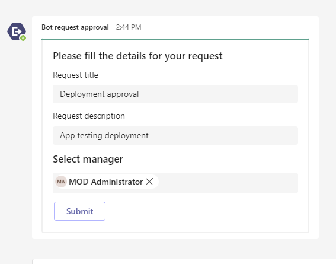
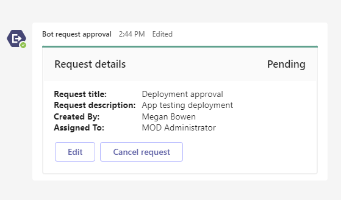
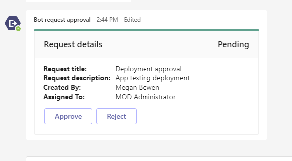
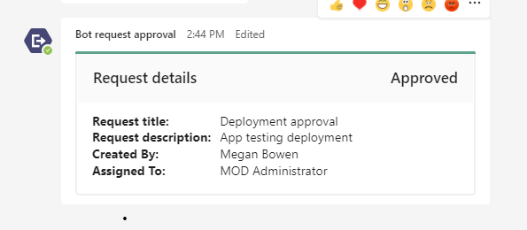

# Send task request using Universal Adaptive Cards in a group chat

This sample shows a feature where:
1. **Requester :** Can request for any task approval from manager by initiating a request in group chat using bot command `request` and only requester can edit the request card.
2. **Manager :** Can see the request raised by user in the same group chat with an option of approve or reject.
3. **Others:** Other members in the group chat can see the request details only.

**Requester:**

- Initiated request using bot command `request` in group chat.

  

- Card will refresh for requester to fill details.

  
  
- After submitting the request, requester can edit or cancel the request.
	
	**Note:** Users who created the card will only be able to see the buttons to edit or cancel the request.

  

**Manager:**

- After requester submit the request, manager can approve/reject the request.
	
	**Note:** Manager of the task request will only be able to see the buttons to approve or reject the request.
  
  

- If manager approves or rejects the request, card will be refreshed for all the members in group chat.

  
  
**Others:**

- Other members in group chat will only be able to see the request details.


## Prerequisites

- [.NET Core SDK](https://dotnet.microsoft.com/download) version 3.1

  determine dotnet version
  ```bash
  dotnet --version
  ```
- [Ngrok](https://ngrok.com/download) (For local environment testing) Latest (any other tunneling software can also be used)
  
  run ngrok locally
  ```bash
  ngrok http -host-header=localhost 3978
  ```
- [Teams](https://teams.microsoft.com) Microsoft Teams is installed and you have an account

## To try this sample

### Register your Teams Auth SSO with Azure AD
1. Register your app with Microsoft identity platform via the Azure AD portal
   - Your app must be registered in the Azure AD portal. See [Register an application with the Microsoft identity platform](https://docs.microsoft.com/en-us/graph/auth-register-app-v2).

   - Ensure that you've [enabled the Teams Channel](https://docs.microsoft.com/en-us/azure/bot-service/channel-connect-teams?view=azure-bot-service-4.0)

2. Clone the repository
   ```bash
   git clone https://github.com/OfficeDev/Microsoft-Teams-Samples.git
   ```

3. Open the code in Visual Studio
   - File -> Open -> Project/Solution
   - Navigate to folder where repository is cloned then `samples/bot-request-approval/csharp/BotRequestApproval.sln`
    
4. Run ngrok - point to port 3978

    ```bash
    # ngrok http -host-header=rewrite 3978
    ```
 
5. Setup and run the bot from Visual Studio: 
   Modify the `appsettings.json` and fill in the following details:
   - `MicrosoftAppId` - Generated from Step 1 (Application (client) ID)is the application app id
   - `MicrosoftAppPassword` - Generated from Step 1, also referred to as Client secret
   - Press `F5` to run the project
	 
6. Modify the `manifest.json` in the `/AppPackage` folder and replace the following details:
   - `{{Microsoft-App-Id}}` with Application id generated from Step 3
   - `{{domain-name}}` with base Url domain. E.g. if you are using ngrok it would be `https://1234.ngrok.io` then your domain-name will be `1234.ngrok.io`.

7. Zip the contents of `AppPackage` folder into a `manifest.zip`, and use the `manifest.zip` to deploy in app store or add to Teams using step 8.

8. Upload the manifest.zip to Teams (in the Apps view click "Upload a custom app")
   - Go to Microsoft Teams and then go to side panel, select Apps
   - Choose Upload a custom App
   - Go to your project directory, the ./AppPackage folder, select the zip folder, and choose Open.
   - Select Add in the pop-up dialog box. Your app is uploaded to Teams.    

## Further reading

- [Bot Framework Documentation](https://docs.botframework.com)
- [Bot Basics](https://docs.microsoft.com/azure/bot-service/bot-builder-basics?view=azure-bot-service-4.0)
- [Send Notification to User in Chat](https://docs.microsoft.com/en-us/graph/api/chat-sendactivitynotification?view=graph-rest-beta)
- [Send Notification to User in Team](https://docs.microsoft.com/en-us/graph/api/team-sendactivitynotification?view=graph-rest-beta&tabs=http)
- [Send Notification to User](https://docs.microsoft.com/en-us/graph/api/userteamwork-sendactivitynotification?view=graph-rest-beta&tabs=http)
