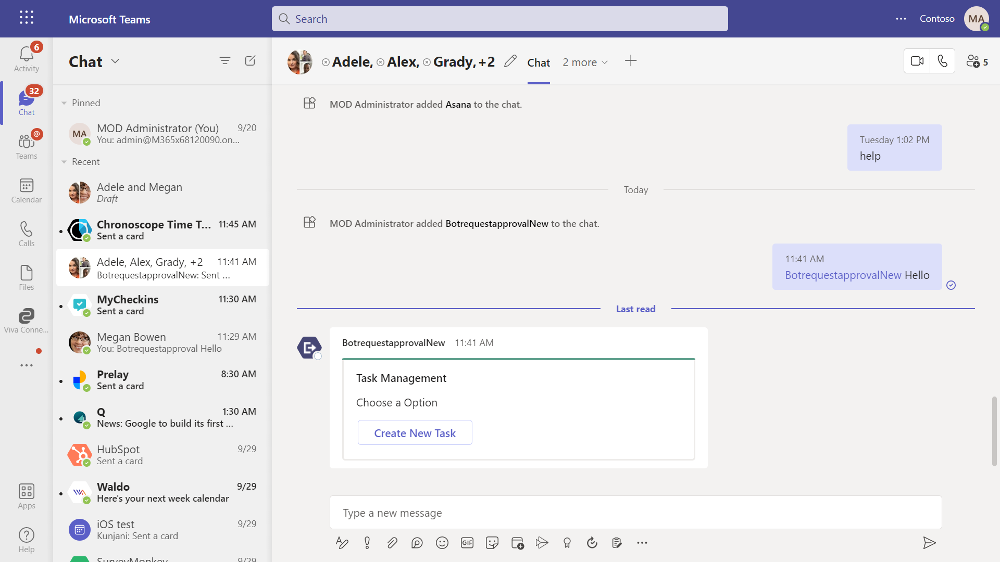

# Bot request approval
This sample shows a feature where user can send task request to his manager and manager can approve/reject the request in group chat.

## Included Features
* Bots
* Adaptive Cards

# Interaction with app


## Try it yourself - experience the App in your Microsoft Teams client
Please find below demo manifest which is deployed on Microsoft Azure and you can try it yourself by uploading the app package (.zip file link below) to your teams and/or as a personal app. (Sideloading must be enabled for your tenant, [see steps here](https://docs.microsoft.com/microsoftteams/platform/concepts/build-and-test/prepare-your-o365-tenant#enable-custom-teams-apps-and-turn-on-custom-app-uploading)).

**Bot request approval:** [Manifest](/samples/bot-request-approval/csharp/demo-manifest/Bot-Request-Approval.zip)

# Send task request using Universal Adaptive Cards in a group chat

This sample shows a feature where:
1. **Requester :** Can request for any task approval from manager by initiating a request in group chat using bot command `request` and only requester can edit the request card.
2. **Manager :** Can see the request raised by user in the same group chat with an option of approve or reject.
3. **Others:** Other members in the group chat can see the request details only.

## Prerequisites

- [.NET Core SDK](https://dotnet.microsoft.com/download) version 6.0

  determine dotnet version
  ```bash
  dotnet --version
  ```
- [Ngrok](https://ngrok.com/download) (For local environment testing) Latest (any other tunneling software can also be used)
  
  run ngrok locally
  ```bash
  ngrok http 3978 --host-header="localhost:3978"
  ```
- [Teams](https://teams.microsoft.com) Microsoft Teams is installed and you have an account

## Setup

### Setup for Bot 
- In Azure portal, create a [Azure Bot resource](https://docs.microsoft.com/azure/bot-service/bot-service-quickstart-registration).
    - For bot handle, make up a name.
    - Select "Use existing app registration" (Create the app registration in Azure Active Directory beforehand.)
    - __*If you don't have an Azure account*__ create an [Azure free account here](https://azure.microsoft.com/free/)

- While registering the bot, use `https://<your_ngrok_url>/api/messages` as the messaging endpoint.
    > NOTE: When you create your bot you will create an App ID and App password - make sure you keep these for later.

### Register your Teams Auth SSO with Azure AD
1. Register your app with Microsoft identity platform via the Azure AD portal
   - Your app must be registered in the Azure AD portal. See [Register an application with the Microsoft identity platform](https://docs.microsoft.com/graph/auth-register-app-v2).

   - Ensure that you've [enabled the Teams Channel](https://docs.microsoft.com/azure/bot-service/channel-connect-teams?view=azure-bot-service-4.0)

2. Clone the repository
   ```bash
   git clone https://github.com/OfficeDev/Microsoft-Teams-Samples.git
   ```

3. Open the code in Visual Studio
   - File -> Open -> Project/Solution
   - Navigate to folder where repository is cloned then `samples/bot-request-approval/csharp/BotRequestApproval.sln`
    
4. Run ngrok - point to port 3978

    ```bash
    # ngrok http 3978 --host-header="localhost:3978"
    ```
 
5. Setup and run the bot from Visual Studio: 
   Modify the `appsettings.json` and fill in the following details:
   - `MicrosoftAppId` - Generated from Step 1 (Application (client) ID)is the application app id
   - `MicrosoftAppPassword` - Generated from Step 1, also referred to as Client secret
   - Press `F5` to run the project
	 
6. Setup Manifest for Teams
- __*This step is specific to Teams.*__
    - **Edit** the `manifest.json` contained in the ./AppPackage folder to replace your Microsoft App Id (that was created when you registered your app registration earlier) *everywhere* you see the place holder string `{{Microsoft-App-Id}}` (depending on the scenario the Microsoft App Id may occur multiple times in the `manifest.json`)
    - **Edit** the `manifest.json` for `validDomains` and replace `{{domain-name}}` with base Url of your domain. E.g. if you are using ngrok it would be `https://1234.ngrok-free.app` then your domain-name will be `1234.ngrok-free.app`.
    - **Zip** up the contents of the `AppPackage` folder to create a `manifest.zip` (Make sure that zip file does not contains any subfolder otherwise you will get error while uploading your .zip package)

- Upload the manifest.zip to Teams (in the Apps view click "Upload a custom app")
   - Go to Microsoft Teams. From the lower left corner, select Apps
   - From the lower left corner, choose Upload a custom App
   - Go to your project directory, the ./AppPackage folder, select the zip folder, and choose Open.
   - Select Add in the pop-up dialog box. Your app is uploaded to Teams. 

**Note**: If you are facing any issue in your app, please uncomment [this](https://github.com/OfficeDev/Microsoft-Teams-Samples/blob/main/samples/bot-request-approval/csharp/BotRequestApproval/AdapterWithErrorHandler.cs#L30) line and put your debugger for local debug.
 
   
## Running the sample

- Initiated request using bot command `request` in group chat.

  

- Card will refresh for requester to fill details.

  
  
- After submitting the request, requester can edit or cancel the request.
	
	**Note:** Users who created the card will only be able to see the buttons to edit or cancel the request.

  

**Manager:**

- After requester submit the request, manager can approve/reject the request.
	
	**Note:** Manager of the task request will only be able to see the buttons to approve or reject the request.
  
  

- If manager approves or rejects the request, card will be refreshed for all the members in group chat.

  
  

## Further reading

- [Bot Framework Documentation](https://docs.botframework.com)
- [Bot Basics](https://docs.microsoft.com/azure/bot-service/bot-builder-basics?view=azure-bot-service-4.0)
- [Send Notification to User in Chat](https://docs.microsoft.com/graph/api/chat-sendactivitynotification?view=graph-rest-beta)
- [Send Notification to User in Team](https://docs.microsoft.com/graph/api/team-sendactivitynotification?view=graph-rest-beta&tabs=http)
- [Send Notification to User](https://docs.microsoft.com/graph/api/userteamwork-sendactivitynotification?view=graph-rest-beta&tabs=http)


