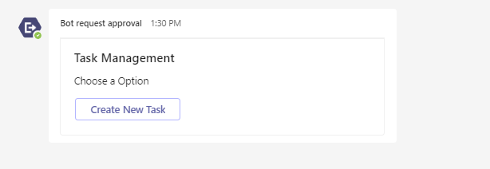
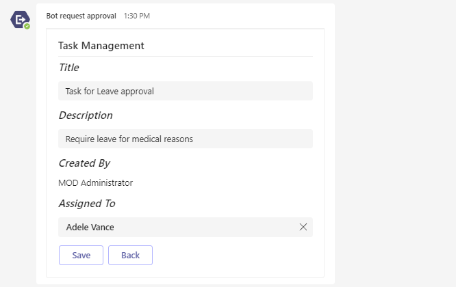
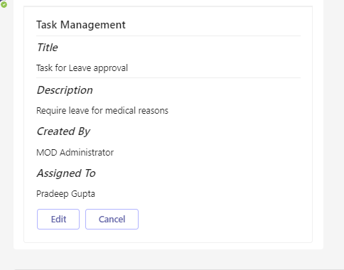
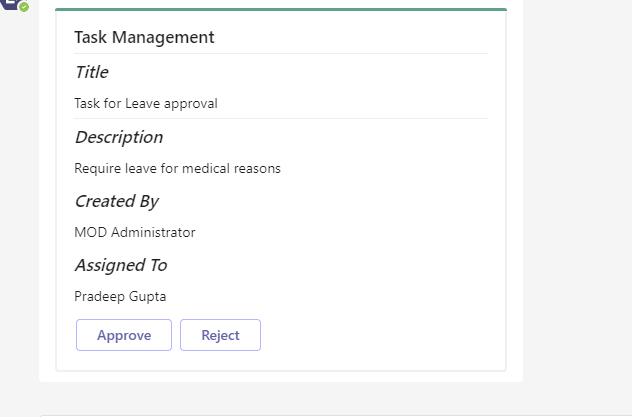
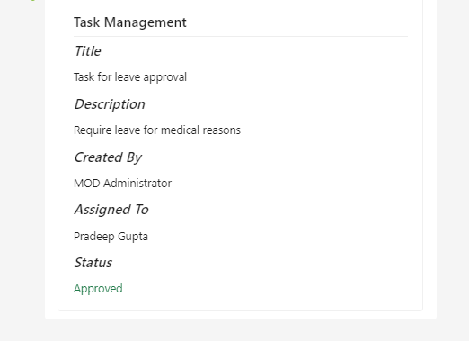
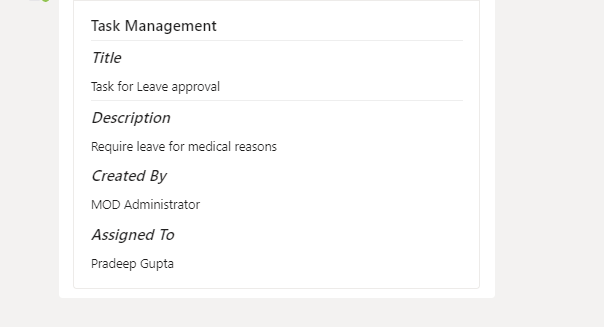

# Send task request using Universal Adaptive Cards in group chat

This sample shows a feature where:
1. **Requester :** Can request for any task approval from manager by initiating a request in group chat using bot command `request` and only requester can edit the request card.
2. **Manager :** Can see the request raised by user in the same group chat with an option of approve or reject.
3. **Others:** Other members in the group chat can see the request details only.

**Requester:**

- Initiated request using bot command `request` in group chat.

  

- Card will refresh for requester to fill details.

  
  
- After submitting the request, requester can edit or cancel the request.

    **Note:** Users who created the card will only be able to see the buttons to edit or cancel the request.

  

**Manager:**

- After requester submit the request, manager can approve/reject the request.

    **Note:** Manager of the task request will only be able to see the buttons to approve or reject the request.

  

- If manager approves or rejects the request, card will be refreshed for all the members in group chat.

  
  
**Others:**

- Other members in group chat will only be able to see the request details.

  

## Prerequisites

- [NodeJS](https://nodejs.org/en/)
- [ngrok](https://ngrok.com/) or equivalent tunnelling solution

### 1. Setup for Bot
In Azure portal, create a [Azure Bot resource](https://docs.microsoft.com/en-us/azure/bot-service/bot-builder-authentication?view=azure-bot-service-4.0&tabs=csharp%2Caadv2).

- Ensure that you've [enabled the Teams Channel](https://docs.microsoft.com/en-us/azure/bot-service/channel-connect-teams?view=azure-bot-service-4.0)

1) Clone the repository

    ```bash
    git clone https://github.com/OfficeDev/Microsoft-Teams-Samples.git
    ```

2) In the folder where repository is cloned navigate to `samples/bot-task-approval/nodejs`

3) Install node modules

   Inside node js folder, open your local terminal and run the below command to install node modules. You can do the same in Visual Studio code terminal by opening the project in Visual Studio code.

    ```bash
    npm install
    ```
4) Run ngrok - point to port 3978

    ```bash
    ngrok http -host-header=rewrite 3978
    ```
5) Open the `.env` configuration file in your project folder (or in Visual Studio Code) and update the `ClientId` and `ClientSecret`, `BaseURL` with your app's base url. (Note the ClientId is the AppId created in step 1 (Setup for Bot), the ClientSecret is referred to as the "client secret" in step 1 (Setup for Bot) and you can always create a new client secret anytime.)

6) Run your app

    ```bash
    npm start
    ```
7) Manually update the manifest.json
    - Edit the `manifest.json` contained in the  `appPackage/` folder to replace with your MicrosoftAppId (that was created in step1.1 and is the same value of MicrosoftAppId in `.env` file) *everywhere* you see the place holder string `{MicrosoftAppId}` (depending on the scenario the Microsoft App Id may occur multiple times in the `manifest.json`)
    - Zip up the contents of the `appPackage/` folder to create a `manifest.zip`
    - Upload the `manifest.zip` to Teams (in the left-bottom *Apps* view, click "Upload a custom app")

## Further reading

- [Bot Framework Documentation](https://docs.botframework.com)
- [Bot Basics](https://docs.microsoft.com/azure/bot-service/bot-builder-basics?view=azure-bot-service-4.0)
- [Send Notification to User in Chat](https://docs.microsoft.com/en-us/graph/api/chat-sendactivitynotification?view=graph-rest-beta)
- [Send Notification to User in Team](https://docs.microsoft.com/en-us/graph/api/team-sendactivitynotification?view=graph-rest-beta&tabs=http)
- [Send Notification to User](https://docs.microsoft.com/en-us/graph/api/userteamwork-sendactivitynotification?view=graph-rest-beta&tabs=http)
