# Sequential workflow adaptive cards C#

This sample illustrates sequential workflow, user specific views and upto date adaptive cards bot and the list of incident created can be seen in messaging extension and can share a specific incident to the chat/team.

## Interaction with app
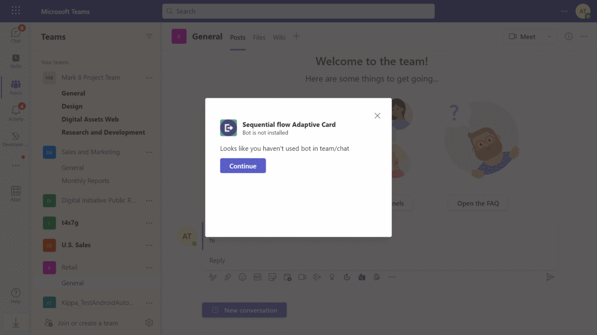

## Try it yourself - experience the App in your Microsoft Teams client
Please find below demo manifest which is deployed on Microsoft Azure and you can try it yourself by uploading the app manifest (.zip file link below) to your teams and/or as a personal app. (Uploading must be enabled for your tenant, [see steps here](https://docs.microsoft.com/microsoftteams/platform/concepts/build-and-test/prepare-your-o365-tenant#enable-custom-teams-apps-and-turn-on-custom-app-uploading)).

**Sequential workflow adaptive cards:** [Manifest](/samples/bot-sequential-flow-adaptive-cards/csharp/demo-manifest/bot-sequential-flow-adaptive-cards.zip)

## Prerequisites

- Microsoft Teams is installed and you have an account
- [.NET Core SDK](https://dotnet.microsoft.com/download) version 6.0
- [dev tunnel](https://learn.microsoft.com/en-us/azure/developer/dev-tunnels/get-started?tabs=windows) or [ngrok](https://ngrok.com/) latest version or equivalent tunnelling solution
- [Microsoft 365 Agents Toolkit for Visual Studio](https://learn.microsoft.com/en-us/microsoftteams/platform/toolkit/toolkit-v4/install-teams-toolkit-vs?pivots=visual-studio-v17-7)

## Run the app (Using Microsoft 365 Agents Toolkit for Visual Studio)

The simplest way to run this sample in Teams is to use Microsoft 365 Agents Toolkit for Visual Studio.
1. Install Visual Studio 2022 **Version 17.14 or higher** [Visual Studio](https://visualstudio.microsoft.com/downloads/)
1. Install Microsoft 365 Agents Toolkit for Visual Studio [Microsoft 365 Agents Toolkit extension](https://learn.microsoft.com/en-us/microsoftteams/platform/toolkit/toolkit-v4/install-teams-toolkit-vs?pivots=visual-studio-v17-7)
1. In the debug dropdown menu of Visual Studio, select Dev Tunnels > Create A Tunnel (set authentication type to Public) or select an existing public dev tunnel.
1. Right-click the 'M365Agent' project in Solution Explorer and select **Microsoft 365 Agents Toolkit > Select Microsoft 365 Account**
1. Sign in to Microsoft 365 Agents Toolkit with a **Microsoft 365 work or school account**
1. Set `Startup Item` as `Microsoft Teams (browser)`.
1. Press F5, or select Debug > Start Debugging menu in Visual Studio to start your app
</br>
1. In the opened web browser, select Add button to install the app in Teams
> If you do not have permission to upload custom apps (uploading), Microsoft 365 Agents Toolkit will recommend creating and using a Microsoft 365 Developer Program account - a free program to get your own dev environment sandbox that includes Teams.

## Setup

1. Register a new application in the [Microsoft Entra ID – App Registrations](https://go.microsoft.com/fwlink/?linkid=2083908) portal.
  
  A) Select **New Registration** and on the *register an application page*, set following values:
      * Set **name** to your app name.
      * Choose the **supported account types** (any account type will work)
      * Leave **Redirect URI** empty.
      * Choose **Register**.
  B) On the overview page, copy and save the **Application (client) ID, Directory (tenant) ID**. You'll need those later when updating your Teams application manifest and in the appsettings.json.
  C) Navigate to **API Permissions**, and make sure to add the following permissions:
   Select Add a permission
      * Select Add a permission
      * Select Microsoft Graph -\> Delegated permissions.
      * `User.Read` (enabled by default)
      * Click on Add permissions. Please make sure to grant the admin consent for the required permissions.

2. Setup for Bot
	- Register a Microsoft Entra ID aap registration in Azure portal.
	- Also, register a bot with Azure Bot Service, following the instructions [here](https://docs.microsoft.com/azure/bot-service/bot-service-quickstart-registration?view=azure-bot-service-3.0).
	- Ensure that you've [enabled the Teams Channel](https://docs.microsoft.com/azure/bot-service/channel-connect-teams?view=azure-bot-service-4.0)
	- While registering the bot, use `https://<your_tunnel_domain>/api/messages` as the messaging endpoint.

    > NOTE: When you create your app registration, you will create an App ID and App password - make sure you keep these for later.

3. Setup NGROK
 - Run ngrok - point to port 3978

   ```bash
   ngrok http 3978 --host-header="localhost:3978"
   ```  

   Alternatively, you can also use the `dev tunnels`. Please follow [Create and host a dev tunnel](https://learn.microsoft.com/en-us/azure/developer/dev-tunnels/get-started?tabs=windows) and host the tunnel with anonymous user access command as shown below:

   ```bash
   devtunnel host -p 3978 --allow-anonymous
   ```

4. Setup for code

  - Clone the repository
    ```bash
    git clone https://github.com/OfficeDev/Microsoft-Teams-Samples.git
    ```
   - Modify the `/appsettings.json` and fill in the following details:
     - `{{YOUR-MICROSOFT-APP-ID}}` - Generated from Step 1 is the application app id
     - `{{YOUR-MICROSOFT-APP-SECRET}}` - Generated from Step 1, also referred to as Client secret
     
  - If you are using Visual Studio
  - Launch Visual Studio
  - File -> Open -> Project/Solution
  - Navigate to `samples/bot-sequential-flow-adaptive-cards/csharp/` folder
  - Select `SequentialUserSpecificFlow.csproj` file
  - Run your app, either from Visual Studio with `F5` or using `dotnet run` in the appropriate folder.
  

5. Setup Manifest for Teams
  - __*This step is specific to Teams.*__
    - **Edit** the `manifest.json` contained in the ./Manifest folder to replace your Microsoft App Id (that was created when you registered your app registration earlier) *everywhere* you see the place holder string `{{Microsoft-App-Id}}` (depending on the scenario the Microsoft App Id may occur multiple times in the `manifest.json`)
    - **Edit** the `manifest.json` for `validDomains` and replace `{{domain-name}}` with base Url of your domain. E.g. if you are using ngrok it would be `https://1234.ngrok-free.app` then your domain-name will be `1234.ngrok-free.app` and if you are using dev tunnels then your domain will be like: `12345.devtunnels.ms`.
    - **Zip** up the contents of the `Manifest` folder to create a `manifest.zip` (Make sure that zip file does not contains any subfolder otherwise you will get error while uploading your .zip package)

 - Upload the manifest.zip to Teams (in the Apps view click "Upload a custom app")
    - Go to Microsoft Teams. From the lower left corner, select Apps
    - From the lower left corner, choose Upload a custom App
    - Go to your project directory, the ./appPackage folder, select the zip folder, and choose Open.
    - Select Add in the pop-up dialog box. Your app is uploaded to Teams.

**Note**: If you are facing any issue in your app, please uncomment [this](https://github.com/OfficeDev/Microsoft-Teams-Samples/blob/main/samples/bot-sequential-flow-adaptive-cards/csharp/SequentialUserSpecificFlow/AdapterWithErrorHandler.cs#L25) line and put your debugger for local debug.

## Workflows

### Workflow for bot interaction

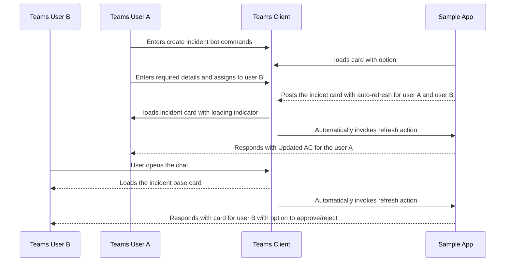

### Workflow for messaging extension interaction


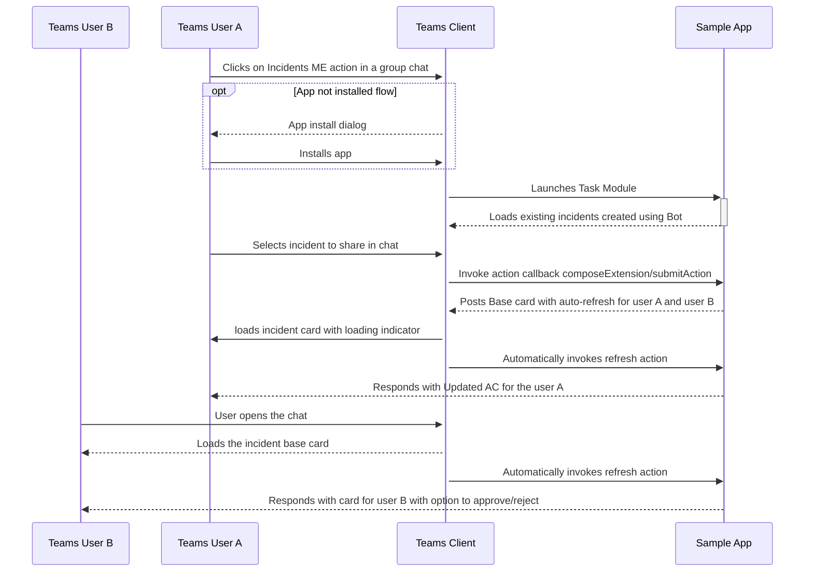


## Running the sample

1. In Teams, Once the app is successfully installed in a group chat, ping the bot by @mentioning it. Bot will reply with a card showing that the person has initiated the incident. 

  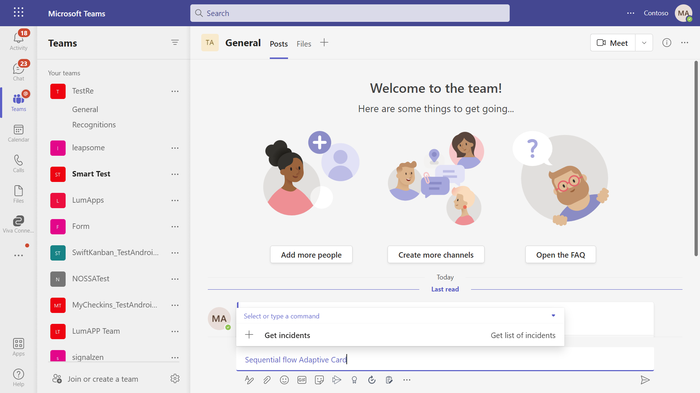
  
2. Using refresh activity only the person who has initiated will be able to proceed further by entering the details of the incident and assign it to a person from the group chat, while others in the group chat will still be able to see only the initiated card.

  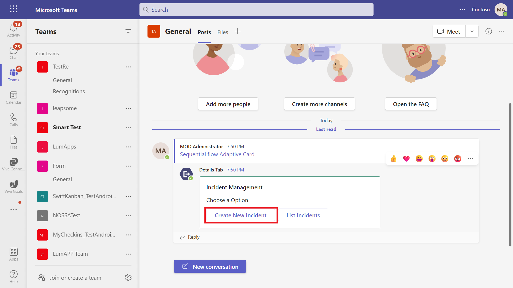

3. User who has initiated the incident will be able to enter the details using the series of cards in a sequential flow and submit it for the further approval/rejection process.

  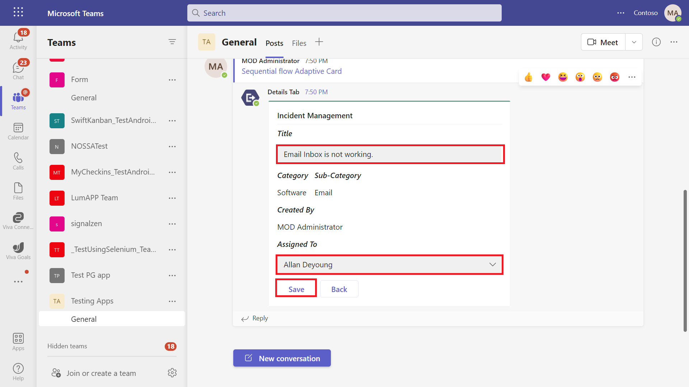
  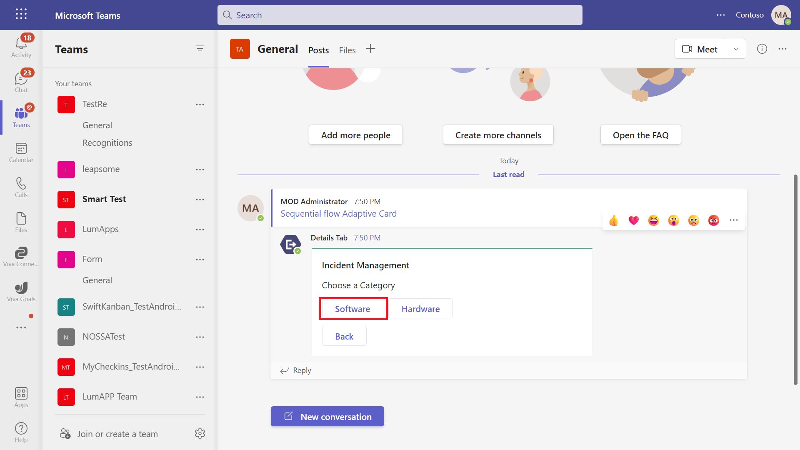
  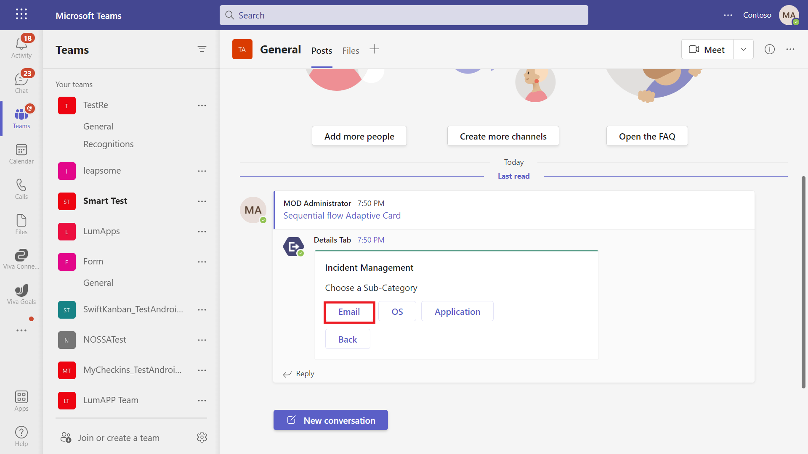
  
4. Once the details are submitted and assigned to a person from the group chat, it will send an updated card to the chat with all the entered details.

  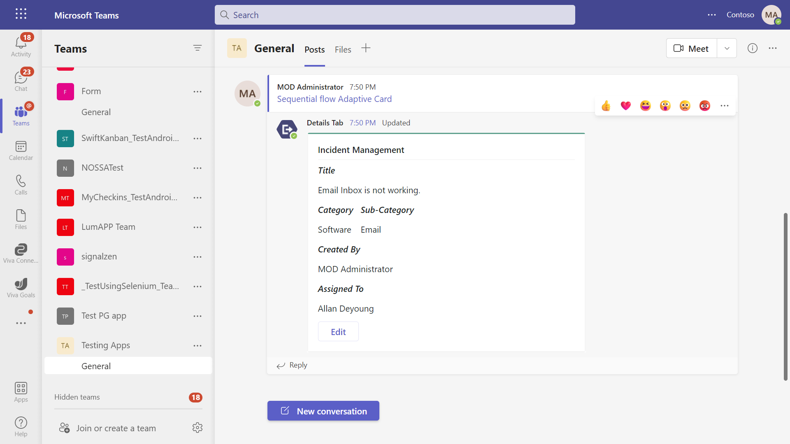
  
5. Now, only the person assigned to will be able to either approve or reject it.

  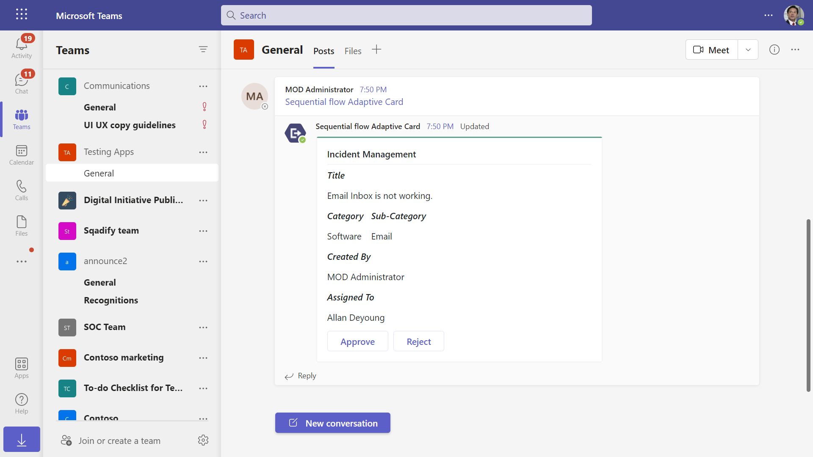  

6. After the approval/rejection of the card, the final updated card will be sent to the group chat.

  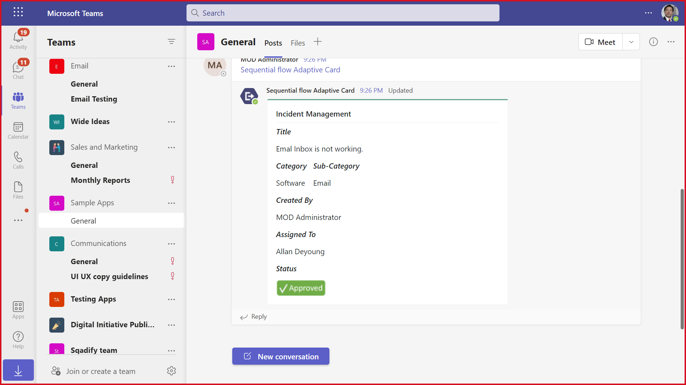


## Running the sample( Interaction with message extension)


1. On selecting app from messaging extension,it checks whether bot is installed in chat/team. If not installed, user will get a option for justInTimeInstallation card.

   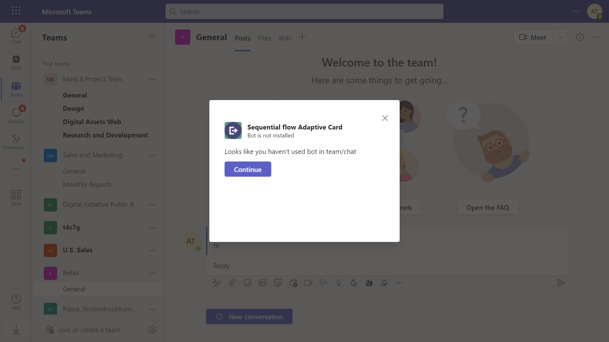

2. After successful installation, list of all incident will be available in messaging extension.

   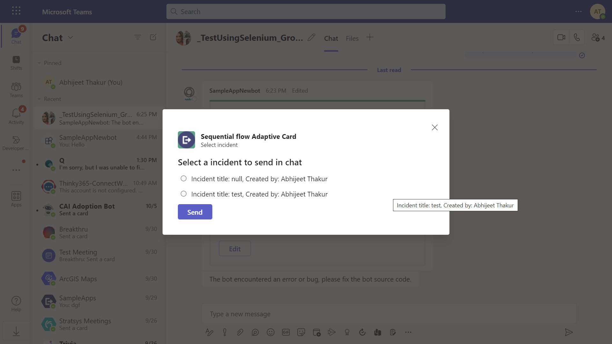.
   
3. User can select any incident from the list and can share to that chat/team.

   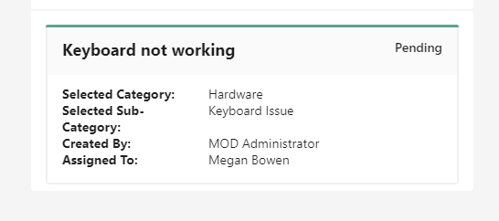.   

## Further Reading

- [Bot Framework Documentation](https://docs.botframework.com)
- [Bot Basics](https://docs.microsoft.com/azure/bot-service/bot-builder-basics?view=azure-bot-service-4.0)
- [Azure Bot Service Introduction](https://docs.microsoft.com/azure/bot-service/bot-service-overview-introduction?view=azure-bot-service-4.0)
- [Azure Bot Service Documentation](https://docs.microsoft.com/azure/bot-service/?view=azure-bot-service-4.0)
- [User Specific views](https://learn.microsoft.com/en-us/microsoftteams/platform/task-modules-and-cards/cards/universal-actions-for-adaptive-cards/user-specific-views?tabs=mobile%2CC)
- [Bot-Sequential-flow-adaptive-card](https://learn.microsoft.com/power-automate/create-adaptive-cards)

