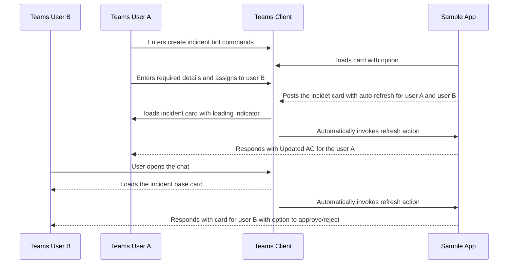
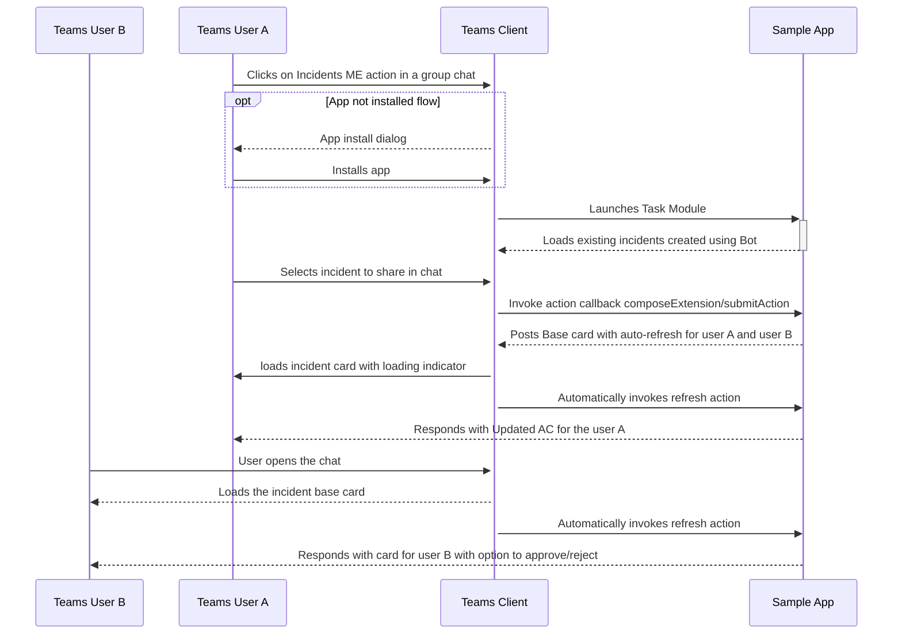

# Sequential workflow adaptive cards

This sample illustrates sequential workflow, user specific views and upto date adaptive cards bot and the list of incident created can be seen in messaging extension and can share a specific incident to the chat/team.

## Prerequisites

- Microsoft Teams is installed and you have an account
- [.NET Core SDK](https://dotnet.microsoft.com/download) version 3.1
- [ngrok](https://ngrok.com/) or equivalent tunnelling solution

1) Clone the repository

    ```bash
    git clone https://github.com/OfficeDev/Microsoft-Teams-Samples.git
    ```

2) If you are using Visual Studio
  - Launch Visual Studio
  - File -> Open -> Project/Solution
  - Navigate to `samples/bot-sequential-flow-adaptive-cards/csharp/` folder
  - Select `SequentialUserSpecificFlow.csproj` file

3) Run ngrok - point to port 3978

    ```bash
    ngrok http -host-header=rewrite 3978
    ```

4) __*This step is specific to Teams.*__
    - **Edit** the `manifest.json` contained in the `Manifest` folder to replace your Microsoft App Id (that was created when you registered your bot earlier) *everywhere* you see the place holder string `<<YOUR-MICROSOFT-APP-ID>>` (depending on the scenario the Microsoft App Id may occur multiple times in the `manifest.json`).
    - **Zip** up the contents of the `teamsAppManifest` folder to create a `manifest.zip`
    - **Upload** the `manifest.zip` to Teams (in the Apps view click "Upload a custom app")

1) Update appsettings.json file with Microsoft App Id, App Secret.
2) Run your app, either from Visual Studio with `F5` or using `dotnet run` in the appropriate folder.

## Workflows

### Workflow for bot interaction



### Workflow for messaging extension interaction





## Interacting with the bot

1. In Teams, Once the app is successfully installed in a group chat, ping the bot by @mentioning it. Bot will reply with a card showing that the person has initiated the incident. 

  
  
2. Using refresh activity only the person who has initiated will be able to proceed further by entering the details of the incident and assign it to a person from the group chat, while others in the group chat will still be able to see only the initiated card.

  

3. User who has initiated the incident will be able to enter the details using the series of cards in a sequential flow and submit it for the further approval/rejection process.

  
  
  
  
4. Once the details are submitted and assigned to a person from the group chat, it will send an updated card to the chat with all the entered details.

  
  
5. Now, only the person assigned to will be able to either approve or reject it.

    

6. After the approval/rejection of the card, the final updated card will be sent to the group chat.

  


## Interaction from messaging extension.


1. On selecting app from messaging extension,it checks whether bot is installed in chat/team. If not installed, user will get a option for justInTimeInstallation card.

   

2. After successful installation, list of all incident will be available in messaging extension.

   .
   
3. User can select any incident from the list and can share to that chat/team.

   .   

