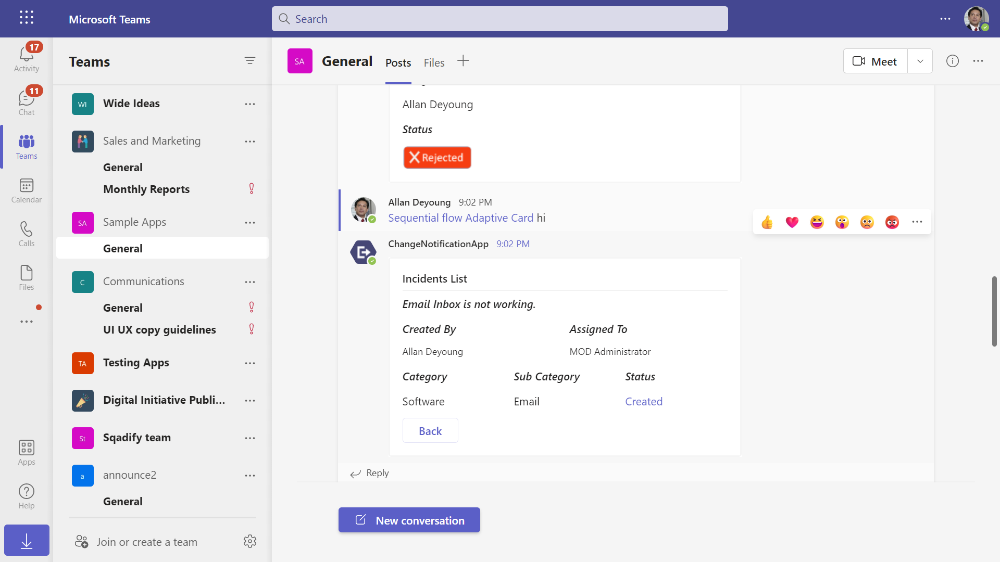
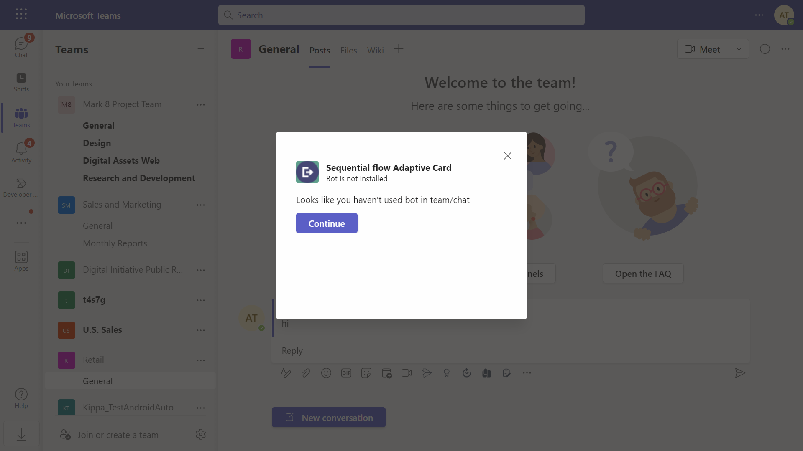

# Sequential workflow adaptive cards Node.js


## Try it yourself - experience the App in your Microsoft Teams client
Please find below demo manifest which is deployed on Microsoft Azure and you can try it yourself by uploading the app package (.zip file link below) to your teams and/or as a personal app. (Uploading must be enabled for your tenant, [see steps here](https://docs.microsoft.com/microsoftteams/platform/concepts/build-and-test/prepare-your-o365-tenant#enable-custom-teams-apps-and-turn-on-custom-app-uploading)).

**Sequential workflow adaptive cards:** [Manifest](/samples/bot-sequential-flow-adaptive-cards/csharp/demo-manifest/bot-sequential-flow-adaptive-cards.zip)

This App talks about the Teams Bot User Specific Views and Sequential Workflows in adaptive card with Node JS

This bot has been created using [Bot Framework v4](https://dev.botframework.com), it shows how to create a simple bot that accepts food order using Adaptive Cards V1.4

This is a sample app that provides an experience of managing incidents. This sample makes use of Teams platform capabilities like Universal Bots with below mentioned capabilities.
[User Specific Views](https://docs.microsoft.com/microsoftteams/platform/task-modules-and-cards/cards/universal-actions-for-adaptive-cards/user-specific-views)
[Sequential Workflows](https://docs.microsoft.com/microsoftteams/platform/task-modules-and-cards/cards/universal-actions-for-adaptive-cards/sequential-workflows)
[Up to date cards](https://docs.microsoft.com/microsoftteams/platform/task-modules-and-cards/cards/universal-actions-for-adaptive-cards/up-to-date-views)

## Key features

- Incident Creation
   - Choose Category
   - Choose Sub Category
   - Create Incident
   - Edit/ Approve/ Reject Incident
- List Incidents

## Prerequisites

 - Office 365 tenant. You can get a free tenant for development use by signing up for the [Office 365 Developer Program](https://developer.microsoft.com/en-us/microsoft-365/dev-program).

 - To test locally, [NodeJS](https://nodejs.org/en/download/) must be installed on your development machine (version 10.14 or higher).

    ```bash
    # determine node version
    node --version
    ```
- [dev tunnel](https://learn.microsoft.com/en-us/azure/developer/dev-tunnels/get-started?tabs=windows) or [ngrok](https://ngrok.com/) latest version or equivalent tunnelling solution

- If you are using Ngrok to test locally, you'll need [Ngrok](https://ngrok.com/) installed on your development machine.
Make sure you've downloaded and installed Ngrok on your local machine. ngrok will tunnel requests from the Internet to your local computer and terminate the SSL connection from Teams.

> NOTE: The free ngrok plan will generate a new URL every time you run it, which requires you to update your Azure AD registration, the Teams app manifest, and the project configuration. A paid account with a permanent ngrok URL is recommended.

- [Microsoft 365 Agents Toolkit for VS Code](https://marketplace.visualstudio.com/items?itemName=TeamsDevApp.ms-teams-vscode-extension) or [TeamsFx CLI](https://learn.microsoft.com/microsoftteams/platform/toolkit/teamsfx-cli?pivots=version-one)

## Run the app (Using Microsoft 365 Agents Toolkit for Visual Studio Code)

The simplest way to run this sample in Teams is to use Microsoft 365 Agents Toolkit for Visual Studio Code.

1. Ensure you have downloaded and installed [Visual Studio Code](https://code.visualstudio.com/docs/setup/setup-overview)
1. Install the [Microsoft 365 Agents Toolkit extension](https://marketplace.visualstudio.com/items?itemName=TeamsDevApp.ms-teams-vscode-extension)
1. Select **File > Open Folder** in VS Code and choose this samples directory from the repo
1. Using the extension, sign in with your Microsoft 365 account where you have permissions to upload custom apps
1. Select **Debug > Start Debugging** or **F5** to run the app in a Teams web client.
1. In the browser that launches, select the **Add** button to install the app to Teams.
> If you do not have permission to upload custom apps (uploading), Microsoft 365 Agents Toolkit will recommend creating and using a Microsoft 365 Developer Program account - a free program to get your own dev environment sandbox that includes Teams.

## Setup

1. Register a new application in the [Microsoft Entra ID – App Registrations](https://go.microsoft.com/fwlink/?linkid=2083908) portal.
    
  A) Select **New Registration** and on the *register an application page*, set following values:
      * Set **name** to your app name.
      * Choose the **supported account types** (any account type will work)
      * Leave **Redirect URI** empty.
      * Choose **Register**.
  B) On the overview page, copy and save the **Application (client) ID, Directory (tenant) ID**. You'll need those later when updating your Teams application manifest and in the appsettings.json.
  C) Navigate to **API Permissions**, and make sure to add the following permissions:
   Select Add a permission
      * Select Add a permission
      * Select Microsoft Graph -\> Delegated permissions.
      * `User.Read` (enabled by default)
      * Click on Add permissions. Please make sure to grant the admin consent for the required permissions.

2. Setup for Bot
	- Register a Microsoft Entra ID aap registration in Azure portal.
	- Also, register a bot with Azure Bot Service, following the instructions [here](https://docs.microsoft.com/azure/bot-service/bot-service-quickstart-registration?view=azure-bot-service-3.0).
	- Ensure that you've [enabled the Teams Channel](https://docs.microsoft.com/azure/bot-service/channel-connect-teams?view=azure-bot-service-4.0)
	- While registering the bot, use `https://<your_tunnel_domain>/api/messages` as the messaging endpoint.

    > NOTE: When you create your app registration, you will create an App ID and App password - make sure you keep these for later.

3. Setup NGROK
 - Run ngrok - point to port 3978

   ```bash
   ngrok http 3978 --host-header="localhost:3978"
   ```  

   Alternatively, you can also use the `dev tunnels`. Please follow [Create and host a dev tunnel](https://learn.microsoft.com/en-us/azure/developer/dev-tunnels/get-started?tabs=windows) and host the tunnel with anonymous user access command as shown below:

   ```bash
   devtunnel host -p 3978 --allow-anonymous
   ```

4. Setup for code

  - Clone the repository
    ```bash
    git clone https://github.com/OfficeDev/Microsoft-Teams-Samples.git
    ```

    

  - In a console, navigate to `samples/bot-sequential-flow-adaptive-cards/nodejs`

      ```bash
      cd samples/bot-sequential-flow-adaptive-cards/nodejs
      ```
  - Update the `.env` configuration for the bot to use the `MicrosoftAppId` (Microsoft App Id) and `MicrosoftAppPassword` (App Password) from the Bot Framework registration. 

> NOTE: the App Password is referred to as the `client secret` in the azure portal and you can always create a new client secret anytime.

- Install modules & Run the `NodeJS` Server 
    - Server will run on PORT:  `3978`
    - Open a terminal and navigate to project root directory
    
    ```bash
    npm run server
    ```
    
    > **This command is equivalent to:**
    _npm install  > npm start_

5. Setup Manifest for Teams
- __*This step is specific to Teams.*__
    - **Edit** the `manifest.json` contained in the ./appManifest folder to replace your Microsoft App Id (that was created when you registered your app registration earlier) *everywhere* you see the place holder string `{{Microsoft-App-Id}}` (depending on the scenario the Microsoft App Id may occur multiple times in the `manifest.json`)
    - **Edit** the `manifest.json` for `validDomains` and replace `{{domain-name}}` with base Url of your domain. E.g. if you are using ngrok it would be `https://1234.ngrok-free.app` then your domain-name will be `1234.ngrok-free.app` and if you are using dev tunnels then your domain will be like: `12345.devtunnels.ms`.
    - **Zip** up the contents of the `appManifest` folder to create a `manifest.zip` (Make sure that zip file does not contains any subfolder otherwise you will get error while uploading your .zip package)

- Upload the manifest.zip to Teams (in the Apps view click "Upload a custom app")
   - Go to Microsoft Teams. From the lower left corner, select Apps
   - From the lower left corner, choose Upload a custom App
   - Go to your project directory, the ./appManifest folder, select the zip folder, and choose Open.
   - Select Add in the pop-up dialog box. Your app is uploaded to Teams.

**Note**: If you are facing any issue in your app, please uncomment [this](https://github.com/OfficeDev/Microsoft-Teams-Samples/blob/main/samples/bot-sequential-flow-adaptive-cards/nodejs/server/api/botController.js#L24) line and put your debugger for local debug.

## Workflows
### Workflow for bot interaction


### Workflow for messaging extension interaction


## Running the sample.

You can interact with this bot by `@Sequential Workflows` (BotName). The bot will respond with adaptive card requesting you the details.

- Install App

Navigate to `Manage apps` > `Upload a custom app` (Bottom-Right of the screen) > Upload `manifest.zip` > `Add`


- Open The App

Type in Chat: `@Sequential Workflows` (BotName) and Enter


Create New Incident


> Only the `Created By` person have the option to `Edit`


Edit Incident


`Approve` or `Reject` Incidents

> Only the `Assigned To` person have the option to `Approve` or `Reject`


List Incidents





## Interaction from messaging extension.

You can also interact with this app using messaging extension action which allows you to share incidents in group chats.

1. On selecting app from messaging extension,it checks whether bot is installed in chat/team. If not installed, user will get a option for justInTimeInstallation card.

   

2. After successful installation, list of all incident will be available in messaging extension.

   .
   
3. User can select any incident from the list and can share to that chat/team.

   

## Deploy the bot to Azure

To learn more about deploying a bot to Azure, see [Deploy your bot to Azure](https://aka.ms/azuredeployment) for a complete list of deployment instructions.

## Further reading

- [Bot Framework Documentation](https://docs.botframework.com)
- [Bot Basics](https://docs.microsoft.com/azure/bot-service/bot-builder-basics?view=azure-bot-service-4.0)
- [Azure Bot Service Introduction](https://docs.microsoft.com/azure/bot-service/bot-service-overview-introduction?view=azure-bot-service-4.0)
- [Azure Bot Service Documentation](https://docs.microsoft.com/azure/bot-service/?view=azure-bot-service-4.0)
- [User Specific views](https://learn.microsoft.com/en-us/microsoftteams/platform/task-modules-and-cards/cards/universal-actions-for-adaptive-cards/user-specific-views?tabs=mobile%2CC)
- [Bot-Sequential-flow-adaptive-card](https://learn.microsoft.com/power-automate/create-adaptive-cards)

