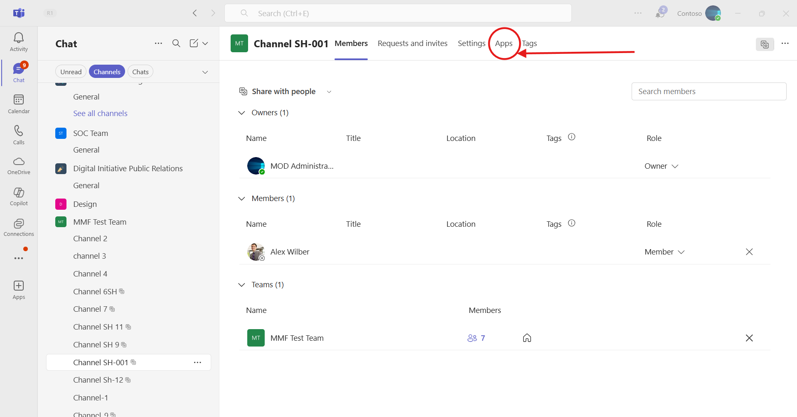

# Bot updates for handling transitive member add/remove events in Microsoft Teams shared channels

This sample shows how to build a Microsoft Teams bot using the Bot Framework SDK that responds to transitive member changes in shared channels. When a member is added to or removed from a parent team that shares a channel, Teams automatically updates the membership of the shared channel. The bot receives these transitive member add and remove events and can process them to track membership changes, maintain rosters, or trigger custom workflows. This enables developers to extend shared channel scenarios by keeping their applications and services in sync with the latest membership state across teams and channels.

The feature shown in this sample is currently available in public developer preview only.

## Included Features
* Bots
* Adaptive Cards
* RSC Permissions

## Interaction with app


## Prerequisites

- [.NET Core SDK](https://dotnet.microsoft.com/download) version 6.0

  ```bash
  # determine dotnet version
  dotnet --version
  ```
- Publicly addressable https url or tunnel such as [dev tunnel](https://learn.microsoft.com/en-us/azure/developer/dev-tunnels/get-started?tabs=windows) or [ngrok](https://ngrok.com/) latest version or [Tunnel Relay](https://github.com/OfficeDev/microsoft-teams-tunnelrelay) 
- [Microsoft 365 Agents Toolkit for Visual Studio](https://learn.microsoft.com/en-us/microsoftteams/platform/toolkit/toolkit-v4/install-teams-toolkit-vs?pivots=visual-studio-v17-7)

## Run the app (Using Microsoft 365 Agents Toolkit for Visual Studio)

The simplest way to run this sample in Teams is to use Microsoft 365 Agents Toolkit for Visual Studio.
1. Install Visual Studio 2022 **Version 17.14 or higher** [Visual Studio](https://visualstudio.microsoft.com/downloads/)
1. Install Microsoft 365 Agents Toolkit for Visual Studio [Microsoft 365 Agents Toolkit extension](https://learn.microsoft.com/en-us/microsoftteams/platform/toolkit/toolkit-v4/install-teams-toolkit-vs?pivots=visual-studio-v17-7)
1. In the debug dropdown menu of Visual Studio, select Dev Tunnels > Create A Tunnel (set authentication type to Public) or select an existing public dev tunnel.
1. In the debug dropdown menu of Visual Studio, select default startup project > **Microsoft Teams (browser)**
1. Right-click the 'M365Agent' project in Solution Explorer and select **Microsoft 365 Agents Toolkit > Select Microsoft 365 Account**
1. Sign in to Microsoft 365 Agents Toolkit with a **Microsoft 365 work or school account**
1. Set `Startup Item` as `Microsoft Teams (browser)`.
1. Press F5, or select Debug > Start Debugging menu in Visual Studio to start your app
    </br>
1. In the opened web browser, select Add button to install the app in Teams
> If you do not have permission to upload custom apps (uploading), Microsoft 365 Agents Toolkit will recommend creating and using a Microsoft 365 Developer Program account - a free program to get your own dev environment sandbox that includes Teams.

## Setup
> NOTE: The free ngrok plan will generate a new URL every time you run it, which requires you to update your Azure AD registration, the Teams app manifest, and the project configuration. A paid account with a permanent ngrok URL is recommended.

1) Setup for Bot
   - Register Azure AD application resource in Azure portal
   - In Azure portal, create a [Azure Bot resource](https://docs.microsoft.com/azure/bot-service/bot-builder-authentication?view=azure-bot-service-4.0&tabs=csharp%2Caadv2).

   - Ensure that you've [enabled the Teams Channel](https://docs.microsoft.com/azure/bot-service/channel-connect-teams?view=azure-bot-service-4.0)
   - While registering the bot, use `https://<your_tunnel_domain>/api/messages` as the messaging endpoint.

## Configure Delegated Permissions in Azure AD App Registration

  1. Navigate to **API Permissions** in your app registration.  
  2. Select **Microsoft Graph** → **Delegated permissions**.  
  3. Add the following permission:  
     - `User.Read`  
  4. Grant **Admin Consent** for the added permission.  

  **NOTE:** When you create your bot you will create an App ID and App password - make sure you keep these for later.

2) Setup NGROK  
   Run ngrok - point to port 3978

   ```bash
   ngrok http 3978 --host-header="localhost:3978"
   ```  

   Alternatively, you can also use the `dev tunnels`. Please follow [Create and host a dev tunnel](https://learn.microsoft.com/en-us/azure/developer/dev-tunnels/get-started?tabs=windows) and host the tunnel with anonymous user access command as shown below:

   ```bash
   devtunnel host -p 3978 --allow-anonymous
   ```

3) Setup for code   
- Clone the repository

    ```bash
    git clone https://github.com/OfficeDev/Microsoft-Teams-Samples.git

- Navigate to `samples/bot-shared-channel-events/csharp` 
    - Modify the `/appsettings.json` and fill in the `{{ MicrosoftAppId }}`,`{{ MicrosoftAppPassword }}` with the values received while doing Microsoft Entra ID app registration in step 1.

- Run the app from a terminal or from Visual Studio, choose option A or B.

  A) From a terminal

  ```bash
  # run the app
  dotnet run
  ```

  B) Or from Visual Studio

  - Launch Visual Studio
  - File -> Open -> Project/Solution
  - Navigate to `SharedChannelEvents` folder
  - Select `SharedChannelEvents.csproj` file
  - Press `F5` to run the project

4) Setup Manifest for Teams

   Modify the `manifest.json` in the `/appPackage` folder and replace the following details

   - `<<App-ID>>` with your Microsoft Entra ID app registration id   
   - `<<VALID DOMAIN>>` with base Url domain. E.g. if you are using ngrok it would be `https://1234.ngrok-free.app` then your domain-name will be `1234.ngrok-free.app` and if you are using dev tunnels then your domain will be like: `12345.devtunnels.ms`.
   - Zip the contents of `appPackage` folder into a `manifest.zip`, and use the `manifest.zip` to deploy in app store
   - - **Upload** the `manifest.zip` to Teams
         - Select **Apps** from the left panel.
         - Then select **Upload a custom app** from the lower right corner.
         - Then select the `manifest.zip` file from `appPackage`.
         - Install the App in Teams Channels.

5) Update your App Manifest for Developer Preview

   To enable member events for shared channels, update your `manifest.json` with the following:
   
   - Update the manifest schema and version:
   ```json
   "$schema": "https://developer.microsoft.com/en-us/json-schemas/teams/v1.22/MicrosoftTeams.schema.json",
   "manifestVersion": "devPreview"
   ```
   
   - Add the `supportsChannelFeatures` property to enable tier 1 channel support:
   ```json
   "supportsChannelFeatures": "tier1"
   ```

## Running the sample

**Shared Channel Events:**   

**1. Install the app:** Upload and install the bot application in Microsoft Teams.


**2. Select Teams:** Choose the team where you want to add the bot and create a shared channel.


**3. Add Channel:** Click on the option to add a new channel to the selected team.


**4. Create Shared Channel:** Configure and create a new shared channel with the appropriate settings.


**5. Select Members for Shared Channel:** Choose the members or teams that will have access to the shared channel.


**6. Manage Created Shared Channel:** View and manage the settings of the newly created shared channel.


**7. Select Apps Tab:** Navigate to the Apps tab within the shared channel.



**8. Add App to Channel:** Select and add the bot application to the shared channel.


**9. Add Member to Channel:** Add a new member directly to the shared channel.


**10. Member Added Notification:** The bot receives and displays a notification when a member is added to the channel.


**11. Remove Member from Channel:** Remove a member from the shared channel.


**12. Member Removed Notification:** The bot receives and displays a notification when a member is removed from the channel.


**13. Share Channel with Team:** Initiate the process to share the channel with another team.


**14. Select Team for Sharing:** Choose the team with which you want to share the channel.


**15. Channel Shared with Team:** Confirmation that the channel has been successfully shared with the selected team.


**16. Unshare Channel with Team:** Begin the process to unshare the channel from a team.


**17. Remove Channel from Team:** Remove the shared channel from the team.


**18. Channel Unshared Notification:** The bot receives and displays a notification when the channel is unshared from a team.


**Transitive Member Events**

**19. Add Member to Parent Team (Step 1):** Begin adding a new member to the parent team that has a shared channel.


**20. Select Member to Add (Step 2):** Choose the member to add to the parent team.


**21. Transitive Member Added Event:** The bot receives a transitive member added event when a member is added to the parent team and automatically becomes a member of the shared channel.


**22. Transitive Member Removed Event:** The bot receives a transitive member removed event when a member is removed from the parent team and is automatically removed from the shared channel.


## Deploy the bot to Azure

To learn more about deploying a bot to Azure, see [Deploy your bot to Azure](https://aka.ms/azuredeployment) for a complete list of deployment instructions.

## Further reading
- [Build-Apps-For-Shared-Private-Channels](https://learn.microsoft.com/en-us/microsoftteams/platform/build-apps-for-shared-private-channels?tabs=tabs%2Cexternal-users%2Csharedchannel).

