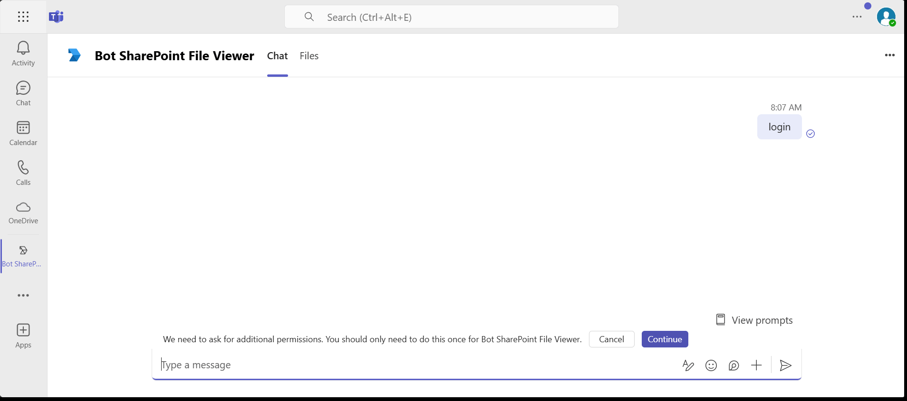
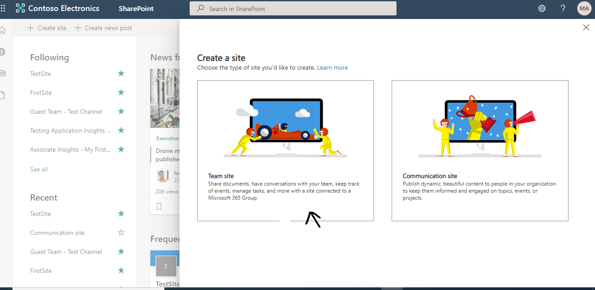
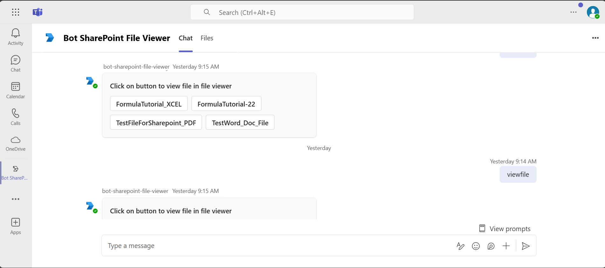
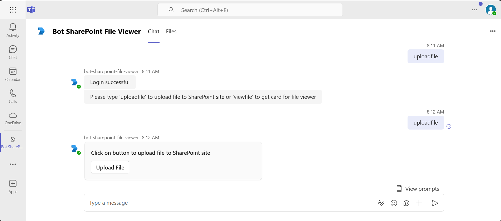
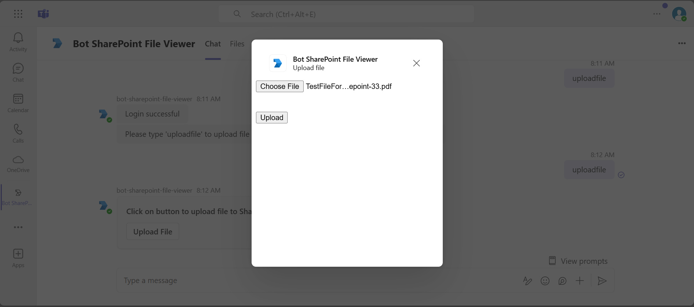
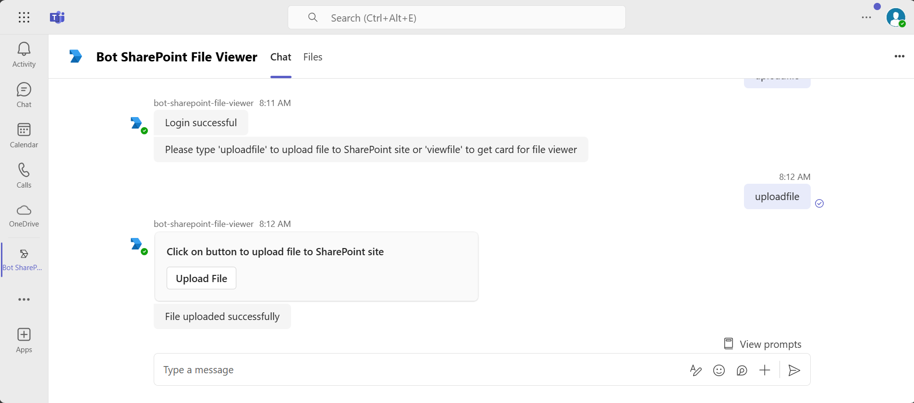
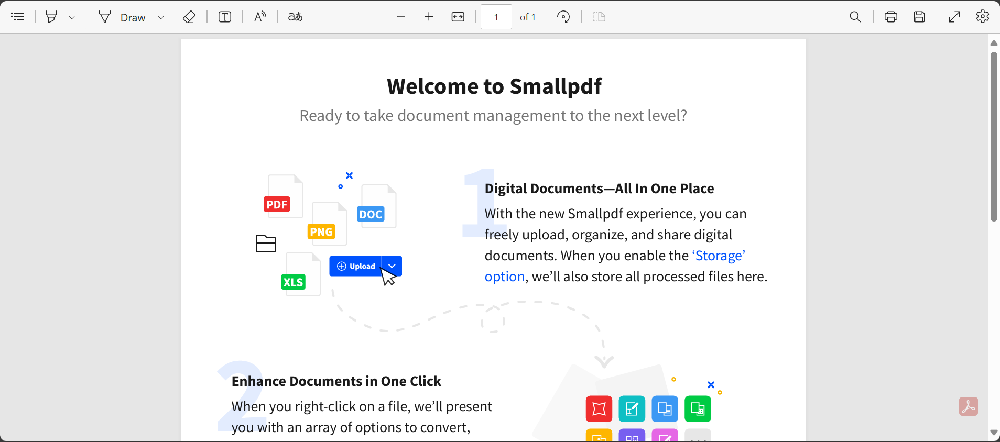
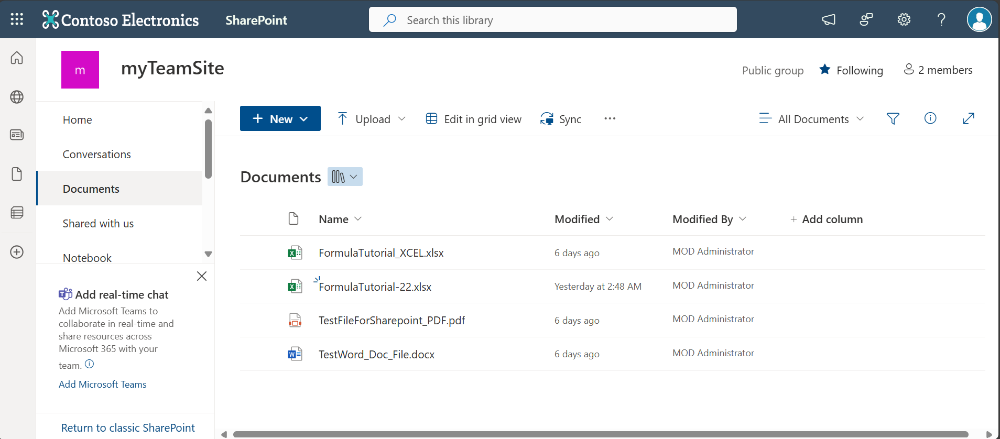

# Bot with SharePoint file to view in Teams file viewer

Using this C# sample, a bot with capability to upload files to SharePoint site and same files can be viewed in Teams file viewer

## Included Features
* Teams SSO (bots)
* Adaptive Cards
* Graph API

## Interaction with bot


## Prerequisites

- [.NET Core SDK](https://dotnet.microsoft.com/download) version 6.0

  ```bash
  # determine dotnet version
  dotnet --version
  ```
- Publicly addressable https url or tunnel such as [dev tunnel](https://learn.microsoft.com/en-us/azure/developer/dev-tunnels/get-started?tabs=windows) or [ngrok](https://ngrok.com/) latest version or [Tunnel Relay](https://github.com/OfficeDev/microsoft-teams-tunnelrelay)

## Run the app (Using Microsoft 365 Agents Toolkit for Visual Studio)

The simplest way to run this sample in Teams is to use Microsoft 365 Agents Toolkit for Visual Studio.
1. Install Visual Studio 2022 **Version 17.14 or higher** [Visual Studio](https://visualstudio.microsoft.com/downloads/)
1. Install Microsoft 365 Agents Toolkit for Visual Studio [Microsoft 365 Agents Toolkit extension](https://learn.microsoft.com/en-us/microsoftteams/platform/toolkit/toolkit-v4/install-teams-toolkit-vs?pivots=visual-studio-v17-7)
1. In the debug dropdown menu of Visual Studio, select Dev Tunnels > Create A Tunnel (set authentication type to Public) or select an existing public dev tunnel.
1. Right-click the 'M365Agent' project in Solution Explorer and select **Microsoft 365 Agents Toolkit > Select Microsoft 365 Account**
1. Sign in to Microsoft 365 Agents Toolkit with a **Microsoft 365 work or school account**
1. Set `Startup Item` as `Microsoft Teams (browser)`.
1. Press F5, or select Debug > Start Debugging menu in Visual Studio to start your app
</br>
1. In the opened web browser, select Add button to install the app in Teams
> If you do not have permission to upload custom apps (uploading), Microsoft 365 Agents Toolkit will recommend creating and using a Microsoft 365 Developer Program account - a free program to get your own dev environment sandbox that includes Teams.

## Setup

### 1. Setup for Bot SSO
Refer to [Bot SSO Setup document](BotWithSharePointFileViewer/BotSSOSetup.md).

### 2. Setup NGROK
1) Run ngrok - point to port 3978

   ```bash
   ngrok http 3978 --host-header="localhost:3978"
   ```  

   Alternatively, you can also use the `dev tunnels`. Please follow [Create and host a dev tunnel](https://learn.microsoft.com/en-us/azure/developer/dev-tunnels/get-started?tabs=windows) and host the tunnel with anonymous user access command as shown below:

   ```bash
   devtunnel host -p 3978 --allow-anonymous
   ```

### 3. Register your app with Azure AD.

  1. Register a new application in the [Microsoft Entra ID – App Registrations](https://go.microsoft.com/fwlink/?linkid=2083908) portal.
  2. Select **New Registration** and on the *register an application page*, set following values:
      * Set **name** to your app name.
      * Choose the **supported account types** (any account type will work)
      * Leave **Redirect URI** empty.
      * Choose **Register**.
  3. On the overview page, copy and save the **Application (client) ID, Directory (tenant) ID**. You'll need those later when updating your Teams application manifest and in the appsettings.json.
  4. Navigate to **API Permissions**, and make sure to add the follow permissions:
   Select Add a permission
      * Select Add a permission
      * Select Microsoft Graph -\> Delegated permissions.
      * `User.Read` (enabled by default)
      * Click on Add permissions. Please make sure to grant the admin consent for the required permissions.


### 4. Setup SharePoint Site.
1) SharePoint site configuration
   - Login to [sharepoint](https://www.office.com/launch/sharepoint?auth=2)
   - Click on `Create site` and select `Team site`
   
   
   
   - Enter site name and description of site.
   
   .
   
2) From site address eg: 'https://m365x357260.sharepoint.com/sites/SharePointTestSite'
      `m365x357260.sharepoint.com` - value is sharepoint tenant name.
	  
   - Click on next. (optional step)Add aditional owner and member.
   - Click on Finish.

### 5. Setup for code
1 Clone the repository

    ```bash
    git clone https://github.com/OfficeDev/Microsoft-Teams-Samples.git
    ```

2 In a terminal, navigate to `samples/bot-sharepoint-file-viewer/csharp/BotWithSharePointFileViewer`

3 If you are using Visual Studio
   - Launch Visual Studio
   - File -> Open -> Project/Solution
   - Navigate to `samples/bot-sharepoint-file-viewer/csharp` folder
   - Select `BotWithSharePointFileViewer.csproj` or `BotWithSharePointFileViewer.sln`file

4 Update the `appsettings.json` configuration for the bot to use the MicrosoftAppId, MicrosoftAppPassword, MicrosoftAppTenantId and ConnectionName generated in Step 1 (Setup for Bot SSO). (Note the App Password is referred to as the "client secret" in the azure portal and you can always create a new client secret anytime.)
 - `ApplicationBaseUrl` will be your app's base url. For eg `https://xxxx.ngrok-free.app` if you are using Ngrok and if you are using dev tunnels, your URL will be like: https://12345.devtunnels.ms.
 - `SharePointTenantName` will be the tenant name generated in step 3.2.
 - `SharePointSiteName` will be the site name created in step 3.

5 Run your bot, either from Visual Studio with `F5` or using `dotnet run` in the appropriate folder.

### 6. Setup Manifest for Teams
1) __*This step is specific to Teams.*__
    - **Edit** the `manifest.json` contained in the  `AppManifest` folder to replace your Microsoft App Id (that was created when you registered your bot earlier) *everywhere* you see the place holder string `<<Microsoft-App-Id>>` (depending on the scenario the Microsoft App Id may occur multiple times in the `manifest.json`)
    - **Edit** the `manifest.json` for `validDomains` with base Url domain. E.g. if you are using ngrok it would be `https://1234.ngrok-free.app` then your domain-name will be `1234.ngrok-free.app` and if you are using dev tunnels then your domain will be like: `12345.devtunnels.ms`.
    - **Zip** up the contents of the `AppManifest` folder to create a `manifest.zip` (Make sure that zip file does not contains any subfolder otherwise you will get error while uploading your .zip package)
    - **Upload** the `manifest.zip` to Teams (In Teams Apps/Manage your apps click "Upload an app". Browse to and Open the .zip file. At the next dialog, click the Add button.)
    - Add the app to personal/team/groupChat scope (Supported scopes)

**Note**: If you are facing any issue in your app, please uncomment [this](https://github.com/OfficeDev/Microsoft-Teams-Samples/blob/main/samples/bot-sharepoint-file-viewer/csharp/BotWithSharePointFileViewer/AdapterWithErrorHandler.cs#L24) line and put your debugger for local debug.


## Running the sample

You can interact with this bot in Teams by sending it a message, or selecting a command from the command list. The bot will respond to the following strings.

1) The `viewfile` command will list all the files that are uploaded to sharepoint site.


1) The `uploadfile` command will return a card, which will open a task module from where new files can be uploaded to sharepoint.






1) The files will be uploaded to sharepoint.


## Deploy the bot to Azure

To learn more about deploying a bot to Azure, see [Deploy your bot to Azure](https://aka.ms/azuredeployment) for a complete list of deployment instructions.

## Further reading

- [How Microsoft Teams bots work](https://docs.microsoft.com/en-us/azure/bot-service/bot-builder-basics-teams?view=azure-bot-service-4.0&tabs=javascript)

