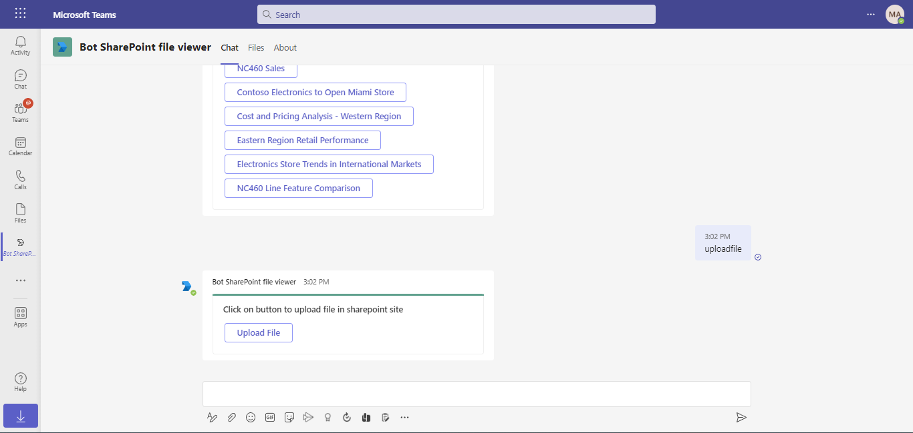

# Bot with SharePoint file to view in Teams file viewer

Using this C# sample, a bot with capability to upload files to SharePoint site and same files can be viewed in Teams file viewer

## Included Features
* Teams SSO (bots)
* Adaptive Cards
* Graph API

## Interaction with bot


## Prerequisites

- [.NET Core SDK](https://dotnet.microsoft.com/download) version 6.0

  ```bash
  # determine dotnet version
  dotnet --version
  ```
- Publicly addressable https url or tunnel such as [ngrok](https://ngrok.com/) or [Tunnel Relay](https://github.com/OfficeDev/microsoft-teams-tunnelrelay) 

## Setup

### 1. Setup for Bot SSO
Refer to [Bot SSO Setup document](BotWithSharePointFileViewer/BotSSOSetup.md).

### 2. Setup NGROK
1) Run ngrok - point to port 3978

```bash
# ngrok http 3978 --host-header="localhost:3978"
```

### 3. Setup SharePoint Site.
1) SharePoint site configuration
   - Login to [sharepoint](https://www.office.com/launch/sharepoint?auth=2)
   - Click on `Create site` and select `Team site`
   
   
   
   - Enter site name and description of site.
   
   .
   
2) From site address eg: 'https://m365x357260.sharepoint.com/sites/SharePointTestSite'
      `m365x357260.sharepoint.com` - value is sharepoint tenant name.
	  
   - Click on next. (optional step)Add aditional owner and member.
   - Click on Finish.

### 4. Setup for code
1 Clone the repository

    ```bash
    git clone https://github.com/OfficeDev/Microsoft-Teams-Samples.git
    ```

2 In a terminal, navigate to `samples/bot-sharepoint-file-viewer/csharp/BotWithSharePointFileViewer`

3 If you are using Visual Studio
   - Launch Visual Studio
   - File -> Open -> Project/Solution
   - Navigate to `samples/bot-sharepoint-file-viewer/csharp` folder
   - Select `BotWithSharePointFileViewer.csproj` or `BotWithSharePointFileViewer.sln`file

4 Update the `appsettings.json` configuration for the bot to use the MicrosoftAppId, MicrosoftAppPassword, MicrosoftAppTenantId and ConnectionName generated in Step 1 (Setup for Bot SSO). (Note the App Password is referred to as the "client secret" in the azure portal and you can always create a new client secret anytime.)
 - `ApplicationBaseUrl` will be your app's base url. For eg `https://xxxx.ngrok-free.app`.
 - `SharePointTenantName` will be the tenant name generated in step 3.2.
 - `SharePointSiteName` will be the site name created in step 3.

5 Run your bot, either from Visual Studio with `F5` or using `dotnet run` in the appropriate folder.

### 5. Setup Manifest for Teams
1) __*This step is specific to Teams.*__
    - **Edit** the `manifest.json` contained in the  `AppManifest` folder to replace your Microsoft App Id (that was created when you registered your bot earlier) *everywhere* you see the place holder string `<<Microsoft-App-Id>>` (depending on the scenario the Microsoft App Id may occur multiple times in the `manifest.json`)
    - **Edit** the `manifest.json` for `validDomains` with base Url domain. E.g. if you are using ngrok it would be `https://1234.ngrok-free.app` then your domain-name will be `1234.ngrok-free.app`.
    - **Zip** up the contents of the `AppManifest` folder to create a `manifest.zip` (Make sure that zip file does not contains any subfolder otherwise you will get error while uploading your .zip package)
    - **Upload** the `manifest.zip` to Teams (In Teams Apps/Manage your apps click "Upload an app". Browse to and Open the .zip file. At the next dialog, click the Add button.)
    - Add the app to personal/team/groupChat scope (Supported scopes)

**Note**: If you are facing any issue in your app, please uncomment [this](https://github.com/OfficeDev/Microsoft-Teams-Samples/blob/main/samples/bot-sharepoint-file-viewer/csharp/BotWithSharePointFileViewer/AdapterWithErrorHandler.cs#L24) line and put your debugger for local debug.


## Running the sample

You can interact with this bot in Teams by sending it a message, or selecting a command from the command list. The bot will respond to the following strings.

1) The `viewfile` command will list all the files that are uploaded to sharepoint site.


1) The `uploadfile` command will return a card, which will open a task module from where new files can be uploaded to sharepoint.



1) The files will be uploaded to sharepoint.


## Deploy the bot to Azure

To learn more about deploying a bot to Azure, see [Deploy your bot to Azure](https://aka.ms/azuredeployment) for a complete list of deployment instructions.

## Further reading

- [How Microsoft Teams bots work](https://docs.microsoft.com/en-us/azure/bot-service/bot-builder-basics-teams?view=azure-bot-service-4.0&tabs=javascript)

