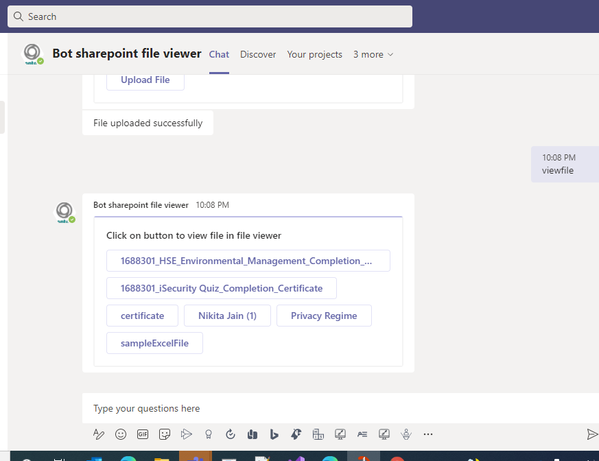
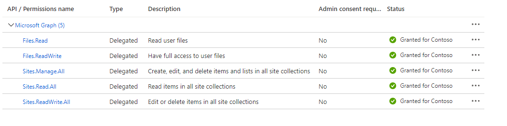

Using this Nodejs sample, a bot with capability to upload files to SharePoint site and same files can be viewed in Teams file viewer.

## Key features





## Prerequisites

- Microsoft Teams is installed and you have an account (not a guest account)
-  [NodeJS](https://nodejs.org/en/)
-  [ngrok](https://ngrok.com/) or equivalent tunneling solution
-  [M365 developer account](https://docs.microsoft.com/en-us/microsoftteams/platform/concepts/build-and-test/prepare-your-o365-tenant) or access to a Teams account with the appropriate permissions to install an app.

## To try this sample

> Note these instructions are for running the sample on your local machine, the tunnelling solution is required because
> the Teams service needs to call into the bot.

### 1. Setup for Bot SSO
In Azure portal, create a [Bot Framework registration resource](https://docs.microsoft.com/en-us/azure/bot-service/bot-builder-authentication?view=azure-bot-service-4.0&tabs=csharp%2Caadv2).

 Add this permission to app registration



### 2. Setup Sharepoint site configuration
- Login to [sharepoint](https://www.office.com/launch/sharepoint?auth=2)
- Click on `Create site` and select `Team site`
   
   
   
   - Enter site name and description of site.
   
   .
   
   - From site address eg: 'https://m365x357260.sharepoint.com/sites/SharePointTestSite'
      `m365x357260.sharepoint.com` - value is sharepoint tenant name.
	  
   - Click on next. (optional step)Add aditional owner and member.
   - Click on Finish.

### 3. Run your bot sample
1) Clone the repository

    ```bash
    git clone https://github.com/OfficeDev/Microsoft-Teams-Samples.git
    ```

2) In a terminal, navigate to `samples/bot-sharepoint-file-viewer/nodejs`

3) Install modules

    ```bash
    npm install
    ```

4) Run ngrok - point to port 3978

    ```bash
    ngrok http -host-header=rewrite 3978
    ```
5) Update the `.env` configuration for the bot to use the `MicrosoftAppId` and `MicrosoftAppPassword` and `ConnectionName` from the Bot Framework registration. (Note that the MicrosoftAppId is the AppId created in step 1 (Setup for Bot SSO), the MicrosoftAppPassword is referred to as the "client secret" in step 1 (Setup for Bot SSO) and you can always create a new client secret anytime.) Also update the `SharepointTenantName` with your tenant name and `SharepointSiteName` with your sharepoint site name. For `ApplicationBaseUrl` provide the application base url.

6) Run your bot at the command line:

    ```bash
    npm start
    ```
- **Manually update the manifest.json**
    - Edit the `manifest.json` contained in the  `/appPackage` folder to and fill in MicrosoftAppId (that was created in step 1 and it is the same value of MicrosoftAppId as in `.env` file) *everywhere* you see the place holder string `<<YOUR-MICROSOFT-APP-ID>>` (depending on the scenario it may occur multiple times in the `manifest.json`)
    - Zip up the contents of the `/appPackage` folder to create a `manifest.zip`
    - Upload the `manifest.zip` to Teams (in the left-bottom *Apps* view, click "Upload a custom app")

    > IMPORTANT: The manifest file in this app adds "token.botframework.com" to the list of `validDomains`. This must be included in any bot that uses the Bot Framework OAuth flow.

## Interacting with the bot.

Add the bot to personal scope.

Send `login` message to the bot, you will recieve a consent card by the bot in your personal scope.
