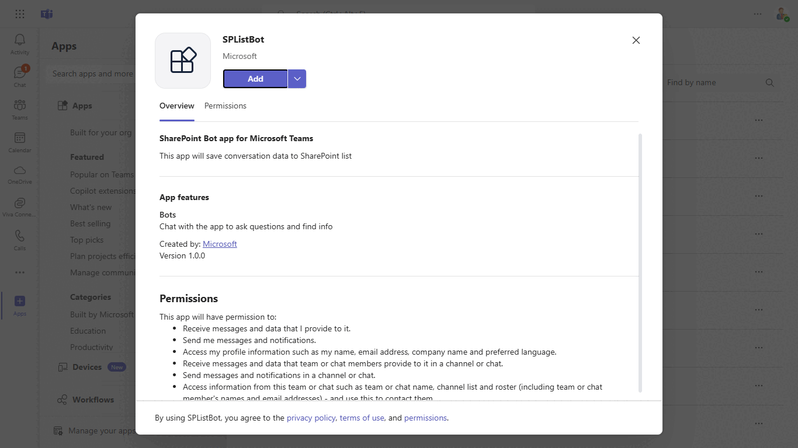
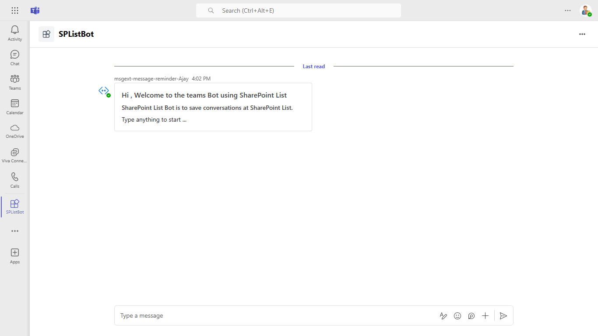
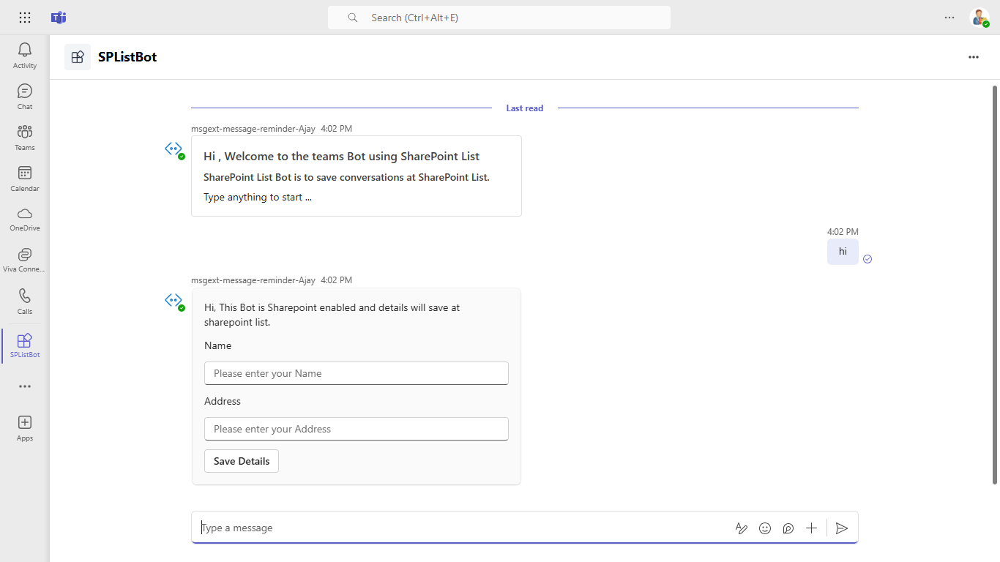

# Sharepoint List Bot

Bot Framework v4 SPListBot sample.

This bot has been created using [Bot Framework](https://dev.botframework.com), This Microsoft Teams bot sample demonstrates how to capture user input through adaptive cards and store it in a SharePoint list. Built on the Bot Framework, it offers a seamless way to manage data directly from the Teams interface. The setup includes SharePoint registration, permissions configuration, and deployment in Teams, allowing easy integration and data handling within your Teams environment.

## Interaction with app




## Prerequisites

- [.NET Core SDK](https://dotnet.microsoft.com/download) version 6.0

  ```bash
  # determine dotnet version
  dotnet --version
  ```

  [Microsoft 365 Agents Toolkit for Visual Studio](https://learn.microsoft.com/en-us/microsoftteams/platform/toolkit/toolkit-v4/install-teams-toolkit-vs?pivots=visual-studio-v17-7)
  
## Run the app (Using Microsoft 365 Agents Toolkit for Visual Studio)

The simplest way to run this sample in Teams is to use Microsoft 365 Agents Toolkit for Visual Studio.
1. Install Visual Studio 2022 **Version 17.14 or higher** [Visual Studio](https://visualstudio.microsoft.com/downloads/)
1. Install Microsoft 365 Agents Toolkit for Visual Studio [Microsoft 365 Agents Toolkit extension](https://learn.microsoft.com/en-us/microsoftteams/platform/toolkit/toolkit-v4/install-teams-toolkit-vs?pivots=visual-studio-v17-7)
1. In the debug dropdown menu of Visual Studio, select Dev Tunnels > Create A Tunnel (set authentication type to Public) or select an existing public dev tunnel.
1. Right-click the 'M365Agent' project in Solution Explorer and select **Microsoft 365 Agents Toolkit > Select Microsoft 365 Account**
1. Sign in to Microsoft 365 Agents Toolkit with a **Microsoft 365 work or school account**
1. Set `Startup Item` as `Microsoft Teams (browser)`.
1. Press F5, or select Debug > Start Debugging menu in Visual Studio to start your app
</br>
1. In the opened web browser, select Add button to install the app in Teams
> If you do not have permission to upload custom apps (uploading), Microsoft 365 Agents Toolkit will recommend creating and using a Microsoft 365 Developer Program account - a free program to get your own dev environment sandbox that includes Teams.

## To try this sample

- Clone the repository

    ```bash
    git clone https://github.com/OfficeDev/Microsoft-Teams-Samples.git
    ```

- Run the bot from a terminal or from Visual Studio:

  A) From a terminal, navigate to `samples/bot-sharepoint-list/csharp` folder

  ```bash
  # run the bot
  dotnet run
  ```

  B) Or from Visual Studio

  - Launch Visual Studio
  - File -> Open -> Project/Solution
  - Navigate to `samples/bot-sharepoint-list/csharp` folder
  - Select `SPListBot.csproj` file
  - Press `F5` to run the project

  # Step 1: Register a new app
    1. Register a new application in the [Microsoft Entra ID – App Registrations](https://go.microsoft.com/fwlink/?linkid=2083908) portal.
    2. Select **New Registration** and on the *register an application page*, set following values:
      * Set **name** to your app name.
      * Choose the **supported account types** (any account type will work)
      * Leave **Redirect URI** empty.
      * Choose **Register**.
    3. On the overview page, copy and save the **Application (client) ID, Directory (tenant) ID**. You'll need those later when updating your Teams application manifest and in the appsettings.json.
    4. Navigate to **API Permissions**, and make sure to add the follow permissions:
    Select Add a permission
      * Select Add a permission
      * Select Microsoft Graph -\> Delegated permissions.
      * `User.Read` (enabled by default)
      * Click on Add permissions. Please make sure to grant the admin consent for the required permissions.

    You need to register a new addin/app in your Sharepoint site, this will generate a ClientID and a Client Secret,  which we will use to authenticate. Lets see how to do it.

    Go to `_layouts/15/appregnew.aspx` under the SP Online site which you want to use as document repository.

  # Step 2: Know your Tenant ID and Resource ID

    It is very important to know your tenant ID for triggering any kind of service calls.
    You can get your Tenant ID, Resource Id by following below points:
    1. Navigate to `https//{SharePointDomain}/_layouts/15/appprincipals.aspx`
    2. You will see Site Collection App Permissions under site settings.
    3. You can check your any App and get the Tenant Id and Resource Id from `App Identifier`. The   part after "@" is your `tenant ID` and the part before @ is `Resource ID`.


  # Step 3: Update your appSetting.json

  MicrosoftAppId: `<<Your Microsoft Bot_Id>>`

  "MicrosoftAppPassword": `<<Your Microsoft Bot_Secret>>`

  "BaseUrl": `<<Bot_endpoint_url>>`

  "TenantID":  `<<Sharepoint Tenant Id>>`

  "ResourceID": `<<SP_Resource_ID>>`

  "TenantName":  `<<sahrepoint Tenant Name>>`

  "SiteName":  `<<Shareppint site name>>`

  "ListName":  `<<Custom list name which created at site>>`

  "AppClientID": `<<Custom Client App ID created at sharepoint App>>`

  "AppSecret": `<<App Secret Id for sharepoint App>>` 

  # Step 4: Grant permissions
    New Client app has been created in SP Online site, now its time to decide what permissions this app should have on your site. You can grant Site collection, web or even at list level read or write permissions.

    Go to `/_layouts/15/appinv.aspx` and serach with ClientID we generated earlier. The application will fetch all other details based on your ClientID.


### This steps is specific to Microsoft Teams

- Navigate to `appPackage` folder
- Select the `Manifest.json` and update it with your `Your Bot Id`
- Now zip the manifest.json along with icons
- Go to teams and do `Upload a Custom App` 
- Add the Bot to Microsoft Teams
- Start the conversation with Bot

### Interaction with the Bot
- Ping the bot in 1:1 or channel scope
- Bot will send an Adaptive card having two fields name and address.
- Enter the values in Adaptive Card and click on Save button.
- Bot will save the card data in SharePoint List.

**Note**: If you are facing any issue in your app, please uncomment [this](https://github.com/OfficeDev/Microsoft-Teams-Samples/blob/main/samples/bot-sharepoint-list/csharp/SPListBot/AdapterWithErrorHandler.cs#L26) line and put your debugger for local debug.

### Screenshots
**Upload the custom app in Teams**


**Interaction with the Bot**



**Ping the Bot**




## Further reading
- [Conversational bots in teams](https://docs.microsoft.com/en-us/microsoftteams/platform/bots/what-are-bots)
- [Conversation Basics](https://docs.microsoft.com/en-us/microsoftteams/platform/bots/how-to/conversations/conversation-basics?tabs=dotnet)
- [Granting Access using sharepoint app only](https://docs.microsoft.com/en-us/sharepoint/dev/solution-guidance/security-apponly-azureacs)
- [Sharepoint using Application Context](https://docs.microsoft.com/en-us/sharepoint/dev/solution-guidance/security-apponly)
- [Sharepoint API basic operations](https://docs.microsoft.com/en-us/sharepoint/dev/sp-add-ins/complete-basic-operations-using-sharepoint-rest-endpoints)


