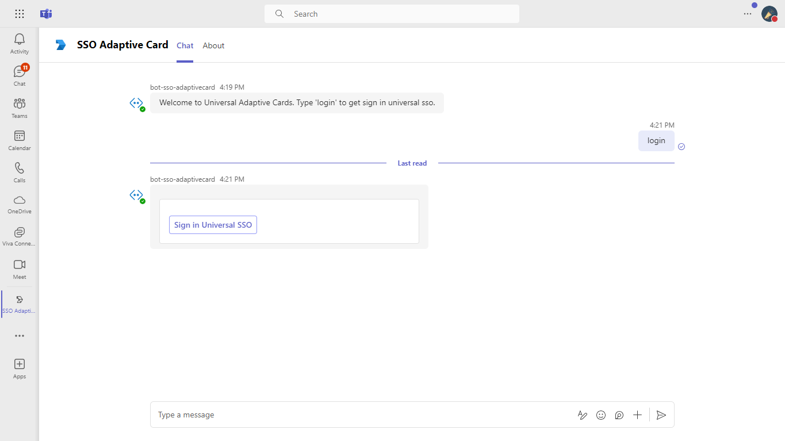

# Teams Auth Bot

Bot Framework v4 bot using Teams authentication

This bot has been created using [Bot Framework](https://dev.botframework.com), it shows how to get started with authentication in a bot for Microsoft Teams.

The focus of this sample is how to use the Bot Framework support for oauth in your bot. Teams behaves slightly differently than other channels in this regard. Specifically an Invoke Activity is sent to the bot rather than the Event Activity used by other channels. This Invoke Activity must be forwarded to the dialog if the OAuthPrompt is being used. This is done by subclassing the ActivityHandler and this sample includes a reusable TeamsActivityHandler. This class is a candidate for future inclusion in the Bot Framework SDK.

The sample uses the bot authentication capabilities in [Azure Bot Service](https://docs.botframework.com),providing features to make it easier to develop a bot that authenticates users to various identity providers such as Azure AD (Azure Active Directory), GitHub, Uber, etc. The OAuth token is then used to make basic Microsoft Graph queries.

> IMPORTANT: The manifest file in this app adds "token.botframework.com" to the list of validDomains. This must be included in any bot that uses the Bot Framework OAuth flow.

> IMPORTANT: Teams SSO only works in 1-1 chats, and not group contexts.


## Interaction with app

 

## Prerequisites

- Microsoft Teams is installed and you have an account
- [.NET SDK](https://dotnet.microsoft.com/download) version 6.0
- [ngrok](https://ngrok.com/) or equivalent tunnelling solution

## Setup

### 1. Setup for Bot SSO
- Setup for Bot SSO
Refer to [Bot SSO Setup document](https://github.com/OfficeDev/Microsoft-Teams-Samples/blob/main/samples/bot-conversation-sso-quickstart/BotSSOSetup.md).

- Ensure that you've [enabled the Teams Channel](https://docs.microsoft.com/en-us/azure/bot-service/channel-connect-teams?view=azure-bot-service-4.0)

- While registering the bot, use `https://<your_ngrok_url>/api/messages` as the messaging endpoint.
    > NOTE: When you create your bot you will create an App ID and App password - make sure you keep these for later.

### 2. Setup NGROK
1) Run ngrok - point to port 3978

```bash
# ngrok http -host-header=rewrite 3978
```
### 3. Setup for code

- Clone the repository

    ```bash
    git clone https://github.com/OfficeDev/Microsoft-Teams-Samples.git
    ```

- Run the bot from a terminal or from Visual Studio:

  A) From a terminal, navigate to `samples/bot-sso-adaptivecard/csharp`

  ```bash
  # run the bot
  dotnet run
  ```
  B) Or from Visual Studio

  - Launch Visual Studio
  - File -> Open -> Project/Solution
  - Navigate to `samples/bot-sso-adaptivecard/csharp` folder
  - Select `BotSsoAdaptivecard.sln` file
  - Press `F5` to run the project

- Update the appsettings.json configuration for the bot to use the MicrosoftAppId (Microsoft App Id), MicrosoftAppPassword (App Password) and connectionName (OAuth Connection Name).
- Navigate to samples/bot-sso-adaptivecard/csharp/BotSsoAdaptivecard/Bots/DialogBot.cs
- On line 34, replace <YOUR-CONNECTION-NAME>.

**Bot Configuration:**


**Bot OAuth Connection:**


### 4. Register your Teams Auth SSO with Azure AD

1. Register a new application in the [Azure Active Directory – App Registrations](https://go.microsoft.com/fwlink/?linkid=2083908) portal.
2. Select **New Registration** and on the *register an application page*, set following values:
    * Set **name** to your app name.
    * Choose the **supported account types** (any account type will work)
    * Leave **Redirect URI** empty.
    * Choose **Register**.
3. On the overview page, copy and save the **Application (client) ID, Directory (tenant) ID**. You’ll need those later when updating your Teams application manifest and in the appsettings.json.
4. Under **Manage**, select **Expose an API**. 
5. Select the **Set** link to generate the Application ID URI in the form of `api://{AppID}`. Insert your fully qualified domain name (with a forward slash "/" appended to the end) between the double forward slashes and the GUID. The entire ID should have the form of: `api://fully-qualified-domain-name/botid-{AppID}`
    * ex: `api://%ngrokDomain%.ngrok.io/botid-00000000-0000-0000-0000-000000000000`.
6. Select the **Add a scope** button. In the panel that opens, enter `access_as_user` as the **Scope name**.
7. Set **Who can consent?** to `Admins and users`
8. Fill in the fields for configuring the admin and user consent prompts with values that are appropriate for the `access_as_user` scope:
    * **Admin consent title:** Teams can access the user’s profile.
    * **Admin consent description**: Allows Teams to call the app’s web APIs as the current user.
    * **User consent title**: Teams can access the user profile and make requests on the user's behalf.
    * **User consent description:** Enable Teams to call this app’s APIs with the same rights as the user.
9. Ensure that **State** is set to **Enabled**
10. Select **Add scope**
    * The domain part of the **Scope name** displayed just below the text field should automatically match the **Application ID** URI set in the previous step, with `/access_as_user` appended to the end:
        * `api://[ngrokDomain].ngrok.io/botid-00000000-0000-0000-0000-000000000000/access_as_user.
11. In the **Authorized client applications** section, identify the applications that you want to authorize for your app’s web application. Each of the following IDs needs to be entered:
    * `1fec8e78-bce4-4aaf-ab1b-5451cc387264` (Teams mobile/desktop application)
    * `5e3ce6c0-2b1f-4285-8d4b-75ee78787346` (Teams web application)

12. Navigate to **Authentication**
    If an app hasn't been granted IT admin consent, users will have to provide consent the first time they use an app.
    Set a redirect URI:
    * Select **Add a platform**.
    * Select **web**.
    * Enter the **redirect URI** for the app in the following format: 
    1) https://token.botframework.com/.auth/web/redirect
    
    Enable implicit grant by checking the following boxes:  
    ✔ ID Token  
    ✔ Access Token  

13.  Navigate to the **Certificates & secrets**. In the Client secrets section, click on "+ New client secret". Add a description      (Name of the secret) for the secret and select “Never” for Expires. Click "Add". Once the client secret is created, copy its value, it need to be placed in the appsettings.json.

 ### 5. Setup Manifest for Teams

**This step is specific to Teams.**
   - **Edit** the `manifest.json` contained in the  `TeamsAppManifest` folder to replace your Microsoft App Id (that was created when you registered your bot earlier) *everywhere* you see the place holder string `<<YOUR-MICROSOFT-APP-ID>>` (depending on the scenario the Microsoft App Id may occur multiple times in the `manifest.json`)
   - **Edit** the `manifest.json` for `validDomains` and `{{domain-name}}` with base Url domain. E.g. if you are using ngrok it would be `https://1234.ngrok.io` then your domain-name will be `1234.ngrok.io`.
   - **Edit** he manifest.json for webApplicationInfo resource "api://{{domain-name}}/botid-<<YOUR-MICROSOFT-APP-ID>>" with base Url of your domain. E.g. if you are using ngrok it would be https://1234.ngrok.io then your domain-name will be "api://{{domain-name}}/botid-<<YOUR-MICROSOFT-APP-ID>>".
   - **Zip** up the contents of the `TeamsAppManifest` folder to create a `manifest.zip` folder into a `manifest.zip`.(Make sure that zip file does not contains any subfolder otherwise you will get error while uploading your .zip package)
   - **Upload** the `manifest.zip` to Teams (In Teams Apps/Manage your apps click "Upload an app". Browse to and Open the .zip file. At the next dialog, click the Add button.)

> Note: This `manifest.json` specified that the bot will be installed in a "personal" scope only. Please refer to Teams documentation for more details.   

## Running the sample

**Upload App:**


**Install App:**


**Welcome UI:**


**Sign-In UI:**



**UserDetails:**


## Deploy the bot to Azure

To learn more about deploying a bot to Azure, see [Deploy your bot to Azure](https://aka.ms/azuredeployment) for a complete list of deployment instructions.

## Further reading

- [Universal Actions for Adaptive Cards](https://learn.microsoft.com/en-us/microsoftteams/platform/task-modules-and-cards/cards/universal-actions-for-adaptive-cards/overview?tabs=mobile)


