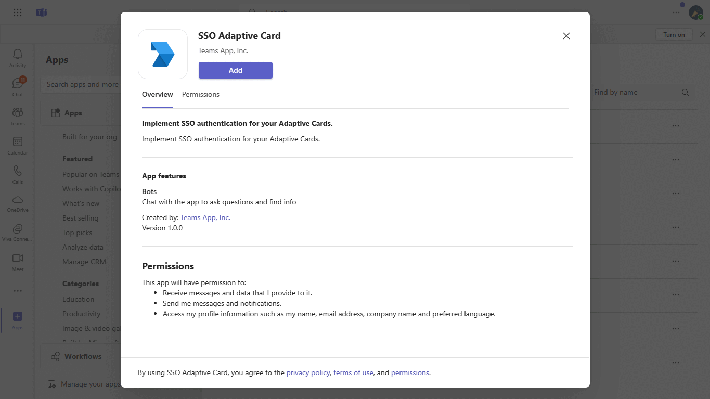
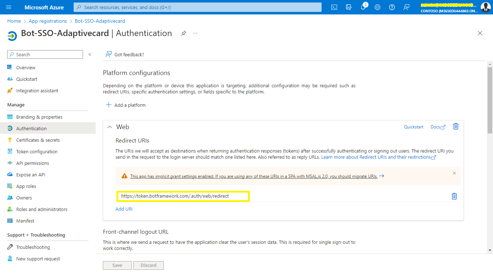
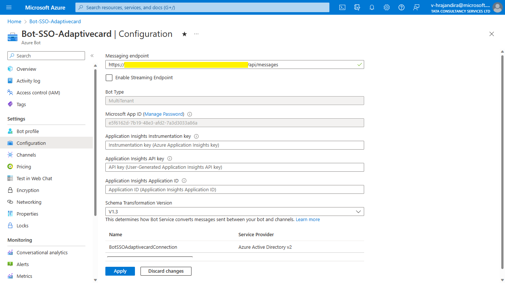
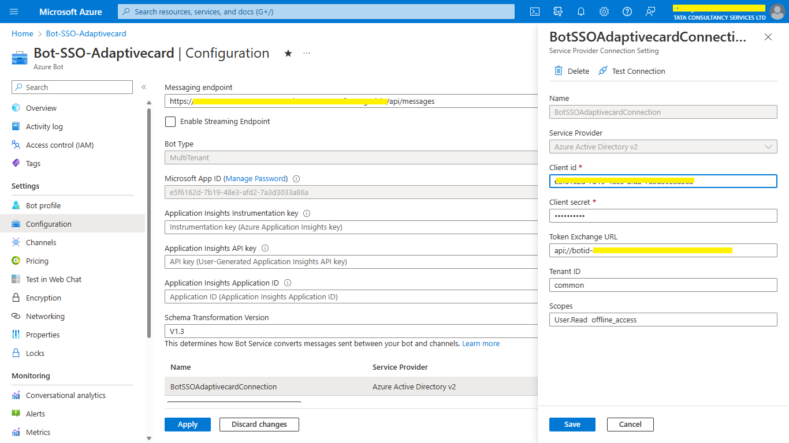
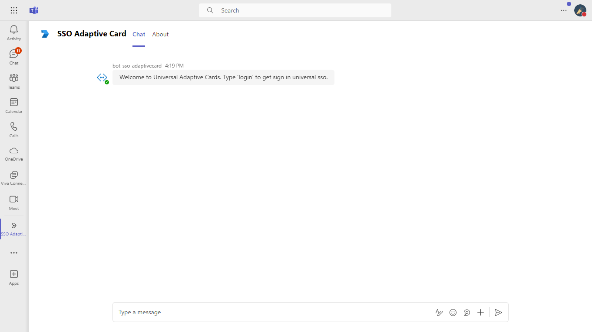
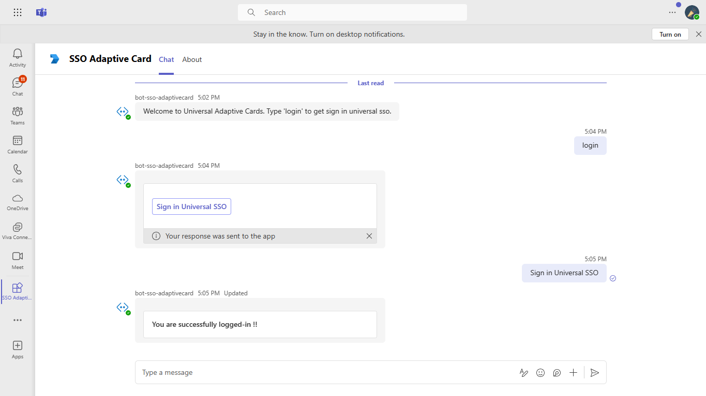
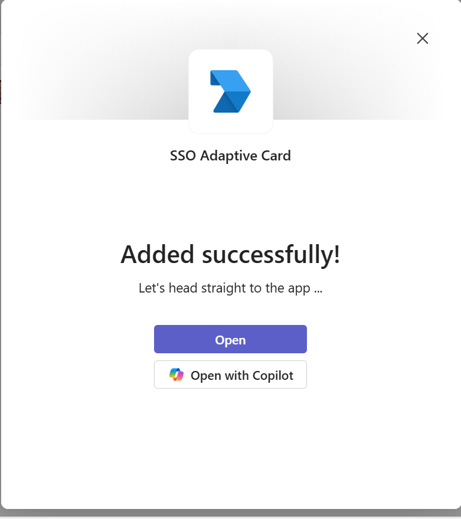
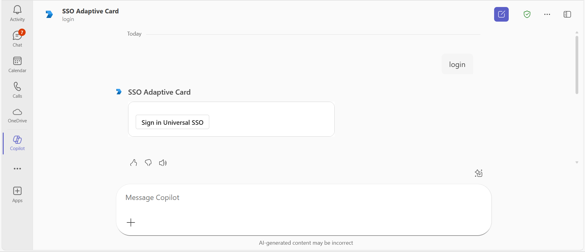
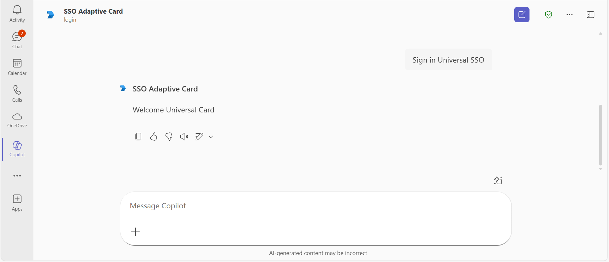

# SSO for your Adaptive Cards

This sample code demonstrates how to get enable SSO authentication for your Adaptive Cards.

## Included Features
* Teams SSO (bots)
* Adaptive Cards
* Custom Engine Agents - Copilot

## Interaction with app

 

## Try it yourself - experience the App in your Microsoft Teams client
Please find below demo manifest which is deployed on Microsoft Azure and you can try it yourself by uploading the app manifest (.zip file link below) to your teams and/or as a personal app. (Uploading must be enabled for your tenant, [see steps here](https://docs.microsoft.com/microsoftteams/platform/concepts/build-and-test/prepare-your-o365-tenant#enable-custom-teams-apps-and-turn-on-custom-app-uploading)).


**Implement SSO authentication for your Adaptive Cards.:** [Manifest](/samples/bot-sso-adaptivecard/csharp/demo-manifest/bot-sso-adaptivecard.zip)

## Prerequisites

- Microsoft Teams is installed and you have an account
- [.NET SDK](https://dotnet.microsoft.com/download) version 6.0
- [dev tunnel](https://learn.microsoft.com/en-us/azure/developer/dev-tunnels/get-started?tabs=windows) or [ngrok](https://ngrok.com/download) latest version or equivalent tunneling solution

## Run the app (Using Microsoft 365 Agents Toolkit for Visual Studio)

The simplest way to run this sample in Teams is to use Microsoft 365 Agents Toolkit for Visual Studio.
1. Install Visual Studio 2022 **Version 17.14 or higher** [Visual Studio](https://visualstudio.microsoft.com/downloads/)
1. Install Microsoft 365 Agents Toolkit for Visual Studio [Microsoft 365 Agents Toolkit extension](https://learn.microsoft.com/en-us/microsoftteams/platform/toolkit/toolkit-v4/install-teams-toolkit-vs?pivots=visual-studio-v17-7)
1. In the debug dropdown menu of Visual Studio, select Dev Tunnels > Create A Tunnel (set authentication type to Public) or select an existing public dev tunnel.
1. Right-click the 'M365Agent' project in Solution Explorer and select **Microsoft 365 Agents Toolkit > Select Microsoft 365 Account**
1. Sign in to Microsoft 365 Agents Toolkit with a **Microsoft 365 work or school account**
1. Set `Startup Item` as `Microsoft Teams (browser)`.
1. Press F5, or select Debug > Start Debugging menu in Visual Studio to start your app
</br>
1. In the opened web browser, select Add button to install the app in Teams
> If you do not have permission to upload custom apps (uploading), Microsoft 365 Agents Toolkit will recommend creating and using a Microsoft 365 Developer Program account - a free program to get your own dev environment sandbox that includes Teams.

## Setup

### 1. Setup for Bot
Register your application with Azure AD

1. Register a new application in the [Microsoft Entra ID – App Registrations](https://go.microsoft.com/fwlink/?linkid=2083908) portal.
2. Select **New Registration** and on the *register an application page*, set following values:
    * Set **name** to your app name.
    * Choose the **supported account types** (any account type will work)
    * Leave **Redirect URI** empty.
    * Choose **Register**.
3. On the overview page, copy and save the **Application (client) ID, Directory (tenant) ID**. You’ll need those later when updating your Teams application manifest and in the appsettings.json.
4. Under **Manage**, select **Expose an API**. 
5. Select the **Set** link to generate the Application ID URI in the form of `api://{AppID}`. Insert your fully qualified domain name (with a forward slash "/" appended to the end) between the double forward slashes and the GUID. The entire ID should have the form of: `api://fully-qualified-domain-name/botid-{AppID}`
    * ex: `api://botid-00000000-0000-0000-0000-000000000000`.
6. Select the **Add a scope** button. In the panel that opens, enter `access_as_user` as the **Scope name**.
7. Set **Who can consent?** to `Admins and users`
8. Fill in the fields for configuring the admin and user consent prompts with values that are appropriate for the `access_as_user` scope:
    * **Admin consent title:** Teams can access the user’s profile.
    * **Admin consent description**: Allows Teams to call the app’s web APIs as the current user.
    * **User consent title**: Teams can access the user profile and make requests on the user's behalf.
    * **User consent description:** Enable Teams to call this app’s APIs with the same rights as the user.
9. Ensure that **State** is set to **Enabled**
10. Select **Add scope**
    * The domain part of the **Scope name** displayed just below the text field should automatically match the **Application ID** URI set in the previous step, with `/access_as_user` appended to the end:
        * `api://botid-00000000-0000-0000-0000-000000000000/access_as_user.
11. In the **Authorized client applications** section, identify the applications that you want to authorize for your app’s web application. Each of the following IDs needs to be entered:
    * `1fec8e78-bce4-4aaf-ab1b-5451cc387264` (Teams mobile/desktop application)
    * `5e3ce6c0-2b1f-4285-8d4b-75ee78787346` (Teams web application)
    
12.  Add any necessary API permissions for downstream calls
     * Navigate to "API permissions" blade on the left hand side
     
13. Navigate to **Authentication**
    If an app hasn't been granted IT admin consent, users will have to provide consent the first time they use an app.
    Set a redirect URI:
    * Select **Add a platform**.
    * Select **web**.
    * Enter the **redirect URI** for the app in the following format: 
    1) https://token.botframework.com/.auth/web/redirect
    
    Enable implicit grant by checking the following boxes:  
    ✔ ID Token  
    ✔ Access Token  

14.  Navigate to the **Certificates & secrets**. In the Client secrets section, click on "+ New client secret". Add a description(Name of the secret) for the secret and select “Never” for Expires. Click "Add". Once the client secret is created, copy its value, it need to be placed in the appsettings.json.

- Ensure that you've [enabled the Teams Channel](https://docs.microsoft.com/en-us/azure/bot-service/channel-connect-teams?view=azure-bot-service-4.0)

- While registering the bot, use `https://<your_tunnel_domain>/api/messages` as the messaging endpoint.
    > NOTE: When you create your bot you will create an App ID and App password - make sure you keep these for later.
15. Register a new application in the [Microsoft Entra ID – App Registrations](https://go.microsoft.com/fwlink/?linkid=2083908) portal.
  
  A) Select **New Registration** and on the *register an application page*, set following values:
      * Set **name** to your app name.
      * Choose the **supported account types** (any account type will work)
      * Leave **Redirect URI** empty.
      * Choose **Register**.
  B) On the overview page, copy and save the **Application (client) ID, Directory (tenant) ID**. You'll need those later when updating your Teams application manifest and in the appsettings.json.
  C) Navigate to **API Permissions**, and make sure to add the following permissions:
   Select Add a permission
      * Select Add a permission
      * Select Microsoft Graph -\> Delegated permissions.
      * `User.Read` (enabled by default)
      * Click on Add permissions. Please make sure to grant the admin consent for the required permissions.

### 2. Setup NGROK
1) Run ngrok - point to port 3978

   ```bash
   ngrok http 3978 --host-header="localhost:3978"
   ```  

   Alternatively, you can also use the `dev tunnels`. Please follow [Create and host a dev tunnel](https://learn.microsoft.com/en-us/azure/developer/dev-tunnels/get-started?tabs=windows) and host the tunnel with anonymous user access command as shown below:

   ```bash
   devtunnel host -p 3978 --allow-anonymous
   ```

### 3. Setup for code

- Clone the repository

    ```bash
    git clone https://github.com/OfficeDev/Microsoft-Teams-Samples.git
    ```

- Run the bot from a terminal or from Visual Studio:

  A) From a terminal, navigate to `samples/bot-sso-adaptivecard/csharp`

  ```bash
  # run the bot
  dotnet run
  ```
  B) Or from Visual Studio

  - Launch Visual Studio
  - File -> Open -> Project/Solution
  - Navigate to `samples/bot-sso-adaptivecard/csharp` folder
  - Select `BotSsoAdaptivecard.sln` file
  - Press `F5` to run the project

1. Update the appsettings.json configuration for the bot to use the MicrosoftAppId (Microsoft App Id), MicrosoftAppPassword (App Password) and connectionName (OAuth Connection Name).
2. Navigate to samples\bot-sso-adaptivecard\csharp\BotSsoAdaptivecard\Resources\AdaptiveCardResponse.json
   - On line 32, replace `<<YOUR-MICROSOFT-APP-ID>>`.
3. Navigate to samples\bot-sso-adaptivecard\csharp\BotSsoAdaptivecard\Resources\AdaptiveCardWithSSOInRefresh.json
   - *Update everywhere* you see the place holder string `<<YOUR-MICROSOFT-APP-ID>>` and Update On line 12, replace `<<YOUR-CONNECTION-NAME>>`.
4. Navigate to samples\bot-sso-adaptivecard\csharp\BotSsoAdaptivecard\Resources\options.json
   - On line 29, replace `<<YOUR-MICROSOFT-APP-ID>>`.

**Notes:**
- If you are facing any issue in your app,  [please uncomment this line](https://github.com/OfficeDev/Microsoft-Teams-Samples/blob/727ae5487d750c25e02a6de5b0c0912b72d86b94/samples/bot-sso-adaptivecard/csharp/BotSsoAdaptivecard/AdapterWithErrorHandler.cs#L27) and put your debugger for local debug.

**Bot Configuration:**



**Bot OAuth Connection:**



 ### 5. Setup Manifest for Teams

**This step is specific to Teams.**
   - **Edit** the `manifest.json` contained in the  `appPackage` folder to replace your Microsoft App Id (that was created when you registered your bot earlier) *everywhere* you see the place holder string `<<YOUR-MICROSOFT-APP-ID>>` (depending on the scenario the Microsoft App Id may occur multiple times in the `manifest.json`)
   - **Edit** the `manifest.json` for `validDomains` and `{{domain-name}}` with base Url domain. E.g. if you are using ngrok it would be `https://1234.ngrok-free.app` then your domain-name will be `1234.ngrok-free.app` and if you are using dev tunnels then your domain will be `12345.devtunnels.ms`.
   - **Edit** the manifest.json for webApplicationInfo resource "api://botid-`<<YOUR-MICROSOFT-APP-ID>>`" with base Url of your domain. E.g. if you are using ngrok it would be https://1234.ngrok-free.app then your domain-name will be "api://botid-`<<YOUR-MICROSOFT-APP-ID>>`".
   - **Zip** up the contents of the `appPackage` folder to create a `manifest.zip` folder into a `manifest.zip`.(Make sure that zip file does not contains any subfolder otherwise you will get error while uploading your .zip package)
   - **Upload** the `manifest.zip` to Teams (In Teams Apps/Manage your apps click "Upload an app to your org's app catalog'". Browse to and Open the .zip file. At the next dialog, click the Add button.)

> Note: This `manifest.json` specified that the bot will be installed in a "personal" scope only. Please refer to Teams documentation for more details.   

## Running the sample

**Install App:**


**Welcome UI:**



**Sign-In UI:**


**Login Successfully:**



**Copilot Custom Engine Agents:**
**Install App In Copilot**

**Sign-In UI:**

**Welcome Universal Card:**


## Deploy the bot to Azure

To learn more about deploying a bot to Azure, see [Deploy your bot to Azure](https://aka.ms/azuredeployment) for a complete list of deployment instructions.

## Further reading

- [Universal Actions for Adaptive Cards](https://review.learn.microsoft.com/en-us/microsoftteams/platform/task-modules-and-cards/cards/universal-actions-for-adaptive-cards/sso-adaptive-cards-universal-action?branch=pr-en-us-7547#add-code-to-receive-the-token)


- [Custom Engine Agent-Copilot](https://learn.microsoft.com/en-us/microsoft-365-copilot/extensibility/overview-custom-engine-agent?utm_source=chatgpt.com)


