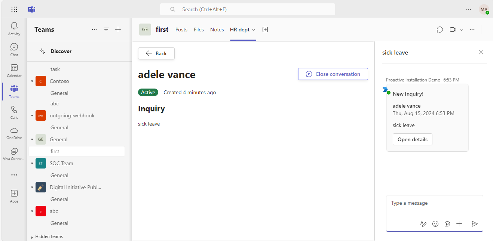
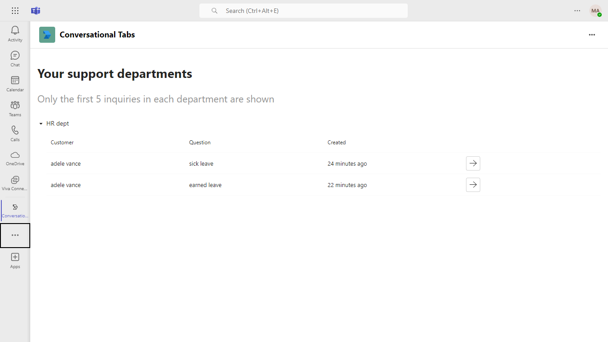
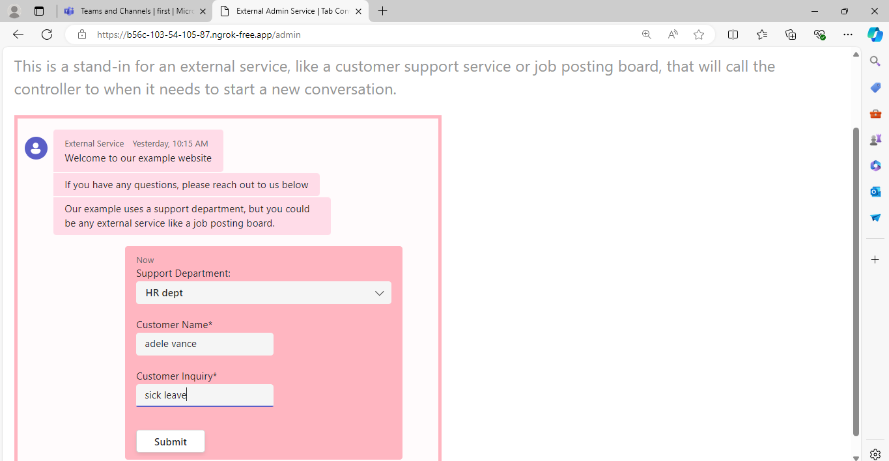
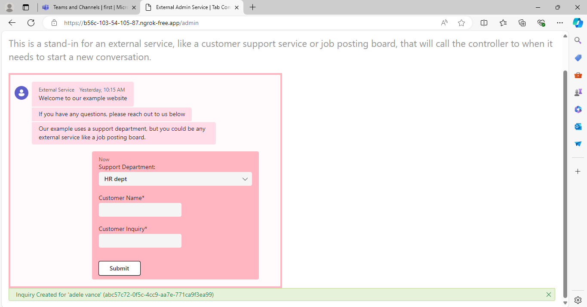

# Proactive Tab Conversations
The proof of concept demonstrates how to use a bot to proactively create a new conversation each time a support inquiry is filed. The inquiry will be viewable in a tab, and the conversation can continue using conversational tabs.
This concept can be extended to additional scenarios including proactively creating conversations on a patient, opportunity, incident, etc.

Please see the [Code Tours](#code-tours) section for in-depth explanation of the sample. 

## Included Features
* Conversational tabs/Sub-entity conversations
* Personal tabs
* Proactive conversation creation from a Bot
* Authorization of API calls based on user's Team membership

 ## Interaction with app


## Workflow

## Prerequisites
* Make sure you have an active [Azure subscription](https://azure.microsoft.com/en-us/free/).
* Make sure [Publish to organization's app store](https://docs.microsoft.com/en-us/MicrosoftTeams/manage-apps?toc=%2Fmicrosoftteams%2Fplatform%2Ftoc.json&bc=%2Fmicrosoftteams%2Fplatform%2Fbreadcrumb%2Ftoc.json#publish-a-custom-app-to-your-organizations-app-store) is available in Teams.
[Publish a custom app](https://docs.microsoft.com/en-us/MicrosoftTeams/submit-approve-custom-apps) to publish the custom app. 
* Install [Visual Studio](https://docs.microsoft.com/en-us/visualstudio/install/install-visual-studio?view=vs-2022) or [Visual Studio Code](https://code.visualstudio.com/download) to run and debug the sample code.
  * [.NET Core SDK](https://dotnet.microsoft.com/download) version 6.0
* Install [ngrok](https://ngrok.com/download) for local setup. (or any other tunneling solution)

### Channel Tab

* [Set-up, deploy and sideload the app to a channel.](#steps)
    *Create new channel and 
    * When the app is installed to the team the bot will automatically gather the required info to create proactive conversations later.
* First create your new channel then proceed.
* In a channel, click '*+ Add a tab*', and add a new *Conversational Tab*.
    * Configure your tab, by adding a *Department name* and *Department description*, then click *Save*.
    * The first time running this application you will need to consent twice. Once to use the app initially, and once to call the API. If you see "We need you to consent to complete that action.", ensure that your pop-up blocker isn't blocking a consent dialog.
* In your tab you will see the department details, but there will be no inquires.
* Open up the external admin page at `<<ngrok-url>>/admin`. This page is a stand-in for an external service that might want to connect into teams, e.g. a job posting board who wants to post new applications.
    * In the external admin page, select a support department and add a new inquiry.
* In the channel, you will see a new conversation. The conversation will be an Adaptive Card that will link to the inquiry in the tab.
* In the tab, you will see the inquiry details and you can use *Open conversation* to open the conversation to the side. And messages posted here, will be visible in the conversation in that channel.
* If you navigate *Back* you can see all the inquiries.

### Personal Tab
There is also a personal tab that will list inquires from all the support departments from all the channels you have access to.
* After installing the app in the personal scope, open the app.
* Once authenticated, the app will list all the support departments from any channel you are a member of. Up to five inquiries from each support department will be listed.
* Clicking on the -> Arrow will open the inquiry details. From the detail page you can open the channel conversation about the inquiry.

## Setup

* Run Ngrok
    * Run ngrok and point it to the port the Web App is listening on. Note the port will change depending on how you are deploying.
    ```bash
    ngrok http 44326 --host-header="localhost:44326" # For Visual Studio
    ```
    * Make sure to copy and save the `https` url (it should look like `https://<randomsubdomain>.ngrok-free.app`).

* Create an AAD app registration in Azure Portal and also create Azure bot in [Azure Portal](https://portal.azure.com) or in [Developer Portal for Microsoft Teams](https://docs.microsoft.com/en-us/microsoftteams/platform/concepts/build-and-test/teams-developer-portal).
    * Set the 'Messaging endpoint' for your Azure Bot with `https://<your application domain/api/messages` like your ngrok URL `https://xxxxx.ngrok-free.app` .
    * *Note: if you restart Ngrok you may have to update the messaging endpoint domain URL aginn in your Azure Bot for local running*
    * Ensure that you've [enabled the Teams Channel](https://docs.microsoft.com/en-us/azure/bot-service/channel-connect-teams?view=azure-bot-service-4.0)

* [Update the AAD App to enable Teams SSO](https://docs.microsoft.com/en-us/microsoftteams/platform/tabs/how-to/authentication/tab-sso-register-aad)
    * When creating the Bot above, an AAD app should either have been created for you, or you should have chosen an AAD app to associate with the bot.
    * The updates below will allow for us to authenticate and authorize API calls to limit data returned to only channels the user is a member of.
    * [Follow the instructions](https://docs.microsoft.com/en-us/microsoftteams/platform/tabs/how-to/authentication/tab-sso-register-aad#to-expose-an-api), to expose an AAD API, creating an Application ID URI, scopes, etc.

    * Once you have followed those instructions, you need to [configure the Web authentication platform for the application](https://docs.microsoft.com/en-us/microsoftteams/platform/tabs/how-to/authentication/tab-sso-graph-api?tabs=dotnet#to-configure-authentication-for-a-platform). Ensure that you have added the `redirect URI` in this format `https://<<fully-qualified-domain-name.com>>/auth-end` like your ngrok URL 'https://xxxxx-590a-c1b2.ngrok-free.app/auth-end'

    * Ensure the following API permissions are granted to the app for Microsoft Graph access - `email`, `offline_access`, `openid`, `profile`, `Team.ReadBasic.All`    
    * *Note: if you restart Ngrok you may have to update any fully qualified domain name you have set in your AAD App*

**Setup for code**
- Clone the repository

    ```bash
    git clone https://github.com/OfficeDev/Microsoft-Teams-Samples.git
    ```

- Run the bot from a terminal or from Visual Studio:

  A) From a terminal, navigate to `Source\ConversationalTabs.Web`

  ```bash
  # run the bot
  dotnet run
  ```

  B) Or from Visual Studio

  - Launch Visual Studio
  - File -> Open -> Project/Solution
  - Navigate to `samples\bot-tab-conversations\csharp\Source\ConversationalTabs.Web` folder
  - Select `Microsoft.Teams.Samples.ConversationalTabs.Web.csproj` file
  - Press `F5` to run the project

* In `appSettings.json` and `.env` file replace:
    * `<<ngrok-url>>` with your minus the https://.
    * `<<aad-id>>` with your AAD Application (Client) Id.
    * `<<aad-client-secret>>` with the client secret you created above.
    * `<<tenant-id>>` with the directory id received via creating AAD app registration in your Azure Portal.
    * `<<teams-app-store-app-id>>` with the App ID assigned to the app in the Teams Admin Center or provided when your app passes validation. If you are sideloading the app you can use the appId from the manifest file, but please note that [deep linking may not work when sideloading](#known-issues).

* Setup Manifest for Teams

    - **Edit** the `manifest.json` contained in the  `Manifest` folder to replace your Microsoft App Id (that was created when you registered your bot earlier) *everywhere* you see the place holder string ``<<aad-id>>`` (depending on the scenario the Microsoft App Id may occur multiple times in the `manifest.json`)
    - **Edit** the `manifest.json` for `<<ngrok-url>>` with base Url domain. E.g. if you are using ngrok it would be `https://1234.ngrok-free.app` then your domain-name will be `1234.ngrok-free.app`. Replace it at all the places you see in your `mainfest.json`.

* Deploying
    * There are detailed instructions for deploying locally below.
* Sideloading the App
    * Create a zip containing `manifest.json`, `colorIcon.png` and `outlineIcon.png` from `Source\ConversationalTabs.Web\Manifest`.
    * [You can upload you app by following these instructions](https://docs.microsoft.com/en-us/microsoftteams/platform/concepts/deploy-and-publish/apps-upload)

**Note**: If you are facing any issue in your app, please uncomment [this](https://github.com/OfficeDev/Microsoft-Teams-Samples/blob/main/samples/bot-tab-conversations/csharp/Source/ConversationalTabs.Web/Bot/BotHttpAdapter.cs#L24) line and put your debugger for local debug.

## Known issues
* When the solution is run on a local web browser (anywhere outside of Teams), it will load a spinner. Instead side-load the application to a teams client, or open up `<<ngrok-url>>/admin` to open the admin page
* Sometimes, the "Open Details" button on a new inquiry's Adaptive Card may not navigate to a the channel tab. This is due to side-loaded apps not having a consistent entityId. This makes deeplinking difficult. If this happens you can open the inquiry in the tab directly. If you have submitted the app to either your Org App Store or the Teams App Store you must set the `<<teams-app-store-app-id>>` in appsettings.json to the App ID value as shown in the [Teams Admin Center](https://admin.teams.microsoft.com/policies/manage-apps).

* Private channels do not support bots at the moment, therefore this app is not supported on private channels.
* If in the personal app a user opens a conversation from a channel they are not a member of, the conversation will fail to show. This is not an issue in our sample as we filter support departments based on Team membership.

* App shows "We need you to consent to complete that action." but provides no action: your pop -up blocker might be blocking a consent dialog from opening, be sure to allow pop-ups from Teams. 

## Code Tours
This repository uses VSCode [Code Tours](https://marketplace.visualstudio.com/items?itemName=vsls-contrib.codetour#:~:text=A%20%22code%20tour%22%20is%20simply%20a%20series%20of,CONTRIBUTING.md%20file%20and%2For%20rely%20on%20help%20from%20others.) to explain _how_ the code works. 

The tour files can be found in the `.tours` directory.

* Project Structure
    * The sample contains 3 projects
        * `Web` - Exposes REST APIs for documents and signing scenarios supported in this POC.  
            * `Web\ClientApp` contains the Front End code to support document sharing in a meeting via share to stage. 
        * `Domain` - Contains the business logic to support the REST APIs.
        * `Infrastructure` - Fulfils `Domain`'s dependencies like data repositories, graph support needed.

## Deployment
### Locally in Visual Studio
* Point Ngrok to port 44326: `ngrok http 44326 --host-header="localhost:44326"`
* Open the solution in Visual Studio.
* Ensure the start-up project is set to `Microsoft.Teams.Samples.ConversationalTabs.Web`
* Start Debugging using IIS Express

### Locally using .NET SDK
* Point Ngrok to port 5001: `ngrok http -host-header=rewrite 5001`
* In a terminal, navigate to `Source\ConversationalTabs.Web`
* Run `dotnet run`

## Running the sample. 









### Docker
*Note the below instructions are using [Podman](https://podman.io/), but Docker's commands are similar. [There are instructions for setting up Podman on WSL2 here](https://github.com/OfficeDev/Microsoft-Teams-Samples/blob/main/samples/meetings-share-to-stage-signing/csharp/Docs/installing-podman-on-wsl2.md)*
* From this directory build the Docker image `podman build -f Deployment/Dockerfile --ignorefile Deployment/.dockerignore ./Source`
* Wait for the container to build
* Run `podman images` to view available images, copy the Image ID
* Point Ngrok to port 8080: `ngrok http -host-header=rewrite 8080`
* Run `podman run -d -p 8080:80 --name ConversationalTabs <IMAGE_ID>` to start the container
* Open [http://localhost:8080/](http://localhost:8080/) to view the service running

## Further reading
* [Create conversational tabs](https://docs.microsoft.com/en-us/microsoftteams/platform/tabs/how-to/conversational-tabs) 


