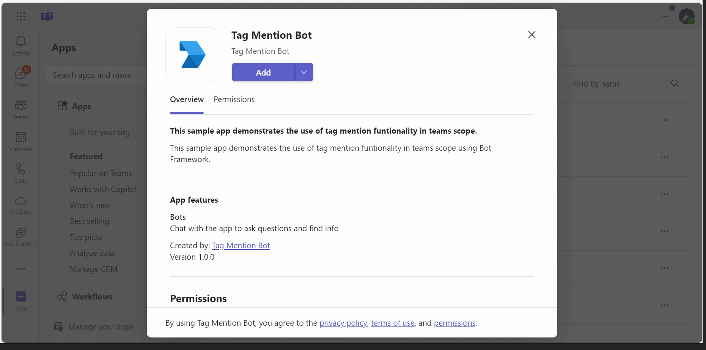
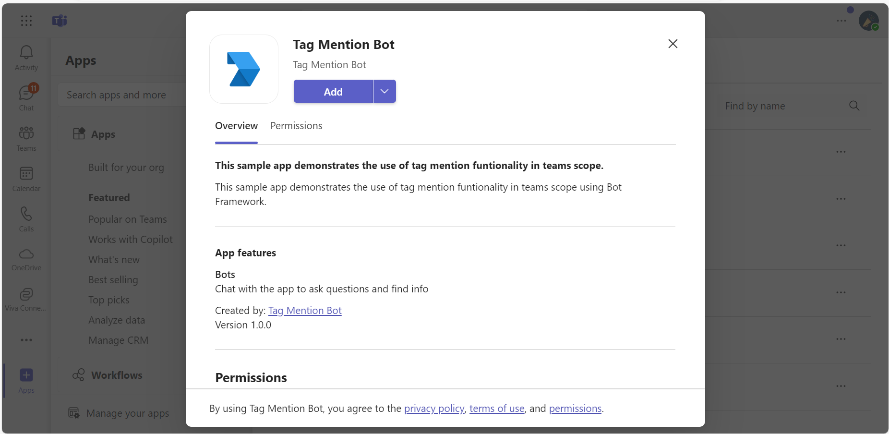
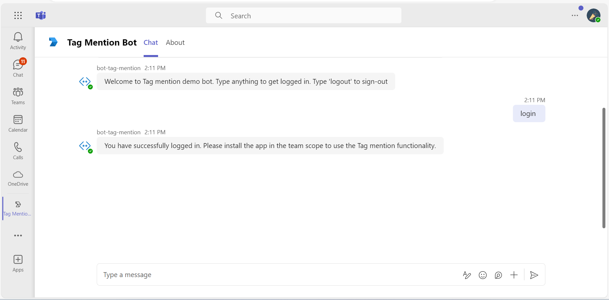
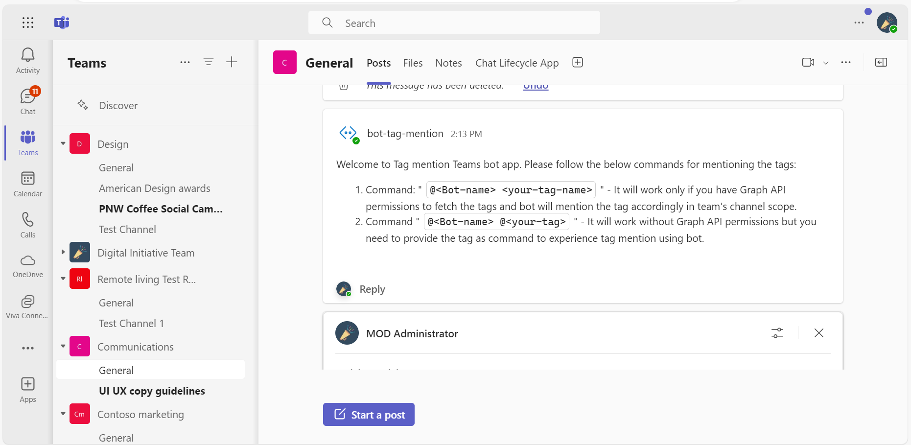
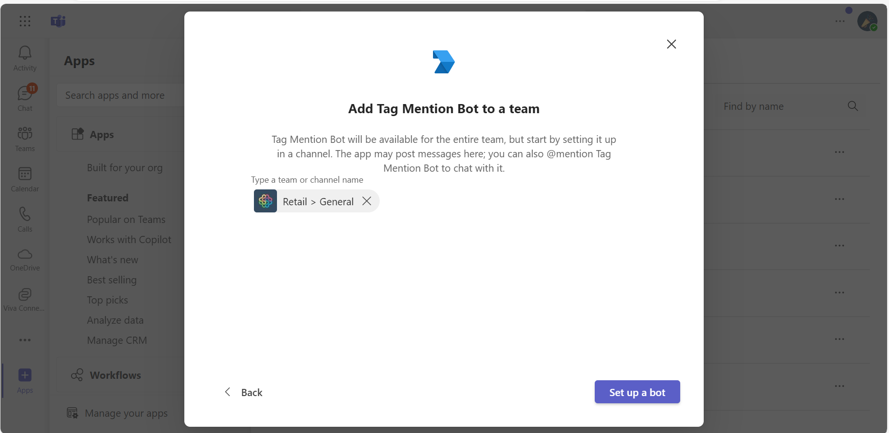
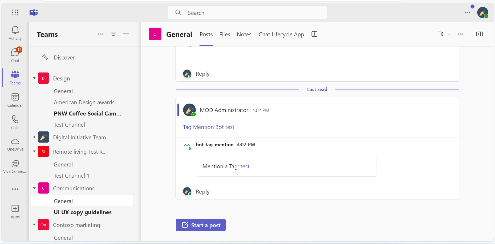
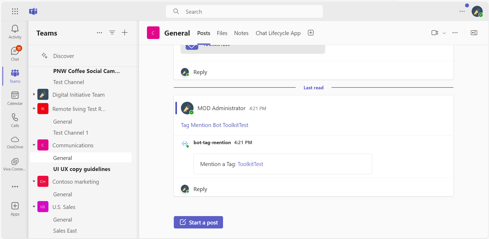
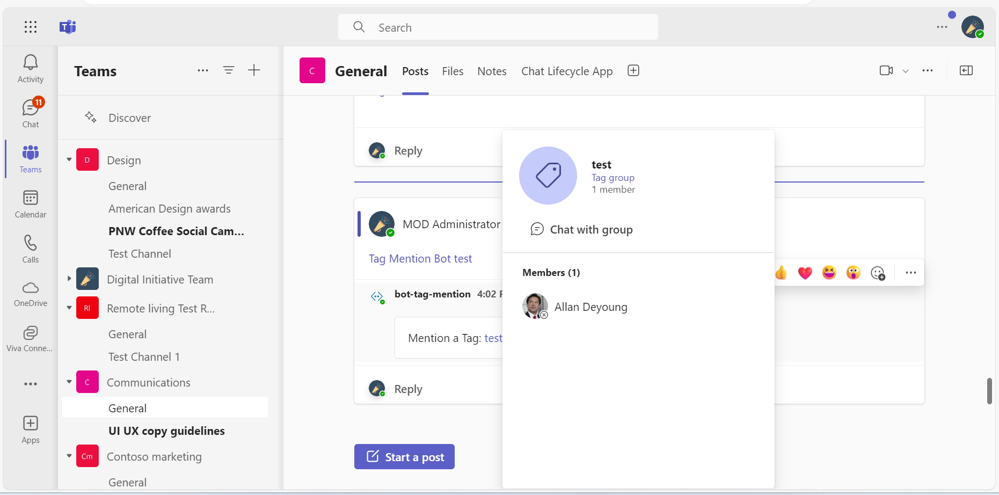
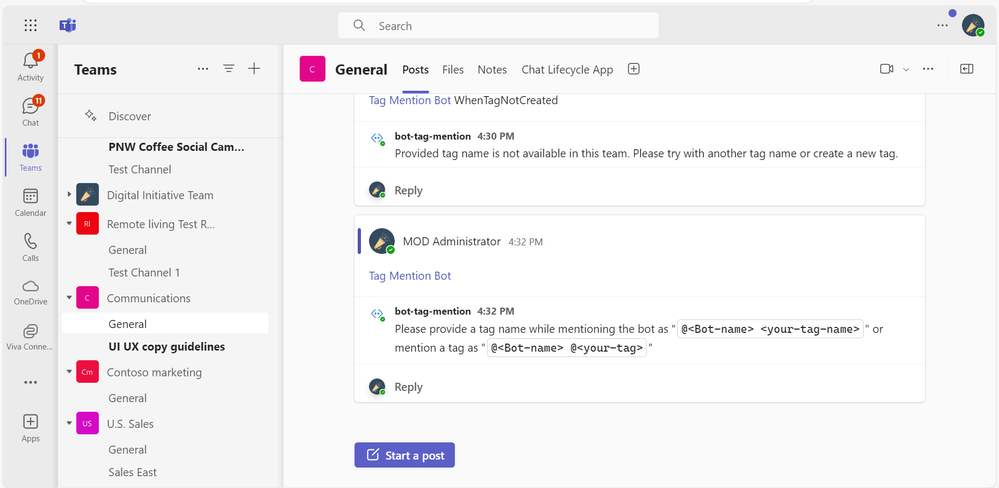
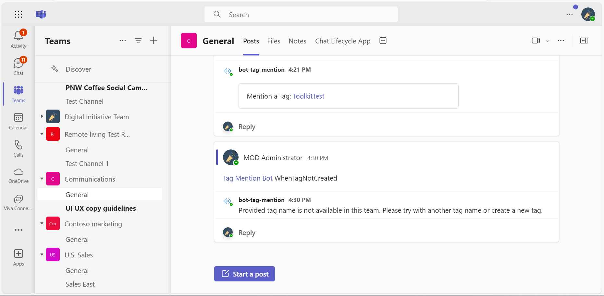

# Tag mention bot

This sample app demonstrates the use of tag mention funtionality in teams scope using Bot Framework.

## Included Features
* Bots
* Adaptive Cards
* Teams Conversation Events

## Interaction with bot


## Prerequisites

- Microsoft Teams is installed and you have an account (not a guest account)
- [dev tunnel](https://learn.microsoft.com/en-us/azure/developer/dev-tunnels/get-started?tabs=windows) or [ngrok](https://ngrok.com/) latest version or equivalent tunnelling solution
- [Python SDK](https://www.python.org/downloads/) min version 3.11

## Run the app (Using Microsoft 365 Agents Toolkit for Visual Studio Code)

The simplest way to run this sample in Teams is to use Microsoft 365 Agents Toolkit for Visual Studio Code.

1. Ensure you have downloaded and installed [Visual Studio Code](https://code.visualstudio.com/docs/setup/setup-overview)
1. Install the [Microsoft 365 Agents Toolkit extension](https://marketplace.visualstudio.com/items?itemName=TeamsDevApp.ms-teams-vscode-extension) and [Python Extension](https://marketplace.visualstudio.com/items?itemName=ms-python.python)
1. Select **File > Open Folder** in VS Code and choose this samples directory from the repo
1. Press **CTRL+Shift+P** to open the command box and enter **Python: Create Environment** to create and activate your desired virtual environment. Remember to select `requirements.txt` as dependencies to install when creating the virtual environment.
1. Using the extension, sign in with your Microsoft 365 account where you have permissions to upload custom apps
1. Select **Debug > Start Debugging** or **F5** to run the app in a Teams web client.
1. In the browser that launches, select the **Add** button to install the app to Teams.

> If you do not have permission to upload custom apps (uploading), Microsoft 365 Agents Toolkit will recommend creating and using a Microsoft 365 Developer Program account - a free program to get your own dev environment sandbox that includes Teams.

## Run the app (Manually Uploading to Teams)

> Note these instructions are for running the sample on your local machine, the tunnelling solution is required because
> the Teams service needs to call into the bot.
1. Register a new application in the [Microsoft Entra ID – App Registrations](https://go.microsoft.com/fwlink/?linkid=2083908) portal.

## Setup

### Register you app with Azure AD.

1. Register a new application in the [Azure Active Directory � App Registrations](https://go.microsoft.com/fwlink/?linkid=2083908) portal.
2. Select **New Registration** and on the *register an application page*, set following values:
    * Set **name** to your app name.
    * Choose the **supported account types** (any account type will work)
    * Leave **Redirect URI** empty.
    * Choose **Register**.
3. On the overview page, copy and save the **Application (client) ID, Directory (tenant) ID**. You�ll need those later when updating your Teams application manifest and in the appsettings.json.
4. Under **Manage**, select **Expose an API**. 
5. Select the **Set** link to generate the Application ID URI in the form of `api://{base-url}/botid-{AppID}`. Insert your fully qualified domain name (with a forward slash "/" appended to the end) between the double forward slashes and the GUID. The entire ID should have the form of: `api://fully-qualified-domain-name/botid-{AppID}`
    * ex: `api://%ngrokDomain%.ngrok-free.app/botid-00000000-0000-0000-0000-000000000000`.
6. Select the **Add a scope** button. In the panel that opens, enter `access_as_user` as the **Scope name**.
7. Set **Who can consent?** to `Admins and users`
8. Fill in the fields for configuring the admin and user consent prompts with values that are appropriate for the `access_as_user` scope:
    * **Admin consent title:** Teams can access the user�s profile.
    * **Admin consent description**: Allows Teams to call the app�s web APIs as the current user.
    * **User consent title**: Teams can access the user profile and make requests on the user's behalf.
    * **User consent description:** Enable Teams to call this app�s APIs with the same rights as the user.
9. Ensure that **State** is set to **Enabled**
10. Select **Add scope**
    * The domain part of the **Scope name** displayed just below the text field should automatically match the **Application ID** URI set in the previous step, with `/access_as_user` appended to the end:
        * `api://[ngrokDomain].ngrok-free.app/botid-00000000-0000-0000-0000-000000000000/access_as_user.
11. In the **Authorized client applications** section, identify the applications that you want to authorize for your app�s web application. Each of the following IDs needs to be entered:
    * `1fec8e78-bce4-4aaf-ab1b-5451cc387264` (Teams mobile/desktop application)
    * `5e3ce6c0-2b1f-4285-8d4b-75ee78787346` (Teams web application)
12. Navigate to **API Permissions**, and make sure to add the follow permissions:
-   Select Add a permission
-  �Select Microsoft Graph -\>�Delegated permissions.
    - `TeamworkTag.Read` 
    - `TeamworkTag.ReadWrite`
-   Click on Add permissions. Please make sure to grant the admin consent for the required permissions.
13. Navigate to **Authentication**
    If an app hasn't been granted IT admin consent, users will have to provide consent the first time they use an app.
- Set redirect URI:
    * Select **Add a platform**.
    * Select **web**.
    * Enter the **redirect URI** `https://token.botframework.com/.auth/web/redirect`. This will be use for bot authenticaiton. 
14.  Navigate to the **Certificates & secrets**. In the Client secrets section, click on "+ New client secret". Add a description(Name of the secret) for the secret and select �Never� for Expires. Click "Add". Once the client secret is created, copy its value, it need to be placed in the appsettings.json.

15. Create a Bot Registration
   - Register a bot with Azure Bot Service, following the instructions [here](https://docs.microsoft.com/en-us/azure/bot-service/bot-service-quickstart-registration?view=azure-bot-service-3.0).
   - Ensure that you've [enabled the Teams Channel](https://docs.microsoft.com/en-us/azure/bot-service/channel-connect-teams?view=azure-bot-service-4.0)
   - While registering the bot, use `https://<your_tunnel_domain>/api/messages` as the messaging endpoint.
   - Select Configuration section.
   - Under configuration -> Add OAuth connection string.
   - Provide connection Name : for eg `ssoconnection`
   - Select service provider ad `Azure Active Directory V2`
   - Complete the form as follows:

    a. **Name:** Enter a name for the connection. You'll use this name in your bot in the appsettings.json file.
    b. **Client id:** Enter the Application (client) ID that you recorded for your Azure identity provider app in the steps above.
    c. **Client secret:** Enter the secret that you recorded for your Azure identity provider app in the steps above.
    d. **Tenant ID**  Enter value as `common`.
    e. **Token Exchange Url** Enter the url in format `api://%ngrokDomain%.ngrok-free.app/botid-00000000-0000-0000-0000-000000000000`(Refer step 1.5)
    f. Provide **Scopes** like "User.Read openid"`

4. Setup for code

  - Clone the repository
    ```bash
    git clone https://github.com/OfficeDev/Microsoft-Teams-Samples.git
    ```
  - In a terminal, navigate to `Microsoft-Teams-samples\samples\ bot-tag-mention\python` folder

  - Activate your desired virtual environment

  - In the terminal, type `pip install -r requirements.txt`

  - Update the `config.py` configuration for the bot to use the Microsoft App Id and App Password from the Bot Framework registration. (Note the App Password is referred to as the "client secret" in the azure portal and you can always create a new client secret anytime.)

5. Setup Manifest for Teams
- __*This step is specific to Teams.*__
    - **Edit** the `manifest.json` contained in the ./teams_app_manifest folder to replace your Microsoft App Id (that was created when you registered your app registration earlier) *everywhere* you see the place holder string `${{AAD_APP_CLIENT_ID}}` (depending on the scenario the Microsoft App Id may occur multiple times in the `manifest.json`)
    - **Edit** the `manifest.json` for `validDomains` and replace `${{BOT_DOMAIN}}` with base Url of your domain. E.g. if you are using ngrok it would be `https://1234.ngrok-free.app` then your domain-name will be `1234.ngrok-free.app` and if you are using dev tunnels then your domain will be like: `12345.devtunnels.ms`.
    - **Zip** up the contents of the `teams_app_manifest` folder to create a `manifest.zip` (Make sure that zip file does not contains any subfolder otherwise you will get error while uploading your .zip package)

- Upload the manifest.zip to Teams (in the Apps view click "Upload a custom app")
   - Go to Microsoft Teams. From the lower left corner, select Apps
   - From the lower left corner, choose Upload a custom App
   - Go to your project directory, the ./appManifest folder, select the zip folder, and choose Open.
   - Select Add in the pop-up dialog box. Your app is uploaded to Teams.

- Run your bot with `python app.py`

> Note this `manifest.json` specified that the bot will be installed in a "personal" scope only. Please refer to Teams documentation for more details.

## Running the sample

You can interact with this bot in Teams by sending it a message, or selecting a command from the command list. The bot will respond to the following strings.

>Note : Before using the Tag Mention sample in a team channel scope, please install this app in your Personal scope to enable Single Sign-On (SSO) login.

**Personal Scope**
    

1. **SSO Login**
   

**Team channel Scope**

**Create tags within the team channel**
To create tags in Microsoft Teams, follow these steps:

1. Select Teams on the left side of the app and choose the team you want to create tags for.
2. Click the "More options" button (three dots) next to the team name and select "Manage tags".
3. Click "Create tag" and provide a name, description, and assign team members to the tag.

1. **Show Welcome**
  - **Result:** The bot will send the welcome card for you to interact with necessary commands
  - **Valid Scopes:** team chat

   **Show Welcome command interaction:**
  

2. **MentionTag**
  - **Result:** The bot will respond to the message and mention a tag
  - **Valid Scopes:** team chat

  - **Team Scope Interactions:**
    

   **MentionTag command interaction:**
   **Command 1:** `@<Bot-name> <your-tag-name>` - It will work only if you have Graph API permissions to fetch the tags and bot will mention the tag accordingly in team's channel scope.
  

   **Command 2:** `@<Bot-name> @<your-tag>` - It will work without Graph API permissions but you need to provide the tag as command to experience tag mention using bot.
  

   **Hover on the tag to view the details card:**
  

  **Message interaction:**
  When you mention the bot in Teams without providing any commands, you will receive the following message.
  

  If you attempt to use the bot before creating a tag or if you provide an incorrect tag name, you will receive the following message.
  

## Deploy the bot to Azure

To learn more about deploying a bot to Azure, see [Deploy your bot to Azure](https://aka.ms/azuredeployment) for a complete list of deployment instructions.

## Further reading

- [Tag mention](https://learn.microsoft.com/microsoftteams/platform/bots/how-to/conversations/channel-and-group-conversations?tabs=dotnet#tag-mention)
- [Bot Framework Documentation](https://docs.botframework.com)
- [Bot Basics](https://docs.microsoft.com/azure/bot-service/bot-builder-basics?view=azure-bot-service-4.0)
- [Azure Bot Service Introduction](https://docs.microsoft.com/azure/bot-service/bot-service-overview-introduction?view=azure-bot-service-4.0)
- [Azure Bot Service Documentation](https://docs.microsoft.com/azure/bot-service/?view=azure-bot-service-4.0)
- [Messages in bot conversations](https://learn.microsoft.com/microsoftteams/platform/bots/how-to/conversations/conversation-messages?tabs=dotnet)

