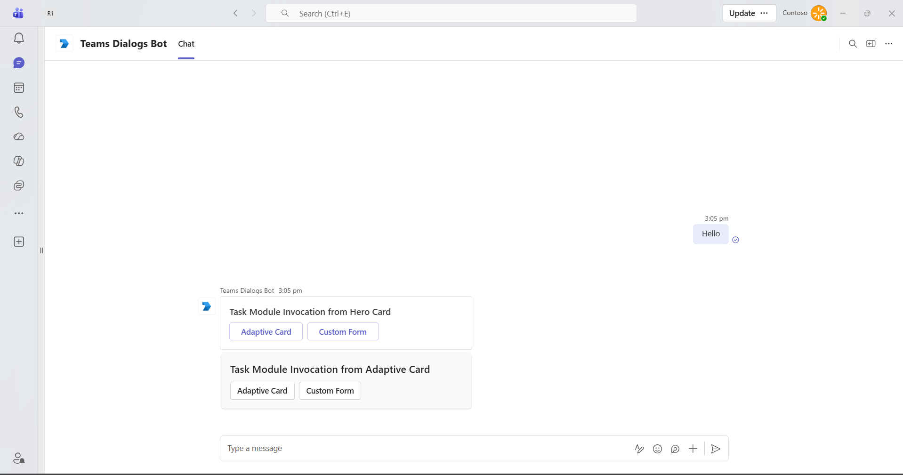

# Bot Task Modules

This sample demonstrates how to use task modules (dialogs) in Microsoft Teams using a bot built with Teams SDK. The bot showcases two key approaches: opening task modules through Adaptive Cards with submit actions, and launching custom HTML/JavaScript webpages as task modules. This comprehensive sample illustrates how to create rich, interactive dialog experiences in Teams, allowing users to complete forms and interact with custom UI components without leaving the Teams conversation context.

## Table of Contents

- [Interaction with Bot](#interaction-with-bot)
  - [1. Adaptive Card Task Module](#1-adaptive-card-task-module)
  - [2. Custom Form Task Module](#2-custom-form-task-module)
- [Sample Implementations](#sample-implementations)
- [How to run these samples](#how-to-run-these-samples)
  - [Run in the Teams Client](#run-in-the-teams-client)
    - [Configure DevTunnels](#configure-devtunnels)
    - [Provisioning the Teams Application](#provisioning-the-teams-application)
  - [Configure the new project to use the new Teams Bot Application](#configure-the-new-project-to-use-the-new-teams-bot-application)
  - [Pro Tip: Read the configuration settings using the Azure CLI](#pro-tip-read-the-configuration-settings-using-the-azure-cli)
- [Troubleshooting](#troubleshooting)
- [Further Reading](#further-reading)

## Interaction with Bot



The bot supports the following functionalities:

### 1. Adaptive Card Task Module

- Opens a task module with an Adaptive Card interface
- Demonstrates card-based dialogs with interactive elements
- Handles user input and submit actions within the card
- Shows best practices for Adaptive Card task module integration

### 2. Custom Form Task Module

- Launches a custom HTML webpage as a task module
- Demonstrates custom UI components including form fields
- Collects user information through an interactive form
- Handles form submission and data processing
- Shows Teams-themed styling for consistent user experience

## Sample Implementations

| Language | Framework | Directory |
|----------|-----------|-----------|
| C# | .NET 10 / ASP.NET Core | [dotnet](dotnet) |
| Typescript | Node.js | [nodejs](nodejs) |
| Python | Python | [python](python) |

## How to run these samples

### Run in the Teams Client

In the Teams client after you have provisioned the Teams Application, configured the application with your local DevTunnels URL, and sideloaded the app.

1. Install the tool DevTunnels https://learn.microsoft.com/en-us/azure/developer/dev-tunnels/get-started
2. Get Access to a M365 Developer Tenant https://learn.microsoft.com/en-us/office/developer-program/microsoft-365-developer-program-get-started
3. Create a Teams App with the Bot Feature in the Teams Developer Portal (in your tenant) https://dev.teams.microsoft.com

#### Configure DevTunnels

Create a persistent tunnel for the port 3978 with anonymous access

```bash
devtunnel create my-tunnel --allow-anonymous
devtunnel port create my-tunnel -p 3978
devtunnel host my-tunnel
```

Take note of the URL shown after Connect via browser:

#### Provisioning the Teams Application

Navigate to the Teams Developer Portal http://dev.teams.microsoft.com

##### Create a new Bot resource

1. Navigate to `Tools->Bot management`, and add a `New bot`
2. In Configure, paste the Endpoint address from devtunnels and append `/api/messages`
3. In Client secrets, create a new secret and save it for later

> **Note.** If you have access to an Azure Subscription in the same Tenant, you can also create the Azure Bot resource ([learn more](https://learn.microsoft.com/en-us/azure/bot-service/abs-quickstart?view=azure-bot-service-4.0&tabs=singletenant)).

##### Create a new Teams App

1. Navigate to `Apps` and create a `New App`
2. Fill the required values in Basic information (short and long name, short and long description and App URLs)
3. In `App features->Bot` select the bot you created previously
4. Select `Preview in Teams` to sideload the app

> **Note.** When using an Azure Bot resource, provide the ClientID instead of selecting an existing bot.

### Configure the new project to use the new Teams Bot Application

For NodeJS you will need a `.env` file with the next fields:

```
TENANT_ID=
CLIENT_ID=
CLIENT_SECRET=
```

### Pro Tip: Read the configuration settings using the Azure CLI

To obtain the TenantId, ClientId and SecretId you can use the Azure CLI with:

> **Note.** If you don't have access to an Azure Subscription you can still use the Azure CLI, make sure you login with `az login --allow-no-subscription`

```bash
az ad app credential reset --id $appId
```

## Troubleshooting

- If Teams cannot communicate with your bot, verify your DevTunnels URL is reachable.
- Ensure your .env or appsettings file is setup correctly.
- Verify that the task module URL (for custom form) is properly configured and accessible.
- For custom form issues, ensure your bot endpoint is serving static files correctly.
- The Azure Bot Service (ABS) Channels UI is very useful to see any errors in the endpoint (only available in ABS, not in Teams Developer Portal).

## Further Reading

- [Task Modules in Microsoft Teams](https://learn.microsoft.com/en-us/microsoftteams/platform/task-modules-and-cards/what-are-task-modules)
- [Invoke and dismiss task modules](https://learn.microsoft.com/en-us/microsoftteams/platform/task-modules-and-cards/task-modules/invoking-task-modules)
- [Microsoft Teams SDK Documentation](https://learn.microsoft.com/microsoftteams/platform/)
