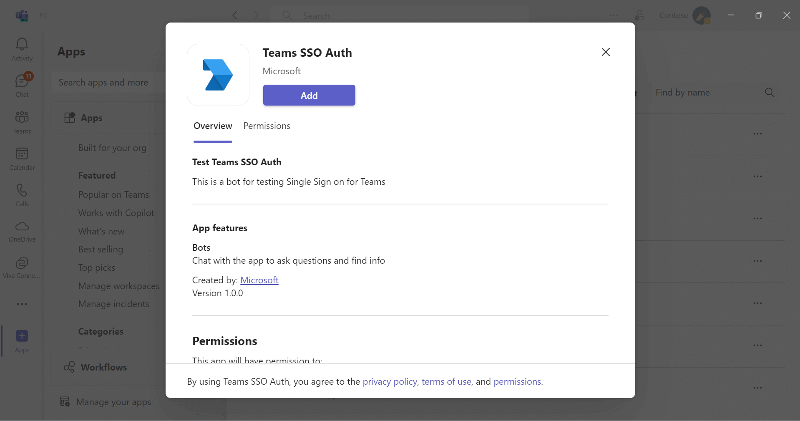
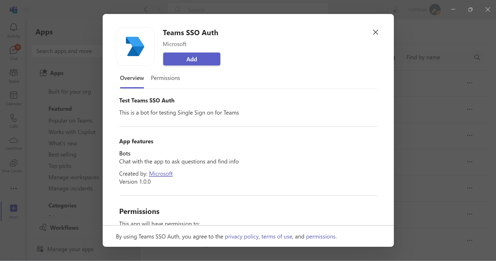
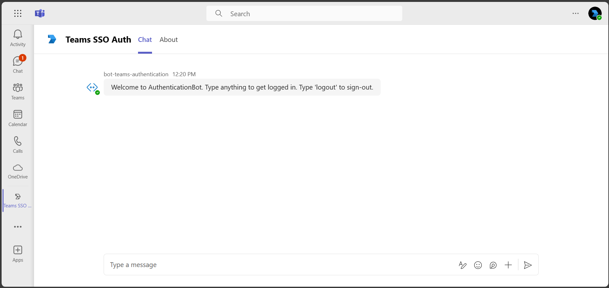
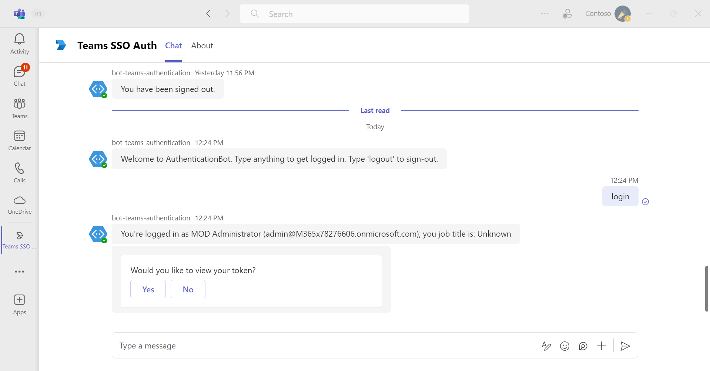
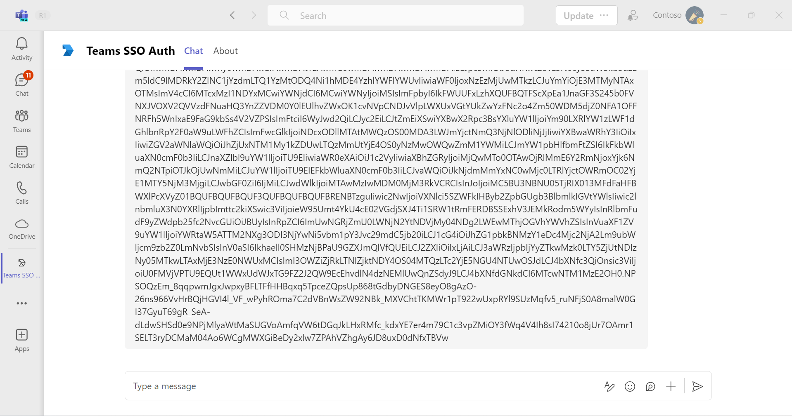
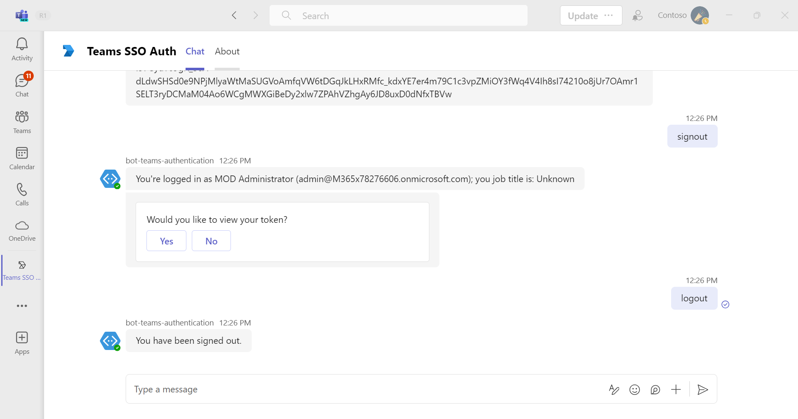

# Teams Auth Bot

Bot Framework v4 bot using Teams authentication

This bot has been created using [Bot Framework](https://dev.botframework.com), it shows how to get started with authentication in a bot for Microsoft Teams.

The focus of this sample is how to use the Bot Framework support for oauth in your bot. Teams behaves slightly differently than other channels in this regard. Specifically an Invoke Activity is sent to the bot rather than the Event Activity used by other channels. _This Invoke Activity must be forwarded to the dialog if the OAuthPrompt is being used._ This is done by subclassing the ActivityHandler and this sample includes a reusable TeamsActivityHandler. This class is a candidate for future inclusion in the Bot Framework SDK.

The sample uses the bot authentication capabilities in [Azure Bot Service](https://docs.botframework.com), providing features to make it easier to develop a bot that authenticates users to various identity providers such as Microsoft Entra ID, GitHub, Uber, etc. The OAuth token is then used to make basic Microsoft Graph queries.

> IMPORTANT: The manifest file in this app adds "token.botframework.com" to the list of `validDomains`. This must be included in any bot that uses the Bot Framework OAuth flow.

## Single Sign On

This sample utilizes an app setting `UseSingleSignOn` to add `TeamsSSOTokenExchangeMiddleware`. Refer to [Teams SSO](https://docs.microsoft.com/microsoftteams/platform/bots/how-to/authentication/auth-aad-sso-bots) for Microsoft Entra ID and SSO OAuth configuration information.

> IMPORTANT: Teams SSO only works in 1-1 chats, and not group contexts.

This bot has been created using [Bot Framework](https://dev.botframework.com), it shows how to use a bot authentication, as well as how to sign in from a bot. In this sample we are assuming the OAuth 2 provider is Azure Active Directory v2 (AADv2) and are utilizing the Microsoft Graph API to retrieve data about the user. Check [here](https://docs.microsoft.com/azure/bot-service/bot-builder-authentication) for information about getting an AADv2 application setup for use in Azure Bot Service. The scopes used in this sample are the following:

- `openid`
- `User.Read`

## Included Features
* Teams SSO (bots)
* Graph API

## Interaction with the bot**


## Try it yourself - experience the App in your Microsoft Teams client
Please find below demo manifest which is deployed on Microsoft Azure and you can try it yourself by uploading the app manifest (.zip file link below) to your teams and/or as a personal app. (Sideloading must be enabled for your tenant, [see steps here](https://docs.microsoft.com/microsoftteams/platform/concepts/build-and-test/prepare-your-o365-tenant#enable-custom-teams-apps-and-turn-on-custom-app-uploading)).

**Teams Auth Bot:** [Manifest](/samples/bot-teams-authentication/csharp/demo-manifest/bot-teams-authentication.zip)

## Prerequisites

- Microsoft Teams is installed and you have an account (not a guest account)
- [.NET SDK](https://dotnet.microsoft.com/download) version 6.0

  ```bash
  # determine dotnet version
  dotnet --version
  ```
- [dev tunnel](https://learn.microsoft.com/en-us/azure/developer/dev-tunnels/get-started?tabs=windows) or [ngrok](https://ngrok.com/) latest version or equivalent tunnelling solution

## Run the app (Using Teams Toolkit for Visual Studio)

The simplest way to run this sample in Teams is to use Teams Toolkit for Visual Studio.
1. Install Visual Studio 2022 **Version 17.10 Preview 4 or higher** [Visual Studio](https://visualstudio.microsoft.com/downloads/)
1. Install Teams Toolkit for Visual Studio [Teams Toolkit extension](https://learn.microsoft.com/en-us/microsoftteams/platform/toolkit/toolkit-v4/install-teams-toolkit-vs?pivots=visual-studio-v17-7)
1. In the debug dropdown menu of Visual Studio, select Dev Tunnels > Create A Tunnel (set authentication type to Public) or select an existing public dev tunnel.
1. In the debug dropdown menu of Visual Studio, select default startup project > **Microsoft Teams (browser)**
1. In Visual Studio, right-click your **TeamsApp** project and **Select Teams Toolkit > Prepare Teams App Dependencies**
1. Using the extension, sign in with your Microsoft 365 account where you have permissions to upload custom apps.
1. Select **Debug > Start Debugging** or **F5** to run the menu in Visual Studio.
1. In the browser that launches, select the **Add** button to install the app to Teams.
> If you do not have permission to upload custom apps (sideloading), Teams Toolkit will recommend creating and using a Microsoft 365 Developer Program account - a free program to get your own dev environment sandbox that includes Teams.

## Setup

> Note these instructions are for running the sample on your local machine, the tunnelling solution is required because
> the Teams service needs to call into the bot.

### 1. Setup for Bot Auth
Refer to [Bot SSO Setup document](https://github.com/OfficeDev/Microsoft-Teams-Samples/blob/main/samples/bot-conversation-sso-quickstart/BotSSOSetup.md).

1) Clone the repository

    ```bash
    git clone https://github.com/OfficeDev/Microsoft-Teams-Samples.git
    ```

1) If you are using Visual Studio
- Launch Visual Studio
- File -> Open -> Project/Solution
- Navigate to `samples/bot-teams-authentication/csharp` folder
- Select `TeamsAuth.csproj` or `TeamsAuth.sln`file

1) Run ngrok - point to port 3978 (You can skip this step, if you have already run ngrok while doing SSO setup)

   ```bash
   ngrok http 3978 --host-header="localhost:3978"
   ```  

   Alternatively, you can also use the `dev tunnels`. Please follow [Create and host a dev tunnel](https://learn.microsoft.com/en-us/azure/developer/dev-tunnels/get-started?tabs=windows) and host the tunnel with anonymous user access command as shown below:

   ```bash
   devtunnel host -p 3978 --allow-anonymous
   ```

1) Update the `appsettings.json` configuration for the bot to use the MicrosoftAppId, MicrosoftAppPassword, MicrosoftAppTenantId generated in Step 1 (App Registration creation). (Note the App Password is referred to as the "client secret" in the azure portal and you can always create a new client secret anytime.)
    - Set "MicrosoftAppType" in the `appsettings.json`. (**Allowed values are: MultiTenant(default), SingleTenant, UserAssignedMSI**)
    - Set "ConnectionName" in the `appsettings.json`. The Microsoft Entra ID ConnectionName from the OAuth Connection Settings on Azure Bot registration

1) Run your bot, either from Visual Studio with `F5` or using `dotnet run` in the appropriate folder.

1) __*This step is specific to Teams.*__
    - **Edit** the `manifest.json` contained in the `appPackage` folder to replace your Microsoft App Id (that was created when you registered your bot earlier) *everywhere* you see the place holder string `<<YOUR-MICROSOFT-APP-ID>>` (depending on the scenario the MicrosoftAppId may occur multiple times in the `manifest.json`)
    - **Edit** the `manifest.json` for `validDomains` with base Url domain. E.g. if you are using ngrok it would be `https://1234.ngrok-free.app` then your domain-name will be `1234.ngrok-free.app` and if you are using dev tunnels then your domain will be like: `12345.devtunnels.ms`.
    - **Zip** up the contents of the `appPackage` folder to create a `manifest.zip` (Make sure that zip file does not contains any subfolder otherwise you will get error while uploading your .zip package)
    - **Upload** the `manifest.zip` to Teams (In Teams Apps/Manage your apps click "Upload an app". Browse to and Open the .zip file. At the next dialog, click the Add button.)
    - Add the app to personal scope or 1:1 chat (Supported scope)

**Note**: If you are facing any issue in your app, please uncomment [this](https://github.com/OfficeDev/Microsoft-Teams-Samples/blob/main/samples/bot-teams-authentication/csharp/AdapterWithErrorHandler.cs#L35) line and put your debugger for local debug.

## Running the sample

> Note `manifest.json` contains a `webApplicationInfo` template required for Teams Single Sign On.

You can interact with this bot by sending it a message. The bot will respond by requesting you to login to Microsoft Entra ID, then making a call to the Graph API on your behalf and returning the results.











## Deploy the bot to Azure

To learn more about deploying a bot to Azure, see [Deploy your bot to Azure](https://aka.ms/azuredeployment) for a complete list of deployment instructions.

## Further reading

- [Bot Framework Documentation](https://docs.botframework.com)
- [Bot Basics](https://docs.microsoft.com/azure/bot-service/bot-builder-basics?view=azure-bot-service-4.0)
- [Azure Bot Service Introduction](https://docs.microsoft.com/azure/bot-service/bot-service-overview-introduction?view=azure-bot-service-4.0)
- [Azure Bot Service Documentation](https://docs.microsoft.com/azure/bot-service/?view=azure-bot-service-4.0)
- [Bot Authentication Basics](https://learn.microsoft.com/en-us/microsoftteams/platform/bots/how-to/authentication/bot-sso-overview)

