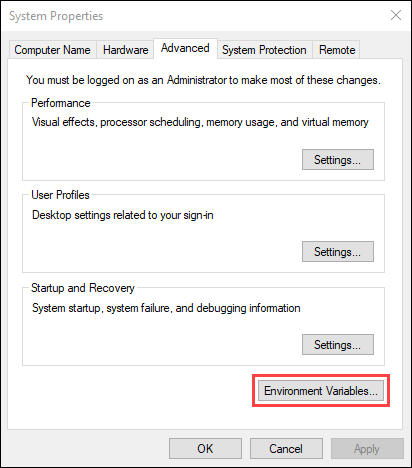
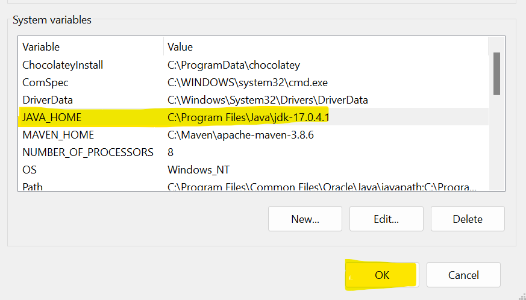
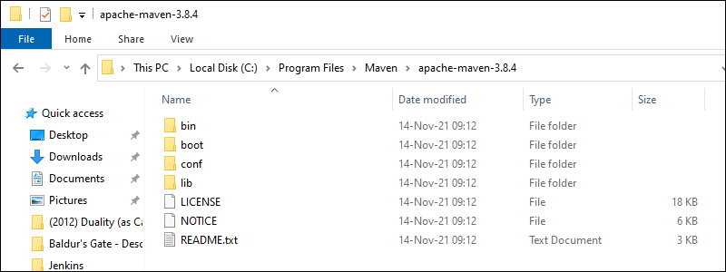
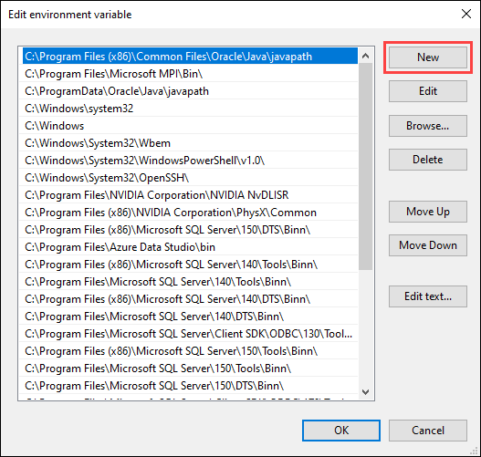
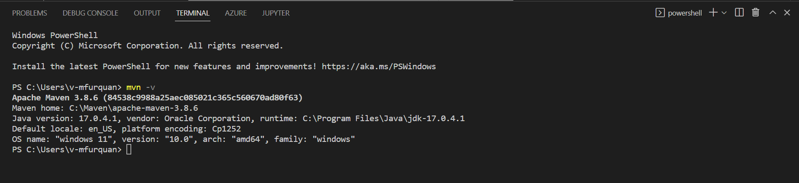

## Setup for Maven and Java JDK.

## Description
This document helps you to setup/configure the Java JDK and Maven (download, install, configure and run) for your Java samples.

## Steps for Java-JDK setup
1) Install Java JDK **32 bit / 64 bit** as per your PC configuration (Minimum Required version is - Java 1.8+) 
[Java-JDK download link](https://www.oracle.com/java/technologies/downloads/#java8-windows).

1) After Successful installation, search **Environment variable** in pc windows search bar and open system properties window.

1) Open Environment variable configuration and add JAVA_HOME System Variable and it's value as the installed JDK path.

## Steps for Maven setup
1) Install [Maven](https://maven.apache.org/)

 
2) Once the download has completed, extract the Maven archive to a directory of your choice.

3) Open the Start menu and search for environment variables, click the Edit the system environment variables result.

4) Under the Advanced tab in the System Properties window, click Environment Variables.

5) Click the New button under the System variables section to add a new system environment variable

6) Enter MAVEN_HOME as the variable name and the path to the Maven directory as the variable value. Click OK to save the new system variable.

7) Enter MAVEN_HOME as the variable name and the path to the Maven directory as the variable value. Click OK to save the new system variable.

8) Enter %MAVEN_HOME%\bin in the new field. Click OK to save changes to the Path variable.

 ## Verify Maven Installation
- In the command prompt, use the following command `mvn -v` to verify the installation by checking the current version of Maven.

## Further reading
- [Maven Apache Download](https://phoenixnap.com/kb/install-maven-windows)
- [java JDK](https://www.oracle.com/java/technologies/downloads/#java8-windows)   
