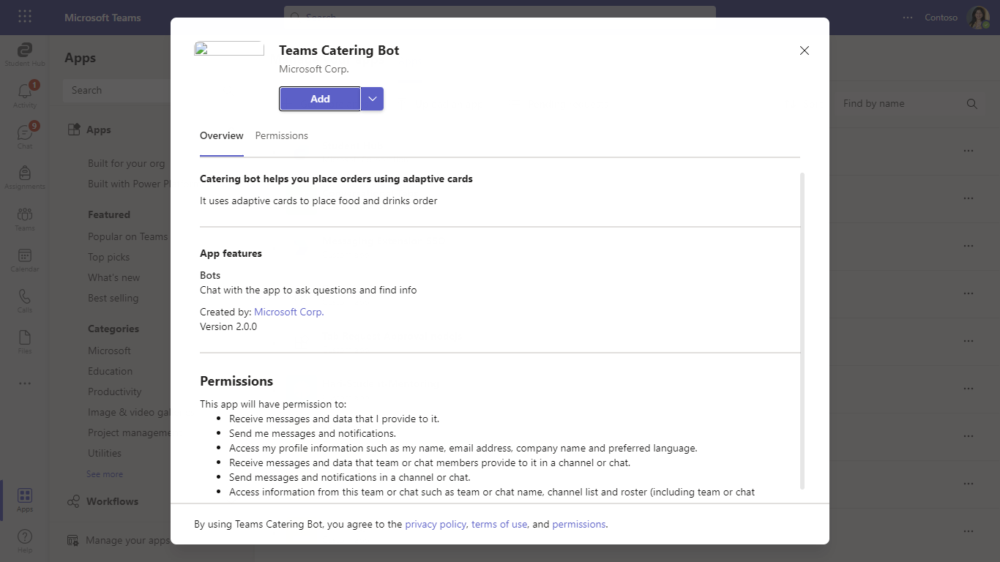

# Teams Catering Bot

Bot Framework v1.4 TeamsCateringBot sample.

This bot has been created using [Bot Framework](https://dev.botframework.com), it shows how to create a simple bot that accepts food order using Adaptive Cards V2.

## Document Manager  

## Summary

Teams Catering bot is a sample app that provides an experience of ordering food and drinks. This sample makes use of Teams platform capabilities like `Universal Bots` to bring a restaurant ordering feature to life. 

## Interaction with app


## Prerequisites

- [.NET Core SDK](https://dotnet.microsoft.com/download) version 6.0

  determine dotnet version
  ```bash
  dotnet --version
  ```
- [Ngrok](https://ngrok.com/download) (For local environment testing) Latest (any other tunneling software can also be used)
  
- [Teams](https://teams.microsoft.com) Microsoft Teams is installed and you have an account

## Setup

1. Register a new application in the [Azure Active Directory – App Registrations](https://go.microsoft.com/fwlink/?linkid=2083908) portal.

    - Go to App registrations and create a new app registration in a different tab.

   - Register an application.
	* Fill out name and select third option for supported account type and click "Register".

    

    **NOTE:** Copy and paste the App Id and Tenant ID somewhere safe. You will need it in a future step.

    - Create Client Secret.
      * Navigate to the "Certificates & secrets" blade and add a client secret by clicking "New Client Secret".

     **NOTE:** Copy and paste the secret somewhere safe. You will need it in a future step:
       

2. Setup for Bot

	 * Register a bot with Azure Bot Service, following the instructions [here](https://docs.microsoft.com/en-us/azure/bot-service/bot-service-quickstart-registration?view=azure-bot-service-3.0).
       * Ensure that you've [enabled the Teams Channel](https://docs.microsoft.com/en-us/azure/bot-service/channel-connect-teams?view=azure-bot-service-4.0)
       * While registering the bot, use `https://<your_ngrok_url>/api/messages` as the messaging endpoint.

       * Register a bot with Azure Bot Service, following the instructions [here](https://docs.microsoft.com/en-us/azure/bot-service/bot-service-quickstart-registration?view=azure-bot-service-3.0).
       * Ensure that you've [enabled the Teams Channel](https://docs.microsoft.com/en-us/azure/bot-service/channel-connect-teams?view=azure-bot-service-4.0)
       * While registering the bot, use `https://<your_ngrok_url>/api/messages` as the messaging endpoint.       

        

        **Go to the created resource, navigate to channels and add "Microsoft Teams" and “Web chat” channels:**

       

       > NOTE: When you create your bot you will create an App ID and App password - make sure you keep these for later.        

3. Create Azure Cosoms Database account**

	 - Create an Azure Cosmos DB account
	   * Choose an existing resource group or create a new one.
	   * Choose an account name for your cosmos db account.
	   * Select `Azure Cosmos DB for NoSQL` as API.

   **Create an Azure Cosmos DB account:**

      

   **Azure Cosmos DB for NoSQL:**

     

4. Get Cosmos DB enpoint `Uri` and read write `Primary Key`
   * Open your newly created Cosmos DB account. Navigate to "Keys" section.
   * Copy paste your URI and read write Primary_Key for further use.

    


5. Setup NGROK

  - Run ngrok - point to port 3978

	```bash
	# ngrok http 3978 --host-header="localhost:3978"
	```
6. Setup for code

  - Clone the repository

    ```bash
    git clone https://github.com/OfficeDev/Microsoft-Teams-Samples.git
    ```

- Run the bot from a terminal or from Visual Studio:

  A) From a terminal, navigate to `samples/bot-teams-catering/csharp`

  ```bash
  # run the bot
  dotnet run
  ```

  B) Or from Visual Studio

  - Launch Visual Studio
  - File -> Open -> Project/Solution
  - Navigate to `samples/bot-teams-catering/csharp` folder
  - Select `Catering.csproj` file
  - Press `F5` to run the project

- Update the appsettings.json files. 

  - "MicrosoftAppId: `<<Your Microsoft Bot_Id>>`

  - "MicrosoftAppPassword": `<<Your Microsoft Bot_Secret>>`

  - "CosmosEndpointUri": `<<Your Cosmos DB enpoint uri>>`

  - "CosmosKey": `<<Your Cosmos DB read-write Primary_Key>>`

  - "BotServiceUrl: `<<YourBotServiceUrl>>/v3`

**NOTE:** The App id to be installed into Teams meeting can be retrieved using the graph explorer. As this sample uses the same app to be added to the teams meeting, app needs to be installed into Teams (follow step 4 on how to package and install the app to teams) and use the app's ID generated by Teams (different from the external ID). For more information, see the [List teamsApp](https://docs.microsoft.com/en-us/graph/api/appcatalogs-list-teamsapps?view=graph-rest-1.0&tabs=http) refernce article

**NOTE:** The Bot Service Url needs to be dynamically fetched (and stored) from the Team. Recommendation is to capture the serviceUrl from the bot Payload and later re-use it to send proactive messages.
eg: https://smba.trafficmanager.net/amer/v3 


**7. Setup Manifest for Teams**
- **This step is specific to Teams.**

    - **Edit** the `manifest.json` contained in the  `Manifest` folder to replace your Microsoft App Id (that was created when you registered your bot earlier) *everywhere* you see the place holder string `<<Your Microsoft App Id>>` (depending on the scenario the Microsoft App Id may occur multiple times in the `manifest.json`)
    - **Edit** the `manifest.json` for `websiteUrl`,`privacyUrl`,`termsOfUseUrl` inside `DeveloperTabs` . Replace `<yourNgrok.ngrok-free.app>` with base Url domain. E.g. if you are using ngrok it would be `https://1234.ngrok-free.app` then your domain-name will be `1234.ngrok-free.app`.
    - **Edit** the `manifest.json` for `validDomains` with base Url domain. E.g. if you are using ngrok it would be `https://1234.ngrok-free.app` then your domain-name will be `1234.ngrok-free.app`.
    - **Zip** up the contents of the `Manifest` folder to create a `manifest.zip` (Make sure that zip file does not contains any subfolder otherwise you will get error while uploading your .zip package)
    - **Upload** the `manifest.zip` to Teams (In Teams Apps/Manage your apps click "Upload an app". Browse to and Open the .zip file. At the next dialog, click the Add button.)
    - Add the app to personal/team/groupChat scope (Supported scopes)

**Note**: If you are facing any issue in your app, please uncomment [this](https://github.com/OfficeDev/Microsoft-Teams-Samples/blob/main/samples/bot-teams-catering/csharp/Catering/AdapterWithErrorHandler.cs#L45) line and put your debugger for local debug.


## Running the sample

**Install App:**



**Select your order UI:**


**Confirm selected item UI:**


**Order confirmed:**


**Select next order UI:**


**Recent order list UI:**


### Interaction with the Bot
- Ping the bot in 1:1 or channel scope
- Bot will send an Adaptive card to choose food.
- Follow the sequential process of selecting food, drink and submit your choices.
- Bot will keep on updating the adaptive card on each submission.
- Submit your final order on confimation card.
- Bot will update the card to order confirmed card. 
- You can click on "Recent Orders" button.
- Bot will update the card to recent orders card.

## Deploy the bot to Azure

To learn more about deploying a bot to Azure, see [Deploy your bot to Azure](https://aka.ms/azuredeployment) for a complete list of deployment instructions.

## Further reading
- [Conversational bots in teams](https://docs.microsoft.com/en-us/microsoftteams/platform/bots/what-are-bots)
- [Conversation Basics](https://docs.microsoft.com/en-us/microsoftteams/platform/bots/how-to/conversations/conversation-basics?tabs=dotnet)
- [Universal Bots in Teams](https://docs.microsoft.com/en-us/microsoftteams/platform/task-modules-and-cards/cards/universal-actions-for-adaptive-cards/overview)
- [List Meeting Attendance Reports](https://docs.microsoft.com/en-us/graph/api/meetingattendancereport-list?view=graph-rest-1.0&tabs=http)
- [List Attendance Records](https://docs.microsoft.com/en-us/graph/api/attendancerecord-list?view=graph-rest-1.0&tabs=http)
- [Configure application access policy](https://docs.microsoft.com/en-us/graph/cloud-communication-online-meeting-application-access-policy)
- [Bot Framework Documentation](https://docs.botframework.com)
- [Bot Basics](https://docs.microsoft.com/azure/bot-service/bot-builder-basics?view=azure-bot-service-4.0)
- [Azure Portal](https://portal.azure.com)
- [Add Authentication to Your Bot Via Azure Bot Service](https://docs.microsoft.com/en-us/azure/bot-service/bot-builder-authentication?view=azure-bot-service-4.0&tabs=csharp)
- [Activity processing](https://docs.microsoft.com/en-us/azure/bot-service/bot-builder-concept-activity-processing?view=azure-bot-service-4.0)
- [Azure Bot Service Introduction](https://docs.microsoft.com/azure/bot-service/bot-service-overview-introduction?view=azure-bot-service-4.0)
- [Azure Bot Service Documentation](https://docs.microsoft.com/azure/bot-service/?view=azure-bot-service-4.0)
- [.NET Core CLI tools](https://docs.microsoft.com/en-us/dotnet/core/tools/?tabs=netcore2x)
- [Azure CLI](https://docs.microsoft.com/cli/azure/?view=azure-cli-latest)
- [Azure Portal](https://portal.azure.com)
- [Language Understanding using LUIS](https://docs.microsoft.com/en-us/azure/cognitive-services/luis/)
- [Channels and Bot Connector Service](https://docs.microsoft.com/en-us/azure/bot-service/bot-concepts?view=azure-bot-service-4.0)
- [Microsoft Teams Developer Platform](https://docs.microsoft.com/en-us/microsoftteams/platform/)


