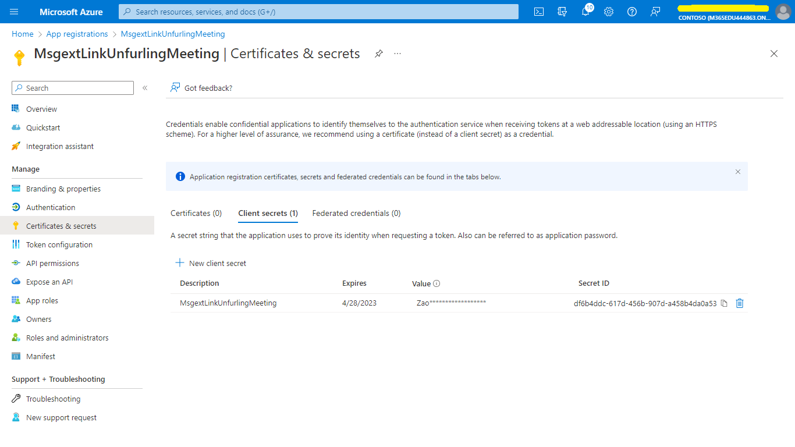
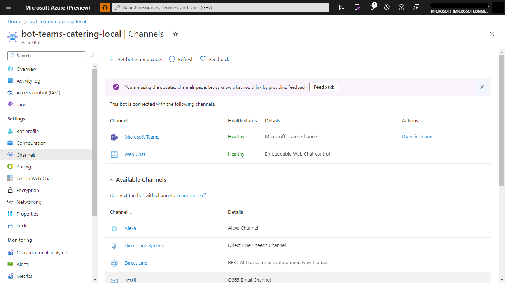
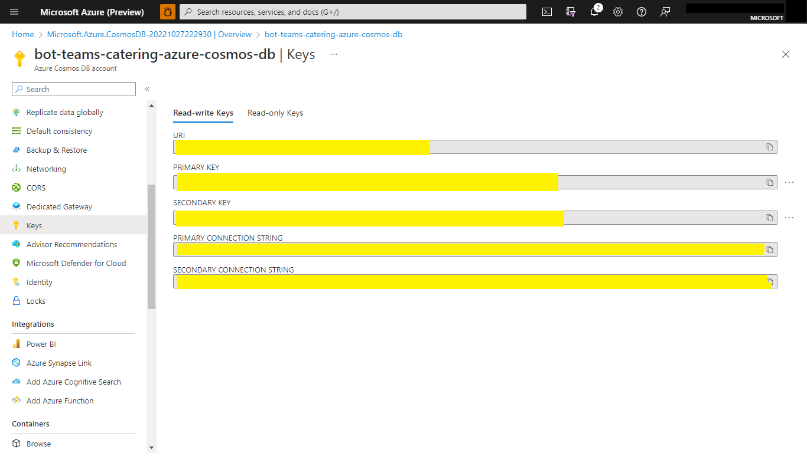

# Teams Catering Bot

Bot Framework v1.4 TeamsCateringBot sample.

This bot has been created using [Bot Framework](https://dev.botframework.com), it shows how to create a simple bot that accepts food order using Adaptive Cards V2.

## Prerequisites

- [.NET Core SDK](https://dotnet.microsoft.com/download) version 3.1

  ```bash
  # determine dotnet version
  dotnet --version
  ```

# Document Manager  

## Summary
Teams Catering bot is a sample app that provides an experience of ordering food and drinks. This sample makes use of Teams platform capabilities like `Universal Bots` to bring a restaurant ordering feature to life. 


## Frameworks


## Prerequisites

* [Office 365 tenant](https://developer.microsoft.com/en-us/microsoft-365/dev-program)

* To test locally, you'll need [Ngrok](https://ngrok.com/download) 
Make sure you've downloaded and installed the ngrok on your local machine. ngrok will tunnel requests from the Internet to your local computer and terminate the SSL connection from Teams.

    * ex: `https://subdomain.ngrok.io`.
    
	 NOTE: A free Ngrok plan will generate a new URL every time you run it, which requires you to update your Azure AD registration, the Teams app manifest, and the project configuration. A paid account with a permanent Ngrok URL is recommended.

## Version history

Version|Date|Author|Comments
-------|----|----|--------
1.0|May 13, 2021|Sowrabh N R S <br />Dipesh Jain |Initial release

## Disclaimer

**THIS CODE IS PROVIDED *AS IS* WITHOUT WARRANTY OF ANY KIND, EITHER EXPRESS OR IMPLIED, INCLUDING ANY IMPLIED WARRANTIES OF FITNESS FOR A PARTICULAR PURPOSE, MERCHANTABILITY, OR NON-INFRINGEMENT.**

---

## Minimal Path to Awesome

Step 1: Setup bot in Service
====================================
1. Create new bot channel registration resource in Azure.


2. Create New Microsoft App ID and Password.


3. Go to App registrations and create a new app registration in a different tab.
4. Register an application.
	* Fill out name and select third option for supported account type and click "Register".


	* Copy and paste the App Id and Tenant ID somewhere safe. You will need it in a future step.

5. Create Client Secret.
   * Navigate to the "Certificates & secrets" blade and add a client secret by clicking "New Client Secret".



	* Copy and paste the secret somewhere safe. You will need it in a future step.
	
   * Paste the App Id and password in the respective blocks and click on OK.


   * Click on Create on the Bot Channel registration.
   
6. Go to the created resource, navigate to channels and add "Microsoft Teams" and “Web chat” channels.



Step 2: Create Azure Cosoms Database account
====================================

1. Create an Azure Cosmos DB account
   * Choose an existing resource group or create a new one.
   * Choose an account name for your cosmos db account.
   * Select `Core (SQL)` as API.


2. Get Cosmos DB enpoint `Uri` and read write `Primary Key`
   * Open your newly created Cosmos DB account. Navigate to "Keys" section.
   * Copy paste your URI and read write Primary_Key for further use.



Step 3: Run the app locally 
====================================
## To try this sample

1. Clone the repository

    ```bash
    git clone https://github.com/OfficeDev/Microsoft-Teams-Samples.git
    ```

2. Run the bot from a terminal or from Visual Studio:

  A) From a terminal, navigate to `samples/bot-teams-catering/csharp` folder

  ```bash
  # run the bot
  dotnet run
  ```

  B) Or from Visual Studio

  - Launch Visual Studio
  - File -> Open -> Project/Solution
  - Navigate to `samples/bot-teams-catering/csharp` folder
  - Select `Catering.csproj` file
  - Press `F5` to run the project

3. Update the appsettings.json files. 

  "MicrosoftAppId: `<<Your Microsoft Bot_Id>>`

  "MicrosoftAppPassword": `<<Your Microsoft Bot_Secret>>`

  "CosmosEndpointUri": `<<Your Cosmos DB enpoint uri>>`

  "CosmosKey": `<<Your Cosmos DB read-write Primary_Key>>`

  "BotServiceUrl: `<<YourBotServiceUrl>>`

NOTE: The App id to be installed into Teams meeting can be retrieved using the graph explorer. As this sample uses the same app to be added to the teams meeting, app needs to be installed into Teams (follow step 4 on how to package and install the app to teams) and use the app's ID generated by Teams (different from the external ID). For more information, see the [List teamsApp](https://docs.microsoft.com/en-us/graph/api/appcatalogs-list-teamsapps?view=graph-rest-1.0&tabs=http) refernce article

NOTE: The Bot Service Url needs to be dynamically fetched (and stored) from the Team. Recommendation is to capture the serviceUrl from the bot Payload and later re-use it to send proactive messages.
eg: https://smba.trafficmanager.net/amer/v3

4. Press F5 to run the project in the Visual studio.

5. Run Ngrok to expose your local web server via a public URL. Make sure to point it to your Ngrok URI. For example, if you're using port 2978 locally, run:

		ngrok http -host-header=rewrite 2978

6. Update messaging endpoint in the Azure Bots Channel Registration. Open the Bot channel registration, click on Configuration/Settings on the left pane, whichever is available and update the messaging endpoint to the endpoint that bot app will be listening on. Update the ngrok URL in the below format for the messaging endpoint.

		ex: https://<subdomain>.ngrok.io/api/messages.


### This steps is specific to Microsoft Teams

- Navigate to `teamsAppManifest` folder
- Select the `Manifest.json` and update it with your `Your Bot Id`
- Now zip the manifest.json along with icons
- Go to teams and do `Upload a Custom App` 
- Add the Bot to Microsoft Teams
- Start the conversation with Bot

### Screenshots
**Upload the custom app in Teams**


### Interaction with the Bot
- Ping the bot in 1:1 or channel scope
- Bot will send an Adaptive card to choose food.
- Follow the sequential process of selecting food, drink and submit your choices.
- Bot will keep on updating the adaptive card on each submission.
- Submit your final order on confimation card.
- Bot will update the card to order confirmed card. 
- You can click on "Recent Orders" button.
- Bot will update the card to recent orders card.


## Further reading
- [Conversational bots in teams](https://docs.microsoft.com/en-us/microsoftteams/platform/bots/what-are-bots)
- [Conversation Basics](https://docs.microsoft.com/en-us/microsoftteams/platform/bots/how-to/conversations/conversation-basics?tabs=dotnet)
- [Universal Bots in Teams](https://docs.microsoft.com/en-us/microsoftteams/platform/task-modules-and-cards/cards/universal-actions-for-adaptive-cards/overview)
