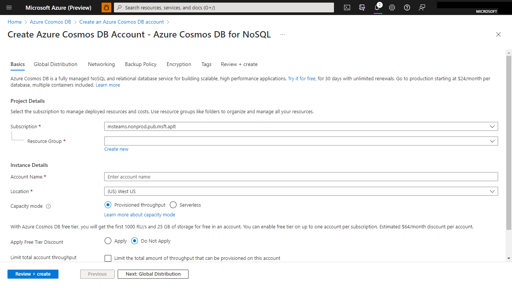

# Teams Catering Bot

This Teams Catering Bot allows users to place food and drink orders seamlessly within Microsoft Teams. It leverages Universal Adaptive Cards for dynamic interactions and supports features like recent orders and order confirmation.

## Document Manager  

## Summary

Teams Catering bot is a sample app that provides an experience of ordering food and drinks. This sample makes use of Teams platform capabilities like `Universal Bots` to bring a restaurant ordering feature to life. 

## Interaction with app


## Prerequisites

- [.NET Core SDK](https://dotnet.microsoft.com/download) version 6.0

  determine dotnet version
  ```bash
  dotnet --version
  ```
- [dev tunnel](https://learn.microsoft.com/en-us/azure/developer/dev-tunnels/get-started?tabs=windows) or [Ngrok](https://ngrok.com/download) (For local environment testing) latest version (any other tunneling software can also be used)
  
- [Teams](https://teams.microsoft.com) Microsoft Teams is installed and you have an account

- [Microsoft 365 Agents Toolkit for Visual Studio](https://learn.microsoft.com/en-us/microsoftteams/platform/toolkit/toolkit-v4/install-teams-toolkit-vs?pivots=visual-studio-v17-7)

## Run the app (Using Microsoft 365 Agents Toolkit for Visual Studio)

The simplest way to run this sample in Teams is to use Microsoft 365 Agents Toolkit for Visual Studio.
1. Install Visual Studio 2022 **Version 17.14 or higher** [Visual Studio](https://visualstudio.microsoft.com/downloads/)
1. Install Microsoft 365 Agents Toolkit for Visual Studio [Microsoft 365 Agents Toolkit extension](https://learn.microsoft.com/en-us/microsoftteams/platform/toolkit/toolkit-v4/install-teams-toolkit-vs?pivots=visual-studio-v17-7)
1. In the debug dropdown menu of Visual Studio, select Dev Tunnels > Create A Tunnel (set authentication type to Public) or select an existing public dev tunnel.
1. Right-click the 'M365Agent' project in Solution Explorer and select **Microsoft 365 Agents Toolkit > Select Microsoft 365 Account**
1. Sign in to Microsoft 365 Agents Toolkit with a **Microsoft 365 work or school account**
1. Set `Startup Item` as `Microsoft Teams (browser)`.
1. Press F5, or select Debug > Start Debugging menu in Visual Studio to start your app
</br>
1. In the opened web browser, select Add button to install the app in Teams
> If you do not have permission to upload custom apps (uploading), Microsoft 365 Agents Toolkit will recommend creating and using a Microsoft 365 Developer Program account - a free program to get your own dev environment sandbox that includes Teams.

## Setup

### Register your app with Azure AD.

  1. Register a new application in the [Microsoft Entra ID – App Registrations](https://go.microsoft.com/fwlink/?linkid=2083908) portal.
  2. Select **New Registration** and on the *register an application page*, set following values:
      * Set **name** to your app name.
      * Choose the **supported account types** (any account type will work)
      * Leave **Redirect URI** empty.
      * Choose **Register**.
  3. On the overview page, copy and save the **Application (client) ID, Directory (tenant) ID**. You'll need those later when updating your Teams application manifest and in the appsettings.json.
  4. Navigate to **API Permissions**, and make sure to add the follow permissions:
   Select Add a permission
      * Select Add a permission
      * Select Microsoft Graph -\> Delegated permissions.
      * `User.Read` (enabled by default)
      * Click on Add permissions. Please make sure to grant the admin consent for the required permissions.

1. Create Azure Cosoms Database account**

	 - Create an Azure Cosmos DB account
	   * Choose an existing resource group or create a new one.
	   * Choose an account name for your cosmos db account.
	   * Select `Azure Cosmos DB for NoSQL` as API.

   **Create an Azure Cosmos DB account:**

      

   **Azure Cosmos DB for NoSQL:**

     

2. Get Cosmos DB enpoint `Uri` and read write `Primary Key`
   * Open your newly created Cosmos DB account. Navigate to "Keys" section.
   * Copy paste your URI and read write Primary_Key for further use.

    

3. Setup for code

  - Clone the repository

    ```bash
    git clone https://github.com/OfficeDev/Microsoft-Teams-Samples.git
    ```

- Run the bot from a terminal or from Visual Studio:

  A) From a terminal, navigate to `samples/bot-teams-catering/csharp`

  ```bash
  # run the bot
  dotnet run
  ```

  B) Or from Visual Studio

  - Launch Visual Studio
  - File -> Open -> Project/Solution
  - Navigate to `samples/bot-teams-catering/csharp` folder
  - Select `Catering.sln` file
  - Press `F5` to run the project

- Update the appsettings.json files. 

  - "CosmosEndpointUri": `<<Your Cosmos DB enpoint uri>>`

  - "CosmosKey": `<<Your Cosmos DB read-write Primary_Key>>`

  - "BotServiceUrl: `<<YourBotServiceUrl>>/v3`

**NOTE:** The App id to be installed into Teams meeting can be retrieved using the graph explorer. As this sample uses the same app to be added to the teams meeting, app needs to be installed into Teams (follow step 4 on how to package and install the app to teams) and use the app's ID generated by Teams (different from the external ID). For more information, see the [List teamsApp](https://docs.microsoft.com/en-us/graph/api/appcatalogs-list-teamsapps?view=graph-rest-1.0&tabs=http) refernce article

**NOTE:** The Bot Service Url needs to be dynamically fetched (and stored) from the Team. Recommendation is to capture the serviceUrl from the bot Payload and later re-use it to send proactive messages.
eg: https://smba.trafficmanager.net/amer/v3 


4) Upload the manifest.zip to Teams (in the Apps view click "Upload a custom app")
   - Go to Microsoft Teams. From the lower left corner, select Apps
   - From the lower left corner, choose Upload a custom App
   - Go to your project directory, the ./appPackage/build folder, select the zip folder, and choose Open.
   - Select Add in the pop-up dialog box. Your app is uploaded to Teams.

**Note**: If you are facing any issue in your app, please uncomment [this](https://github.com/OfficeDev/Microsoft-Teams-Samples/blob/main/samples/bot-teams-catering/csharp/Catering/AdapterWithErrorHandler.cs#L45) line and put your debugger for local debug.


## Running the sample

**Install App:**


**Select your order UI:**


**Confirm selected item UI:**


**Order confirmed:**


**Select next order UI:**


**Recent order list UI:**


### Interaction with the Bot
- Ping the bot in 1:1 or channel scope
- Bot will send an Adaptive card to choose food.
- Follow the sequential process of selecting food, drink and submit your choices.
- Bot will keep on updating the adaptive card on each submission.
- Submit your final order on confimation card.
- Bot will update the card to order confirmed card. 
- You can click on "Recent Orders" button.
- Bot will update the card to recent orders card.

## Deploy the bot to Azure

To learn more about deploying a bot to Azure, see [Deploy your bot to Azure](https://aka.ms/azuredeployment) for a complete list of deployment instructions.

## Further reading
- [Conversational bots in teams](https://docs.microsoft.com/en-us/microsoftteams/platform/bots/what-are-bots)
- [Conversation Basics](https://docs.microsoft.com/en-us/microsoftteams/platform/bots/how-to/conversations/conversation-basics?tabs=dotnet)
- [Universal Bots in Teams](https://docs.microsoft.com/en-us/microsoftteams/platform/task-modules-and-cards/cards/universal-actions-for-adaptive-cards/overview)
- [List Meeting Attendance Reports](https://docs.microsoft.com/en-us/graph/api/meetingattendancereport-list?view=graph-rest-1.0&tabs=http)
- [List Attendance Records](https://docs.microsoft.com/en-us/graph/api/attendancerecord-list?view=graph-rest-1.0&tabs=http)
- [Configure application access policy](https://docs.microsoft.com/en-us/graph/cloud-communication-online-meeting-application-access-policy)
- [Bot Framework Documentation](https://docs.botframework.com)
- [Bot Basics](https://docs.microsoft.com/azure/bot-service/bot-builder-basics?view=azure-bot-service-4.0)
- [Azure Portal](https://portal.azure.com)
- [Add Authentication to Your Bot Via Azure Bot Service](https://docs.microsoft.com/en-us/azure/bot-service/bot-builder-authentication?view=azure-bot-service-4.0&tabs=csharp)
- [Activity processing](https://docs.microsoft.com/en-us/azure/bot-service/bot-builder-concept-activity-processing?view=azure-bot-service-4.0)
- [Azure Bot Service Introduction](https://docs.microsoft.com/azure/bot-service/bot-service-overview-introduction?view=azure-bot-service-4.0)
- [Azure Bot Service Documentation](https://docs.microsoft.com/azure/bot-service/?view=azure-bot-service-4.0)
- [.NET Core CLI tools](https://docs.microsoft.com/en-us/dotnet/core/tools/?tabs=netcore2x)
- [Azure CLI](https://docs.microsoft.com/cli/azure/?view=azure-cli-latest)
- [Azure Portal](https://portal.azure.com)
- [Language Understanding using LUIS](https://docs.microsoft.com/en-us/azure/cognitive-services/luis/)
- [Channels and Bot Connector Service](https://docs.microsoft.com/en-us/azure/bot-service/bot-concepts?view=azure-bot-service-4.0)
- [Microsoft Teams Developer Platform](https://docs.microsoft.com/en-us/microsoftteams/platform/)


