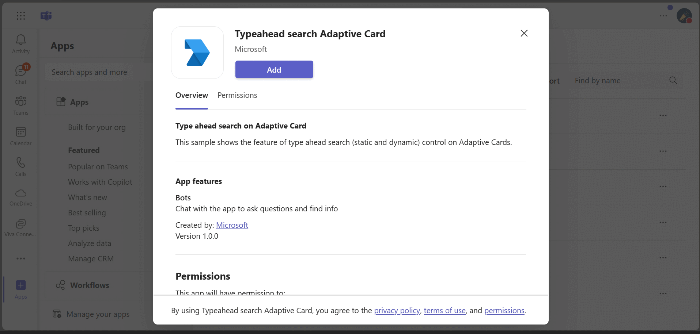

# Typeahead search control in Adaptive Cards C#

This sample shows the feature of typeahead search (static and dynamic) control in Adaptive Cards.

## Included Features
* Bots
* Adaptive Cards (typeahead search)

## Interaction with app



## Try it yourself - experience the App in your Microsoft Teams client
Please find below demo manifest which is deployed on Microsoft Azure and you can try it yourself by uploading the app package (.zip file link below) to your teams and/or as a personal app. (Sideloading must be enabled for your tenant, [see steps here](https://docs.microsoft.com/microsoftteams/platform/concepts/build-and-test/prepare-your-o365-tenant#enable-custom-teams-apps-and-turn-on-custom-app-uploading)).

**Typeahead search control in Adaptive Cards:** [Manifest](/samples/bot-type-ahead-search-adaptive-cards/csharp/demo-manifest/Typeahead-search-adaptive-cards.zip)

## Prerequisites

- [.NET Core SDK](https://dotnet.microsoft.com/download) version 6.0

  determine dotnet version
  ```bash
  dotnet --version
  ```
- [Ngrok](https://ngrok.com/download) (For local environment testing) Latest (any other tunneling software can also be used)  
 
- [Teams](https://teams.microsoft.com) Microsoft Teams is installed and you have an account

## Setup

1. Register a new application in the [Azure Active Directory – App Registrations](https://go.microsoft.com/fwlink/?linkid=2083908) portal.

2. Setup for Bot
	- Register a AAD aap registration in Azure portal.
	- Also, register a bot with Azure Bot Service, following the instructions [here](https://docs.microsoft.com/azure/bot-service/bot-service-quickstart-registration?view=azure-bot-service-3.0).
	- Ensure that you've [enabled the Teams Channel](https://docs.microsoft.com/azure/bot-service/channel-connect-teams?view=azure-bot-service-4.0)
	- While registering the bot, use `https://<your_ngrok_url>/api/messages` as the messaging endpoint.

    > NOTE: When you create your app registration, you will create an App ID and App password - make sure you keep these for later.

3. Setup NGROK
      - Run ngrok - point to port 3978

	```bash
	# ngrok http 3978 --host-header="localhost:3978"
	```   
4. Setup for code

  - Clone the repository

    ```bash
    git clone https://github.com/OfficeDev/Microsoft-Teams-Samples.git
    ```
 - Modify the `appsettings.json` and fill in the following details:
   - `MicrosoftAppId` - Generated from Step 1 (Application (client) ID)is the application app id
   - `MicrosoftAppPassword` - Generated from Step 1, also referred to as Client secret
   
  - Open the code in Visual Studio
   - File -> Open -> Project/Solution
   - Navigate to folder where repository is cloned then `samples/bot-type-ahead-search-adaptive-cards/csharp/TypeaheadSearch.sln`
   - Press `F5` to run the project
	 
5. Setup Manifest for Teams
- __*This step is specific to Teams.*__
    - **Edit** the `manifest.json` contained in the ./AppPackage folder to replace your Microsoft App Id (that was created when you registered your app registration earlier) *everywhere* you see the place holder string `{{Microsoft-App-Id}}` (depending on the scenario the Microsoft App Id may occur multiple times in the `manifest.json`)
    - **Edit** the `manifest.json` for `validDomains` and replace `{{domain-name}}` with base Url of your domain. E.g. if you are using ngrok it would be `https://1234.ngrok-free.app` then your domain-name will be `1234.ngrok-free.app`.
    - **Zip** up the contents of the `AppPackage` folder to create a `manifest.zip` (Make sure that zip file does not contains any subfolder otherwise you will get error while uploading your .zip package)

- Upload the manifest.zip to Teams (in the Apps view click "Upload a custom app")
   - Go to Microsoft Teams. From the lower left corner, select Apps
   - From the lower left corner, choose Upload a custom App
   - Go to your project directory, the ./AppPackage folder, select the zip folder, and choose Open.
   - Select Add in the pop-up dialog box. Your app is uploaded to Teams.

**Note**: If you are facing any issue in your app, please uncomment [this](https://github.com/OfficeDev/Microsoft-Teams-Samples/blob/main/samples/bot-type-ahead-search-adaptive-cards/csharp/TypeaheadSearch/AdapterWithErrorHandler.cs#L30) line and put your debugger for local debug.

## Running the sample

Use the bot command `staticsearch` to get the card with static typeahead search control and use bot command `dynamicsearch` to get the card with dynamic typeahead search control.


`Static search:`
 Static typeahead search allows users to search from values specified within `input.choiceset` in the Adaptive Card payload.


Static tpyedhead detail after submission


`Dynamic search:`
 Dynamic typeahead search is useful to search and select data from large data sets. The data sets are loaded dynamically from the dataset specified in the card payload.


`On `Submit` button click, the bot will return the choice that we have selected:`


## Further reading

- [Bot Framework Documentation](https://docs.botframework.com)
- [Bot Basics](https://docs.microsoft.com/azure/bot-service/bot-builder-basics?view=azure-bot-service-4.0)
- [Azure Bot Service Introduction](https://docs.microsoft.com/azure/bot-service/bot-service-overview-introduction?view=azure-bot-service-4.0)
- [Azure Bot Service Documentation](https://docs.microsoft.com/azure/bot-service/?view=azure-bot-service-4.0)
- [Typeahead Search in Adaptive Cards](https://learn.microsoft.com/microsoftteams/platform/task-modules-and-cards/cards/dynamic-search?tabs=desktop%2Ccsharp)

