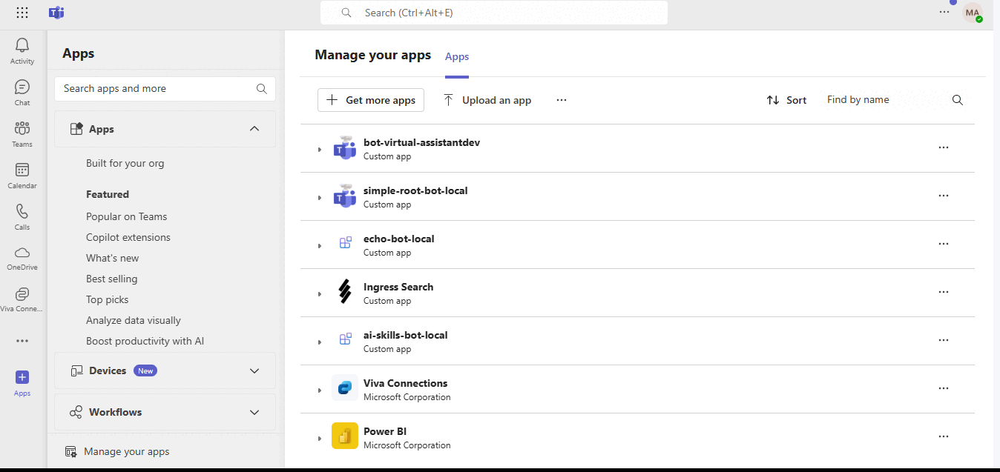
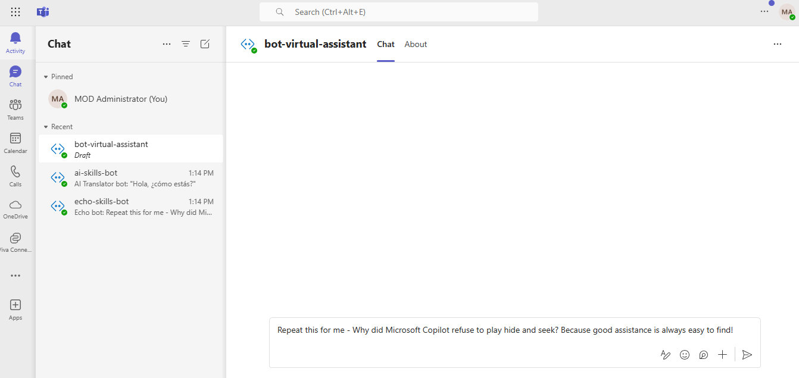
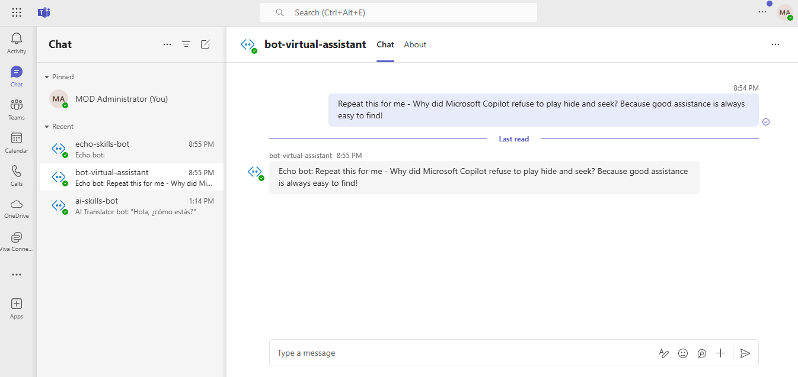
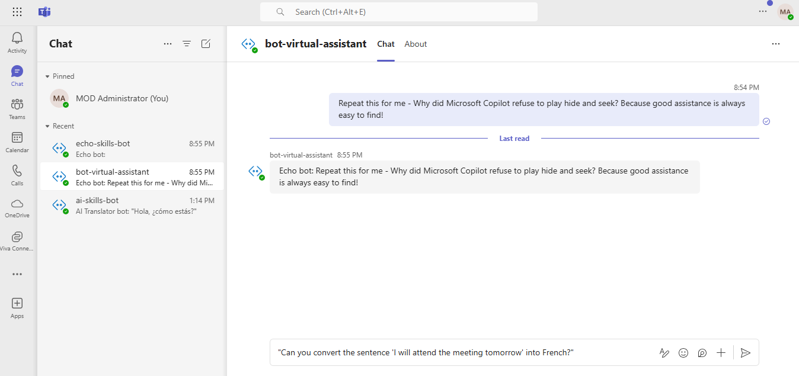
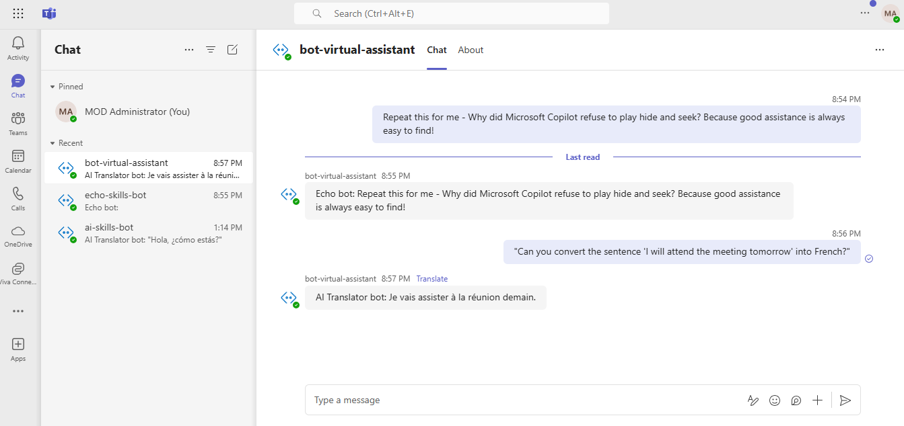

# Virtual Assistant Bot (Root Bot)

This Teams AI-based Virtual Assistant Root Bot is a consumer bot that uses the Teams AI library to dynamically route user inputs to Echo and AI skill bots, returning tailored responses. It operates seamlessly within Microsoft Teams to enhance productivity by automating responses and facilitating efficient interactions.

**Note: This is a skill consumer bot that will call other skill bots, such as Echo and AI Translator, which will return the responses based on user inputs.**

You can implement a skill consumer bot by following the steps mentioned in the [Implement a skill consumer](https://learn.microsoft.com/en-us/azure/bot-service/skill-implement-consumer?view=azure-bot-service-4.0&tabs=cs) documentation.

## Included Features
* Bots

## Interaction with the Bot 



## Prerequisites

- Microsoft Teams is installed and you have a valid [M365 account](https://www.microsoft.com/en-us/microsoft-365/what-is-microsoft-365?msockid=00bf51c23fe96f65186b42723e726e7f)
- [NodeJS](https://nodejs.org/en/)
- [dev tunnel](https://learn.microsoft.com/en-us/azure/developer/dev-tunnels/get-started?tabs=windows) or [ngrok](https://ngrok.com/) latest version or equivalent tunnelling solution
- [Visual Studio Code](https://code.visualstudio.com/Download) or any other code editor
- An [Azure subscription](https://learn.microsoft.com/en-us/microsoft-365/enterprise/subscriptions-licenses-accounts-and-tenants-for-microsoft-cloud-offerings?view=o365-worldwide) with permissions to create resources
- [Azure access to create Azure Open AI Service](https://learn.microsoft.com/en-us/azure/ai-services/openai/overview)
- [Azure access to create Application Insights](https://learn.microsoft.com/en-us/azure/azure-monitor/app/nodejs#resource)

## Create an Azure Open AI service

- In Azure portal, create an [Azure Open AI service](https://learn.microsoft.com/en-us/azure/ai-services/openai/how-to/create-resource?pivots=web-portal).
- **Deploy Azure Open AI model:** Deploy the `gpt-35-turbo` model in your created Azure Open AI service for the application to perform translation.
- Collect `AzureOpenAIEndpoint`, `AzureOpenAIApiKey`, `AzureOpenAIDeploymentName` values and save these values to update in `.localConfigs` file later.

## Setup the Application Insights
In Azure portal, create an [Application Insights](https://learn.microsoft.com/en-us/azure/azure-monitor/app/nodejs#resource) and save `Instrumentation Key` and `Connection String` values and which will be required later while updating `.localConfigs` file configuration in sample code.

**Note>** While creating or setting up Application Insights, choose `NodeJS` as the application type.

### Register your app with Azure AD.

  1. Register a new application in the [Microsoft Entra ID – App Registrations](https://go.microsoft.com/fwlink/?linkid=2083908) portal.
  2. Select **New Registration** and on the *register an application page*, set following values:
      * Set **name** to your app name.
      * Choose the **supported account types** (any account type will work)
      * Leave **Redirect URI** empty.
      * Choose **Register**.
  3. On the overview page, copy and save the **Application (client) ID, Directory (tenant) ID**. You'll need those later when updating your Teams application manifest and in the appsettings.json.
  4. Navigate to **API Permissions**, and make sure to add the follow permissions:
   Select Add a permission
      * Select Add a permission
      * Select Microsoft Graph -\> Delegated permissions.
      * `User.Read` (enabled by default)
      * Click on Add permissions. Please make sure to grant the admin consent for the required permissions.


## Setup the code
1) Clone the repository

    ```bash
    git clone https://github.com/OfficeDev/Microsoft-Teams-Samples.git
    ```

2) Navigate to the `samples/bot-virtual-assistant/bot-ai-virtual-assistant` folder and open with Visual Studio Code.

3) Open and modify the `.localConfigs` file contained in your project folder (Open it in Visual Studio Code or any other editor) and fill in below details:
   - `BOT_ID` - It will be automatically generated while running the sample using Toolkit.
   - `BOT_PASSWORD` - It will be automatically generated while running the sample using Toolkit.
   - `SECRET_AZURE_OPENAI_API_KEY` - Generated while creating Azure Open AI service (`AzureOpenAIApiKey` value).
   - `AZURE_OPENAI_ENDPOINT` - Generated while creating Azure Open AI service (`AzureOpenAIEndpoint` value). 
     Example: https://abc.openai.azure.com/
   - `AZURE_OPENAI_DEPLOYMENT_NAME` - Generated while creating Azure Open AI service (`AzureOpenAIDeploymentName` value).
   - `MicrosoftAppType` - The value for app type will be `MultiTenant` because we have configured the application to support `MultiTenant` Including Echo skill and AI Translator skill bots which we are going to call from this Virtual Assistant bot.
   - `MicrosoftAppTenantId` - Put it as blank as we are using MultiTenant app.
   - `SkillHostEndpoint` - It will be in format: `{ApplicationBaseURL}/api/skills/`. Example: `http://localhost:3978/api/skills/` and if your app is deployed to Azure Web app, you should provide your deployed application base URL.
   
   - `SkillId` - It will be comma separated list of unique id's that will be representing your skill bots like: `EchoSkillBot,OpenAiSkillBot`
   - `SkillAppId` - It will be comma separated list of your app registration id's of your skill bots like: `SkillAppId=xxxxxx-4573-xxxx-2e74bf1edbd0,xxxxx-1b8a-4029-xxxx-aa07dc2d3ee6`

   **Note: Make sure that your `SkillId` values and `SkillAppId` values are in proper order means if you have added skillId as `EchoSkillBot` first, you should add that app registration id as in first place in `SkillAppId` section followed by `OpenAiSkillBot` related app registraiton id value.**
   - `SkillEndpoint` - It will be comma separated list of your bot's Messaging Endpoing like: `{EchoBot-ApplicationBaseURL}/api/messages,{AIBot-ApplicationBaseURL}/api/messages`. Example: `http://localhost:39783/api/messages,http://localhost:39784/api/messages`

   - `APPINSIGHTS_INSTRUMENTATIONKEY` - Provide the application insights `Instrumentation Key` created in previous steps (Required to log the telemetry data).
   - `APPINSIGHTS_CONNECTIONSTRING` - Provide the application insights `Connection String` created in previous steps in single quote (Required to log the telemetry data).

## Run the app (Using Microsoft 365 Agents Toolkit for Visual Studio Code)

The simplest way to run this sample in Teams is to use Microsoft 365 Agents Toolkit for Visual Studio Code.

1. Ensure you have downloaded and installed [Visual Studio Code](https://code.visualstudio.com/docs/setup/setup-overview)
1. Install the [Microsoft 365 Agents Toolkit extension](https://marketplace.visualstudio.com/items?itemName=TeamsDevApp.ms-teams-vscode-extension)
1. Select **File > Open Folder** in VS Code and choose this samples directory from the repo
1. Using the extension, sign in with your Microsoft 365 account where you have permissions to upload custom apps
1. Select **Debug > Start Debugging** or **F5** to run the app in a Teams web client.
1. In the browser that launches, select the **Add** button to install the app to Teams.

> If you do not have permission to upload custom apps (uploading), Microsoft 365 Agents Toolkit will recommend creating and using a Microsoft 365 Developer Program account - a free program to get your own dev environment sandbox that includes Teams.

**If you are facing any issue while adding the application from launched browser popup, you can upload the generated app package manually by following below steps:**

- Navigate to the application folder `samples/bot-virtual-assistant/bot-ai-virtual-assistant/appPackage/build` and check for `appPackage.local.zip` auto generated file.

- Upload the `appPackage.local.zip` file to Teams (in the Apps view click **"Upload a custom app"**)
   - Go to **Microsoft Teams** and then go to side panel, select Apps
   - Choose [Upload a custom App](https://learn.microsoft.com/en-us/microsoftteams/platform/concepts/deploy-and-publish/apps-upload#upload-your-app) (If it is not enabled, please contact your Teams admin to enable this feature or you can also refer [Allow users to upload custom apps](https://learn.microsoft.com/en-us/microsoftteams/teams-custom-app-policies-and-settings#allow-users-to-upload-custom-apps))
   - Go to your project directory and `./appPackage/build` folder, select the zip folder, and choose Open.
   - Select Add in the opened pop-up dialog box. Your app will be uploaded to Teams.

## Running the sample

You can interact with this AI Virtual Assistant bot in Teams by sending it a message. The bot will dynamically route user inputs to Echo and AI skill bots, that returning tailored responses.

**Note: We will ask queries to Virtual Assistant Bot and it will call Echo or AI Translator skill bot to get the responses.**

### ECHO Bot
- [Click here to setup Echo Skill Bot](../echo-skill-bot/README.md)

**User Prompt:** 

`Repeat this for me - Why did Microsoft Copilot refuse to play hide and seek? Because good assistance is always easy to find!`



**Bot Response:** 

`Echo bot: Repeat this for me - Why did Microsoft Copilot refuse to play hide and seek? Because good assistance is always easy to find!`



### AI Translator Bot
- [Click here to setup AI Translator Bot](../ai-skill-bot/README.md)

**User Prompt:** 

`Can you convert the sentence 'I will attend the meeting tomorrow' into French?`



**Bot Response:** 

`AI Translator bot: "Je vais assister a la reunion demain."`



**Note that the root bot uses OpenAI to detect the intent and decided to call the appropriate bot without needing to be told explicitly and displays the result from the respective bot.**

## Deploy/Host your app on Azure
If you want to deploy the app to Azure, you can follow the below steps:
- [Provision cloud resources](https://learn.microsoft.com/en-us/microsoftteams/platform/toolkit/provision)
- [Deploy Microsoft Teams app to the cloud using Microsoft Visual Studio Code](https://learn.microsoft.com/en-us/microsoftteams/platform/toolkit/deploy)

## Further reading
- [Implement a skill consumer](https://learn.microsoft.com/en-us/azure/bot-service/skill-implement-consumer?view=azure-bot-service-4.0&tabs=cs)
- [Bot Basics](https://docs.microsoft.com/azure/bot-service/bot-builder-basics?view=azure-bot-service-4.0)
- [Azure Bot Service Introduction](https://docs.microsoft.com/azure/bot-service/bot-service-overview-introduction?view=azure-bot-service-4.0)
- [Azure Bot Service Documentation](https://docs.microsoft.com/azure/bot-service/?view=azure-bot-service-4.0)
- [Azure Open AI Service](https://learn.microsoft.com/en-us/azure/ai-services/openai/overview)
- [Azure Application Insights](https://learn.microsoft.com/en-us/azure/azure-monitor/app/nodejs#resource)

