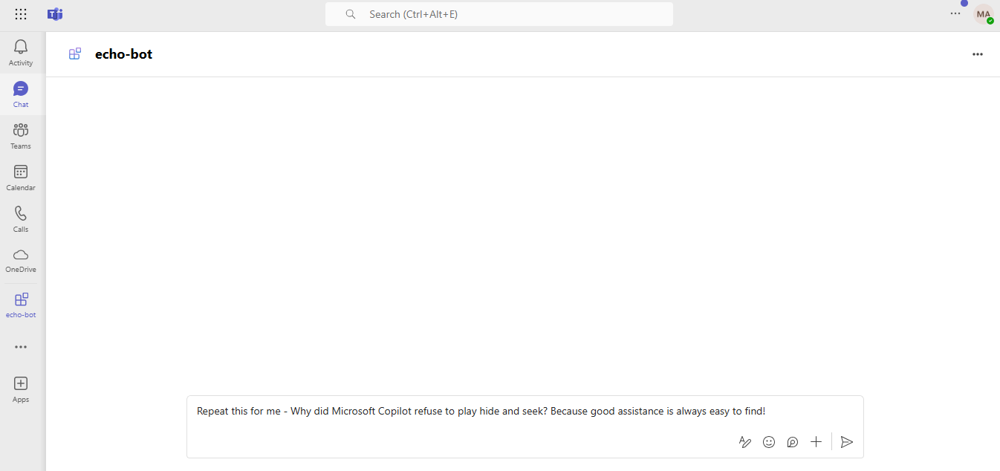

# Echo Skill Bot

This simple echo skill bot repeats the user's message and sends it back to them, demonstrating basic message handling in personal chats and Teams channel scopes.

**Note: This skill bot will be called by the main Virtual Assistant bot (Root Bot) and will echo back the user's message.**

You can create a new skill bot by following the steps mentioned in the [Create a skill](https://learn.microsoft.com/en-us/azure/bot-service/skill-implement-skill?view=azure-bot-service-4.0&tabs=cs) documentation.

## Included Features
* Bots

## Interaction with the Bot


## Prerequisites

- Microsoft Teams is installed and you have an valid M365 account
- [NodeJS](https://nodejs.org/en/)
- [dev tunnel](https://learn.microsoft.com/en-us/azure/developer/dev-tunnels/get-started?tabs=windows) or [ngrok](https://ngrok.com/) latest version or equivalent tunnelling solution
- Visual Studio Code or any other code editor
- An Azure subscription with permissions to create resources

## Setup for App Registration

1. Register a new application in the [Microsoft Entra ID – App Registrations](https://go.microsoft.com/fwlink/?linkid=2083908) portal.
2. Select **New Registration** and on the *register an application page*, set following values:
    * Set **name** to your app name.
    * Choose the **supported account types** as "MultiTenant" only (If you created your Virtual Assistant (root bot) then you should selet multi-tenant here as well). For more information, see [Supported account types](https://learn.microsoft.com/en-us/azure/bot-service/skill-implement-skill?view=azure-bot-service-4.0&tabs=cs).
    
    
    * Leave **Redirect URI** empty.
    * Choose **Register**.
3. On the overview page, copy and save the **Application (client) ID, Directory (tenant) ID**. You’ll need those later when updating your `Teams application manifest` and `.env` file configuration in your code.
4. Navigate to **Certificates & secrets**. In the Client secrets section:
    * Click on "+ New client secret".
    * Add a description(Name of the secret) for the secret and select “Never” for Expires.
    * Click "Add".
    * Once the client secret is created, copy its value, it need to be placed in the `.env` file configuration in code.

## Setup NGROK
   Run ngrok - point to port 39783

    ```bash
   ngrok http 39783 --host-header="localhost:39783"
   ```

   Alternatively, you can also use the `dev tunnels`. Please follow [Create and host a dev tunnel](https://learn.microsoft.com/en-us/azure/developer/dev-tunnels/get-started?tabs=windows) and host the tunnel with anonymous user access command as shown below:

   ```bash
   devtunnel host -p 39783 --allow-anonymous
   ```

## Setup the Azure bot
- In Azure portal, create a [Azure Bot resource](https://docs.microsoft.com/azure/bot-service/bot-service-quickstart-registration).
    - For bot handle, make up a name and fill in the required fields.
    - Select **supported account types** as "MultiTenant" and select "Use existing app registration" and provide app registration app id (Application (client) ID) created in previous step.
    - __*If you don't have an Azure account*__ create an [Azure free account here](https://azure.microsoft.com/free/)
    
- In the new Azure Bot resource in the Portal,
    - Ensure that you've [enabled the Teams Channel](https://learn.microsoft.com/azure/bot-service/channel-connect-teams?view=azure-bot-service-4.0)
    - In Settings/Configuration/Messaging endpoint, enter the current `https` URL you were given by running the tunneling application (NGROK/Devtunnel URL). Append with the path `/api/messages`
    for example: `https://12345.ngrok-free.app/api/messages` or `https://12345.devtunnels.ms/api/messages`

## Setup the Appplication Insights
In Azure portal, create an [Application Insights](https://learn.microsoft.com/en-us/azure/azure-monitor/app/nodejs#resource).

**Note>** When setting up Application Insights, choose `NodeJS` as the application type.
    - Make sure to collect and save the Instrumentation Key and Connection String, as you'll need these to update the `.env` configuration file in your code later.

## Setup the code
1) Clone the repository

    ```bash
    git clone https://github.com/OfficeDev/Microsoft-Teams-Samples.git
    ```

2) In a terminal, navigate to `samples/bot-virtual-assistant/bot-ai-virtual-assistant`

3) Install node modules

   Inside `echo-skill-bot` folder, open your local terminal and run the below command to install node modules. You can do the same in Visual Studio code terminal by opening the project in Visual Studio code.

    ```bash
    npm install
    ```

4) Modify the `.env` file in your project folder (or in Visual Studio Code) and fill in below details:
   - `{{MicrosoftAppType}}` - The value for app type will be `MultiTenant` only as we have configured the app registration for MultiTenant and this app (Including virtual assistant bot) supports multiple tenant only.
   - `{{MicrosoftAppId}}` - Generated while registering your application. (Application (client) ID) is the application app id.
   - `{{MicrosoftAppPassword}}` - Generated while registering your application. Also referred to as Client secret.
   - `MicrosoftAppTenantId` - Put it as blank as we are using MultiTenant app.
   - `{{AllowedCallers}}` - ID of the application that are allowed to call this skill bot (Echo skill bot). In this case, please provide the app registration id of your main virtual assistant bot (Root Bot).
   - `{{APPINSIGHTS_INSTRUMENTATIONKEY}}` - Provide the application insights `Instrumentation Key` created in previous steps. (Required to log the telemetry data)
   - `{{APPINSIGHTS_CONNECTIONSTRING}}` - Provide the application insights `Connection String` created in previous steps in single quote. (Required to log the telemetry data)

5) Run your application locally

    ```bash
    npm start
    ```
    Or you can run the app in Visual Studio Code by pressing `F5`.

## Setup App Package (Manifest) for Teams Client

1. Modify the `manifest.json` available in the `/appPackage` folder in your opened project in `Visual Studio Code` and replace the following details:
   - `{{MicrosoftAppId}}` It can be any GUID or you can add your app registration id as well which was generated while registering or creating the app registration in Azure portal.
   - `{{BotId}}` Replace with your app registration id which was generated while registering or creating the app registration in Azure portal.
   - `{Base_URL_Domain}` - Your application's base url domain. E.g. for https://12345.ngrok-free.app the base url domain will be `12345.ngrok-free.app` when you are using ngrok and if you are using dev tunnels then your domain will be like: `12345.devtunnels.ms`. If you have deployed the application in Azure app service, please use like `xyz.azurewebsites.net`.

2. Zip the contents of the `appPackage` folder to create a `manifest.zip` file.(Make sure that zip file does not contains any subfolder otherwise you will get error while uploading your .zip package) 

3. Upload the manifest.zip to Teams (in the Apps view click "Upload a custom app")
   - Go to Microsoft Teams and then go to side panel, select Apps
   - Choose Upload a custom App
   - Go to your project directory, the ./appPackage folder, select the zip folder, and choose Open.
   - Select Add in the pop-up dialog box. Your app is uploaded to Teams.

## Running the sample

You can interact with this echo skill bot in Teams by sending it a message. The bot will echo back the same message.

**User Prompt:** 

`Repeat this for me - Why did Microsoft Copilot refuse to play hide and seek? Because good assistance is always easy to find!`



**Bot Response:** 

`Echo bot: Repeat this for me - Why did Microsoft Copilot refuse to play hide and seek? Because good assistance is always easy to find!`


## Deploy the app to Azure

To learn more about deploying a `NodeJS` app to Azure, see [Configure the App Service app and deploy the code](https://learn.microsoft.com/en-us/azure/app-service/quickstart-nodejs?tabs=windows&pivots=development-environment-vscode#configure-the-app-service-app-and-deploy-code) for a complete list of deployment instructions.

## Further reading

- [Implement a skill](https://learn.microsoft.com/en-us/azure/bot-service/skill-implement-skill?view=azure-bot-service-4.0&tabs=cs)
- [Bot Framework Documentation](https://docs.botframework.com)
- [Bot Basics](https://docs.microsoft.com/azure/bot-service/bot-builder-basics?view=azure-bot-service-4.0)
- [Azure Bot Service Introduction](https://docs.microsoft.com/azure/bot-service/bot-service-overview-introduction?view=azure-bot-service-4.0)
- [Azure Bot Service Documentation](https://docs.microsoft.com/azure/bot-service/?view=azure-bot-service-4.0)

