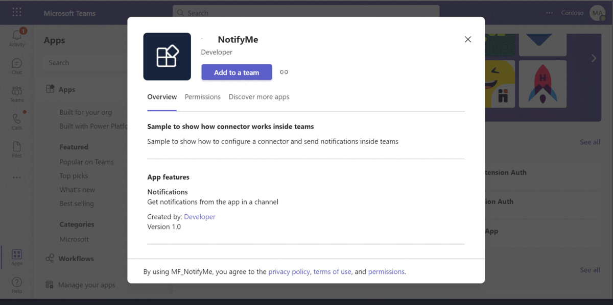
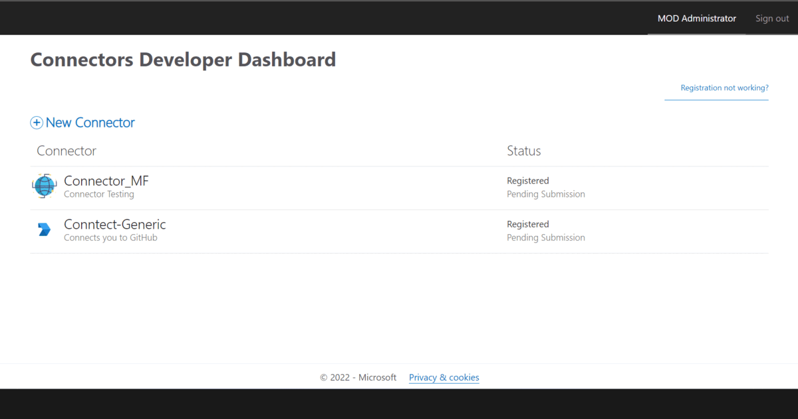
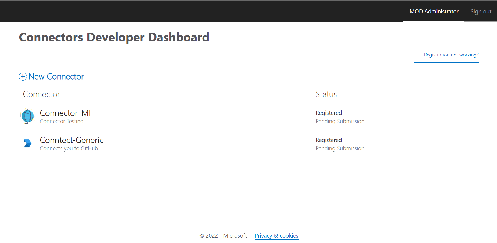
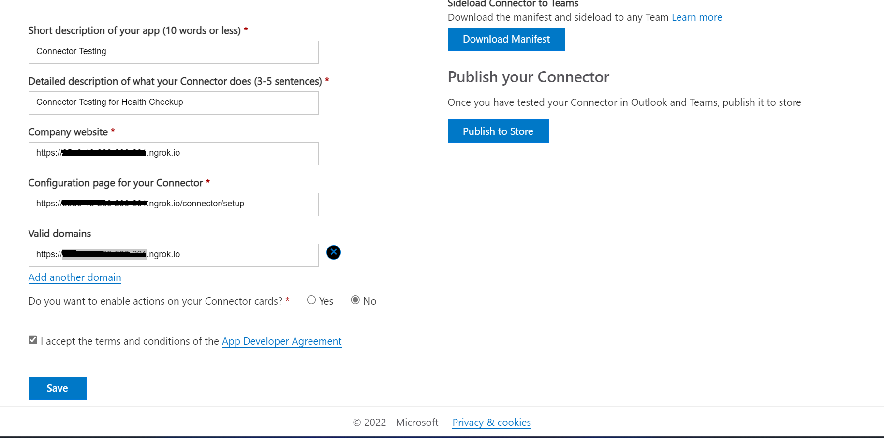
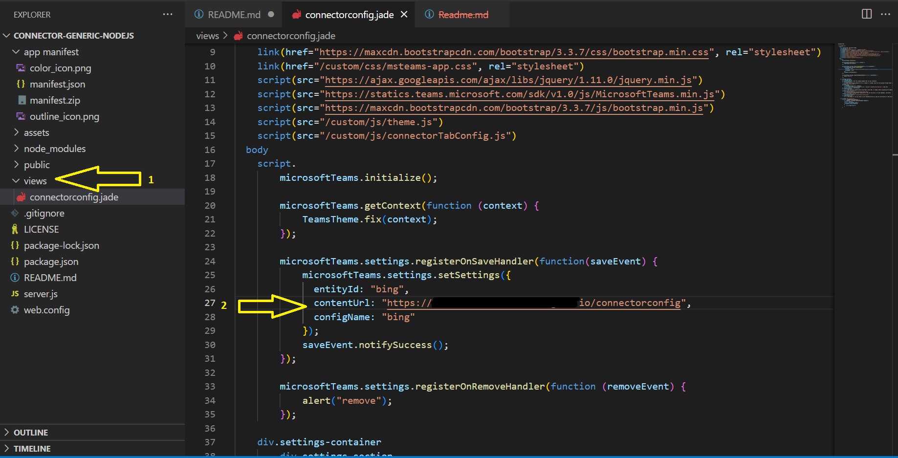
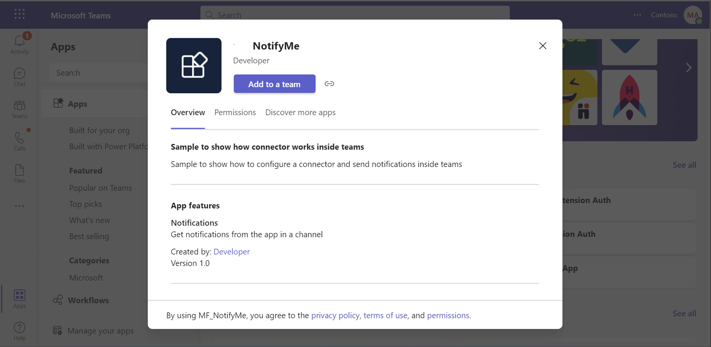
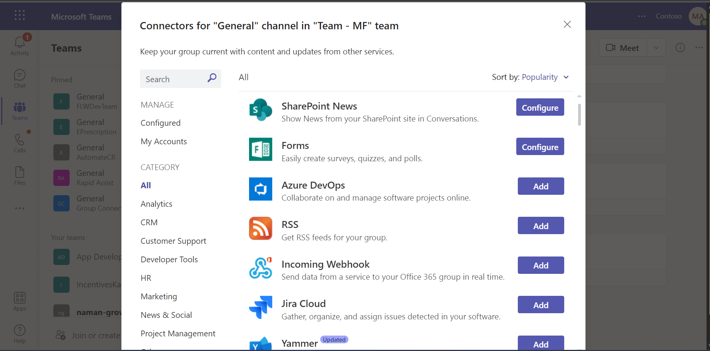
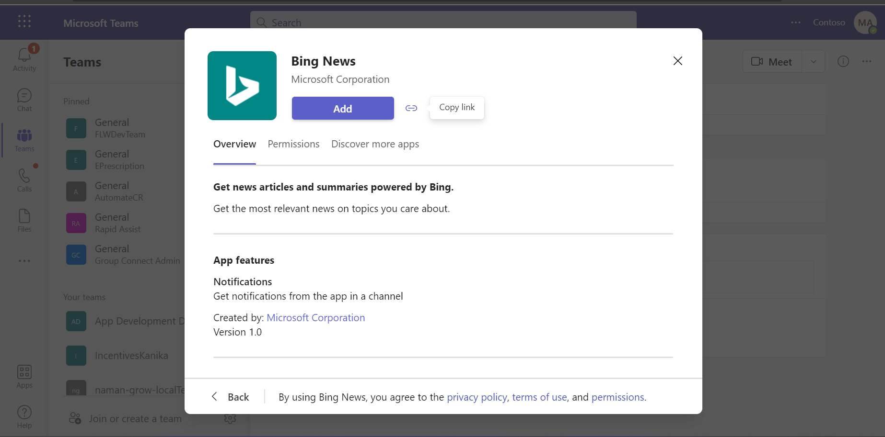
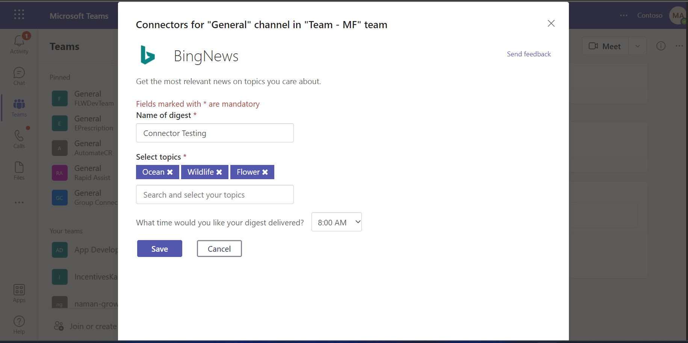
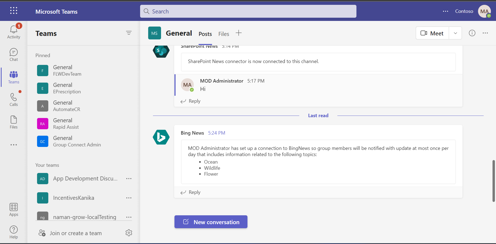

# Generic Connector 

This contains the source for a generic connector that's easy to customize for any system which supports webhooks.

## Included Features
* Connectors

## Interaction with app
 
 
## Prerequisites
To complete this tutorial, you need the following tools. If you don't already have them you can install them from these links.

* [Git](https://git-scm.com/downloads) 
* [Node.js and NPM](https://nodejs.org/)
* Get any text editor or IDE. You can install and use [Visual Studio Code](https://code.visualstudio.com/download) for free.
* An Office 365 account with access to Microsoft Teams, with [sideloading enabled](https://docs.microsoft.com/microsoftteams/platform/concepts/build-and-test/prepare-your-o365-tenant#enable-custom-teams-apps-and-turn-on-custom-app-uploading).
* If you want to run this code locally, use a tunnelling service. These instructions assume you are using [ngrok](https://ngrok.com/). 

### Setup 
> Note these instructions are for running the sample on your local machine.

   1. Open a new command prompt window. 
   2. Change to the directory that contains the ngrok.exe application. 
   3. In the command prompt

      Run ngrok - point to port 3978
      ```bash
       ngrok http 3978 --host-header="localhost:3978"
       ```
   4. Make note of the https:// Forwarding URL. This URL will be your [BASE_URI] like `https://1234.ngrok-free.app` which will be used in later steps.

   5. **Configure your own connector**

    

   - Open [Connector Developer Portal](https://aka.ms/connectorsdashboard) and select New Connector.
   

   - Fill in all the basic details such as name, logo, descriptions etc. for the new connector.
   - For the configuration page, you'll use our sample code's setup endpoint: `https://[BASE_URI]/connector/setup`
   

   - For Valid domains, make enter your domain's http or https URL, e.g. XXXXXXXX.ngrok-free.app.
   - Click on Save. After the save completes, you will see your connector ID in address bar.

  6. In the `~/views/connectorconfig.jade` file line 27 and replace `ngrokURL` to the ngrok https forwarding url from the above.

   

  7. Install all the dependencies by running `npm install` in root directory.

   ```bash
   npm install
   ```
 8. Run the sample using 

   ```bash
   node server.js
   ```

 9. __*This step is specific to Teams.*__
    - **Edit** the `manifest.json` contained in the  `app manifest` folder to replace your Microsoft Replace `<<CONNECTOR_ID>>` field in `~/app manifest/manifest.json` file with your newly registered
    - **Edit** the `manifest.json` and update `<<AppDomain>>`
      Example. if you are using ngrok it would be `https://1234.ngrok-free.app` then your app domain-name will be `1234.ngrok-free.app`.
    - **Zip** up the contents of the `app manifest` folder to create a `manifest.zip` (Make sure that zip file does not contains any subfolder otherwise you will get error while uploading your .zip package)
    - **Upload** the `manifest.zip` to Teams (In Teams Apps/Manage your apps click "Upload an app". Browse to and Open the .zip file. At the next dialog, click the Add button.)
    - Add the app to personal/team/groupChat scope (Supported scopes).
   

## Running the sample

**Setup your App in Teams**


**App list to connect for notifications** (Select App from the list which you want to connect for notifications.)
 

**Select App to get notifications** (Configure your selected application.)


**Selected App configuration** (Give some digest name and select topics to get connect)


**App is now configured for notification** (you will be get notify of that app which is connected with channel.)



## Further reading
For more information about getting started with Teams, please review the following resources:
- Review [Office 365 Connectors](https://docs.microsoft.com/microsoftteams/platform/webhooks-and-connectors/how-to/connectors-creating)
- Review [Understanding Teams app capabilities](https://docs.microsoft.com/microsoftteams/platform/concepts/capabilities-overview)

## Contributing

This project welcomes contributions and suggestions.  Most contributions require you to agree to a
Contributor License Agreement (CLA) declaring that you have the right to, and actually do, grant us
the rights to use your contribution. For details, visit https://cla.microsoft.com.

When you submit a pull request, a CLA-bot will automatically determine whether you need to provide
a CLA and decorate the PR appropriately (e.g., label, comment). Simply follow the instructions
provided by the bot. You will only need to do this once across all repos using our CLA.

This project has adopted the [Microsoft Open Source Code of Conduct](https://opensource.microsoft.com/codeofconduct/).
For more information see the [Code of Conduct FAQ](https://opensource.microsoft.com/codeofconduct/faq/) or
contact [opencode@microsoft.com](mailto:opencode@microsoft.com) with any additional questions or comments.


