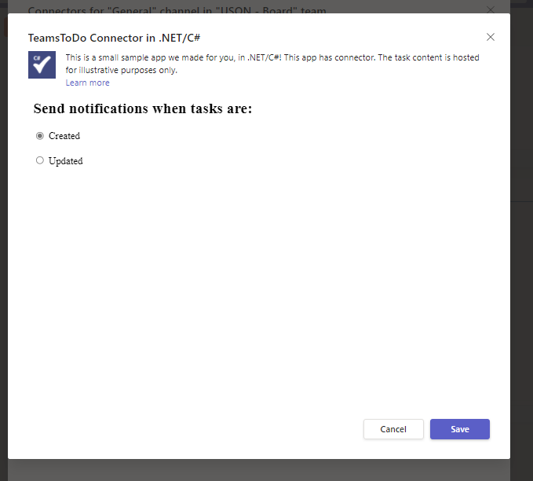
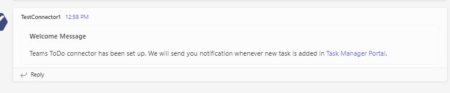
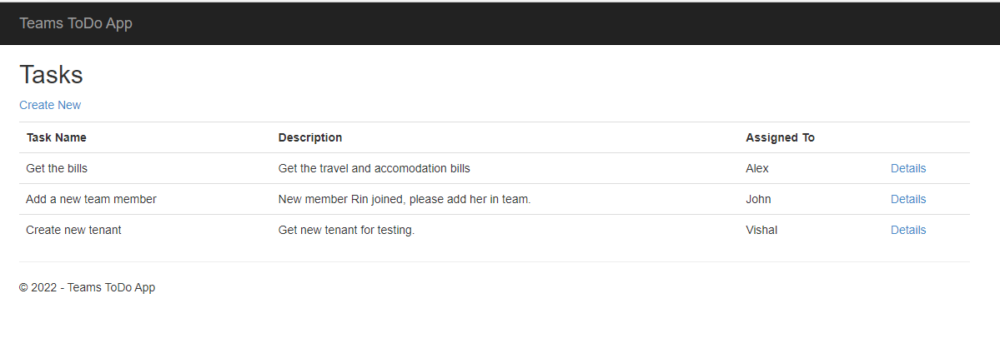
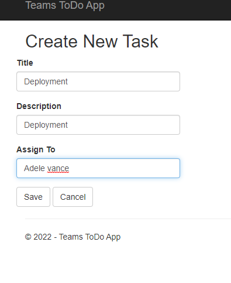
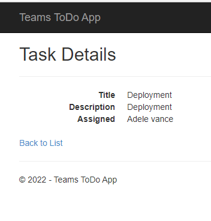
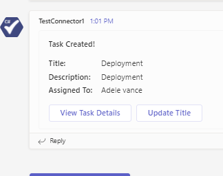

# Microsoft Teams Sample Connector

This is an MVC sample task management application generated using the [ASP.NET Web Application (.NET Framework)](https://docs.microsoft.com/en-us/aspnet/mvc/overview/getting-started/introduction/getting-started#creating-your-first-application) template. The majority of the code is related to either basic MVC configuration or Task management.

The main connector code is found here:
* ConnectorController.cs - `Setup` & `Save` actions
* TaskController.cs - `Create` & `Update` actions

This application simulates a real task management system and allows users to create and view tasks. The content is randomly generated to simulate how notification can be sent into Microsoft Teams channel using connector.

**For more information on developing apps for Microsoft Teams, please review the Microsoft Teams [developer documentation](https://docs.microsoft.com/en-us/microsoftteams/platform/overview).**

## Prerequisites
The minimum prerequisites to run this sample are:
* The latest update of Visual Studio. You can download the community version [here](http://www.visualstudio.com) for free.
* An Office 365 account with access to Microsoft Teams, with [sideloading enabled](https://msdn.microsoft.com/en-us/microsoft-teams/setup).
* If you want to run this code locally, use a tunnelling service. These instructions assume you are using [ngrok](https://ngrok.com/). 

>**Note**: some features in the sample require that you using [Public Developer Preview mode](https://docs.microsoft.com/en-us/microsoftteams/platform/resources/dev-preview/developer-preview-intro) in Microsoft Teams.

### How to see the connector working in Microsoft Teams
1) [Upload your custom app in Microsoft Teams](https://docs.microsoft.com/en-us/microsoftteams/platform/concepts/apps/apps-upload) using [this manifest file](TeamsToDoAppConnector/TeamsAppPackages/manifest.json).
2) Configure the [Teams ToDo Notification](https://docs.microsoft.com/en-us/microsoftteams/platform/concepts/connectors#accessing-office-365-connectors-from-microsoft-teams) connector.
3) Select either Create or Update on the registration page and click Save. 
4) Once the connector is configured, you will get a notification in channel with link to the Task Manager application.
5) Go to Task Manager portal and click on Create New and enter the task details and Save.
6) You will see the MessageCard in the registered Teams channel.
7) You can try the actionable buttons available on the message card.

>**Note**: With the above instructions, you can use sample connector which is deployed on Azure. Please follow the instructions below to create your own connector.

### Configure your own connector
The sample shows a simple implementation of a connector registration implementation. It also sends a connector card to the registered connector via a process triggered "externally."

1. Open the TeamsToDoAppConnector.sln solution with Visual Studio.
1. Begin your tunnelling service to get an https endpoint. 
   1. Open a new command prompt window. 
   1. Change to the directory that contains the ngrok.exe application. 
   1. In the command prompt, run the command `ngrok http [port] --host-header=localhost`.
   1. Ngrok will fill the entire prompt window. Make note of the https:// Forwarding URL. This URL will be your [BASE_URI] referenced below. 
   1. Minimize the ngrok Command Prompt window. It is no longer referenced in these instructions, but it must remain running.
1. Register a new connector in the [Connector Developer Portal](https://outlook.office.com/connectors/home/login/#/new)
   1. Fill in all the basic details such as name, logo, descriptions etc. for the new connector.
   1. For the configuration page, you'll use our sample code's setup endpoint: `https://[BASE_URI]/connector/setup`
   1. For Valid domains, make enter your domain's http or https URL, e.g. XXXXXXXX.ngrok.io.
   1. Enable the action on connector card by selecting the Yes radio button and enter the update endpoint: `https://[BASE_URI]/Task/Update`
   1. Click on Save. After the save completes, you will see your connector id.
1. In the Web.config file, set the `configuration.appSettings.Base_Uri` variable to the ngrok https forwarding url from the above.
1. In Visual Studio, click the play button. 
1. Now you can sideload your app package and test your new connector.

## More Information
For more information about getting started with Teams, please review the following resources:
- Review [Getting Started with Teams](https://msdn.microsoft.com/en-us/microsoft-teams/setup)
- Review [Getting Started with Bot Framework](https://docs.microsoft.com/en-us/bot-framework/bot-builder-overview-getstarted)
- Review [Testing your bot with Teams](https://msdn.microsoft.com/en-us/microsoft-teams/botsadd)

