# Microsoft Teams Sample Connector Todo

This application simulates a real task management system and allows users to create and view tasks. The content is randomly generated to simulate how notification can be sent into Microsoft Teams channel using connector.

## Included Features
* Connectors

## Interaction with bot
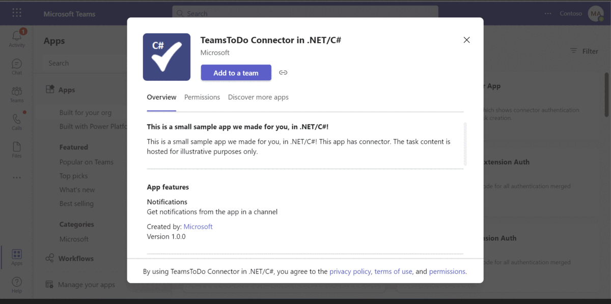 

## Prerequisites
The minimum prerequisites to run this sample are:
* The latest update of Visual Studio. You can download the community version [here](http://www.visualstudio.com) for free.
* An Office 365 account with access to Microsoft Teams, with [sideloading enabled](https://msdn.microsoft.com/en-us/microsoft-teams/setup).
* [.NET Core SDK](https://dotnet.microsoft.com/download) version 6.0.

  determine dotnet version
  ```bash
  dotnet --version
  ```
* [Ngrok](https://ngrok.com/download) (For local environment testing) Latest (any other tunneling software can also be used)
  
* [Teams](https://teams.microsoft.com) Microsoft Teams is installed and you have an account 

>**Note**: some features in the sample require that you using [Public Developer Preview mode](https://docs.microsoft.com/en-us/microsoftteams/platform/resources/dev-preview/developer-preview-intro) in Microsoft Teams.

### Setup 
> Note these instructions are for running the sample on your local machine.

1. Run ngrok - point to port 3978

   ```bash
     ngrok http 3978 --host-header="localhost:3978"
   ```  
2. Clone the repository

    ```bash
    git clone https://github.com/OfficeDev/Microsoft-Teams-Samples.git
    ```

3. If you are using Visual Studio
 
  - Launch Visual Studio
  - File -> Open Folder
  - Navigate to `samples/connector-todo-notification/csharp` folder
  - Select `TeamsToDoAppConnector.sln` solution file

  > Note The main connector code is found here:
  * ConnectorController.cs - `Setup` & `Save` actions
  * TaskController.cs - `Create` & `Update` actions

4. Configure your own connector : 
  >**Note**:The below gif file shows a simple implementation of a connector registration implementation. It also sends a connector card to the registered       connector via a process triggered "externally". 
  
   1. Register a new connector in the [Connector Developer Portal](https://aka.ms/connectorsdashboard)
   1. Fill in all the basic details such as name, logo, descriptions etc. for the new connector.
   1. For the configuration page, you'll use our sample code's setup endpoint: `https://[BASE_URI]/connector/setup`
   1. For Valid domains, make enter your domain's http or https URL, e.g. XXXXXXXX.ngrok-free.app.
   1. Enable the action on connector card by selecting the Yes radio button and enter the update endpoint: `https://[BASE_URI]/Task/Update`
   1. Click on Save. After the save completes, you will see your connector id.
   1. In the Web.config file, set the `configuration.appSettings.Base_Uri` variable to the ngrok https forwarding url from the above.
   1. In Visual Studio, click the play button.
   1. Now you can sideload your app package and test your new connector.
   1. Once the connector is configured, you will get a notification in Team channel with link to the `Task Manager application`.
   1. Go to Task Manager portal and click on Create New and enter the task details and Save.
   1. You will see the MessageCard in the registered Teams channel.
   1. You can try the actionable buttons available on the message card.
   
5. __*This step is specific to Teams.*__
    - **Edit** the `manifest.json` contained in the  `app manifest` folder to replace your `ConnectorId` field in `~/app manifest/manifest.json` file with      your ConnectorId in `connectors` section.
    - **Edit** the `manifest.json` for `validDomains`. if you are using ngrok it would be `https://1234.ngrok-free.app` then your domain-name will be `1234.ngrok-free.app`.
 
        Example :

        ```json
          "connectors": [
          {
            "connectorId": "<<CONNECTOR_ID>>",
            "configurationUrl": "https://<<VALID-DOMAIN>>/Connector/Setup"
          }
        ]
        ```
    
    - **Zip** up the contents of the `app manifest` folder to create a `manifest.zip` (Make sure that zip file does not contains any subfolder otherwise you will get error while uploading your .zip package)
    - **Upload** the `manifest.zip` to Teams (In Teams Apps/Manage your apps click "Upload an app". Browse to and Open the .zip file. At the next dialog, click the Add button.)
    - Add the app to personal/team/groupChat scope (Supported scopes)

## Running the sample

**Setup your App in Teams**
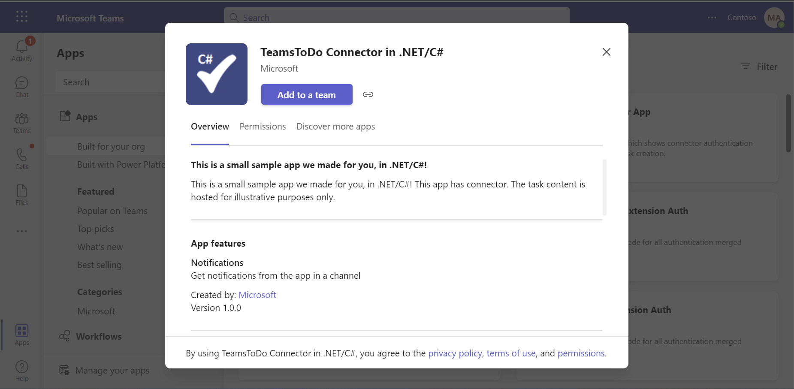

**Setup Connector**
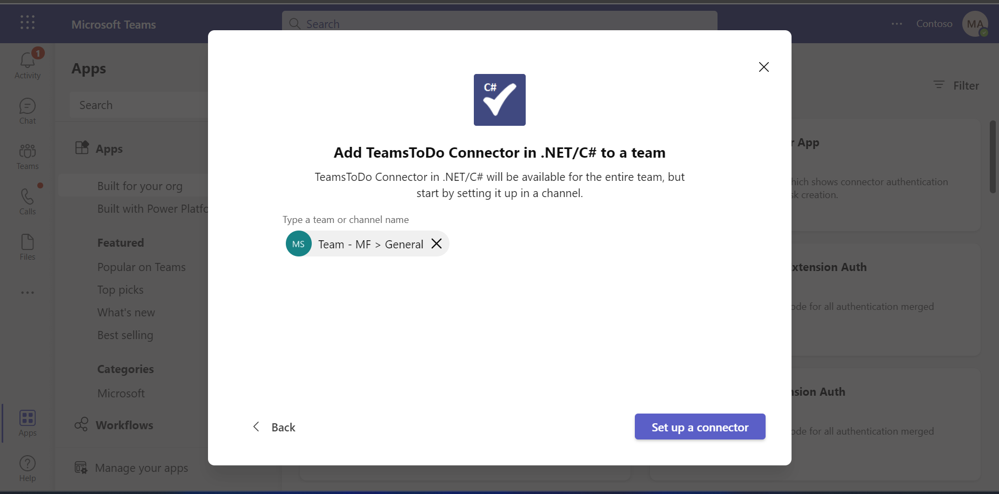

**Select Update/Create**
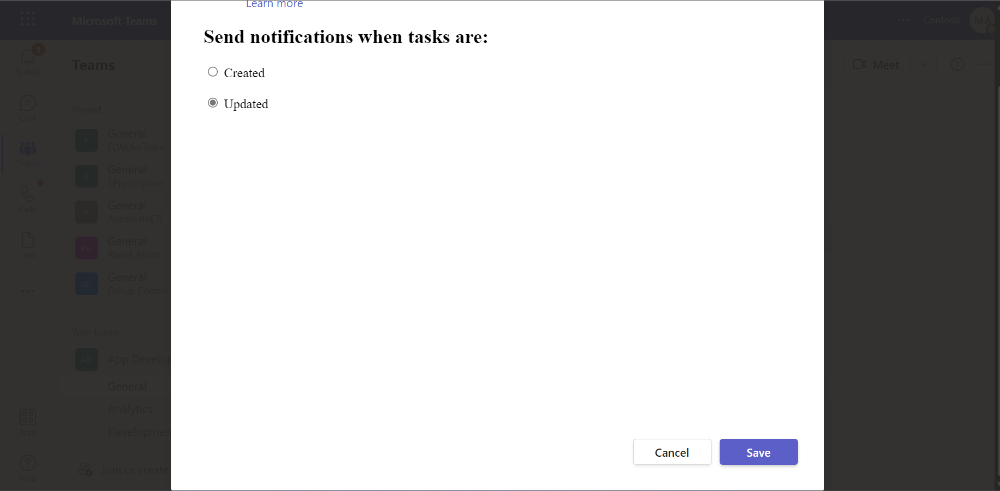

**Configured**
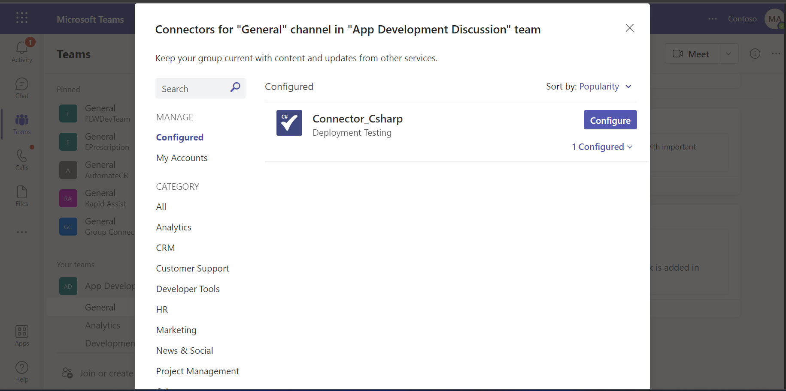

**Connector added successfully in Team's channel**
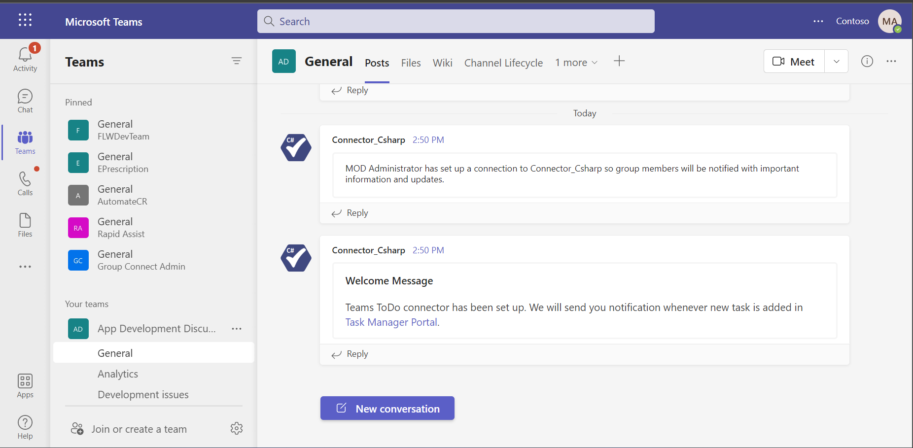

**Task manager portal** => **Create new task**
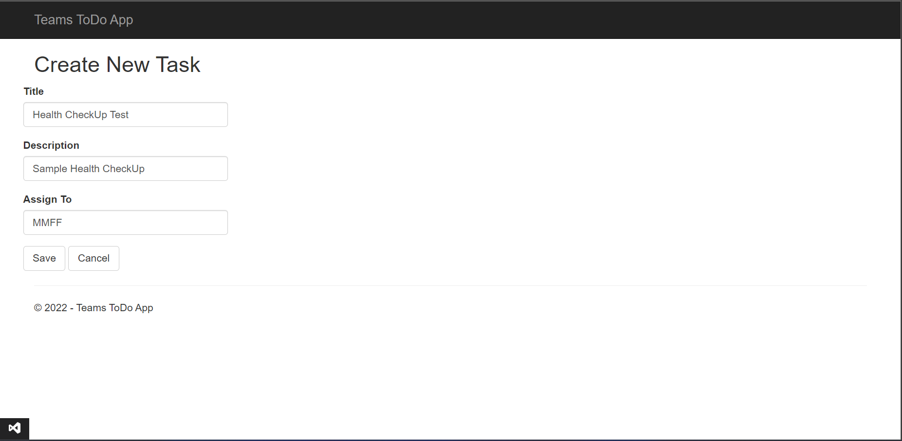

**Task manager portal** => **Task Details**
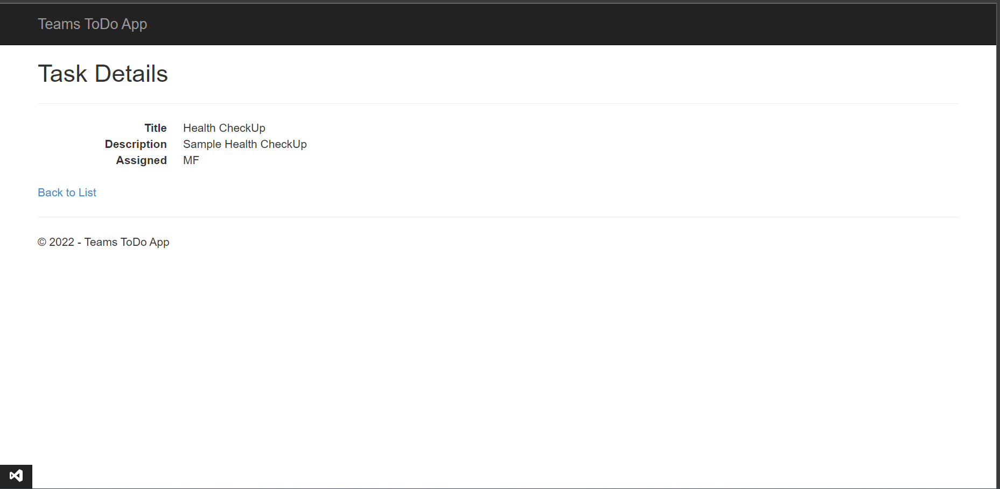

**Task manager portal** => **Task List**
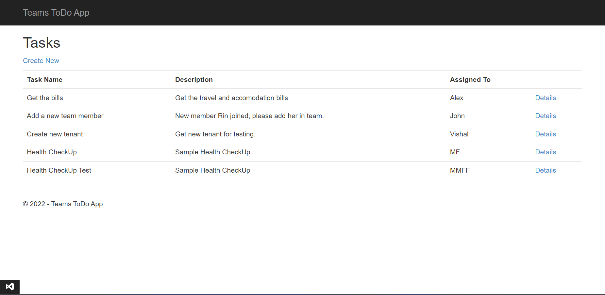

**Notification Of Task**
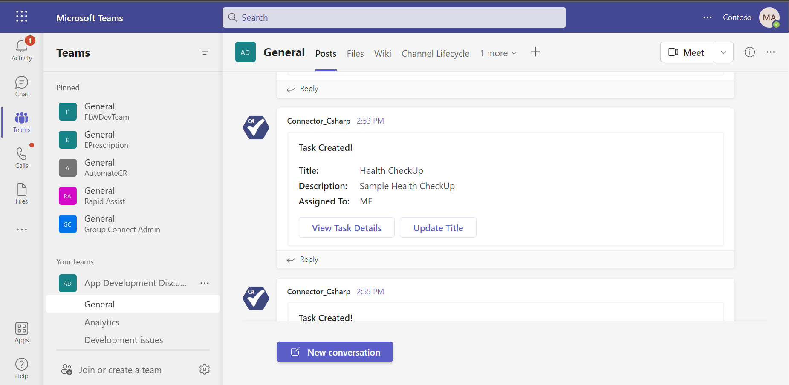

**Update From Notification Card**
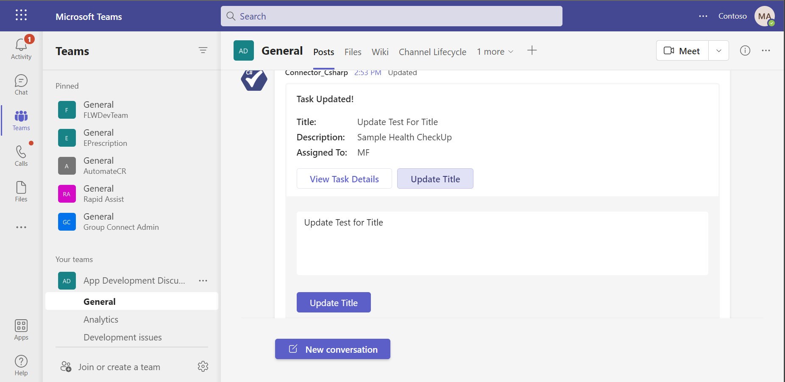

**Updated Notification**
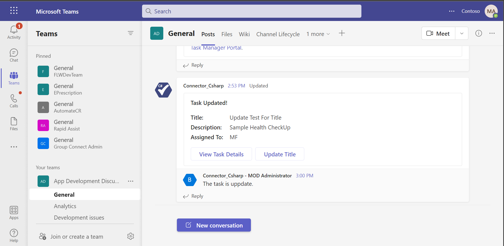


## Further Information
- For more information on developing apps for Microsoft Teams, please review the Microsoft Teams [developer documentation](https://docs.microsoft.com/en-us/microsoftteams/platform/overview).
- Configure the [Teams ToDo Notification](https://docs.microsoft.com/en-us/microsoftteams/platform/concepts/connectors#accessing-office-365-connectors-from-microsoft-teams) connector.
- For more information about getting started with Teams, please review the following resources:
- Review [Getting Started with Teams](https://msdn.microsoft.com/en-us/microsoft-teams/setup)
- Review [Getting Started with Bot Framework](https://docs.microsoft.com/en-us/bot-framework/bot-builder-overview-getstarted)
- Review [Testing your bot with Teams](https://msdn.microsoft.com/en-us/microsoft-teams/botsadd)


