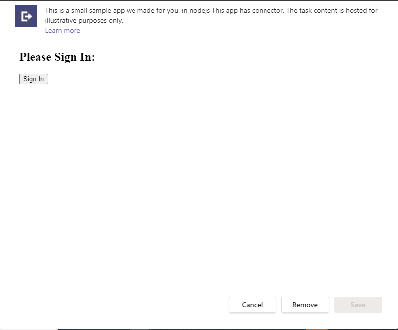
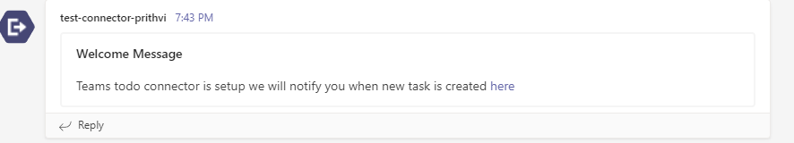
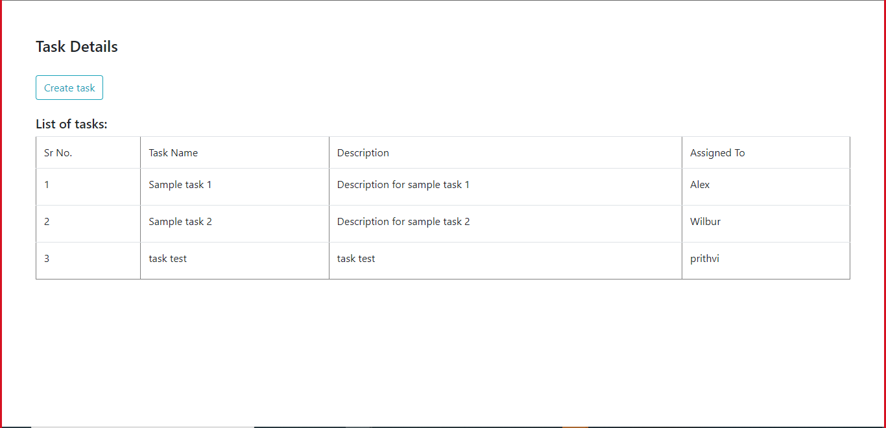
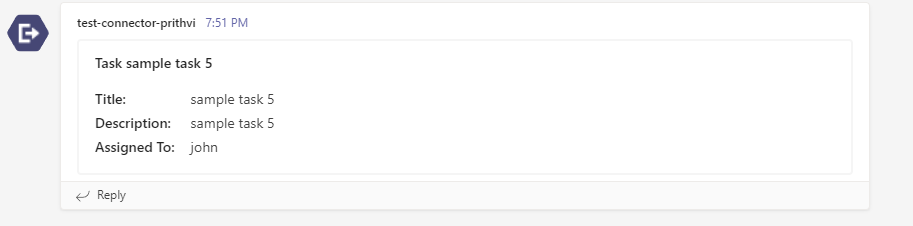

# Microsoft Teams Sample Connector

This is a sample connector application which demonstarates how to add authentication to connector configuration page and send notification on task creation.

**For more information on developing apps for Microsoft Teams, please review the Microsoft Teams [developer documentation](https://docs.microsoft.com/microsoftteams/platform/overview).**










## Prerequisites
- Microsoft Teams is installed and you have an account (not a guest account)
-  [NodeJS](https://nodejs.org/en/)
-  [ngrok](https://ngrok.com/) or equivalent tunneling solution
-  [M365 developer account](https://docs.microsoft.com/en-us/microsoftteams/platform/concepts/build-and-test/prepare-your-o365-tenant) or access to a Teams account with the 
   appropriate permissions to install an app.

### How to see the connector working in Microsoft Teams
1) [Upload your custom app in Microsoft Teams](https://docs.microsoft.com/microsoftteams/platform/concepts/apps/apps-upload) using [this manifest file](TeamsToDoAppConnector/TeamsAppPackages/manifest.json).
2) Configure the [Connector](https://docs.microsoft.com/microsoftteams/platform/concepts/connectors#accessing-office-365-connectors-from-microsoft-teams).
3) Select either Create or Update on the registration page and click Save. 
4) Once the connector is configured, you will get a notification in channel for the configured connector.

>**Note**: With the above instructions, you can use sample connector which is deployed on Azure. Please follow the instructions below to create your own connector.

### [Configure your own connector](https://docs.microsoft.com/microsoftteams/platform/webhooks-and-connectors/how-to/connectors-creating)
The sample shows a simple implementation of a connector registration implementation. It also sends a connector card to the registered connector via a process triggered "externally."

1. Clone the repository
   ```bash
   git clone https://github.com/OfficeDev/Microsoft-Teams-Samples.git
   ```
1. In a terminal, navigate to `samples/connector-auth-nodejs/nodejs`
1. Install node modules using command npm install.
1. Run your app using command npm start.
1. Begin your tunnelling service to get an https endpoint. 
   1. Open a new command prompt window. 
   1. Change to the directory that contains the ngrok.exe application. 
   1. In the command prompt, run the command `ngrok http 3978 --host-header=localhost`.
   1. Ngrok will fill the entire prompt window. Make note of the https:// Forwarding URL. This URL will be your [BASE_URI] referenced below. 
   1. Minimize the ngrok Command Prompt window. It is no longer referenced in these instructions, but it must remain running.
1. Register a new connector in the [Connector Developer Portal](https://aka.ms/connectorsdashboard)
   1. Fill in all the basic details such as name, logo, descriptions etc. for the new connector.
   1. For the configuration page, you'll use our sample code's setup endpoint: `https://[BASE_URI]/connector/SimpleAuth`
   1. For Valid domains, make entery of your domain's https URL, e.g. XXXXXXXX.ngrok.io.
   1. Click on Save. After the save completes, download the zip file for your connector which will contain the connector id.
1. Now you can sideload your app package and test your new connector.

### [Using Azure AD](#using-azure-ad)

1. Go to the [Application Registration Portal](https://aka.ms/appregistrations) and sign in with the your account to create an application.
1. Navigate to **Authentication** under **Manage** and add the following redirect URLs:

    - `https://<your_ngrok_url>/SimpleEnd`

1. Additionally, under the **Implicit grant** subsection select **Access tokens** and **ID tokens**

1. Click on **Expose an API** under **Manage**. Select the Set link to generate the Application ID URI in the form of api://{AppID}. Insert your fully qualified domain name (with a forward slash "/" appended to the end) between the double forward slashes and the GUID. The entire ID should have the form of: api://<your_ngrok_url>/{AppID}

1. Navigate to **API Permissions**, and make sure to add the following delegated permissions:
    - User.Read
    - email
    - offline_access
    - openid
    - profile
1. Scroll to the bottom of the page and click on "Add Permissions".

## Setting up Authentication for Configuration page 


1. Update the `.env` configuration with the `ClientId` and `BaseUrl`

1.  Update your Microsoft Teams application manifest

1. Add your ngrok URL to validDomains. Teams will only show the sign-in popup if its from a whitelisted domain.

   ```json
    "validDomains": [
        "<<base-url>>"
    ]
    ```


## More Information
For more information about getting started with Teams, please review the following resources:
- Review [Getting Started with Authentications for Tabs](https://docs.microsoft.com/en-us/microsoftteams/platform/tabs/how-to/authentication/auth-tab-aad)
- Review [Getting Started with Teams](https://msdn.microsoft.com/en-us/microsoft-teams/setup)


