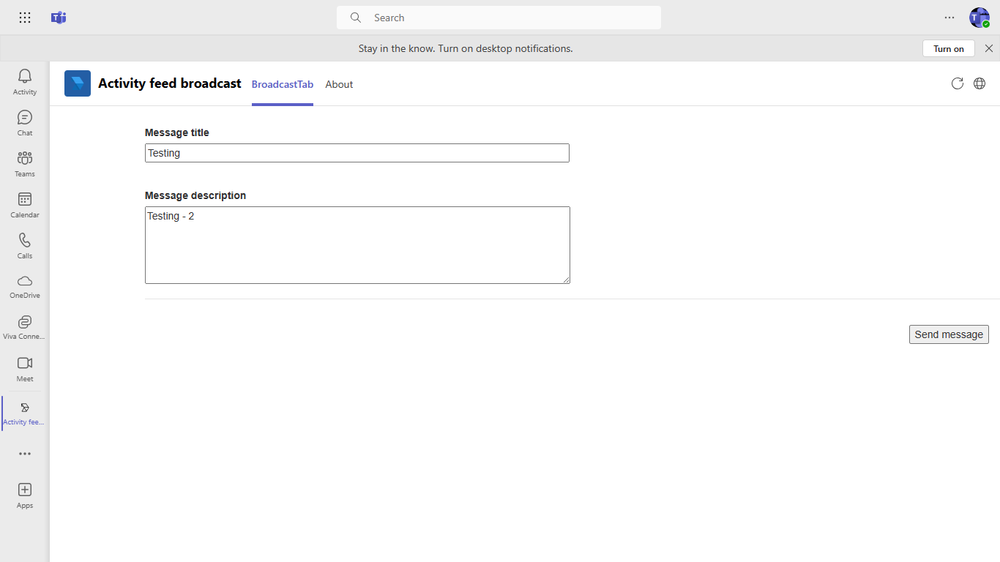

# Broadcast message to organization using activity feed notification (Graph APIs)

This sample shows a feature where user can broadcast a message to all members of organization using activty feed notification.

## Included Features
* Teams SSO (tabs)
* Activity Feed Notifications
* Graph API

## Interaction with app


## Prerequisites

- [.NET Core SDK](https://dotnet.microsoft.com/download) version 6.0

  determine dotnet version
  ```bash
  dotnet --version
  ```
- [Ngrok](https://ngrok.com/download) (For local environment testing) Latest (any other tunneling software can also be used)
- [Teams](https://teams.microsoft.com) Microsoft Teams is installed and you have an account

## Setup

- run ngrok locally
  ```bash
  ngrok http 3978 --host-header="localhost:3978"
  ```

- Register your Teams Auth SSO with Azure AD

1. Register a new application in the [Azure Active Directory – App Registrations](https://go.microsoft.com/fwlink/?linkid=2083908) portal.
2. Select **New Registration** and on the *register an application page*, set following values:
    * Set **name** to your app name.
    * Choose the **supported account types** (any account type will work)
    * Leave **Redirect URI** empty.
    * Choose **Register**.
3. On the overview page, copy and save the **Application (client) ID, Directory (tenant) ID**. You’ll need those later when updating your Teams application manifest and in the appsettings.json.

4. Under **Manage**, select **Expose an API**.
5. Click on the **Set** link to generate the Application ID URI in the form of `api://{AppID}`. Insert your fully qualified domain name (with a forward slash "/" appended to the end) between the double forward slashes and the GUID. The entire ID should have the form of: `api://fully-qualified-domain-name/{AppID}` and exclude http/https from the domain name.
    * ex: `api://%ngrokDomain%.ngrok-free.app/00000000-0000-0000-0000-000000000000`.
6. Select the **Add a scope** button. In the panel that opens, enter `access_as_user` as the **Scope name**.
7. Set **Who can consent?** to `Admins and users`
8. Fill in the fields for configuring the admin and user consent prompts with values that are appropriate for the `access_as_user` scope:
    * **Admin consent title:** Teams can access the user’s profile.
    * **Admin consent description**: Allows Teams to call the app’s web APIs as the current user.
    * **User consent display name**: Teams can access the user profile and make requests on the user's behalf.
    * **User consent description:** Enable Teams to call this app’s APIs with the same rights as the user.
9. Ensure that **State** is set to **Enabled**
10. Select **Add scope**
    * The domain part of the **Scope name** displayed just below the text field should automatically match the **Application ID** URI set in the previous step, with `/access_as_user` appended to the end:
        * `api://[ngrokDomain].ngrok-free.app/00000000-0000-0000-0000-000000000000/access_as_user.

11. In the **Authorized client applications** section, identify the applications that you want to authorize for your app’s web application. Each of the following IDs needs to be entered:
    * `1fec8e78-bce4-4aaf-ab1b-5451cc387264` (Teams mobile/desktop application)
    * `5e3ce6c0-2b1f-4285-8d4b-75ee78787346` (Teams web application)

12. Navigate to **API Permissions** section under **Manage**, and make sure to add the follow permissions:
-   Select Add a permission
-   Select Microsoft Graph -\> Delegated permissions.
    - `User.Read` (enabled by default)
    - `Directory.Read.All`
    - `Directory.ReadWrite.All`
	- `TeamsAppInstallation.ReadForUser`
	- `TeamsAppInstallation.ReadWriteForUser`
    - `TeamsActivity.Send`

**Note** Your need to add `TeamsActivity.Send`, `TeamsAppInstallation.ReadForUser.All` and `Directory.Read.All` as Application level permissions too.

-   Click on Add permissions. Please make sure to grant the admin consent for the required permissions.
13. Navigate to **Authentication**
    If an app hasn't been granted IT admin consent, users will have to provide consent the first time they use an app. (This will only work for the delegated permissions and Admin consent is required for any Application level permissions)
    Set a redirect URI:
    * Select **Add a platform**.
    * Select **web**.
    * Enter the **redirect URI** for the app in the following format: `https://{Base_Url_Domain}/Auth/End`, `https://{Base_Url_Domain}/Auth/Start`. This will be the page where a successful implicit grant flow will redirect the user.
    Enable implicit grant by checking the following boxes:  
    ✔ ID Token  
    ✔ Access Token  
14.  Navigate to the **Certificates & secrets**. In the Client secrets section, click on "+ New client secret". Add a description(Name of the secret) for the secret and select “Never” for Expires. Click "Add". Once the client secret is created, copy its value, it need to be placed in the appsettings.json.

15. Clone the repository
   ```bash
   git clone https://github.com/OfficeDev/Microsoft-Teams-Samples.git
   ```

16. Open the code in Visual Studio
   - File -> Open -> Project/Solution
   - Navigate to folder where repository is cloned then `samples/graph-activity-feed-broadcast/csharp/ActivityFeedBroadcast.sln`
    
17. Run ngrok - point to port 3978

    ```bash
    # ngrok http 3978 --host-header="localhost:3978"
    ```
 
18. Setup and run the bot from Visual Studio: 
   Modify the `appsettings.json` and fill in the following details:
   - `MicrosoftAppId` - Generated from Step 3 (Application (client) ID) is the application app id
   - `TenantId` - Generated from Step 3 (Directory (tenant) ID) is the tenant id
   - `MicrosoftAppPassword` - Generated from Step 14, also referred to as Client secret
   - `{{Base_URL_Domain}}` with base Url domain. E.g. if you are using ngrok it would be `https://1234.ngrok-free.app` then your domain-name will be `1234.ngrok-free.app`.
   - Press `F5` to run the project
	 
19. Modify the `manifest.json` in the `/AppPackage` folder and replace the following details:
   - `{{Microsoft-App-Id}}` with Application id generated from Step 3
   - `{{Base_URL_Domain}}` with base Url domain. E.g. if you are using ngrok it would be `https://1234.ngrok-free.app` then your domain-name will be `1234.ngrok-free.app`.

20. Zip the contents of `AppPackage` folder into a `manifest.zip`, and use the `manifest.zip` to deploy in app store or add to Teams using step 19.

21. Upload the manifest.zip to Teams (in the Apps view click "Upload a custom app")
   - Go to Microsoft Teams and then go to side panel, select Apps
   - Choose Upload a custom App
   - Go to your project directory, the ./AppPackage folder, select the zip folder, and choose Open.
   - Select Add in the pop-up dialog box. Your app is uploaded to Teams.    

**Note**: If you are facing any issue in your app, please uncomment [this](https://github.com/OfficeDev/Microsoft-Teams-Samples/blob/main/samples/graph-activity-feed-broadcast/csharp/ActivityFeedBroadcast/AdapterWithErrorHandler.cs#L26) line and put your debugger for local debug.

## Running the sample

- Broadcast message for all the members.


- Activity feed notification.


- Broadcast details available for members.


## Further reading

- [Bot Framework Documentation](https://docs.botframework.com)
- [Bot Basics](https://docs.microsoft.com/azure/bot-service/bot-builder-basics?view=azure-bot-service-4.0)
- [Send Notification to User in Bulk](https://docs.microsoft.com/en-us/graph/api/teamwork-sendactivitynotificationtorecipients?view=graph-rest-beta&tabs=http)
- [Send Notification to User in Chat](https://docs.microsoft.com/en-us/graph/api/chat-sendactivitynotification?view=graph-rest-beta)
- [Send Notification to User in Team](https://docs.microsoft.com/en-us/graph/api/team-sendactivitynotification?view=graph-rest-beta&tabs=http)
- [Send Notification to User](https://docs.microsoft.com/en-us/graph/api/userteamwork-sendactivitynotification?view=graph-rest-beta&tabs=http)


