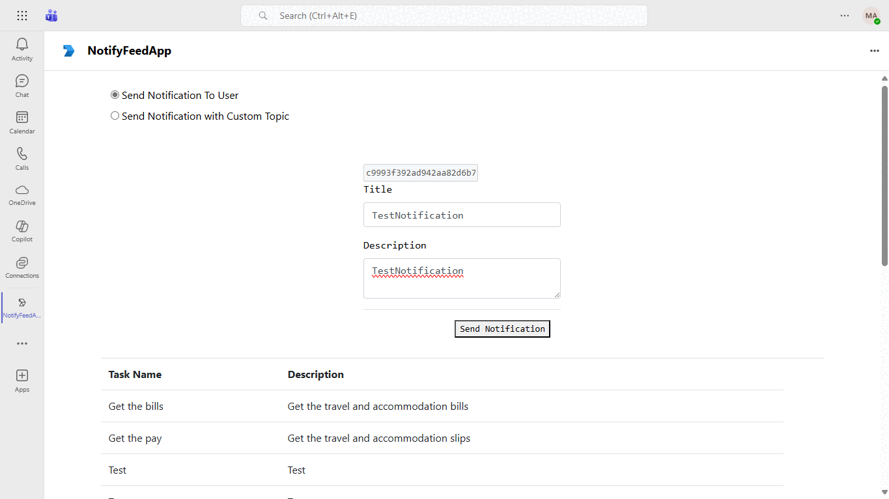

# Activity Feed Notification

This sample application demonstrates how to utilize the Microsoft Graph API to send activity feed notifications from a Teams Tab. It features support for Teams Single Sign-On (SSO) and allows triggering activity feed notifications across user, chat, and team scopes, seamlessly integrating with the Microsoft Teams platform. Created using [Microsoft Graph](https://docs.microsoft.com/en-us/graph/overview?view=graph-rest-beta), this sample shows how to trigger notifications that are sent back to conversations, enhancing user engagement within Teams.

## Included Features
* Teams SSO (tabs)
* Activity Feed Notifications
* Graph API

## Interactin with app



## Prerequisites

- [.NET Core SDK](https://dotnet.microsoft.com/download) version 6.0

  determine dotnet version
  ```bash
  dotnet --version
  ```
- [dev tunnel](https://learn.microsoft.com/en-us/azure/developer/dev-tunnels/get-started?tabs=windows) or [Ngrok](https://ngrok.com/download) (For local environment testing) latest version (any other tunneling software can also be used)
  
- [Teams](https://teams.microsoft.com) Microsoft Teams is installed and you have an account

## Setup

1. Register a new application in the [Microsoft Entra ID – App Registrations](https://go.microsoft.com/fwlink/?linkid=2083908) portal.
   
   ### Register your Teams Auth SSO with Azure AD

  - Register a new application in the [Microsoft Entra ID – App Registrations](https://go.microsoft.com/fwlink/?linkid=2083908) portal.
     Select **New Registration** and on the *register an application page*, set following values:
     * Set **name** to your app name.
     * Choose the **supported account types** (any account type will work)
     * Leave **Redirect URI** empty.
     * Choose **Register**.
 - On the overview page, copy and save the **Application (client) ID, Directory (tenant) ID**. You’ll need those later when updating your Teams application manifest and in the appsettings.json.
    - Under **Manage**, select **Expose an API**. 
    - Select the **Set** link to generate the Application ID URI in the form of `api://{AppID}`. Insert your fully qualified domain name (with a forward slash "/" appended to the end) between the double forward slashes and the GUID. The entire ID should have the form of: `api://fully-qualified-domain-name/{AppID}`
    - ex: `api://%ngrokDomain%.ngrok-free.app/00000000-0000-0000-0000-000000000000`.
    - Select the **Add a scope** button. In the panel that opens, enter `access_as_user` as the **Scope name**.
    - Set **Who can consent?** to `Admins and users`
  - Fill in the fields for configuring the admin and user consent prompts with values that are appropriate for the `access_as_user` scope:
      * **Admin consent title:** Teams can access the user’s profile.
      * **Admin consent description**: Allows Teams to call the app’s web APIs as the current user.
      * **User consent title**: Teams can access the user profile and make requests on the user's behalf.
      * **User consent description:** Enable Teams to call this app’s APIs with the same rights as the user.
  -Ensure that **State** is set to **Enabled**
     -Select **Add scope**
        * The domain part of the **Scope name** displayed just below the text field should automatically match the **Application ID** URI set in the previous step, with `/access_as_user` appended to the end:
        * `api://[ngrokDomain].ngrok-free.app/00000000-0000-0000-0000-000000000000/access_as_user.
   -In the **Authorized client applications** section, identify the applications that you want to authorize for your app’s web application. Each of the following IDs needs to be entered:
     * `1fec8e78-bce4-4aaf-ab1b-5451cc387264` (Teams mobile/desktop application)
     * `5e3ce6c0-2b1f-4285-8d4b-75ee78787346` (Teams web application)
  - Navigate to **API Permissions**, and make sure to add the follow permissions:
  - Select Add a permission
  - Select Microsoft Graph -\> Delegated permissions.
    - `User.Read` (enabled by default)
    - `email`
    - `offline_access`
    - `OpenId`
    - `profile`
    - `ChannelMessage.Send`
    - `ChatMessage.Send`
    - `Chat.ReadWrite`
    - `TeamsActivity.Send`
    - `TeamsAppInstallation.ReadForUser.All`
    - `TeamsTab.Read.All`
	- `ChannelSettings.Read.All`
	- `TeamsTab.ReadWriteForTeam`

     Also add `TeamsActivity.Send` as Application level permissions

    - Click on Add permissions. Please make sure to grant the admin consent for the required permissions.
    - Navigate to **Authentication**
    If an app hasn't been granted IT admin consent, users will have to provide consent the first time they use an app.
    Set a redirect URI:
      * Select **Add a platform**.
      * Select **Single page application**.
      * Enter the **redirect URI** for the app in the following format: `https://{Base_Url}/Auth/end`, `https://{Base_Url}/Auth/Start`. This will be the page where a successful implicit grant flow will redirect the user.

   - Navigate to the **Certificates & secrets**. In the Client secrets section, click on "+ New client secret". Add a description      (Name of the secret) for the secret and select “Never” for Expires. Click "Add". Once the client secret is created, copy its value, it need to be placed in the appsettings.json.

2. Setup for Bot
   - Register a Microsoft Entra ID aap registration in Azure portal.
   - Also, register a bot with Azure Bot Service, following the instructions [here](https://docs.microsoft.com/en-us/azure/bot-service/bot-service-quickstart-registration?view=azure-bot-service-3.0).
   - Ensure that you've [enabled the Teams Channel](https://docs.microsoft.com/en-us/azure/bot-service/channel-connect-teams?view=azure-bot-service-4.0)   

    > NOTE: When you create your app registration, you will create an App ID and App password - make sure you keep these for later.

3. Setup NGROK
1) Run ngrok - point to port 3978

   ```bash
   ngrok http 3978 --host-header="localhost:3978"
   ```  

   Alternatively, you can also use the `dev tunnels`. Please follow [Create and host a dev tunnel](https://learn.microsoft.com/en-us/azure/developer/dev-tunnels/get-started?tabs=windows) and host the tunnel with anonymous user access command as shown below:

   ```bash
   devtunnel host -p 3978 --allow-anonymous
   ```

4. Setup for code

  - Clone the repository

    ```bash
    git clone https://github.com/OfficeDev/Microsoft-Teams-Samples.git
    ```

  - Modify the `/appsettings.json` and fill in the following details:
  -  `{{MicrosoftAppId}}` - Generated from Step 1 while doing Microsoft Entra ID app registration in Azure portal.
  -  `{{TenantId}}` - Generated from Step 1 while doing Microsoft Entra ID app registration in Azure portal Directory (tenant) ID.
  -  `{{ MicrosoftAppPassword}}` - Generated from Step 1, also referred to as Client secret
  -  `{{ ApplicationIdURI }}` - Your application's ApplicationIdURI ex: `api://%ngrokDomain%.ngrok-free.app/00000000-0000-0000-0000-000000000000`..

- Run the bot from a terminal or from Visual Studio:

  A) From a terminal, navigate to `samples/graph-activity-feed/csharp` folder

  ```bash
  # run the bot
  dotnet run
  ```

  B) Or from Visual Studio

  - Launch Visual Studio
  - File -> Open -> Project/Solution
  - Navigate to `samples/graph-activity-feed/csharp` folder
  - Select `TabActivityFeed.csproj` file
  - Press `F5` to run the project
  
  ## User Interaction with Tab Activity Feed App

- Install TabActivityFeed manifest in Teams
- Add Tab in Personal, GroupChat or Team scope
- Fill the Details in Page and click on Send notification button


5.  - __*This step is specific to Teams.*__
    - **Edit** the `manifest.json` contained in the ./TabNotificationApp folder to replace your Microsoft App Id (that was created when you registered your app registration earlier) *everywhere* you see the place holder string `{{Microsoft-App-Id}}` (depending on the scenario the Microsoft App Id may occur multiple times in the `manifest.json`)
    - **Edit** the `manifest.json` for `validDomains` and replace `{{domain-name}}` with base Url of your domain. E.g. if you are using ngrok it would be `https://1234.ngrok-free.app` then your domain-name will be `1234.ngrok-free.app` and if you are using dev tunnels then your domain will be like: `12345.devtunnels.ms`.
    - 
    - **Zip** up the contents of the `AppManifest` folder to create a `manifest.zip` (Make sure that zip file does not contains any subfolder otherwise you will get error while uploading your .zip package)
    
    - **Edit** the `manifest.json` for `webApplicationInfo` resource `"api://{Base_Url}/<<MicrosoftAppId>>"` with MicrosoftAppId. E.g. `"api://1234.ngrok-free.app/00000-000-0000"`.
    
   - Upload the manifest.zip to Teams (in the Apps view click "Upload a custom app")
   - Go to Microsoft Teams. From the lower left corner, select Apps
   - From the lower left corner, choose Upload a custom App
   - Go to your project directory, the ./AppManifest folder, select the zip folder, and choose Open.
   - Select Add in the pop-up dialog box. Your app is uploaded to Teams.

**Note**: If you are facing any issue in your app, please uncomment [this](https://github.com/OfficeDev/Microsoft-Teams-Samples/blob/main/samples/graph-activity-feed/csharp/ActivityFeedNotification/AdapterWithErrorHandler.cs#L25) line and put your debugger for local debug.

## Setting up activity types in manifest
Teams Activity feed notification API uses activity to which user want a notification which we specify in app manifest, Add following activity type in your manifest for task creation.

  ```"activities": {
    "activityTypes": [
      {
        "type": "taskCreated",
        "description": "Task created activity",
        "templateText": "New created task {taskName} for you"
      }
    ]
}
```
## User Interaction with Tab Activity Feed App

- Install TabActivityFeed manifest in Teams
- Add Tab in Personal, GroupChat or Team scope
- Fill the Details in Page and click on Send notification button

## Running the sample


- Notification triggred by Tab App will appear in Teams Activity Feed


**Custom Activity Icons**

The app demonstrates a feature that allows developers to configure custom activity icons in personal, groupChat, channel scopes for various activities displayed in the activity feed. To test this feature, install the app in personal scope, log in with the user from whom you want to send the notification, fill out the form, and send a notification. You will observe the activity displayed with a custom icon. Also, go to the following line of code in the server.js file:
Please make sure to replace {userId} with the ID of the user to whom you want to send the notification in HomeController file. (Object Id of user from azure portal)


## Further reading

- [Bot Framework Documentation](https://docs.botframework.com)
- [Bot Basics](https://docs.microsoft.com/azure/bot-service/bot-builder-basics?view=azure-bot-service-4.0)
- [Send Notification to User in Chat](https://docs.microsoft.com/en-us/graph/api/chat-sendactivitynotification?view=graph-rest-beta)
- [Send Notification to User in Team](https://docs.microsoft.com/en-us/graph/api/team-sendactivitynotification?view=graph-rest-beta&tabs=http)
- [Send Notification to User](https://docs.microsoft.com/en-us/graph/api/userteamwork-sendactivitynotification?view=graph-rest-beta&tabs=http)
- [Send Default feed notification to User](https://review.learn.microsoft.com/en-us/graph/teams-send-activityfeednotifications?branch=main&branchFallbackFrom=pr-en-us-9593&tabs=csharp#example-8-send-a-notification-to-a-user-using-the-systemdefault-activity-type)


