# Activity Feed Notification

This sample application demonstrates how to utilize the Microsoft Graph API to send activity feed notifications from a Teams Tab. It features support for Teams Single Sign-On (SSO) and allows triggering activity feed notifications across user, chat, and team scopes, seamlessly integrating with the Microsoft Teams platform. Created using [Microsoft Graph](https://docs.microsoft.com/en-us/graph/overview?view=graph-rest-beta), this sample shows how to trigger notifications that are sent back to conversations, enhancing user engagement within Teams.

## Included Features
* Teams SSO (tabs)
* Activity Feed Notifications
* Graph API

## Interaction with app
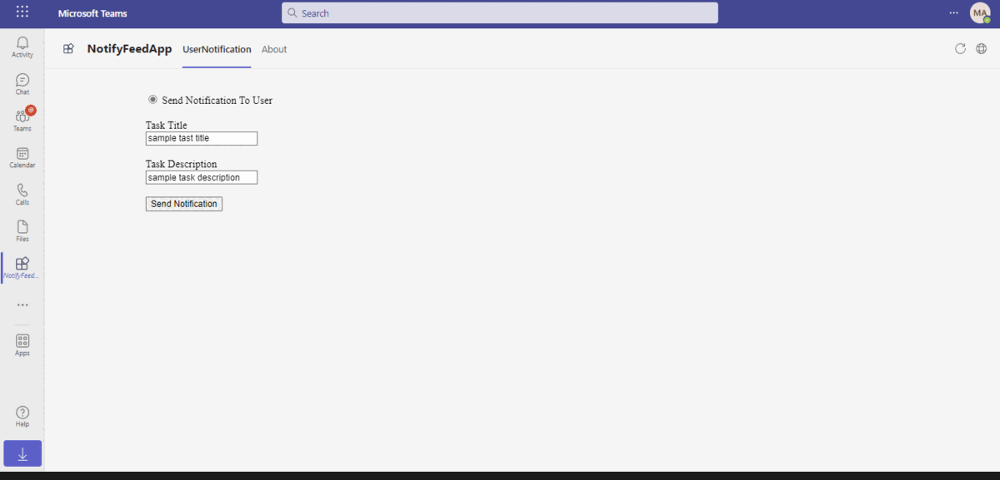

## Prerequisites

- Microsoft Teams is installed and you have an account (not a guest account)
- [NodeJS](https://nodejs.org/en/)
- [dev tunnel](https://learn.microsoft.com/en-us/azure/developer/dev-tunnels/get-started?tabs=windows) or [ngrok](https://ngrok.com/) latest version or equivalent tunnelling solution
- [M365 developer account](https://docs.microsoft.com/en-us/microsoftteams/platform/concepts/build-and-test/prepare-your-o365-tenant) or access to a Teams account with the appropriate permissions to install an app.
- [Microsoft 365 Agents Toolkit for VS Code](https://marketplace.visualstudio.com/items?itemName=TeamsDevApp.ms-teams-vscode-extension) or [TeamsFx CLI](https://learn.microsoft.com/microsoftteams/platform/toolkit/teamsfx-cli?pivots=version-one)

## Run the app (Using Microsoft 365 Agents Toolkit for Visual Studio Code)

The simplest way to run this sample in Teams is to use Microsoft 365 Agents Toolkit for Visual Studio Code.

1. Ensure you have downloaded and installed [Visual Studio Code](https://code.visualstudio.com/docs/setup/setup-overview)
1. Install the [Microsoft 365 Agents Toolkit extension](https://marketplace.visualstudio.com/items?itemName=TeamsDevApp.ms-teams-vscode-extension)
1. Select **File > Open Folder** in VS Code and choose this samples directory from the repo
1. Using the extension, sign in with your Microsoft 365 account where you have permissions to upload custom apps
1. Select **Debug > Start Debugging** or **F5** to run the app in a Teams web client.
1. In the browser that launches, select the **Add** button to install the app to Teams.
> If you do not have permission to upload custom apps (sideloading), Microsoft 365 Agents Toolkit will recommend creating and using a Microsoft 365 Developer Program account - a free program to get your own dev environment sandbox that includes Teams.

## Setup

### 1. Setup for App Registration

1. Register a new application in the [Microsoft Entra ID – App Registrations](https://go.microsoft.com/fwlink/?linkid=2083908) portal.
2. Select **New Registration** and on the *register an application page*, set following values:
    * Set **name** to your app name.
    * Choose the **supported account types** (any account type will work)
    * Leave **Redirect URI** empty.
    * Choose **Register**.
3. On the overview page, copy and save the **Application (client) ID, Directory (tenant) ID**. You’ll need those later when updating your Teams application manifest and in the appsettings.json.
4. Under **Manage**, select **Expose an API**. 
5. Select the **Set** link to generate the Application ID URI in the form of `api://{AppID}`. Insert your fully qualified domain name (with a forward slash "/" appended to the end) between the double forward slashes and the GUID. The entire ID should have the form of: `api://fully-qualified-domain-name/{AppID}`
    * ex: `api://%ngrokDomain%.ngrok-free.app/00000000-0000-0000-0000-000000000000`.
6. Select the **Add a scope** button. In the panel that opens, enter `access_as_user` as the **Scope name**.
7. Set **Who can consent?** to `Admins and users`
8. Fill in the fields for configuring the admin and user consent prompts with values that are appropriate for the `access_as_user` scope:
    * **Admin consent title:** Teams can access the user’s profile.
    * **Admin consent description**: Allows Teams to call the app’s web APIs as the current user.
    * **User consent title**: Teams can access the user profile and make requests on the user's behalf.
    * **User consent description:** Enable Teams to call this app’s APIs with the same rights as the user.
9. Ensure that **State** is set to **Enabled**
10. Select **Add scope**
    * The domain part of the **Scope name** displayed just below the text field should automatically match the **Application ID** URI set in the previous step, with `/access_as_user` appended to the end:
        * `api://[ngrokDomain].ngrok-free.app/00000000-0000-0000-0000-000000000000/access_as_user.
11. In the **Authorized client applications** section, identify the applications that you want to authorize for your app’s web application. Each of the following IDs needs to be entered:
    * `1fec8e78-bce4-4aaf-ab1b-5451cc387264` (Teams mobile/desktop application)
    * `5e3ce6c0-2b1f-4285-8d4b-75ee78787346` (Teams web application)
12. Navigate to **API Permissions**, and make sure to add the follow permissions:
-   Select Add a permission
-   Select Microsoft Graph -\> Delegated permissions.
    - `User.Read` (enabled by default)
    - `ChannelMessage.Send`
    - `ChatMessage.Send`
    - `Chat.ReadWrite`    
    - `TeamsAppInstallation.ReadForUser`.

-  You need to add `Directory.Read.All` as Application level permissions

-   Click on Add permissions. Please make sure to grant the admin consent for the required permissions.
13. Navigate to **Authentication**
    If an app hasn't been granted IT admin consent, users will have to provide consent the first time they use an app.
    Set a redirect URI:
    * Select **Add a platform**.
    * Select **web**.
    * Enter the **redirect URI** for the app in the following format: `https://{Base_Url_Domain}/auth-end`. This will be the page where a successful implicit grant flow will redirect the user. E.g. if you are using ngrok it would be `https://1234.ngrok-free.app` then your `{Base_Url_Domain}` will be`1234.ngrok-free.app` and if you are using dev tunnels then your domain will be `12345.devtunnels.ms`.
      
14.  Navigate to the **Certificates & secrets**. In the Client secrets section, click on "+ New client secret". Add a description      (Name of the secret) for the secret and select “Never” for Expires. Click "Add". Once the client secret is created, copy its value, it need to be placed in the .env file.

### 2. Setup NGROK
1) Run ngrok - point to port 3978

   ```bash
   ngrok http 3978 --host-header="localhost:3978"
   ```  

   Alternatively, you can also use the `dev tunnels`. Please follow [Create and host a dev tunnel](https://learn.microsoft.com/en-us/azure/developer/dev-tunnels/get-started?tabs=windows) and host the tunnel with anonymous user access command as shown below:

   ```bash
   devtunnel host -p 3978 --allow-anonymous
   ```

### 3. Setup for code

1) Clone the repository

    ```bash
    git clone https://github.com/OfficeDev/Microsoft-Teams-Samples.git
    ```

1) In a terminal, navigate to `samples/graph-activity-feed/nodejs
`

1) Install modules

    ```bash
    npm install
    ```

    If you face any dependency error while installing node modules, try using below command

    ```bash
    npm install --legacy-peer-deps
    ```

1) Update the `.env` configuration with the ```ClientId``` (MicrosoftAppId),  ```ClientSecret```(MicrosoftAppPassword) and ```TenantId``` generated in step 1 while doing App Registration.

1) Run your bot at the command line:

    ```bash
    npm start
    ```

### 4. Setup Manifest for Teams
1) __*This step is specific to Teams.*__
    - **Edit** the `manifest.json` contained in the  `appManifest` folder to replace your Microsoft App Id (that was created when you registered your app earlier) *everywhere* you see the place holder string `<<YOUR-MICROSOFT-APP-ID>>` (depending on the scenario the Microsoft App Id may occur multiple times in the `manifest.json`)
    - **Edit** the `manifest.json` for `configurationUrl` inside `configurableTabs` . Replace `<<BASE-URL-DOMAIN>>` with base Url domain. E.g. if you are using ngrok it would be `https://1234.ngrok-free.app` then your base url domain will be`1234.ngrok-free.app` and if you are using dev tunnels then your domain will be `12345.devtunnels.ms`.
    - **Edit** the `manifest.json` for `validDomains` with base Url domain. E.g. if you are using ngrok it would be `https://1234.ngrok-free.app` then your domain-name will be `1234.ngrok-free.app` and if you are using dev tunnels then your domain will be like: `12345.devtunnels.ms`.
    - **Zip** up the contents of the `appManifest` folder to create a `manifest.zip` (Make sure that zip file does not contains any subfolder otherwise you will get error while uploading your .zip package)
    - **Upload** the `manifest.zip` to Teams (In Teams Apps/Manage your apps click "Upload an app". Browse to and Open the .zip file. At the next dialog, click the Add button.)
    - Add the app to personal/team/groupChat scope (Supported scopes)

## Running the sample

- Install TabActivityFeed manifest in Teams
- Add Tab in Personal, GroupChat or Team scope
- Fill the Details in Page and click on Send notification button
- Notification triggred by Tab App will appear in Teams Activity Feed

**Personal Scope**
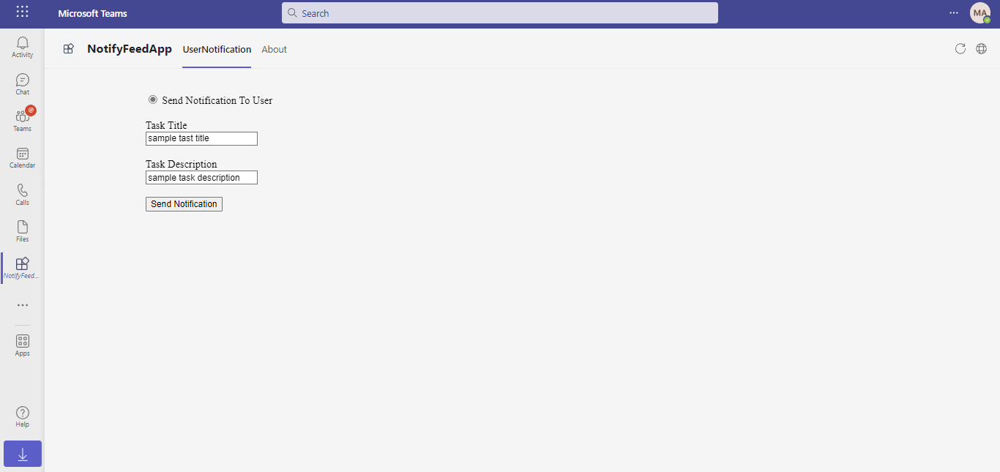
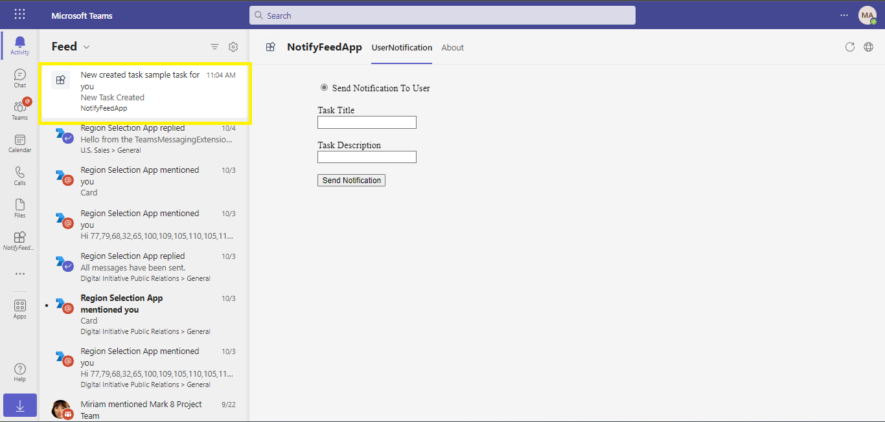

**Group Scope**
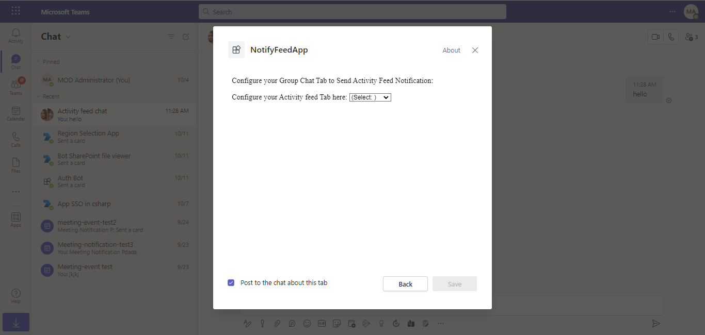
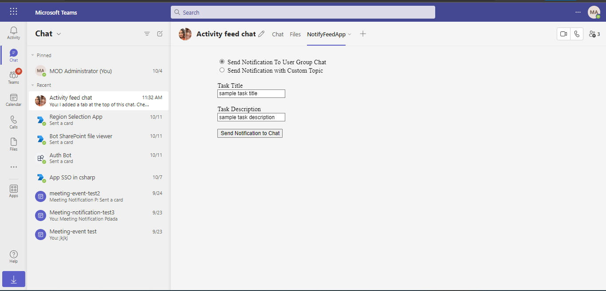
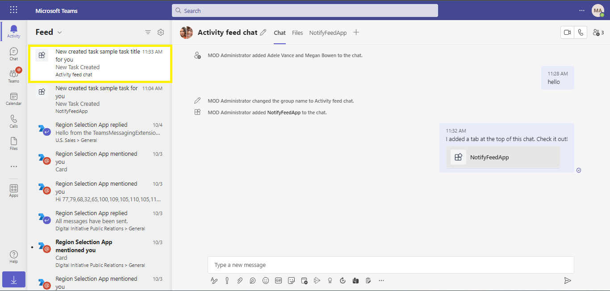
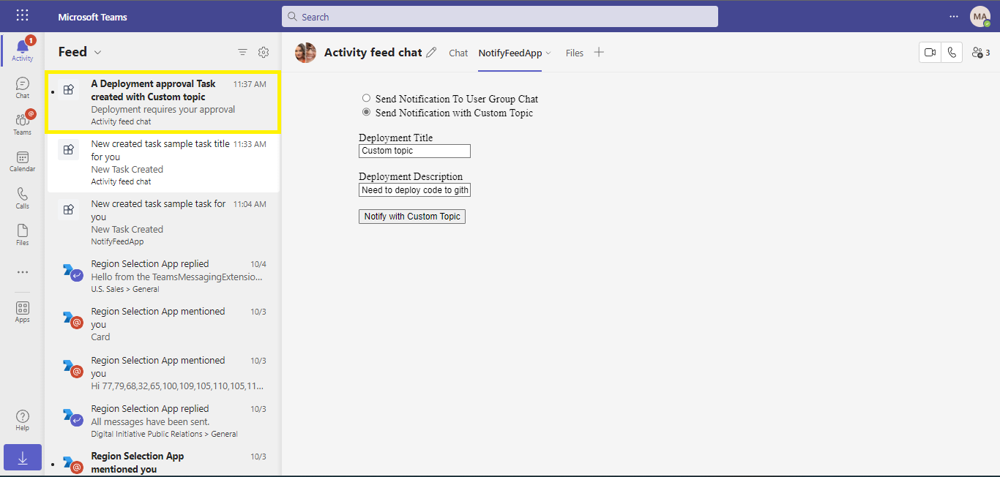

**Teams Scope**
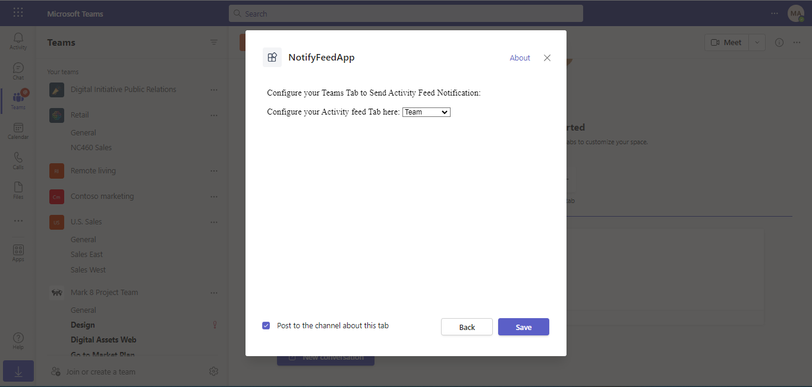
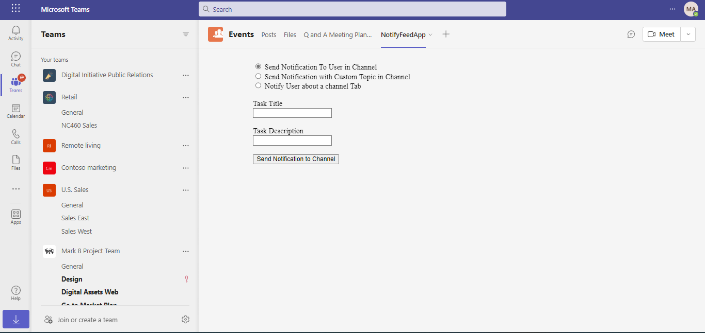
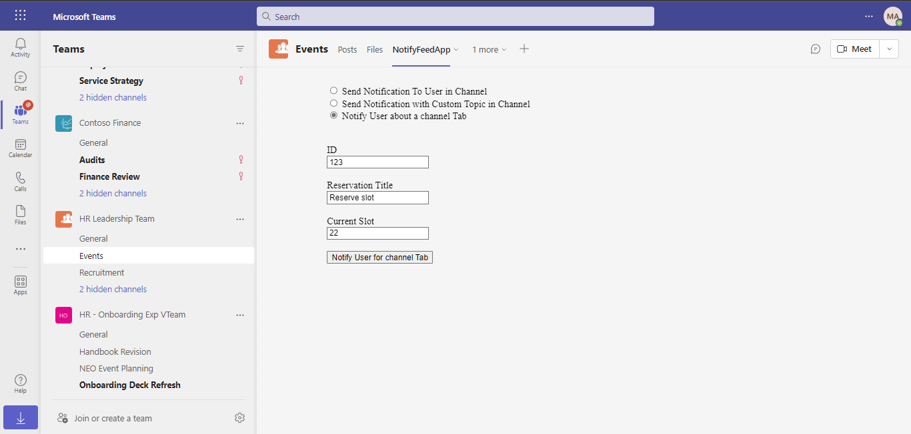
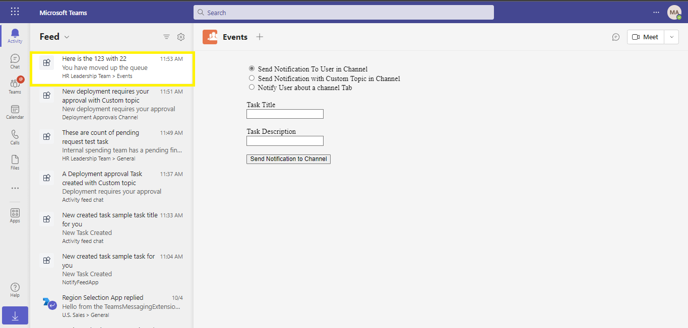


**Custom Activity Icons**

The app demonstrates a feature that allows developers to configure custom activity icons for various activities displayed in the activity feed. To test this feature, Replace UserId with the ID of the user to whom you want to send the notification in the .env file (Object Id of user from azure portal) and then install the app in personal scope, groupChat or team log in with the user from whom you want to send the notification, fill out the form, and send a notification. You will observe the activity displayed with a custom icon.


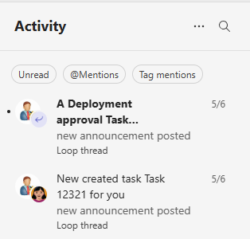

## Further reading

- [Activity Feed](https://docs.microsoft.com/en-us/graph/api/chat-sendactivitynotification?view=graph-rest-1.0&tabs=http)

