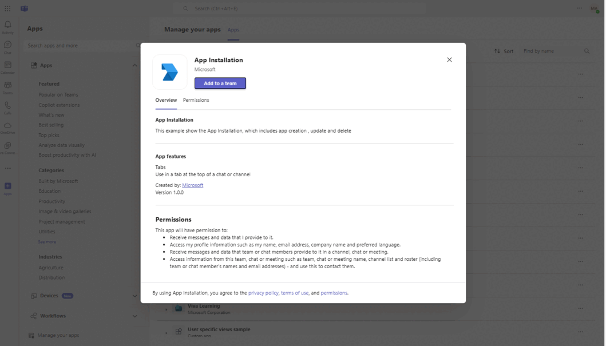
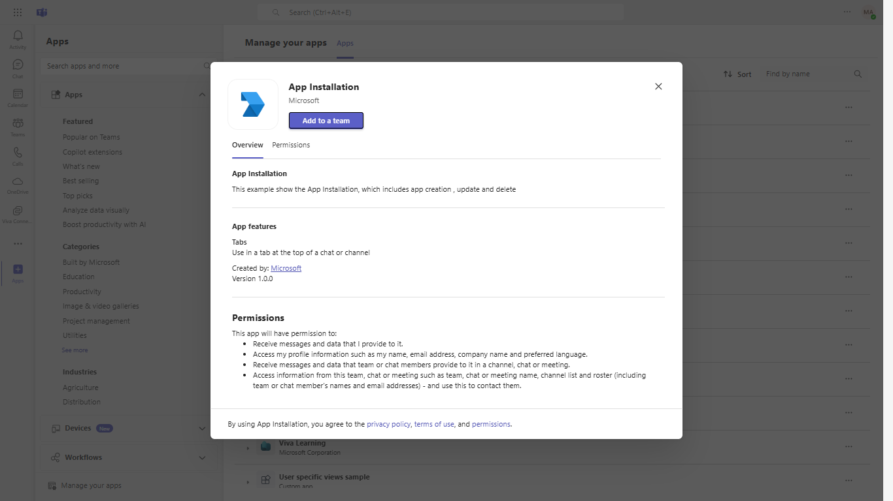
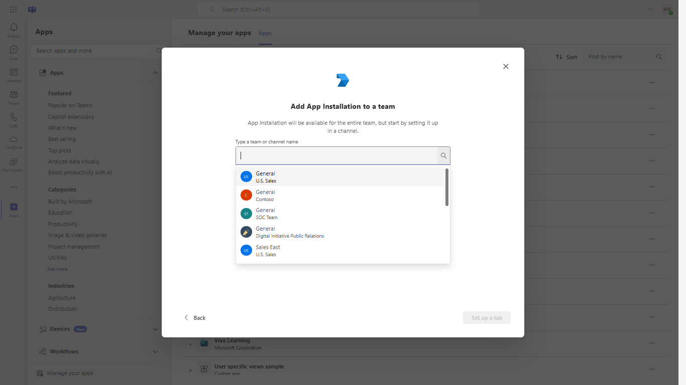
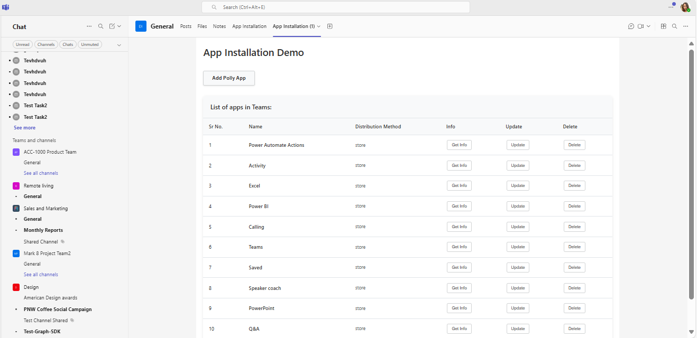
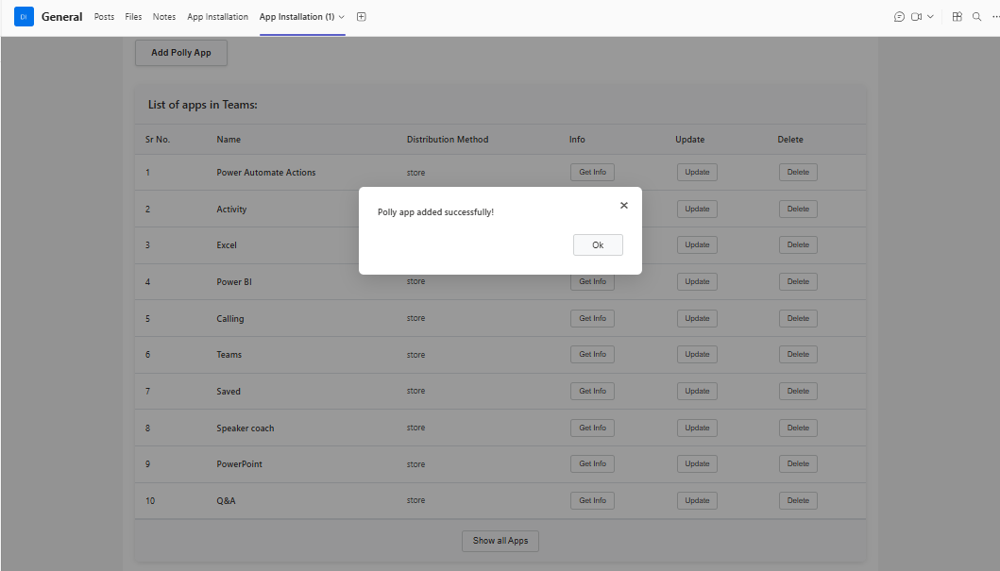
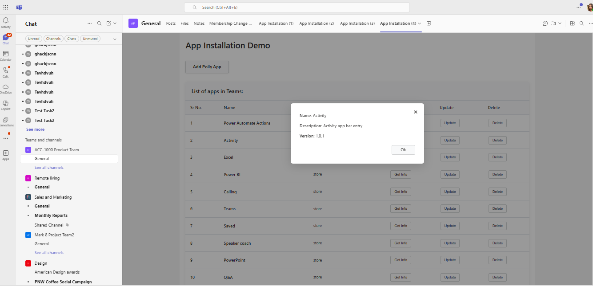
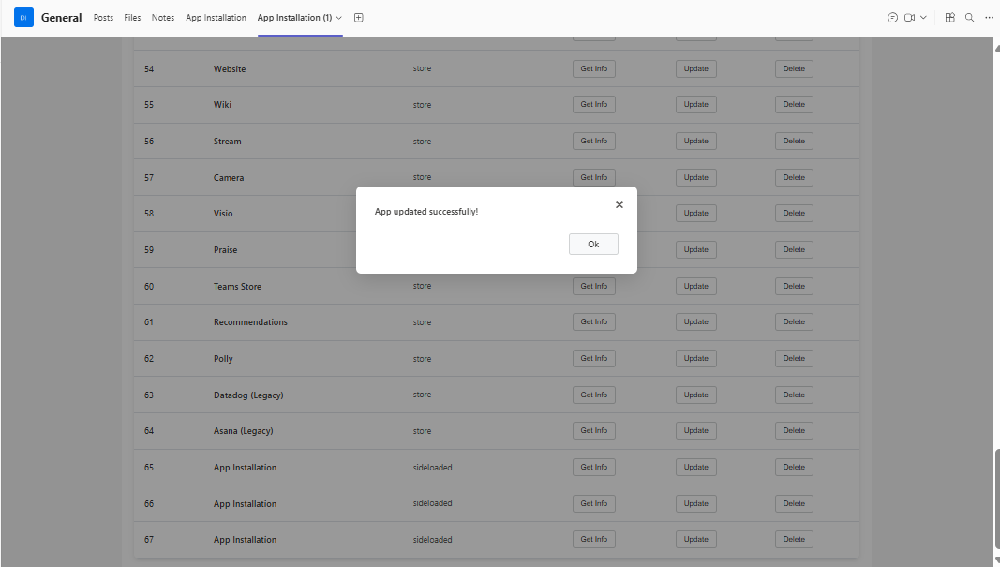

# App Installation Lifecycle - Python

This sample app demonstrates the installation lifecycle for Teams [Apps](https://docs.microsoft.com/graph/api/resources/teamsappinstallation?view=graph-rest-1.0), showcasing how to create, update, and delete apps using Microsoft Graph APIs via a Teams tab. It features interactive elements, such as tabs, and provides a guided setup for seamless integration within Microsoft Teams, offering developers a comprehensive experience in app lifecycle management.

## Included Features
* Tabs
* Graph API

## Interaction with app



## Try it yourself - experience the App in your Microsoft Teams client
Please find below demo manifest which is deployed on Microsoft Azure and you can try it yourself by uploading the app package (.zip file link below) to your teams and/or as a personal app. (Sideloading must be enabled for your tenant, [see steps here](https://docs.microsoft.com/microsoftteams/platform/concepts/build-and-test/prepare-your-o365-tenant#enable-custom-teams-apps-and-turn-on-custom-app-uploading)).

**App Installation:** [Manifest](/samples/graph-app-installation-lifecycle/python/appManifest/build/manifest.localhost.json)

## Prerequisites
- Microsoft Teams is installed and you have an account (not a guest account)
- To test locally, [Python](https://www.python.org/downloads/) must be installed on your development machine (version 3.7 or higher)
- [dev tunnel](https://learn.microsoft.com/en-us/azure/developer/dev-tunnels/get-started?tabs=windows) or [ngrok](https://ngrok.com/) latest version or equivalent tunneling solution
- [M365 developer account](https://docs.microsoft.com/microsoftteams/platform/concepts/build-and-test/prepare-your-o365-tenant) or access to a Teams account with the appropriate permissions
- [Microsoft 365 Agents Toolkit for VS Code](https://marketplace.visualstudio.com/items?itemName=TeamsDevApp.ms-teams-vscode-extension) or [TeamsFx CLI](https://learn.microsoft.com/microsoftteams/platform/toolkit/teamsfx-cli?pivots=version-one)

## Run the app (Using Microsoft 365 Agents Toolkit for Visual Studio Code)

The simplest way to run this sample in Teams is to use Microsoft 365 Agents Toolkit for Visual Studio Code.

1. Ensure you have downloaded and installed [Visual Studio Code](https://code.visualstudio.com/docs/setup/setup-overview)
2. Install the [Microsoft 365 Agents Toolkit extension](https://marketplace.visualstudio.com/items?itemName=TeamsDevApp.ms-teams-vscode-extension)
3. Select **File > Open Folder** in VS Code and choose this samples directory from the repo
4. Using the extension, sign in with your Microsoft 365 account where you have permissions to upload custom apps
5. Select **Debug > Start Debugging** or **F5** to run the app in a Teams web client.
6. In the browser that launches, select the **Add** button to install the app to Teams.

> If you do not have permission to upload custom apps (sideloading), Microsoft 365 Agents Toolkit will recommend creating and using a Microsoft 365 Developer Program account - a free program to get your own dev environment sandbox that includes Teams.

## Setup

### 1. Register a new application in the [Microsoft Entra ID – App Registrations](https://go.microsoft.com/fwlink/?linkid=2083908) portal.
  A) Select **New Registration** and on the *register an application page*, set following values:
      * Set **name** to your app name.
      * Choose the **supported account types** (any account type will work)
      * Leave **Redirect URI** empty.
      * Choose **Register**.
  B) On the overview page, copy and save the **Application (client) ID, Directory (tenant) ID**. You'll need those later when updating your Teams application manifest and in the appsettings.json.
  C) Navigate to **API Permissions**, and make sure to add the following permissions:
   Select Add a permission
      * Select Add a permission
      * Select Microsoft Graph -\> Delegated permissions.
      * `User.Read` (enabled by default)
      * Click on Add permissions. Please make sure to grant the admin consent for the required permissions.

- Your app must be registered in the Azure AD portal to integrate with the Microsoft identity platform and call Microsoft Graph APIs. See [Register an application with the Microsoft identity platform](https://docs.microsoft.com/graph/auth-register-app-v2).
- You need to add following permissions mentioned in the below screenshots to call respective Graph API:


**Required Microsoft Graph Permissions:**
- `TeamsAppInstallation.ReadWriteForChat`
- `Group.ReadWrite.All`

### 2. Setup for Bot
- In Azure portal, create a [Azure Bot resource](https://docs.microsoft.com/azure/bot-service/bot-builder-authentication?view=azure-bot-service-4.0&tabs=csharp%2Caadv2).
- Ensure that you've [enabled the Teams Channel](https://docs.microsoft.com/azure/bot-service/channel-connect-teams?view=azure-bot-service-4.0)
- While registering the bot, use `https://<your_tunnel_domain>/api/messages` as the messaging endpoint.

**NOTE:** When you create app registration, you will create an App ID and App password - make sure you keep these for later.

### 3. Setup NGROK or Dev Tunnels
- Run ngrok - point to port 3978

   ```bash
   ngrok http 3978 --host-header="localhost:3978"
   ```  

   Alternatively, you can also use the `dev tunnels`. Please follow [Create and host a dev tunnel](https://learn.microsoft.com/en-us/azure/developer/dev-tunnels/get-started?tabs=windows) and host the tunnel with anonymous user access command as shown below:

   ```bash
   devtunnel host -p 3978 --allow-anonymous
   ```

### 4. Setup for code

- Clone the repository

    ```bash
    git clone https://github.com/OfficeDev/Microsoft-Teams-Samples.git
    ```

- Navigate to the Python sample directory

    ```bash
    cd samples/graph-app-installation-lifecycle/python
    ```

- Install Python dependencies

    ```bash
    pip install -r requirements.txt
    ```

- Run your Flask app:

    ```bash
    python app.py
    ```

    Or use the provided startup scripts:

    **Windows PowerShell:**
    ```bash
    .\start-localhost.ps1
    ```

    **Windows Command Prompt:**
    ```bash
    start-localhost.bat
    ```

### 5. Setup Manifest for Teams
- **Edit** the `manifest.json` contained in the `./appManifest` folder to replace your Microsoft App Id (that was created when you registered your app registration earlier) *everywhere* you see the place holder string `{{Microsoft-App-Id}}` (depending on the scenario the Microsoft App Id may occur multiple times in the `manifest.json`)
- **Edit** the `manifest.json` for `validDomains` and replace `{{domain-name}}` with base Url of your domain. E.g. if you are using ngrok it would be `https://1234.ngrok-free.app` then your domain-name will be `1234.ngrok-free.app` and if you are using dev tunnels then your domain will be like: `12345.devtunnels.ms`.
- **For localhost testing**, use the pre-configured `appManifest/build/manifest.localhost.json` file
- **Zip** up the contents of the `appManifest` folder to create a `manifest.zip` (Make sure that zip file does not contains any subfolder otherwise you will get error while uploading your .zip package)

- Upload the manifest.zip to Teams (in the Apps view click "Upload a custom app")
   - Go to Microsoft Teams. From the lower left corner, select Apps
   - From the lower left corner, choose Upload a custom App
   - Go to your project directory, the ./appManifest folder, select the zip folder, and choose Open.
   - Select Add in the pop-up dialog box. Your app is uploaded to Teams.


## Running the sample

The application provides a comprehensive interface for managing Teams app installations:















## Further reading

- [Graph-app-installation](https://learn.microsoft.com/microsoftteams/plan-teams-lifecycle)
- [Microsoft Graph API Documentation](https://docs.microsoft.com/graph/)
- [Teams App Manifest](https://docs.microsoft.com/microsoftteams/platform/resources/schema/manifest-schema)
- [Flask Documentation](https://flask.palletsprojects.com/)
- [Microsoft Teams Developer Platform](https://docs.microsoft.com/microsoftteams/platform/)


