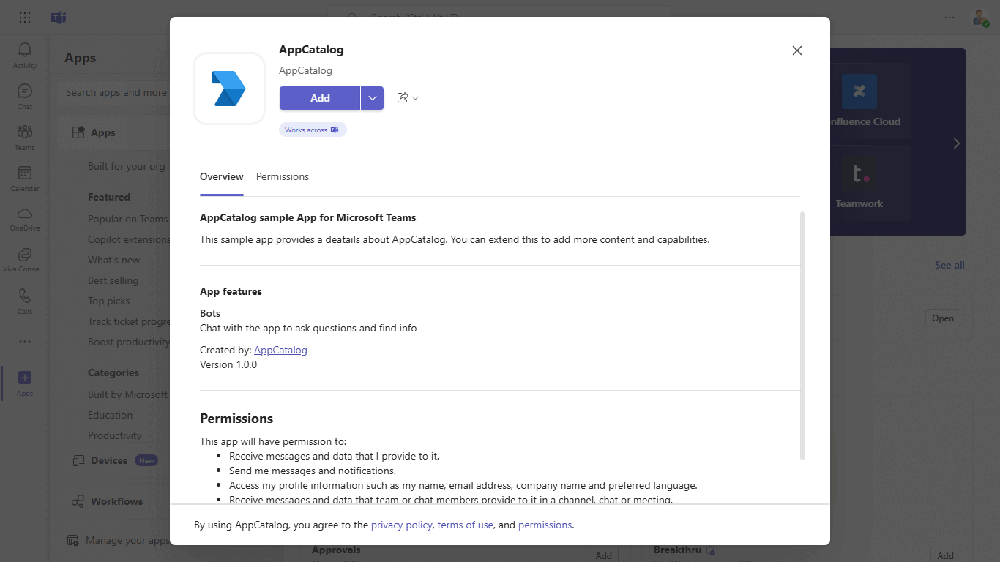
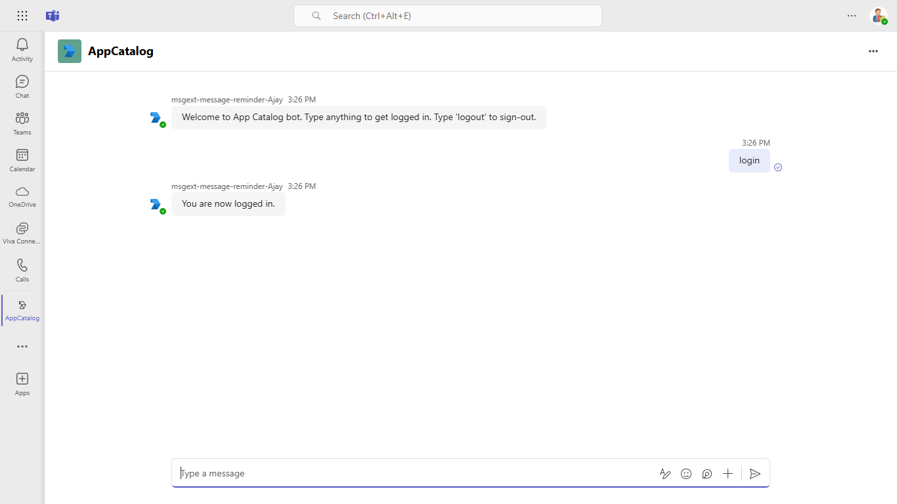
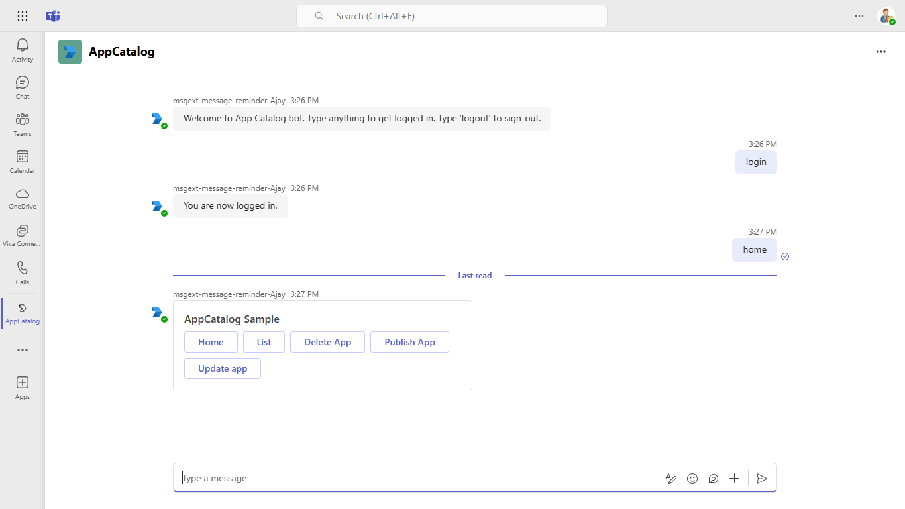
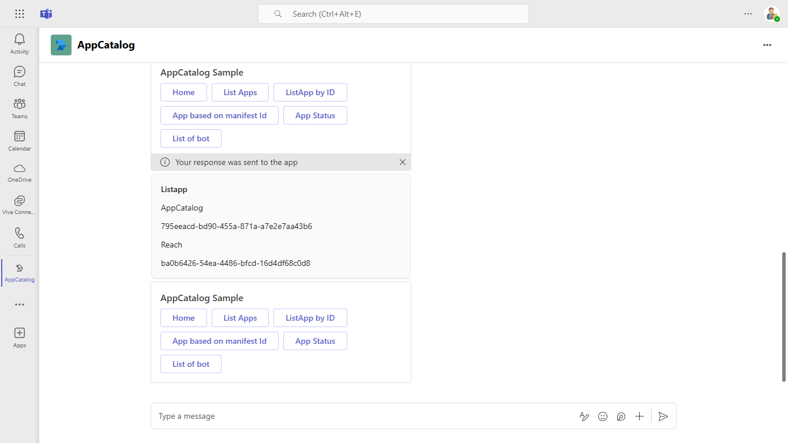
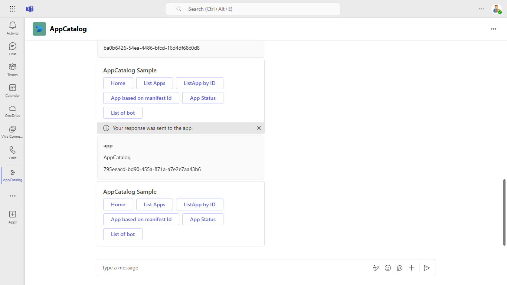
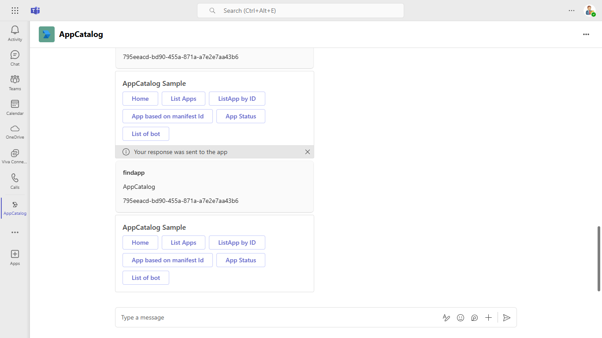
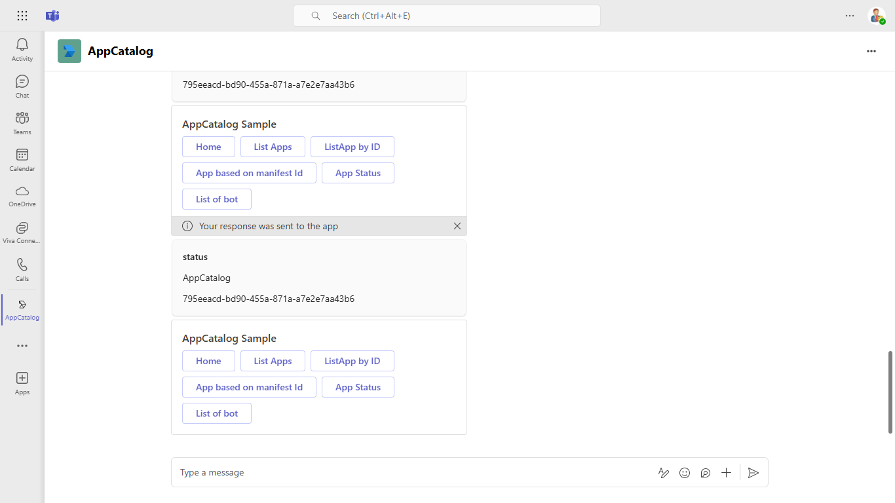
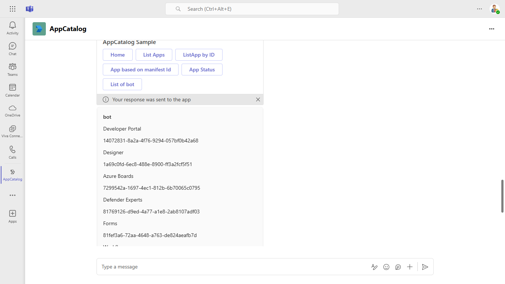

# AppCatalog sample

This sample illustrates how to manage the lifecycle of Teams apps in the app catalog programmatically using Microsoft Graph APIs through a bot. It includes features like Teams SSO, Adaptive Cards, and bot commands for publishing, updating, deleting, and listing applications, enhancing your Teams app management experience.

## Included Features
* Teams SSO (bots)
* Adaptive Cards
* Graph API

## Interaction with bot


## Try it yourself - experience the App in your Microsoft Teams client
Please find below demo manifest which is deployed on Microsoft Azure and you can try it yourself by uploading the app package (.zip file link below) to your teams and/or as a personal app. (Uploading must be enabled for your tenant, [see steps here](https://docs.microsoft.com/microsoftteams/platform/concepts/build-and-test/prepare-your-o365-tenant#enable-custom-teams-apps-and-turn-on-custom-app-uploading)).

**Microsoft Teams graph appcatalog lifecycle sample app:** [Manifest](/samples/graph-appcatalog-lifecycle/csharp/demo-manifest/graph-appcatalog-lifecycle.zip)

## Prerequisites
- Microsoft Teams is installed and you have an account
- [NodeJS](https://nodejs.org/en/)
- [dev tunnel](https://learn.microsoft.com/en-us/azure/developer/dev-tunnels/get-started?tabs=windows) or [ngrok](https://ngrok.com/) latest version or equivalent tunnelling solution
- [Microsoft 365 Agents Toolkit for VS Code](https://marketplace.visualstudio.com/items?itemName=TeamsDevApp.ms-teams-vscode-extension) or [TeamsFx CLI](https://learn.microsoft.com/microsoftteams/platform/toolkit/teamsfx-cli?pivots=version-one)

## Run the app (Using Microsoft 365 Agents Toolkit for Visual Studio Code)

The simplest way to run this sample in Teams is to use Microsoft 365 Agents Toolkit for Visual Studio Code.

1. Ensure you have downloaded and installed [Visual Studio Code](https://code.visualstudio.com/docs/setup/setup-overview)
1. Install the [Microsoft 365 Agents Toolkit extension](https://marketplace.visualstudio.com/items?itemName=TeamsDevApp.ms-teams-vscode-extension)
1. Select **File > Open Folder** in VS Code and choose this samples directory from the repo
1. Using the extension, sign in with your Microsoft 365 account where you have permissions to upload custom apps
1. Select **Debug > Start Debugging** or **F5** to run the app in a Teams web client.
1. In the browser that launches, select the **Add** button to install the app to Teams.

> If you do not have permission to upload custom apps (uploading), Microsoft 365 Agents Toolkit will recommend creating and using a Microsoft 365 Developer Program account - a free program to get your own dev environment sandbox that includes Teams.

## Setup
> Note these instructions are for running the sample on your local machine, the tunnelling solution is required because
the Teams service needs to call into the bot.

### Register your app with Azure AD.

  1. Register a new application in the [Microsoft Entra ID – App Registrations](https://go.microsoft.com/fwlink/?linkid=2083908) portal.
  2. Select **New Registration** and on the *register an application page*, set following values:
      * Set **name** to your app name.
      * Choose the **supported account types** (any account type will work)
      * Leave **Redirect URI** empty.
      * Choose **Register**.
  3. On the overview page, copy and save the **Application (client) ID, Directory (tenant) ID**. You'll need those later when updating your Teams application manifest and in the appsettings.json.
  4. Navigate to **API Permissions**, and make sure to add the follow permissions:
   Select Add a permission
      * Select Add a permission
      * Select Microsoft Graph -\> Delegated permissions.
      * `User.Read` (enabled by default)
      * Click on Add permissions. Please make sure to grant the admin consent for the required permissions.

1) Clone the repository

    ```bash
    git clone https://github.com/OfficeDev/Microsoft-Teams-Samples.git
    ```

2) In a terminal, navigate to `samples/graph-app-installation-lifecycle/nodejs` 
3)  Install modules

    ```bash
    npm install
    ```
4) Run ngrok - point to port 3978

   ```bash
   ngrok http 3978 --host-header="localhost:3978"
   ```  

   Alternatively, you can also use the `dev tunnels`. Please follow [Create and host a dev tunnel](https://learn.microsoft.com/en-us/azure/developer/dev-tunnels/get-started?tabs=windows) and host the tunnel with anonymous user access command as shown below:

   ```bash
   devtunnel host -p 3978 --allow-anonymous
   ```

5) Update the `.env` configuration with the ```ClientId``` and ```ClientSecret```

6) Run your bot at the command line

    ```bash
    npm start
    ```
 
## Register Azure AD application
Register one Azure AD application in your tenant's directory for the bot and tab app authentication.

1.  Log in to the Azure portal from your subscription, and go to the "App registrations" blade  [here](https://portal.azure.com/#blade/Microsoft_AAD_IAM/ActiveDirectoryMenuBlade/RegisteredApps). Ensure that you use a tenant where admin consent for API permissions can be provided.

2.  Click on "New registration", and create an Azure AD application.

3.  **Name:**  The name of your Teams app - if you are following the template for a default deployment, we recommend "App catalog lifecycle".

4.  **Supported account types:**  Select "Accounts in any organizational directory"

5.  Leave the "Redirect URL" field blank.   

6.  Click on the "Register" button.

7.  When the app is registered, you'll be taken to the app's "Overview" page. Copy the  **Application (client) ID**; we will need it later. Verify that the "Supported account types" is set to **Multiple organizations**.

8.  On the side rail in the Manage section, navigate to the "Certificates & secrets" section. In the Client secrets section, click on "+ New client secret". Add a description for the secret and select Expires as "Never". Click "Add".

9.  Once the client secret is created, copy its **Value**, please take a note of the secret as it will be required later.


At this point you have 3 unique values:
-   Application (client) ID which will be later used during Azure bot creation
-   Client secret for the bot which will be later used during Azure bot creation
-   Directory (tenant) ID


We recommend that you copy these values into a text file, using an application like Notepad. We will need these values later.

10.  Under left menu, select  **Authentication**  under  **Manage**  section.

11. Select 'Accounts in any organizational directory (Any Azure AD directory - Multitenant)' under Supported account types and click "+Add a platform".

12.  On the flyout menu, Select "Web"    

13.  Add  `https://token.botframework.com/.auth/web/redirect`  under Redirect URLs and click Configure button. 

14.  Once the flyout menu close, scroll bottom to section 'Implicit Grant' and select check boxes "Access tokens" and "ID tokens" and click "Save" at the top bar.

15.  Under left menu, navigate to **API Permissions**, and make sure to add the following permissions of Microsoft Graph API > Delegated permissions:
-   AppCatalog.ReadWrite.All
-  AppCatalog.Submit

Click on Add Permissions to commit your changes.

16.  If you are logged in as the Global Administrator, click on the "Grant admin consent for <%tenant-name%>" button to grant admin consent else, inform your admin to do the same through the portal or follow the steps provided here to create a link and send it to your admin for consent.
    
17.  Global Administrator can grant consent using following link:  [https://login.microsoftonline.com/common/adminconsent?client_id=](https://login.microsoftonline.com/common/adminconsent?client_id=)<%appId%> 

## Setup Bot Service

1. In Azure portal, create a [Azure Bot resource](https://docs.microsoft.com/en-us/azure/bot-service/bot-service-quickstart-registration)
2. Select Type of App as "Multi Tenant"
3.  Select Creation type as "Use existing app registration"
4. Use the copied App Id and Client secret from above step and fill in App Id and App secret respectively.
5. Click on 'Create' on the Azure bot.   
6. Go to the created resource, ensure that you've [enabled the Teams Channel](https://learn.microsoft.com/en-us/azure/bot-service/channel-connect-teams?view=azure-bot-service-4.0)
7. In Settings/Configuration/Messaging endpoint, enter the current `https` URL you have given by running the tunnelling application. Append with the path `/api/messages`

### Instruction on setting connection string for bot authentication on the behalf of user:
1. In the Azure portal, select your resource group from the dashboard.

2. Select your Azure Bot registration link.

3. Open the resource page and select Configuration under Settings.

4. Select Add OAuth Connection Settings.

5. Complete the form as follows:

    In the Azure Portal, navigate back to the Azure Bot resource created in Step 2
   
    
- Switch to the "Settings" blade
   - In Configuration/Messaging endpoint, enter the current `https` URL you were given by running the tunnelling application. Append with the path `/api/messages`
 
   - On the configuration page, click on `sAdd Oauth Connection Settings`.
    

- Fill out the Connection Setting form

    - Enter a name for your new Connection setting. This will be the name that gets referenced inside the settings of your bot service code in step 5

    - In the Service Provider dropdown, select Azure Active Directory V2

    - Enter in the client id and client secret obtained in step 1.1 and 1.2

    - For the Token Exchange URL keep the field blank

    - Specify "common" as the Tenant ID

    - Scopes: Add these Scopes "AppCatalog.Submit, AppCatalog.Read.All,  AppCatalog.ReadWrite.All"

    - Click "Save"

    

### Configuring the sample:

1) Update the `appsettings.json` configuration for the bot to use the MicrosoftAppId, MicrosoftAppPassword, MicrosoftAppTenantId generated in 'App Registration' Stage. (Note that 'App Password' is referred to as the 'client secret' in the azure portal and you can always create a new client secret anytime.)
2) Also, set MicrosoftAppType in the `appsettings.json`. (**Allowed values are: MultiTenant(default), SingleTenant, UserAssignedMSI**)
3) Update the `ConnectionName`  as given while setting connection string for bot authentication. 
4) __*This step is specific to Teams.*__
    - **Edit** the `manifest.json` contained in the  `appManifest` folder to replace your Microsoft App Id (that was created when you registered your bot earlier) *everywhere* you see the place holder string `<<YOUR-MICROSOFT-APP-ID>>` (depending on the scenario the Microsoft App Id may occur multiple times in the `manifest.json`)
    - **Edit** the `manifest.json` for `validDomains` with base Url domain. E.g. if you are using ngrok it would be `https://1234.ngrok-free.app` then your domain-name will be `1234.ngrok-free.app` and if you are using dev tunnels then your domain will be like: `12345.devtunnels.ms`.
    - **Zip** up the contents of the `appManifest` folder to create a `manifest.zip` (Make sure that zip file does not contains any subfolder otherwise you will get error while uploading your .zip package)
    - **Upload** the `manifest.zip` to Teams (In Teams Apps/Manage your apps click "Upload an app to your org's app catalog". Browse to and Open the .zip file. At the next dialog, click the Add button.)
    - Add the app to personal scope (Supported scope)

**Note**: If you are facing any issue in your app, please uncomment [this](https://github.com/OfficeDev/Microsoft-Teams-Samples/blob/main/samples/graph-appcatalog-lifecycle/nodejs/index.js#L45) line and put your debugger for local debug.

## Running the sample

- Welcome card along with commands.



- Publish app to catalog
type "publish" and upload the mainfest.zip of the teamsApp and app uploaded to appcatalog
- Update app in catalog
type "update" and upload the mainfest.zip of the teamsApp and app updated to appcatalog against of the app id
- Delete app from catalog
- List all applications specific to the tenant : type "listapp" in chat and get all the app available in the same tenant.

- List applications with a given ID : type "app" in the chat and get details of app according to their appId.

- Find application based on the Teams app manifest ID :  type "findapp" in the chat and get details of app according to their manifest Id.

- List applications with a given ID, and return the submission review state: type "status" in the chat and get details of app either published or not.

- List the details of only those apps in the catalog that contain a bot: type "bot" in the chat and get details of available bot in app catalog.


 ## Deploy the bot to Azure

To learn more about deploying a bot to Azure, see [Deploy your bot to Azure](https://aka.ms/azuredeployment) for a complete list of deployment instructions.

## Further reading

- [Bot Framework Documentation](https://docs.botframework.com)
- [Bot Basics](https://docs.microsoft.com/azure/bot-service/bot-builder-basics?view=azure-bot-service-4.0)
- [Bot Authentication](https://docs.microsoft.com/en-us/azure/bot-service/bot-builder-authentication?view=azure-bot-service-4.0&tabs=aadv2%2Ccsharp)
- [App in Catalog](https://docs.microsoft.com/en-us/graph/api/resources/teamsapp?view=graph-rest-1.0)

