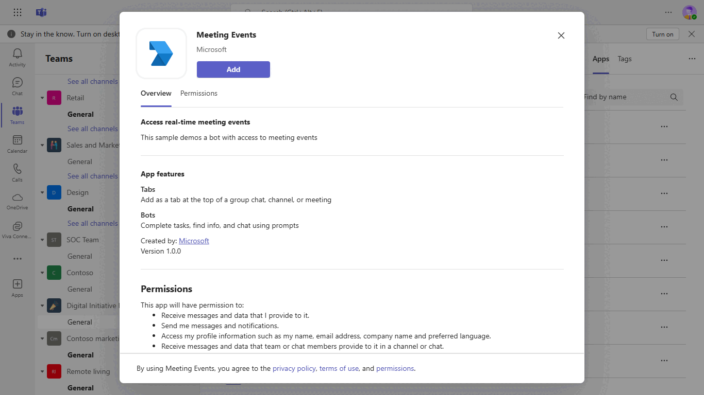
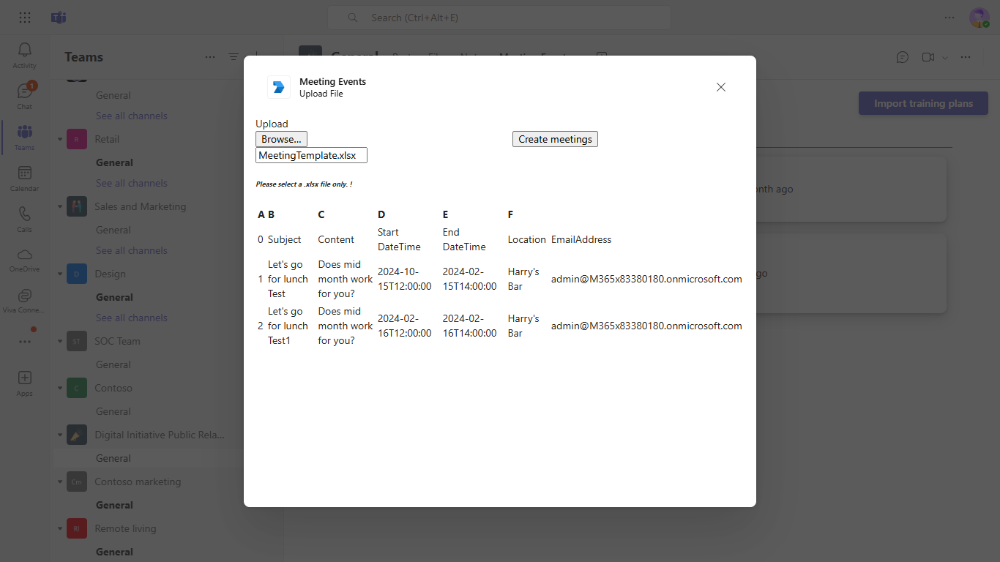
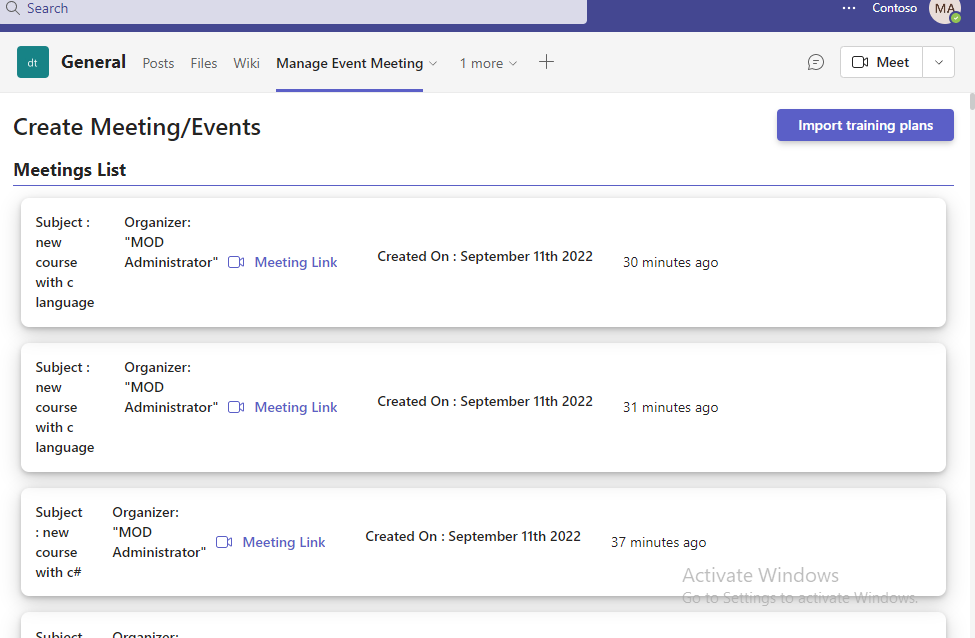
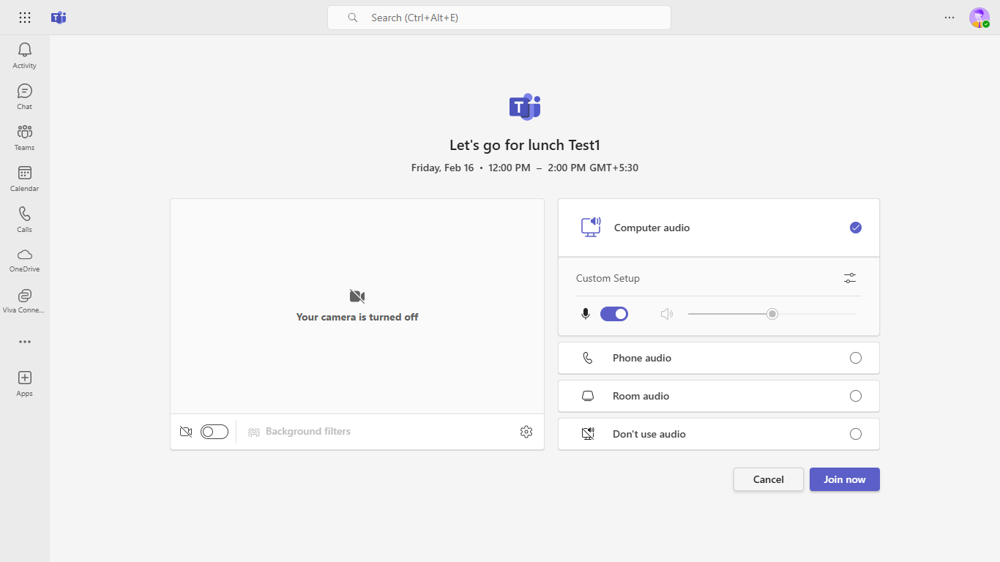

# Graph bulk meetings

This sample application allows users to efficiently create multiple meetings in Microsoft Teams calendars by uploading an Excel sheet. It utilizes the Graph API, provides a user-friendly tab interface for interaction, and includes comprehensive setup instructions for Microsoft Entra ID app registration and bot configuration.

## Included Features
* Tabs
* Graph API

## Interact with app



## Prerequisites

- Microsoft Teams is installed and you have an account (not a guest account)
-  .[NET 6.0](https://dotnet.microsoft.com/en-us/download) SDK.
    ```bash
        # determine dotnet version
        dotnet --version```

-  [dev tunnel](https://learn.microsoft.com/en-us/azure/developer/dev-tunnels/get-started?tabs=windows) or [ngrok](https://ngrok.com/download) latest version or equivalent tunneling solution
-  [M365 developer account](https://docs.microsoft.com/en-us/microsoftteams/platform/concepts/build-and-test/prepare-your-o365-tenant) or access to a Teams account with the appropriate permissions to install an app.
-  [Microsoft 365 Agents Toolkit for Visual Studio](https://learn.microsoft.com/en-us/microsoftteams/platform/toolkit/toolkit-v4/install-teams-toolkit-vs?pivots=visual-studio-v17-7)

### Register your app with Azure AD.

  1. Register a new application in the [Microsoft Entra ID – App Registrations](https://go.microsoft.com/fwlink/?linkid=2083908) portal.
  2. Select **New Registration** and on the *register an application page*, set following values:
      * Set **name** to your app name.
      * Choose the **supported account types** (any account type will work)
      * Leave **Redirect URI** empty.
      * Choose **Register**.
  3. On the overview page, copy and save the **Application (client) ID, Directory (tenant) ID**. You'll need those later when updating your Teams application manifest and in the appsettings.json.
  4. Navigate to **API Permissions**, and make sure to add the follow permissions:
   Select Add a permission
      * Select Add a permission
      * Select Microsoft Graph -\> Delegated permissions.
      * `User.Read` (enabled by default)
      * Click on Add permissions. Please make sure to grant the admin consent for the required permissions.


## Run the app (Using Microsoft 365 Agents Toolkit for Visual Studio)

The simplest way to run this sample in Teams is to use Microsoft 365 Agents Toolkit for Visual Studio.
1. Install Visual Studio 2022 **Version 17.14 or higher** [Visual Studio](https://visualstudio.microsoft.com/downloads/)
1. Install Microsoft 365 Agents Toolkit for Visual Studio [Microsoft 365 Agents Toolkit extension](https://learn.microsoft.com/en-us/microsoftteams/platform/toolkit/toolkit-v4/install-teams-toolkit-vs?pivots=visual-studio-v17-7)
1. In the debug dropdown menu of Visual Studio, select Dev Tunnels > Create A Tunnel (set authentication type to Public) or select an existing public dev tunnel.
1. In the debug dropdown menu of Visual Studio, select default startup project > **Microsoft Teams (browser)**
1. Right-click the 'M365Agent' project in Solution Explorer and select **Microsoft 365 Agents Toolkit > Select Microsoft 365 Account**
1. Sign in to Microsoft 365 Agents Toolkit with a **Microsoft 365 work or school account**
1. Set `Startup Item` as `Microsoft Teams (browser)`.
1. Press F5, or select Debug > Start Debugging menu in Visual Studio to start your app
    </br>
1. In the opened web browser, select Add button to install the app in Teams
> If you do not have permission to upload custom apps (uploading), Microsoft 365 Agents Toolkit will recommend creating and using a Microsoft 365 Developer Program account - a free program to get your own dev environment sandbox that includes Teams.

## Setup

Note these instructions are for running the sample on your local machine, the tunnelling solution is required because the Teams service needs to call into the bot.

1) Run ngrok - point to port 3978

   ```bash
   ngrok http 3978 --host-header="localhost:3978"
   ```  

   Alternatively, you can also use the `dev tunnels`. Please follow [Create and host a dev tunnel](https://learn.microsoft.com/en-us/azure/developer/dev-tunnels/get-started?tabs=windows) and host the tunnel with anonymous user access command as shown below:

   ```bash
   devtunnel host -p 3978 --allow-anonymous
   ```


1) Setup for Microsoft Entra ID app registration
    In Azure portal, create a Microsoft Entra ID app registration
        - Navigate to **API Permissions**, and make sure to add the below permissions:
        - Select Add a permission, select Microsoft Graph -> Application permissions.
            - `Calendars.ReadWrite`
            - `Calendars.Read`

        - Click on Add permissions. Please make sure to grant the admin consent for the required permissions.

    Navigate to the **Certificates & secrets**. In the Client secrets section, click on "+ New client secret". Add a description (Name of the secret) for the secret and select “Never” for Expires. Click "Add". Once the client secret is created, copy its value, it need to be placed in the appsettings.json file.

1) Setup for Bot
   In Azure portal, create a [Azure Bot resource](https://docs.microsoft.com/en-us/azure/bot-service/bot-service-quickstart-registration).
    - For bot handle, make up a name.
    - Select "Use existing app registration" (Create the app registration in Microsoft Entra ID beforehand.)
    - __*If you don't have an Azure account*__ create an [Azure free account here](https://azure.microsoft.com/en-us/free/)
    
   In the new Azure Bot resource in the Portal, 
    - Ensure that you've [enabled the Teams Channel](https://learn.microsoft.com/en-us/azure/bot-service/channel-connect-teams?view=azure-bot-service-4.0)
    - In Settings/Configuration/Messaging endpoint, enter the current `https` URL you were given by running the tunnelling application. Append with the path `/api/messages`

1) Clone the repository
   ```bash
   git clone https://github.com/OfficeDev/Microsoft-Teams-Samples.git
   ```

1) Launch Visual Studio
   - File -> Open -> Project/Solution
   - Navigate to folder where repository is cloned and then open this file `samples/EventMeeting/csharp/EventMeeting.sln`

1) Setup and run the bot from Visual Studio:
Modify the `appsettings.json` file with the following details:
    - Update configuration with the ```MicrosoftAppId```, ```MicrosoftAppPassword``` and ```MicrosoftAppTenantId``` values received while doing Microsoft Entra ID app registration in your Azure portal.
    - Press `F5` to run the project

1) Modify the `manifest.json` in the `/appPackage` folder 
Replace the following details:
    - `{{AAD_APP_CLIENT_ID}}` with your MicrosoftAppId received after doing Microsoft Entra ID app registration in your Azure portal.
    - `{{BOT_DOMAIN}}` with base Url domain. E.g. if you are using ngrok it would be `https://1234.ngrok-free.app` then your domain-name will be `1234.ngrok-free.app` and if you are using dev tunnels then your domain will be like: `12345.devtunnels.ms`.
    - **Zip** up the contents of the `appPackage` folder to create a `manifest.zip`
    - **Upload** the `manifest.zip` to Teams (in the Apps view click "Upload a custom app")

## Running the sample

1. Imported Meetings view from the excel sheet.
  

2. Dashborad of the Meetings Here is the all created meetings list.
   

3. Created Meeting view in teams.
   

## Deploy the bot to Azure
To learn more about deploying a bot to Azure, see [Deploy your bot to Azure](https://aka.ms/azuredeployment) for a complete list of deployment instructions.

## Further reading
- [Event resource type](https://docs.microsoft.com/en-us/graph/api/resources/event?view=graph-rest-1.0)


