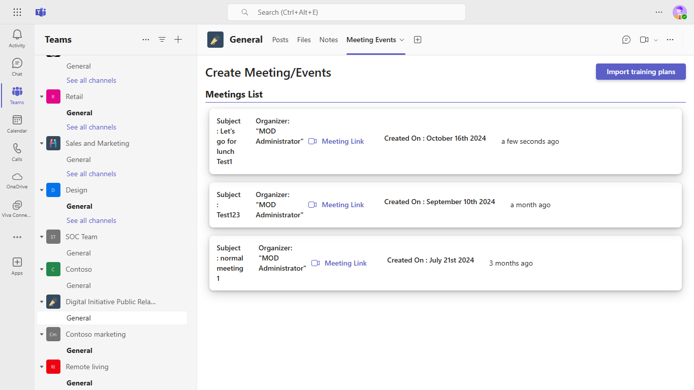

# Graph bulk meetings

This is a sample application which demonstrates how to create meeting in bulk on Teams calendar use to create meeting to upload excel sheet.

## Included Features
* Tabs
* Graph API

## Interact with app


## Prerequisites

- Microsoft Teams is installed and you have an account (not a guest account)
-  .[NET 6.0](https://dotnet.microsoft.com/en-us/download) SDK.
    ```bash
        # determine dotnet version
        dotnet --version```

-  [ngrok](https://ngrok.com/) or equivalent tunneling solution
-  [M365 developer account](https://docs.microsoft.com/en-us/microsoftteams/platform/concepts/build-and-test/prepare-your-o365-tenant) or access to a Teams account with the appropriate permissions to install an app.

## Setup

Note these instructions are for running the sample on your local machine, the tunnelling solution is required because the Teams service needs to call into the bot.

1) Run ngrok - point to port 3978

    ```bash
    ngrok http 3978 --host-header="localhost:3978"
    ```


1) Setup for AAD app registration
    In Azure portal, create a AAD app registration
        - Navigate to **API Permissions**, and make sure to add the below permissions:
        - Select Add a permission, select Microsoft Graph -> Application permissions.
            - `Calendars.ReadWrite`
            - `Calendars.Read`

        - Click on Add permissions. Please make sure to grant the admin consent for the required permissions.

    Navigate to the **Certificates & secrets**. In the Client secrets section, click on "+ New client secret". Add a description (Name of the secret) for the secret and select “Never” for Expires. Click "Add". Once the client secret is created, copy its value, it need to be placed in the appsettings.json file.

1) Setup for Bot
   In Azure portal, create a [Azure Bot resource](https://docs.microsoft.com/en-us/azure/bot-service/bot-service-quickstart-registration).
    - For bot handle, make up a name.
    - Select "Use existing app registration" (Create the app registration in Azure Active Directory beforehand.)
    - __*If you don't have an Azure account*__ create an [Azure free account here](https://azure.microsoft.com/en-us/free/)
    
   In the new Azure Bot resource in the Portal, 
    - Ensure that you've [enabled the Teams Channel](https://learn.microsoft.com/en-us/azure/bot-service/channel-connect-teams?view=azure-bot-service-4.0)
    - In Settings/Configuration/Messaging endpoint, enter the current `https` URL you were given by running ngrok. Append with the path `/api/messages`

1) Clone the repository
   ```bash
   git clone https://github.com/OfficeDev/Microsoft-Teams-Samples.git
   ```

1) Launch Visual Studio
   - File -> Open -> Project/Solution
   - Navigate to folder where repository is cloned and then open this file `samples/EventMeeting/csharp/EventMeeting.sln`

1) Setup and run the bot from Visual Studio:
Modify the `appsettings.json` file with the following details:
    - Update configuration with the ```MicrosoftAppId```, ```MicrosoftAppPassword``` and ```MicrosoftAppTenantId``` values received while doing AAD app registration in your Azure portal.
    - Press `F5` to run the project

1) Modify the `manifest.json` in the `/Manifest` folder 
Replace the following details:
    - `<<Your Microsoft App Id>>` with your MicrosoftAppId received after doing AAD app registration in your Azure portal.
    - `{{BASE-URL}}` with base Url domain. E.g. if you are using ngrok it would be `https://1234.ngrok-free.app` then your domain-name will be `1234.ngrok-free.app`.
    - **Zip** up the contents of the `Manifest` folder to create a `manifest.zip`
    - **Upload** the `manifest.zip` to Teams (in the Apps view click "Upload a custom app")

## Running the sample

1. Imported Meetings view from the excel sheet.
  

2. Dashborad of the Meetings Here is the all created meetings list.
   

3. Created Meeting view in teams.
   

## Deploy the bot to Azure
To learn more about deploying a bot to Azure, see [Deploy your bot to Azure](https://aka.ms/azuredeployment) for a complete list of deployment instructions.

## Further reading
- [Event resource type](https://docs.microsoft.com/en-us/graph/api/resources/event?view=graph-rest-1.0)


