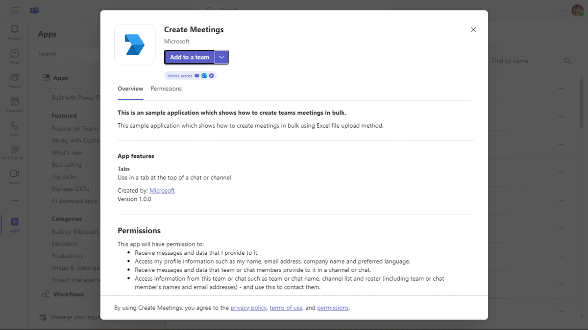

# Graph bulk meetings

This is an sample application which shows how to create teams meetings in bulk using file upload method.

## Included Features
* Tabs
* Graph API

## Interaction with app



## Prerequisites

- Microsoft Teams is installed and you have an account (not a guest account)
-  [NodeJS](https://nodejs.org/en/)

## Setup

### Register your application with Azure AD

1. Register a new application in the [Azure Active Directory – App Registrations](https://go.microsoft.com/fwlink/?linkid=2083908) portal.
  - On the overview page, copy and save the **Application (client) ID, Directory (tenant) ID**. You’ll need those later when updating your Teams application manifest and in the appsettings.json.
  - Navigate to **API Permissions**, and make sure to add the follow permissions:
  - Select Add a permission
  - Select Microsoft Graph -> Application permissions.
   - `Calendars.Read`,
   - `Calendars.ReadWrite.All`,
   - `OnlineMeetings.Read.All`,
   - `OnlineMeetings.ReadWrite.All`

  -  Click on Add permissions. Please make sure to grant the admin consent for the required permissions.

  -  Navigate to the **Certificates & secrets**. In the Client secrets section, click on "+ New client secret". Add a description (Name of the secret) for the secret and select “Never” for Expires. Click "Add". Once the client secret is created, copy its value, it need to be placed in the .env file.


 2. Setup for Bot
   - In Azure portal, create a [Azure Bot resource](https://docs.microsoft.com/en-us/azure/bot-service/bot-builder-authentication?view=azure-bot-service-  4.0&tabs=csharp%2Caadv2).
  - Ensure that you've [enabled the Teams Channel](https://docs.microsoft.com/en-us/azure/bot-service/channel-connect-teams?view=azure-bot-service-4.0)
  **NOTE:** When you create app registration, you will create an App ID and App password - make sure you keep these for later.

3. Setup NGROK
   - Run ngrok - point to port 3978

    ```bash
    ngrok http 3978 --host-header="localhost:3978"
    ```
4. Setup for code

  - Clone the repository

    ```bash
    git clone https://github.com/OfficeDev/Microsoft-Teams-Samples.git
    ```
  - Update the `.env` configuration for the bot to use the `App-Id`, `App-Secret` and Tenant-ID. (Note the MicrosoftAppId is the AppId created in step 1 (Setup for Bot), the MicrosoftAppPassword is referred to as the "client secret" in step 1 (Setup for Bot) and you can always create a new client secret anytime.) for the Tenant-ID is referred to as the "Directory (tenant) ID" in step 1
 
 - In a terminal, navigate to `samples/graph-bulk-meetings/nodejs`

 - Install node modules and run client 
   ```bash
    npm install
   ```

     ```bash
     npm start
    ```

    ```bash
   npm install moment --save
   ```
    
5. Setup Manifest for Teams
- __*This step is specific to Teams.*__
    - **Edit** the `manifest.json` contained in the ./Manifest folder to replace your Microsoft App Id (that was created when you registered your app registration earlier) *everywhere* you see the place holder string `{{Microsoft-App-Id}}` (depending on the scenario the Microsoft App Id may occur multiple times in the `manifest.json`)
    - **Edit** the `manifest.json` for `validDomains` and replace `{{domain-name}}` with base Url of your domain. E.g. if you are using ngrok it would be `https://1234.ngrok-free.app` then your domain-name will be `1234.ngrok-free.app`.
    - **Zip** up the contents of the `Manifest` folder to create a `manifest.zip` (Make sure that zip file does not contains any subfolder otherwise you will get error while uploading your .zip package)

- Upload the manifest.zip to Teams (in the Apps view click "Upload a custom app")
   - Go to Microsoft Teams. From the lower left corner, select Apps
   - From the lower left corner, choose Upload a custom App
   - Go to your project directory, the ./Manifest folder, select the zip folder, and choose Open.
   - Select Add in the pop-up dialog box. Your app is uploaded to Teams.

## Running the sample


## Further reading
- [Create Event](https://docs.microsoft.com/en-us/graph/api/user-post-events?view=graph-rest-1.0&tabs=javascript)


