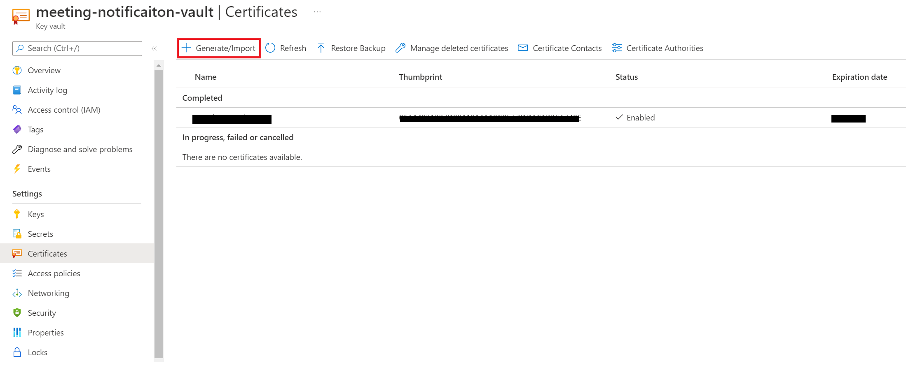
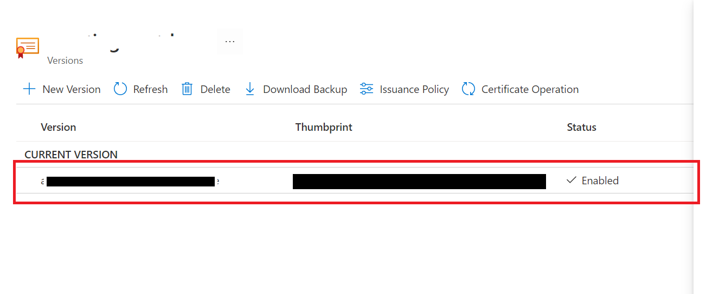
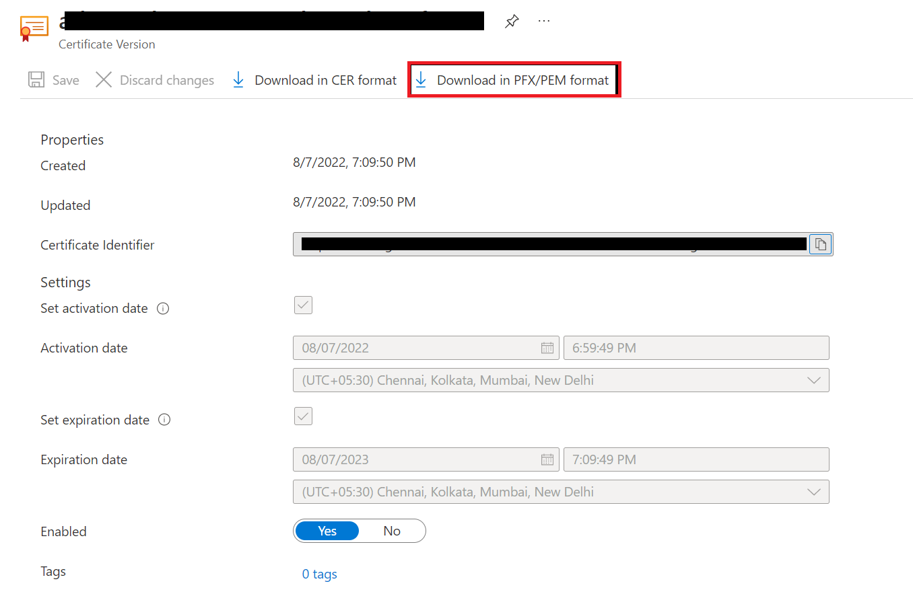
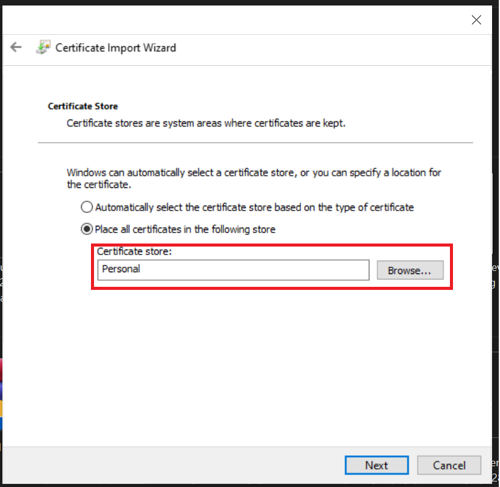
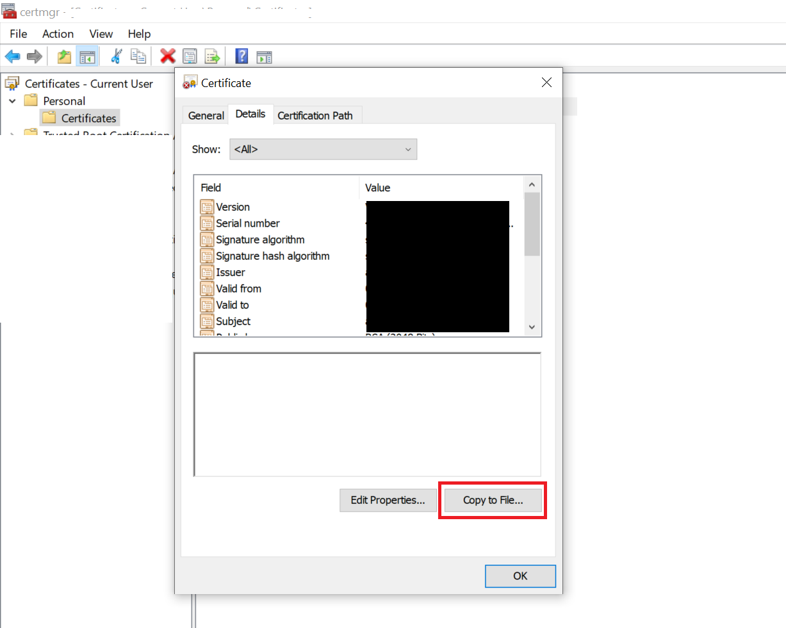

# Create and install Self-Signed certificate

## Generate certificate using Azure key vault.

1. Open [Azure key vault](https://docs.microsoft.com/en-us/azure/key-vault/key-vault-whatis) and navigate to `Certificates` section.
2. Click on `Generate/Import` button to create a certificate. 

3. Fill the required details. Make sure `Method of Certificate Creation` is **Generate**.

4. Once the certificate is created, open the certificate and copy the thumbprint. This will be the value of `CertificateThumbprint` in appsettings.json file

5. Click on *Current version of certificate*.

5. It will open a menu, click on `Download in PFX/PEM format`

## Install certificate.
Once the download is completed open the downloaded certificate. 

Click on next and ignore the password and click next again and when it ask to store certificate enter `Personal`.

Click on Finish to continue.

## Get base64 certificate string 
1. Open *Manage user certificate* from start menu.
2. Go to `Personal` -> `Certificates` and open certificate you installed.
3. Go to *Details* tab and click on `Copy to File...`

4. Click on next-next and select format as *Base-64 encoded X.509 (.CER)*.
5. Give it a path and Finish the process.
6. Right click on exported certificate and Open with notepad
7. Copy the content between `-----BEGIN CERTIFICATE-----` and `-----END CERTIFICATE-----`. This will be the value of `Base64EncodedCertificate` in appsettings.json file.
