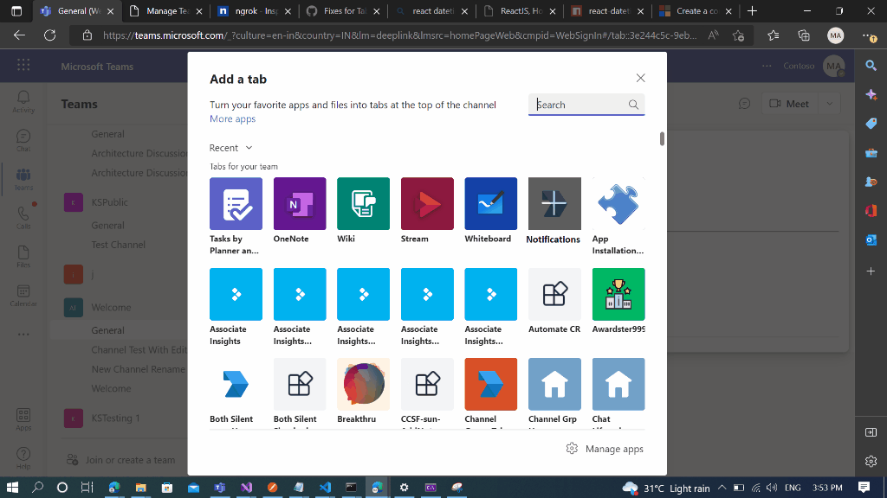
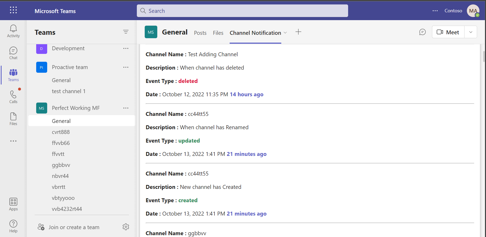
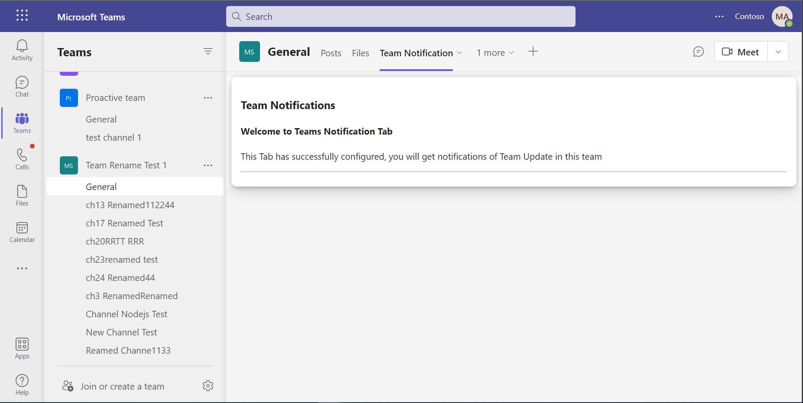
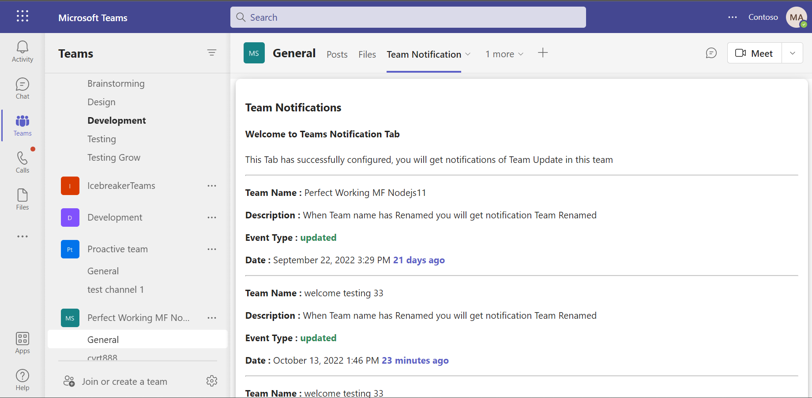

# Change Notifications For Team and Channel Using Microsoft Graph C#

This is a sample application which demonstrates use of Team/Channel subscription that will post notifications when user create/edit/delete team/channel.

## Included Features
* Tabs
* Graph API
* RSC Permissions
* Change Notifications

## Interaction with bot


## Prerequisites

- Microsoft Teams is installed and you have an account (not a guest account)
-  .[NET 6.0](https://dotnet.microsoft.com/en-us/download) SDK.
    ```bash
        # determine dotnet version
        dotnet --version
    ```
-  [ngrok](https://ngrok.com/) or equivalent tunneling solution
-  [M365 developer account](https://docs.microsoft.com/en-us/microsoftteams/platform/concepts/build-and-test/prepare-your-o365-tenant) or access to a Teams account with the appropriate permissions to install an app.

## Setup

> Note these instructions are for running the sample on your local machine.

1) Run ngrok - point to port 3978

   ```bash
     ngrok http 3978 --host-header="localhost:3978"
   ```  

2) Setup for Bot

### Register your application with Azure AD

1. Register a new application in the [Azure Active Directory [App Registrations](https://go.microsoft.com/fwlink/?linkid=2083908) portal.
2. On the overview page, copy and save the **Application (client) ID, Directory (tenant) ID**. You'll need those later when updating your Teams application manifest and in the appsettings.json.
3. Navigate to **API Permissions**, and make sure to add the follow permissions:
-   Select Add a permission
-   Select Microsoft Graph -> Application permissions.
   - `Channel.ReadBasic.All`,`ChannelSettings.Read.All`,`Directory.ReadWrite.All`,`Group.ReadWrite.All`
    `Team.ReadBasic.All`,`TeamSettings.Read.All`,`TeamSettings.ReadWrite.All`

-   Click on Add permissions. Please make sure to grant the admin consent for the required permissions.

4. Navigate to the **Certificates & secrets**. In the Client secrets section, click on "+ New client secret". Add a description (Name of the secret) for the secret and select Expiry date. Click "Add", Once the client secret is created, copy its value because it needs to be placed in the appsettings.json file.

### Create Azure bot resource

In Azure portal, create a [Azure Bot resource](https://docs.microsoft.com/en-us/azure/bot-service/bot-builder-authentication?view=azure-bot-service-4.0&tabs=csharp%2Caadv2).

- Ensure that you've [enabled the Teams Channel](https://docs.microsoft.com/en-us/azure/bot-service/channel-connect-teams?view=azure-bot-service-4.0).
- In Settings/Configuration/Messaging endpoint, enter the current `https` URL you were given by running ngrok. Append with the path `/api/messages`

### Create and install Self-Signed certificate

To include resource data of graph notifications, this Graph API require self-signed certificate. Follow the below steps to create and manage certificate.

1. You can self-sign the certificate, since Microsoft Graph does not verify the certificate issuer, and uses the public key for only encryption.

2. Use [Azure Key Vault](https://docs.microsoft.com/en-us/azure/key-vault/key-vault-whatis) as the solution to create, rotate, and securely manage certificates. Make sure the keys satisfy the following criteria:

    - The key must be of type `RSA`
    - The key size must be between 2048 and 4096 bits

3. Follow this documentation for the steps - 
[Create and install Self-Signed certificate](ChangeNotification/CertificateDocumentation/README.md)

3) Clone the repository

    ```bash
    git clone https://github.com/OfficeDev/Microsoft-Teams-Samples.git
    ```

  A) If you are using Visual Studio

  - Launch Visual Studio
  - File -> Open Folder
  - Navigate to `samples/graph-change-notification-team-channel/csharp` folder
  - Select `ChangeNotiifcation` solution file

  **Instruction for appsetting**
    1. Provide MicrosoftAppId, MicrosoftAppPassword and MicrosoftAppTenantId in the appsetting that is created in Azure.
    (Note the App Password is referred to as the "client secret" in the azure portal and you can always create a new client secret anytime.)
    2. Provide the ngrok url as  "BaseUrl" in appsetting on which application is running on.
    3. You should be having Base64EncodedCertificate and CertificateThumbprint value from *Create and install Self-Signed certificate* step.

  - Run your bot, either from Visual Studio with `F5` or using `dotnet run` in the appropriate folder.

  B) *This step is specific to Teams.*

- **Edit** the `manifest.json` contained in the  `TeamsAppManifest` folder to replace your Microsoft App Id (that was created when you registered your bot earlier) *everywhere* you see the place holder string `<<YOUR-MICROSOFT-APP-ID>>` (depending on the scenario the Microsoft App Id may occur multiple times in the `manifest.json`)

- **Edit** the `manifest.json` for `validDomains` with base Url domain. E.g. if you are using ngrok it would be `https://1234.ngrok-free.app` then your domain-name will be `1234.ngrok-free.app`.

- **Zip** up the contents of the `TeamsAppManifest` folder to create a `manifest.zip` (Make sure that zip file does not contains any subfolder otherwise you will get error while uploading your .zip package)

- **Upload** the `manifest.zip` to Teams (In Teams Apps/Manage your apps click "Upload an app". Browse to and Open the .zip file. At the next dialog, click the Add button.)

- Add the app to personal/team/groupChat scope (Supported scopes)

**Note**: If you are facing any issue in your app, please uncomment [this](https://github.com/OfficeDev/Microsoft-Teams-Samples/blob/main/samples/graph-change-notification-team-channel/csharp/ChangeNotification/AdapterWithErrorHandler.cs#L27) line and put your debugger for local debug.

## Running the sample

You can interact with Teams Tab by subscribing the teams/channel for notifications.

1. **Show Welcome - Channel** -> Welcome Message when Channel selected for subscription.


2. **Channel Notifications** -> Channel Created Update Delete Message


3. **Show Welcome - Team** -> Welcome Message when Team selected for subscription.


4. **Team Notifications** -> Team Update Edit Message



## Further reading
- [Change notifications for Microsoft Teams channel](https://docs.microsoft.com/en-us/graph/teams-changenotifications-team-and-channel)
- [Create subscription permissions for supported resource](https://docs.microsoft.com/en-us/graph/api/subscription-post-subscriptions?view=graph-rest-1.0&tabs=http#team-channel-and-chat)


