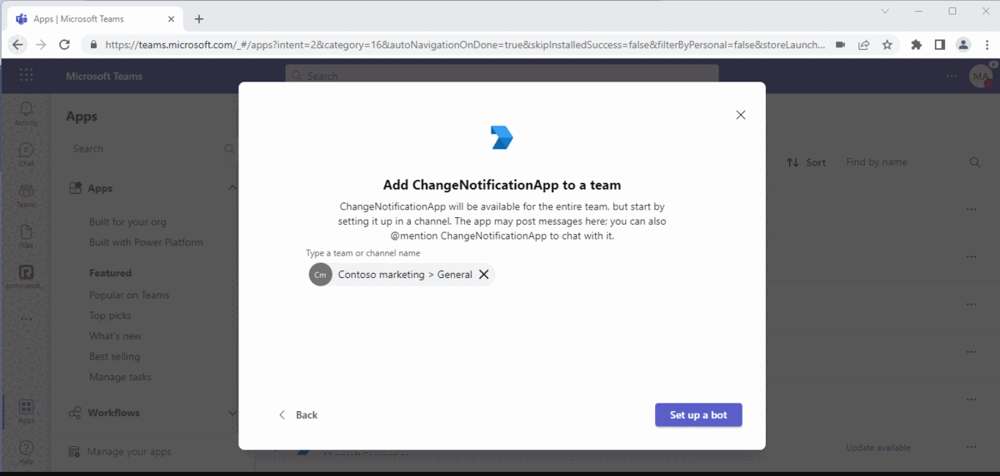
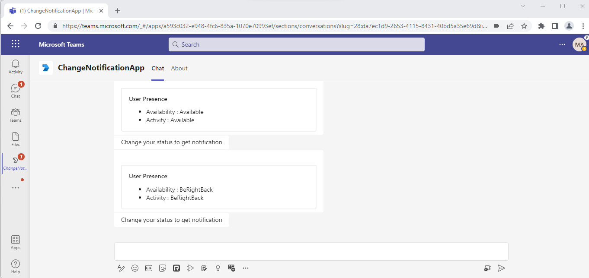
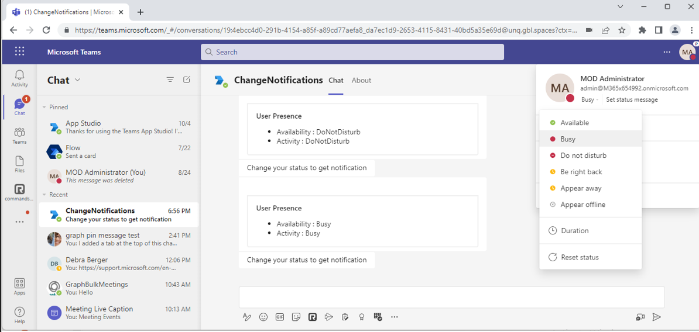
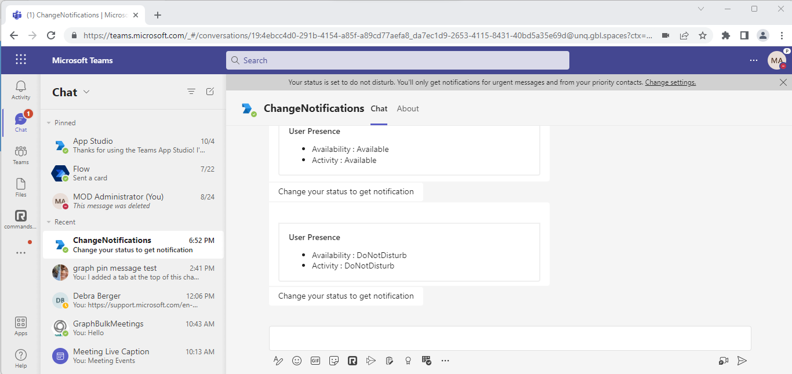

# Change Notification sample

Bot Framework v4 ChangeNotification sample.

This sample app demonstrates sending change notifications to user presence in Teams based on user presence status.

## Included Features
* Bots
* Graph API
* Change Notifications

## Interact with app



## Prerequisites

- Microsoft Teams is installed and you have an account
- [.NET Core SDK](https://dotnet.microsoft.com/download) version 3.1
- [ngrok](https://ngrok.com/) or equivalent tunnelling solution
- [M365 developer account](https://docs.microsoft.com/en-us/microsoftteams/platform/concepts/build-and-test/prepare-your-o365-tenant) or access to a Teams account with the appropriate permissions to install an app.

## Setup
1) Clone the repository

    ```bash
    git clone https://github.com/OfficeDev/Microsoft-Teams-Samples.git
    ```

2) Run ngrok - point to port 3978

   ```bash
     ngrok http 3978 --host-header="localhost:3978"
   ```

3) Setup App Registration
This step will create an AAD app, it will be reused wherever it needs AAD throughout this sample to simpler the steps.

    - Navigate to [Azure _App Registration_ Blade](https://ms.portal.azure.com/#blade/Microsoft_AAD_RegisteredApps/ApplicationsListBlade)

    - Click "New Registration" on the upper left corner

    - Fill out name and select third option for supported account type 
    - Set Redirect Uri to "https://token.botframework.com/.auth/web/redirect" and click "Register":

        

    - Navigate to the AAD app you just created, _copy and paste the Application ID(will referred as **AppId** in this document) somewhere safe_. You'll need it in a future step:
        

- Create Client Secret

    - Navigate to the "Certificates & secrets" blade and add a client secret by clicking "New Client Secret"

    
</br>

    - Copy and paste the secret value somewhere safe. You'll need it in a future step

- Expose API endpoint
    - Click "_Expose an API_" in the left rail

        - Set your Application ID URL to include your bot id - api://botid-<AppId>, where <AppId> is the id of the bot that will be making the SSO request and found in your Teams Application Manifest, which is the same you create and saved in step1.1:
        

        - Click "_Add a scope_"

            - access_as_user as the Scope name.

            - Set Who can consent? to Admins and users

            - Fill in the fields for configuring the admin and user consent prompts with values that are appropriate for the access_as_user scope. Suggestions:

                - Admin consent display name: Teams can access the user’s profile

                - Admin consent description: Allows Teams to call the app’s web APIs as the current user.

                - User consent display name: Teams can access your user profile and make requests on your behalf

                - User consent description: Enable Teams to call this app’s APIs with the same rights that you have

            - Ensure that State is set to Enabled

            - Click on Add scope button (Note: The domain part of the Scope name displayed just below the text field should automatically match the Application ID URI set in the previous step, with /access_as_user appended to the end)

            

- Authorize client applications
    Add the following Ids as authorized clients for your application

        - 1fec8e78-bce4-4aaf-ab1b-5451cc387264 (Teams mobile/desktop application)
        - 5e3ce6c0-2b1f-4285-8d4b-75ee78787346 (Teams web application)


- Add required Graph API permissions:

    - Navigate to "API permissions" blade on the left hand side

    - Add `Presence.Read` and `Presence.Read.All` as delegated permissions

        

- Enable implicit grant

    - Navigate to "Authentication"

    - Check the *Access tokens* and *ID tokens* boxes and click on Save button.

4) Register a bot with Azure Bot Service, following the instructions [here](https://docs.microsoft.com/en-us/azure/bot-service/bot-service-quickstart-registration?view=azure-bot-service-3.0).
    - Ensure that you've [enabled the Teams Channel](https://docs.microsoft.com/en-us/azure/bot-service/channel-connect-teams?view=azure-bot-service-4.0)
    - While registering the bot, use `https://<your_ngrok_url>/api/messages` as the messaging endpoint.

    > NOTE: When you create your bot you will create an App ID and App password - make sure you keep these for later.

    - Instruction on setting connection string for bot authentication on the behalf of user
        - In the Azure portal, select your resource group from the dashboard.
        - Select your registered Azure bot service
        - Open the resource page and select Configuration under Settings.
        - Select Add OAuth Connection Settings.


    - Setup Bot Service Connection (TokenStore)

        a. Enter a name for the connection. You'll use this name in your bot in the appsettings.json file. For example BotTeamsAuthADv1.

        b. Service Provider: select Azure Active Directory. Once you select this, the Azure AD-specific fields will be displayed.

        c. Client id: enter the Application (client) ID that you recorded for your Azure identity provider app in the steps above.

        d. Client secret: enter the secret that you recorded for your Azure identity provider app in the steps above.

        e. Grant Type: `authorization_code`

        f. Login URL: https://login.microsoftonline.com

        g. Tenant ID, enter the Directory (tenant) ID that you recorded earlier for your Azure identity app or common depending on the supported account type selected when you created the identity provider app.
        
        h. Resource URL: https://graph.microsoft.com/

        i. Provide Scopes: "Presence.Read Presence.Read.All"


5)  Open the code in Visual Studio

  - Launch Visual Studio code
  - File -> Open Folder
  - Navigate to `samples/graph-change-notification/csharp` folder
  - Select `ChangeNotification.sln` and open it in Visual Studio
   
6) Setup and run the bot from Visual Studio:
Modify the `appsettings.json` file with the following details:
    - Provide MicrosoftAppId and MicrosoftAppPassword in the appsetting that is created in Azure while doing AAD app registration.
    - Provide ConnectionName in appsetting that is created in Azure wile creating connect for your Azure bot.
    - Provide the ngrok url as "BaseUrl" in appsetting on which application is running on like URL: https://xxxx.ngrok-free.app
    - Press `F5` to run the project

7) __*This step is specific to Teams.*__
    - **Edit** the `manifest.json`file contained in the `Manifest` folder to replace your Microsoft App Id (that was created when you registered your AAD app registration earlier) *everywhere* you see the place holder string `<<app id>>` (depending on the scenario the Microsoft App Id may occur multiple times in the `manifest.json`)
    - `[Your Ngrok Domain]` with base Url domain. E.g. if you are using ngrok it would be `https://1234.ngrok-free.app` then your domain-name will be `1234.ngrok-free.app`.
    - **Zip** up the contents of the `teamsAppManifest` folder to create a `manifest.zip`
    - **Upload** the `manifest.zip` to Teams (in the Apps view click "Upload a custom app")

**Note**: If you are facing any issue in your app, please uncomment [this](https://github.com/OfficeDev/Microsoft-Teams-Samples/blob/main/samples/graph-change-notification/csharp/ChangeNotification/AdapterWithErrorHandler.cs#L28) line and put your debugger for local debug.

## Running the sample
- After sucessfully installation of app you will get a sign in button. When sign in is complete then you get your current status in adapative card


- After that when the user status chagnes you will get notify about their status: 
- user to available.


- Change user status Busy from DoNotDistrub.
 

- Change user status DoNotDistrub from Available.
 

- Change user status BeRightBack from Available.
 
 
## Further reading
- [Bot Authentication](https://docs.microsoft.com/en-us/azure/bot-service/bot-builder-authentication?view=azure-bot-service-4.0&tabs=aadv2%2Ccsharp)
- [Change Notification](https://docs.microsoft.com/en-us/graph/api/resources/webhooks?view=graph-rest-beta)
- [App in Catalog](https://docs.microsoft.com/en-us/graph/api/resources/teamsapp?view=graph-rest-1.0)
- [Bot Framework Documentation](https://docs.botframework.com)
- [Bot Basics](https://docs.microsoft.com/azure/bot-service/bot-builder-basics?view=azure-bot-service-4.0)


