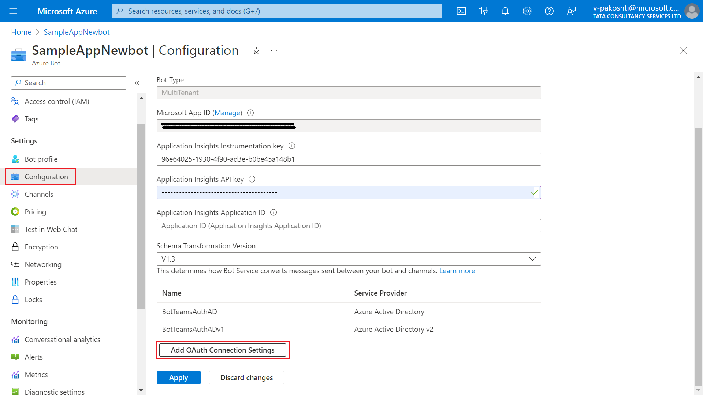
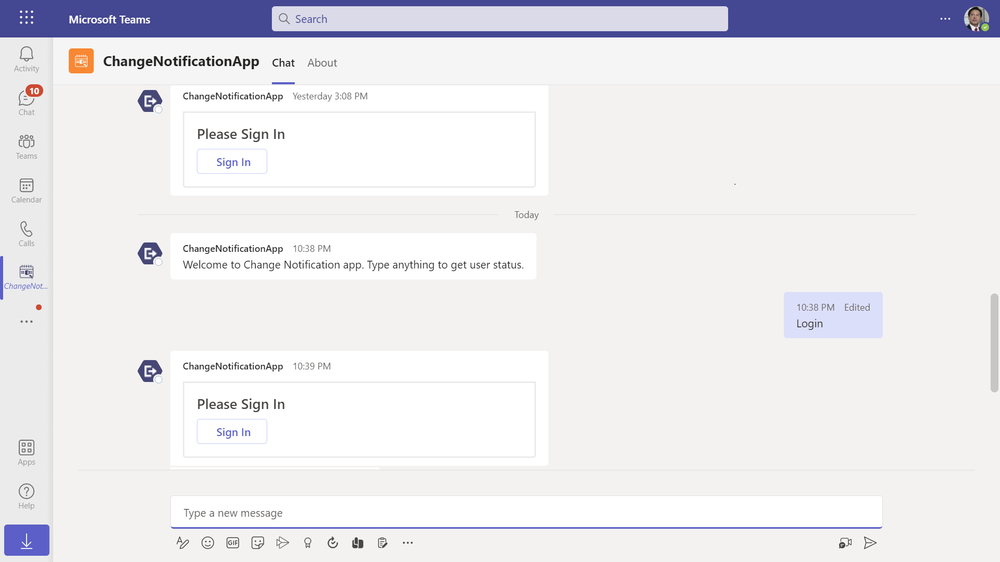
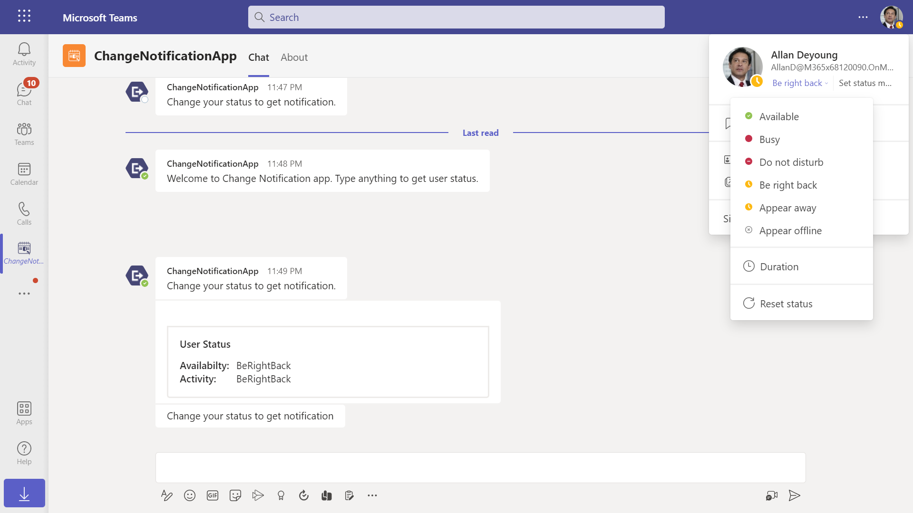
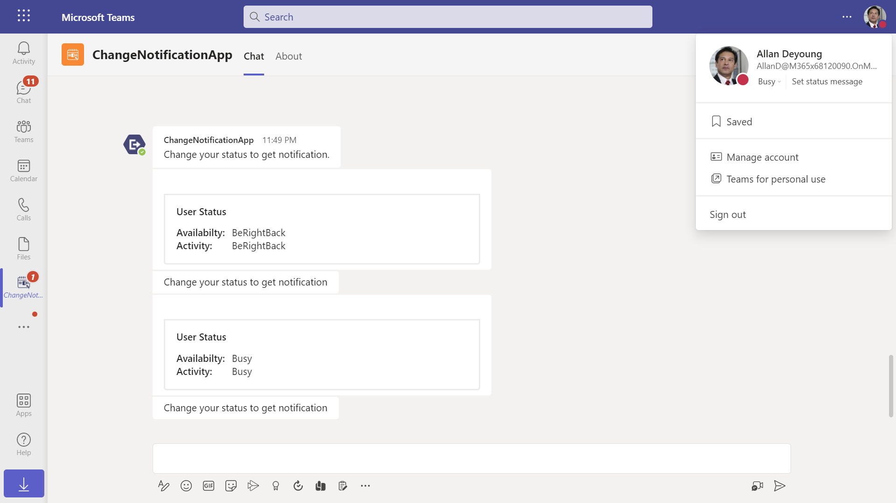
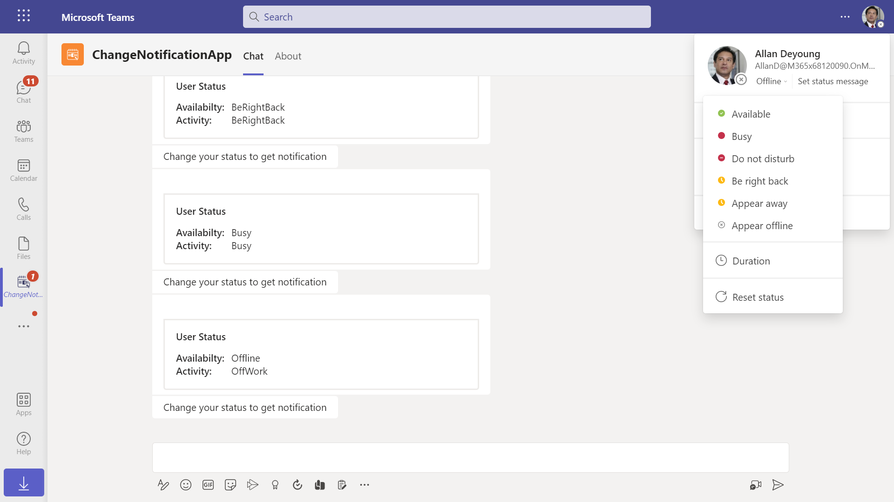

# Change Notification sample using nodejs

Bot Framework v4 ChangeNotification sample.

This sample app demonstrates sending notifications to users when presence status is changed.

## Included Features
* Bots
* Graph API
* Change Notifications

## Interaction with app


## Prerequisites

- Microsoft Teams is installed and you have an account (not a guest account)
- To test locally, [NodeJS](https://nodejs.org/en/download/) must be installed on your development machine (version 16.14.2  or higher)
- [ngrok](https://ngrok.com/download) or equivalent tunneling solution
- [M365 developer account](https://docs.microsoft.com/en-us/microsoftteams/platform/concepts/build-and-test/prepare-your-o365-tenant) or access to a Teams account with the 

## Setup
 1. Register a new application in the [Azure Active Directory – App Registrations](https://go.microsoft.com/fwlink/?linkid=2083908) portal.
 
    - Your app must be registered in the Azure AD portal to integrate with the Microsoft identity platform and call Microsoft Graph APIs. See [Register an application with the Microsoft identity platform](https://docs.microsoft.com/en-us/graph/auth-register-app-v2).
    - You need to add following permissions mentioned in the below screenshots to call respective Graph   API
 
      ### Instruction on setting connection string for bot authentication on the behalf of user
       - In the Azure portal, select your resource group from the dashboard.

       - Select your bot channel registration link.

       - Open the resource page and select Configuration under Settings.

        - Select Add OAuth Connection Settings.

          
	
         - Complete the form as follows.

       a. Enter a name for the connection. You'll use this name in your bot in the appsettings.json file. For example BotTeamsAuthADv1.

       b. Service Provider. Select Azure Active Directory. Once you select this, the Azure AD-specific fields will be displayed.

       c. Client id. Enter the Application (client) ID that you recorded for your Azure identity provider app in the steps above.

       d. Client secret. Enter the secret that you recorded for your Azure identity provider app in the steps above.

       e. Grant Type. Enter authorization_code.

       f. Login URL. Enter https://login.microsoftonline.com.

       g. Tenant ID, enter the Directory (tenant) ID that you recorded earlier for your Azure identity app or common depending on the supported account type selected when you created the identity provider app.
       h. For Resource URL, enter https://graph.microsoft.com/
       i. Provide  Scopes like "Presence.Read, Presence.Read.All"
       
 
 2. Setup for Bot
	- In Azure portal, create a [Azure Bot resource](https://docs.microsoft.com/en-us/azure/bot-service/bot-builder-authentication?view=azure-bot-service-4.0&tabs=csharp%2Caadv2).
	- Ensure that you've [enabled the Teams Channel](https://docs.microsoft.com/en-us/azure/bot-service/channel-connect-teams?view=azure-bot-service-4.0)
	- While registering the bot, use `https://<your_ngrok_url>/api/messages` as the messaging endpoint.
	**NOTE:** When you create app registration, you will create an App ID and App password - make sure you keep these for later.

3. Setup NGROK
   - Run ngrok - point to port 3978

    ```bash
    ngrok http 3978 --host-header="localhost:3978"
    ```
4. Setup for code

  - Clone the repository

    ```bash
    git clone https://github.com/OfficeDev/Microsoft-Teams-Samples.git
    ```
  - Update the `.env` configuration for the bot to use the `MicrosoftAppId` and `MicrosoftAppPassword`,`connectionName` and `notificationUrl` (Note the MicrosoftAppId is the AppId created in step 1 (Setup for Bot), the MicrosoftAppPassword is referred to as the "client secret" in step 1 (Setup for Bot) and you can always create a new client secret anytime.) and connectionName we can get from step "Select your bot channel registration link." and for the `notificationUrl` eg.1234.ngrok-free.app/api/notifications
  
 - Open from Visual Studio code
    - Launch Visual Studio code
    - File -> Open Folder
    - Navigate to `samples/graph-change-notification/nodejs` folder
    - Run npm command  in the terminal
        ```bash
        npm install
        ``` 
    - Press `F5` to run the project
    
5. Setup Manifest for Teams
- __*This step is specific to Teams.*__
    - **Edit** the `manifest.json` contained in the ./Manifest folder to replace your Microsoft App Id (that was created when you registered your app registration earlier) *everywhere* you see the place holder string `{{Microsoft-App-Id}}` (depending on the scenario the Microsoft App Id may occur multiple times in the `manifest.json`)
    - **Edit** the `manifest.json` for `validDomains` and replace `{{domain-name}}` with base Url of your domain. E.g. if you are using ngrok it would be `https://1234.ngrok-free.app` then your domain-name will be `1234.ngrok-free.app`.
    - **Zip** up the contents of the `Manifest` folder to create a `manifest.zip` (Make sure that zip file does not contains any subfolder otherwise you will get error while uploading your .zip package)

- Upload the manifest.zip to Teams (in the Apps view click "Upload a custom app")
   - Go to Microsoft Teams. From the lower left corner, select Apps
   - From the lower left corner, choose Upload a custom App
   - Go to your project directory, the ./Manifest folder, select the zip folder, and choose Open.
   - Select Add in the pop-up dialog box. Your app is uploaded to Teams.

**Note**: If you are facing any issue in your app, please uncomment [this](https://github.com/OfficeDev/Microsoft-Teams-Samples/blob/main/samples/graph-change-notification/nodejs/index.js#L42) line and put your debugger for local debug.

## Running with sample
- After sucessfully installation of app you will get a sign in button. When sign in is complete then you get your current status in adapative card





- After that when the user status chagnes you will get notify about their status: 
- Change user status from available to busy like



- Change user status from busy to busy offline




## Further reading
- [Bot Authentication](https://docs.microsoft.com/en-us/azure/bot-service/bot-builder-authentication?view=azure-bot-service-4.0&tabs=aadv2%2Ccsharp)
- [Change Notification](https://docs.microsoft.com/en-us/graph/api/resources/webhooks?view=graph-rest-beta)
- [App in Catalog](https://docs.microsoft.com/en-us/graph/api/resources/teamsapp?view=graph-rest-1.0)
- [Bot Framework Documentation](https://docs.botframework.com)
- [Bot Basics](https://docs.microsoft.com/azure/bot-service/bot-builder-basics?view=azure-bot-service-4.0)


