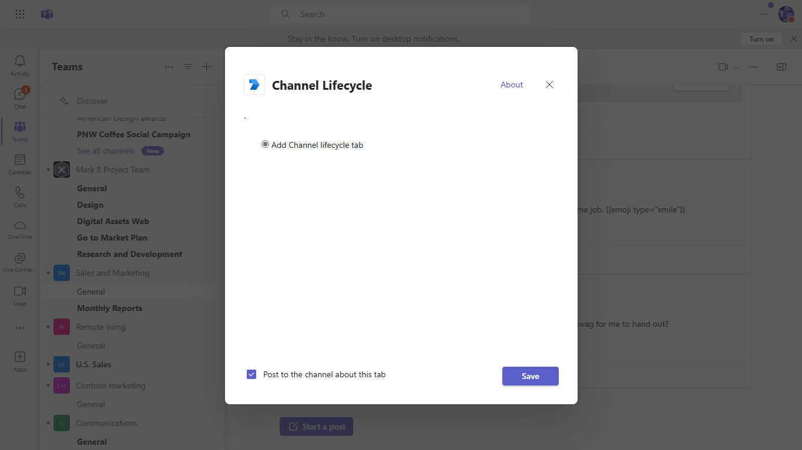

# Channel life cycle using C#

This sample show the [Channel](https://docs.microsoft.com/en-us/graph/api/resources/channel?view=graph-rest-1.0) life cycle which includes create, update delete a channel.

## Included Features
* Tabs
* Graph API
* RSC Permissions

## Interaction with app

 

## Prerequisites
- [.NET Core SDK](https://dotnet.microsoft.com/download) version 6.0

  determine dotnet version
  ```bash
  dotnet --version
  ```
- [dev tunnel](https://learn.microsoft.com/en-us/azure/developer/dev-tunnels/get-started?tabs=windows) or [Ngrok](https://ngrok.com/download) (For local environment testing) latest version (any other tunneling software can also be used)
  
- [Teams](https://teams.microsoft.com) Microsoft Teams is installed and you have an account

## Setup
1. Register a new application in the [Microsoft Entra ID – App Registrations](https://go.microsoft.com/fwlink/?linkid=2083908) portal.

> NOTE: When you create your app registration, you will create an App ID and App password - make sure you keep these for later.

2. Setup NGROK
 - Run ngrok - point to port 3978

   ```bash
   ngrok http 3978 --host-header="localhost:3978"
   ```  

   Alternatively, you can also use the `dev tunnels`. Please follow [Create and host a dev tunnel](https://learn.microsoft.com/en-us/azure/developer/dev-tunnels/get-started?tabs=windows) and host the tunnel with anonymous user access command as shown below:

   ```bash
   devtunnel host -p 3978 --allow-anonymous
   ```

3. Setup for code

- Clone the repository

    ```bash
    git clone https://github.com/OfficeDev/Microsoft-Teams-Samples.git
    ```

- Modify the `/appsettings.json` and fill in the following details:
  - `{{ ClientId}}` - Generated from Step 1 while doing Microsoft Entra ID app registration in Azure portal.
  - `{{ ClientSecret}}` - Generated from Step 1, also referred to as Client secret
  - `{{ BaseUri }}` - Your application's base url. E.g. https://12345.ngrok-free.app if you are using ngrok and if you are using dev tunnels, your URL will be like: https://12345.devtunnels.ms.

- Run the bot from a terminal or from Visual Studio:

  A) From a terminal, navigate to `samples/graph-channel-lifecycle/csharp`

  ```bash
  # run the bot
  dotnet run
  ```
  B) Or from Visual Studio
    - Launch Visual Studio
  - File -> Open -> Project/Solution
  - Navigate to `ChannelLifecycle` folder
  - Select `ChannelLifecycle.csproj` file
  - Press `F5` to run the project

 4. Setup Manifest for Teams
- __*This step is specific to Teams.*__
    - **Edit** the `manifest.json` contained in the ./AppManifest folder to replace your Microsoft App Id (that was created when you registered your app registration earlier) *everywhere* you see the place holder string `{{Microsoft-App-Id}}` (depending on the scenario the Microsoft App Id may occur multiple times in the `manifest.json`)
    - **Edit** the `manifest.json` for `validDomains` and replace `{{domain-name}}` with base Url of your domain. E.g. if you are using ngrok it would be `https://1234.ngrok-free.app` then your domain-name will be `1234.ngrok-free.app` and if you are using dev tunnels then your domain will be like: `12345.devtunnels.ms`.
    - **Zip** up the contents of the `AppManifest` folder to create a `manifest.zip` (Make sure that zip file does not contains any subfolder otherwise you will get error while uploading your .zip package)

- Upload the manifest.zip to Teams (in the Apps view click "Upload a custom app")
   - Go to Microsoft Teams. From the lower left corner, select Apps
   - From the lower left corner, choose Upload a custom App
   - Go to your project directory, the ./AppManifest folder, select the zip folder, and choose Open.
   - Select Add in the pop-up dialog box. Your app is uploaded to Teams.
- [Upload app manifest file](https://docs.microsoft.com/en-us/microsoftteams/platform/concepts/deploy-and-publish/apps-upload#load-your-package-into-teams) (zip file) to your team

## Running the sample.

  

  

  

  

  

  

  
  
  [Grpah-Channel-lifecycel](https://learn.microsoft.com/en-us/microsoftteams/plan-teams-lifecycle)
  
## Further Reading.

 [sample feature](https://docs.microsoft.com/en-us/graph/api/resources/channel?view=graph-rest-1.0) life cycle which includes create, update delete a channel
  
 


