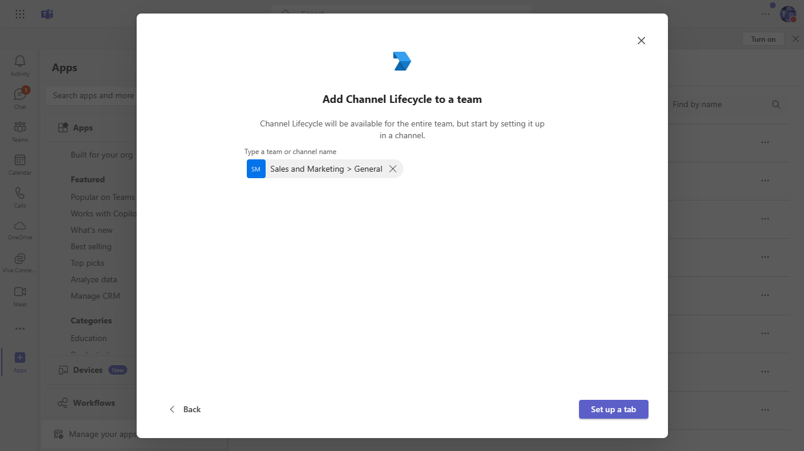

# Channel life cycle

This sample show the [Channel](https://docs.microsoft.com/en-us/graph/api/resources/channel?view=graph-rest-1.0) life cycle which includes create, update delete a channel

## Prerequisites

- [.NET Core SDK](https://dotnet.microsoft.com/download) version 3.1

  ```bash
  # determine dotnet version
  dotnet --version
  ```
- [Graph Explorer](https://developer.microsoft.com/en-us/graph/graph-explorer)

- [ngrok](https://ngrok.com/) or equivalent tunnelling solution

## To try this sample

- Register your app with Microsoft identity platform via the Azure AD portal
  - Your app must be registered in the Azure AD portal to integrate with the Microsoft identity platform and call Microsoft Graph APIs. See [Register an application with the Microsoft identity platform](https://docs.microsoft.com/en-us/graph/auth-register-app-v2). 
  
- Clone the repository 
   ```bash
   git clone https://github.com/OfficeDev/microsoft-teams-samples.git
   ```

- Build your solution

  - Launch Visual Studio
  - File -> Open -> Project/Solution
  - Navigate to `ChannelLifecycle` folder
  - Select `ChannelLifecycle.csproj` file
  - Press `F5` to run the project

- Setup ngrok
  ```bash
  ngrok http -host-header=rewrite 3978
  ```

   Config changes
   - Add your client id, client secret in appsettings.json
   - Press F5 to run the project
   - Update the ngrok in manifest
   - Zip all three files present in manifest folder

- [Upload app manifest file](https://docs.microsoft.com/en-us/microsoftteams/platform/concepts/deploy-and-publish/apps-upload#load-your-package-into-teams) (zip file) to your team
  
  
  

  

  
  
  
 

