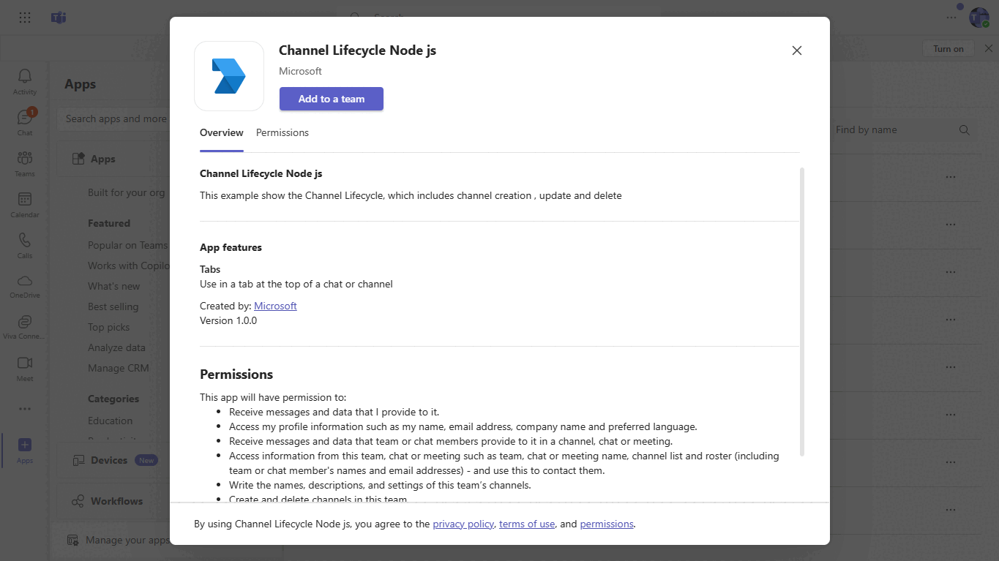
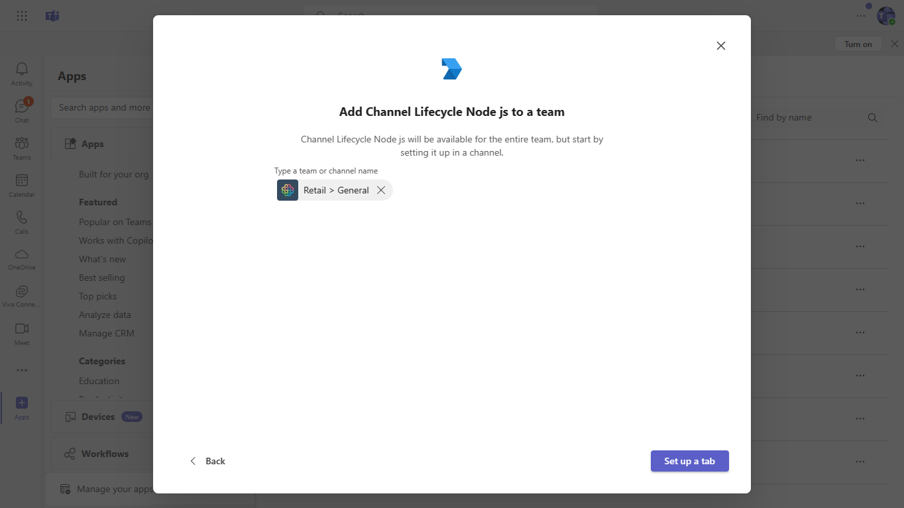

# Channel life cycle using Node js

This sample show the [Channel](https://docs.microsoft.com/en-us/graph/api/resources/channel?view=graph-rest-1.0) life cycle which includes create, update delete a channel.

## Included Features
* Tabs
* Graph API
* RSC Permissions

## Interaction with app
   
  

## Prerequisites

- Microsoft Teams is installed and you have an account (not a guest account)
- To test locally, [NodeJS](https://nodejs.org/en/download/) must be installed on your development machine (version 16.14.2  or higher)
- [ngrok](https://ngrok.com/download) or equivalent tunneling solution
- [M365 developer account](https://docs.microsoft.com/en-us/microsoftteams/platform/concepts/build-and-test/prepare-your-o365-tenant) or access to a Teams account with the 

## Setup.
1. Register a new application in the [Azure Active Directory – App Registrations](https://go.microsoft.com/fwlink/?linkid=2083908) portal.
  - Your app must be registered in the Azure AD portal to integrate with the Microsoft identity platform and call Microsoft Graph APIs. See [Register an application with the Microsoft identity platform](https://docs.microsoft.com/en-us/graph/auth-register-app-v2).
**NOTE:** When you create app registration, you will create an App ID and App password - make sure you keep these for later.

2. Setup NGROK
  -  Run ngrok - point to port 3978

    ```bash
    ngrok http 3978 --host-header="localhost:3978"
    ```
3. Setup for code
  - Clone the repository

    ```bash
    git clone https://github.com/OfficeDev/Microsoft-Teams-Samples.git
    ```
  - In a terminal, navigate to `samples/graph-channel-lifecycle/nodejs
 
 - Update the `.env` configuration with the Microsoft `ClientId` and `ClientSecret`

- Install modules

    ```bash
    npm install
    ```
 - Run your bot at the command line:

    ```bash
    npm start
    ```
 4. Setup Manifest for Teams

- **This step is specific to Teams.**
    - Edit the `manifest.json` contained in the `teamsManifest/` folder to replace with your MicrosoftAppId (that was created in step1.1 and is the same value of MicrosoftAppId in `.env` file) *everywhere* you see the place holder string `{MicrosoftAppId}` (depending on the scenario the Microsoft App Id may occur multiple times in the `manifest.json`)
   
    - Zip up the contents of the `teamsManifest/` folder to create a `manifest.zip`
    - Upload the `manifest.zip` to Teams (in the left-bottom *Apps* view, click "Upload a custom app")
 
## Running the sample.

   

   

   


  [Grpah-Channel-lifecycel](https://learn.microsoft.com/en-us/microsoftteams/plan-teams-lifecycle)


