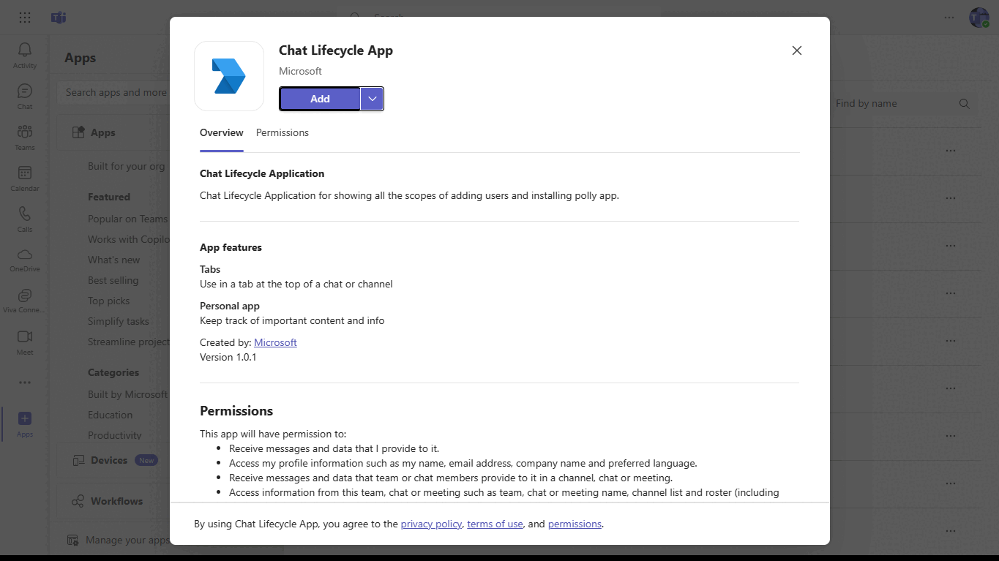
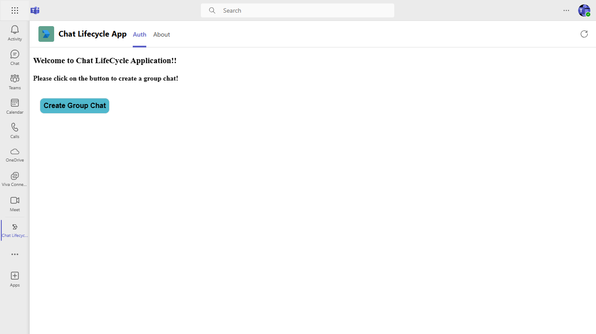
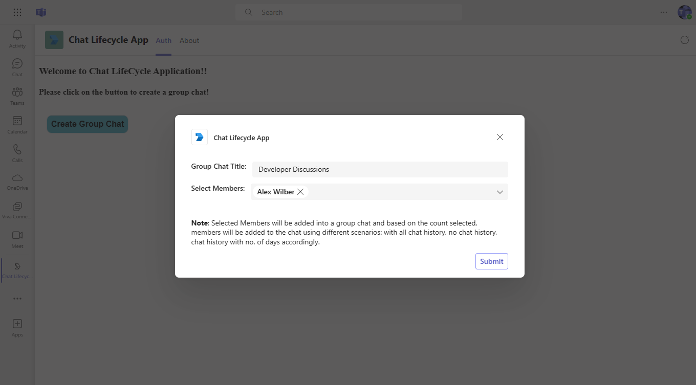
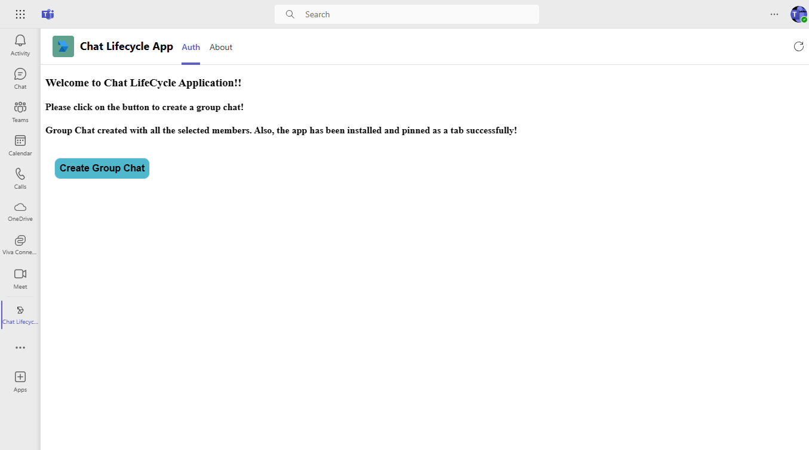
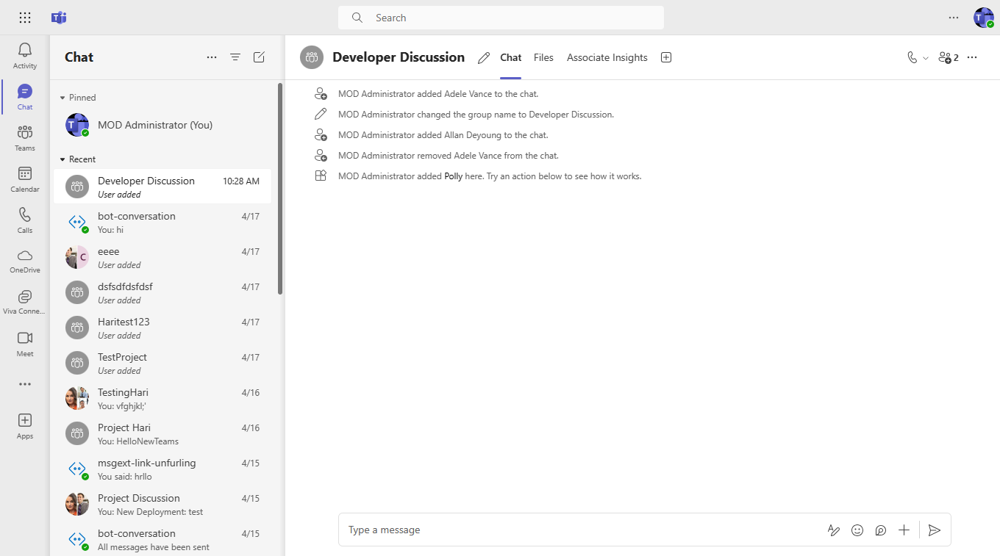
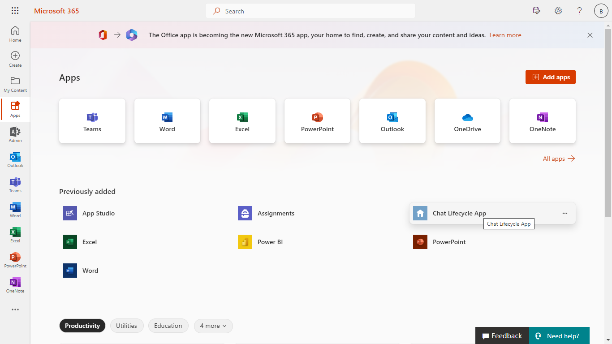

# Chat LifeCycle Application

This sample illustrates Lifecycle of chat in Teams (Creating chat, adding members with all scenarios, deleting member).

## Included Features
* Tabs
* Adaptive Cards
* Graph API

## Interaction with app


## Prerequisites

- Microsoft Teams is installed and you have an account
- [.NET Core SDK](https://dotnet.microsoft.com/download) version 6.0
- [dev tunnel](https://learn.microsoft.com/en-us/azure/developer/dev-tunnels/get-started?tabs=windows) or [ngrok](https://ngrok.com/) latest version or equivalent tunnelling solution

## Setup

- Ensure that you've [enabled the Teams Channel](https://docs.microsoft.com/en-us/azure/bot-service/channel-connect-teams?view=azure-bot-service-4.0)

> NOTE: When you create your app registration, you will create an App ID and App password - make sure you keep these for later.

1.Register your Teams Auth SSO with Azure AD

 -  Register a new application in the [Microsoft Entra ID – App Registrations](https://go.microsoft.com/fwlink/?linkid=2083908) portal.
 -  Select **New Registration** and on the *register an application page*, set following values:
    * Set **name** to your app name.
    * Choose the **supported account types** (any account type will work)
    * Leave **Redirect URI** empty.
    * Choose **Register**.
-   On the overview page, copy and save the **Application (client) ID, Directory (tenant) ID**. You’ll need those later when updating your Teams application manifest and in the appsettings.json.
-  Under **Manage**, select **Expose an API**. 
-  Select the **Set** link to generate the Application ID URI in the form of `api://{AppID}`. Insert your fully qualified domain name (with a forward slash "/" appended to the end) between the double forward slashes and the GUID. The entire ID should have the form of: `api://fully-qualified-domain-name/{AppID}`
    - ex: `api://%ngrokDomain%.ngrok-free.app/00000000-0000-0000-0000-000000000000`.
-  Select the **Add a scope** button. In the panel that opens, enter `access_as_user` as the **Scope name**.
-  Set **Who can consent?** to `Admins and users`
- Fill in the fields for configuring the admin and user consent prompts with values that are appropriate for the `access_as_user` scope:
    * **Admin consent title:** Teams can access the user’s profile.
    * **Admin consent description**: Allows Teams to call the app’s web APIs as the current user.
    * **User consent title**: Teams can access the user profile and make requests on the user's behalf.
    * **User consent description:** Enable Teams to call this app’s APIs with the same rights as the user.
- Ensure that **State** is set to **Enabled**
- Select **Add scope**
    * The domain part of the **Scope name** displayed just below the text field should automatically match the **Application ID** URI set in the previous step, with `/access_as_user` appended to the end:
        * `api://[ngrokDomain].ngrok-free.app/00000000-0000-0000-0000-000000000000/access_as_user.
- In the **Authorized client applications** section, identify the applications that you want to authorize for your app’s web application. Each of the following IDs needs to be entered:
    * `1fec8e78-bce4-4aaf-ab1b-5451cc387264` (Teams mobile/desktop application)
    * `5e3ce6c0-2b1f-4285-8d4b-75ee78787346` (Teams web application)
**Note** If you want to test or extend your Teams apps across Office and Outlook, kindly add below client application identifiers while doing Azure AD app registration in your tenant:
   * `4765445b-32c6-49b0-83e6-1d93765276ca` (Office web)
   * `0ec893e0-5785-4de6-99da-4ed124e5296c` (Office desktop)
   * `bc59ab01-8403-45c6-8796-ac3ef710b3e3` (Outlook web)
   * `d3590ed6-52b3-4102-aeff-aad2292ab01c` (Outlook desktop)    
- Navigate to **API Permissions**, and make sure to add the follow permissions:
-   Select Add a permission
-   Select Microsoft Graph -\> Delegated permissions.
    * User.Read (enabled by default)
    * email
    * offline_access
    * OpenId
    * profile
    * Chat.Create
    * Chat.ReadWrite
    * ChatMember.ReadWrite
    * TeamsAppInstallation.ReadWriteForChat
    * TeamsAppInstallation.ReadWriteSelfForChat
    * TeamsTab.Create
    * TeamsTab.ReadWriteForChat
    * TeamsTab.ReadWrite.All
    * User.Read.All
-   Click on Add permissions. Please make sure to grant the admin consent for the required permissions.
- Navigate to **Authentication**
    Set a redirect URI:
    * Select **Add a platform**.
    * Select **Single Page Application**.
    * Enter the **redirect URI** for the app in the following format: https://%ngrokDomain%.ngrok-free.app/Auth/End.
    
-  Navigate to the **Certificates & secrets**. In the Client secrets section, click on "+ New client secret". Add a description      (Name of the secret) for the secret and select “Never” for Expires. Click "Add". Once the client secret is created, copy its value, it need to be placed in the appsettings.json.

2. Setup NGROK
 - Run ngrok - point to port 3978

   ```bash
   ngrok http 3978 --host-header="localhost:3978"
   ```  

   Alternatively, you can also use the `dev tunnels`. Please follow [Create and host a dev tunnel](https://learn.microsoft.com/en-us/azure/developer/dev-tunnels/get-started?tabs=windows) and host the tunnel with anonymous user access command as shown below:

   ```bash
   devtunnel host -p 3978 --allow-anonymous
   ```

3. Setup for code

- Clone the repository

    ```bash
    git clone https://github.com/OfficeDev/Microsoft-Teams-Samples.git
    ```
- Modify the `/appsettings.json` and fill in the following details:
  - `{{ YOUR-APP-PASSWORD}}` -  Generated from Step 1, also referred to as Client secret.
  - `{{ YOUR-APP-ID}}` - Generated from Step 1 while doing Microsoft Entra ID app registration in Azure portal
  - `{{ YOUR-TENANT-ID}}` - Generated from Step 1, also referred to as Directory (tenant) ID
  - `{{ ApplicationIdURI}}` - Generated from Step 1 , eg.(api://<<BASE-URL-DOMAIN>>/<<YOUR-APP-ID>>)

- If you are using Visual Studio
  - Launch Visual Studio
  - File -> Open -> Project/Solution
  - Navigate to `samples/graph-chat-lifecycle/ChatLifecycle` folder
  - Select `ChatLifecycle.csproj` file
  
4. Setup Manifest for Teams
- __*This step is specific to Teams.*__
    - **Edit** the `manifest.json` contained in the ./AppManifest folder to replace your Microsoft App Id (that was created when you registered your app registration earlier) *everywhere* you see the place holder string `<<YOUR-MICROSOFT-APP-ID>>` (depending on the scenario the Microsoft App Id may occur multiple times in the `manifest.json`)
    - **Edit** the `manifest.json` for `validDomains` and replace `{{domain-name}}` with base Url of your domain. E.g. if you are using ngrok it would be `https://1234.ngrok-free.app` then your domain-name will be `1234.ngrok-free.app` and if you are using dev tunnels then your domain will be like: `12345.devtunnels.ms`.
    - **Edit** the `manifest.json` for `webApplicationInfo` resource `"api://{{domain-name}}/<<YOUR-MICROSOFT-APP-ID>>"` with MicrosoftAppId.
    **Note:** If you want to test your app across multi hub like: Outlook/Office.com, please update the `manifest.json` in the `graph-chat-lifecycle\csharp\ChatLifecycle\AppManifest_Hub` folder with the required values.
    - **Zip** up the contents of the `Manifest` folder to create a `Manifest.zip` or `AppManifest_Hub` folder to create a `Manifest_Hub.zip`(Make sure that zip file does not contains any subfolder otherwise you will get error while uploading your .zip package)

- Upload the manifest.zip to Teams (in the Apps view click "Upload a custom app")
   - Go to Microsoft Teams. From the lower left corner, select Apps
   - From the lower left corner, choose Upload a custom App
   - Go to your project directory, the ./AppManifest folder, select the zip folder, and choose Open.
   - Select Add in the pop-up dialog box. Your app is uploaded to Teams.

## Running the sample

1. Install App.


2. In Teams, Once the app is successfully installed, it can be opened in the tab and has option to create group chat if user is authenticated.



3. Once create group chat is clicked, user will be able to add Title of the groupchat and select users from drop down to create a group chat and add members (using different scenarios) and delete member accordingly to depict the lifecycle of chat.

   

4. Successfully Group chat created.


5. created group chat Details.
 

## Outlook on the web

- To view your app in Outlook on the web.

- Go to [Outlook on the web](https://outlook.office.com/mail/)and sign in using your dev tenant account.

**On the side bar, select More Apps. Your sideloaded app title appears among your installed apps**


**Select your app icon to launch and preview your app running in Outlook on the web**


**Note:** Similarly, you can test your application in the Outlook desktop app as well.

## Office on the web

- To preview your app running in Office on the web.

- Log into office.com with test tenant credentials

**Select the Apps icon on the side bar. Your sideloaded app title appears among your installed apps**



**Select your app icon to launch your app in Office on the web**

 

**Note:** Similarly, you can test your application in the Office 365 desktop app as well.
   
## Further Reading
[Graph-Chat-Lifecycle](https://learn.microsoft.com/en-us/microsoftteams/plan-teams-lifecycle)
[Extend Teams apps across Microsoft 365](https://learn.microsoft.com/en-us/microsoftteams/platform/m365-apps/overview)


