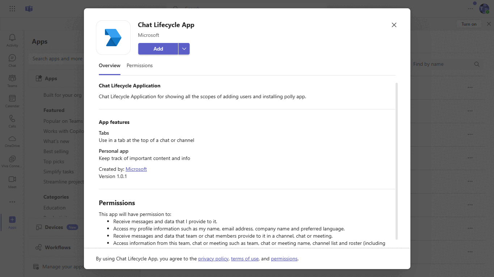
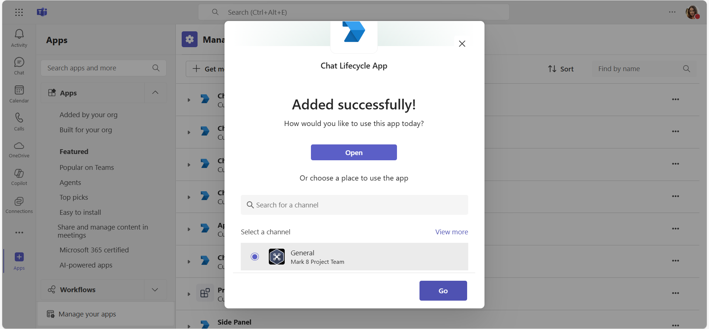
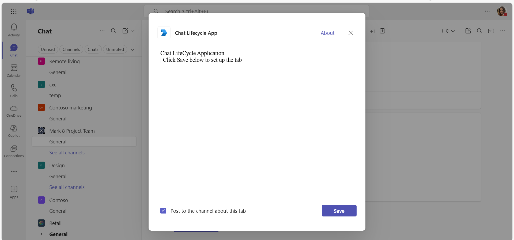
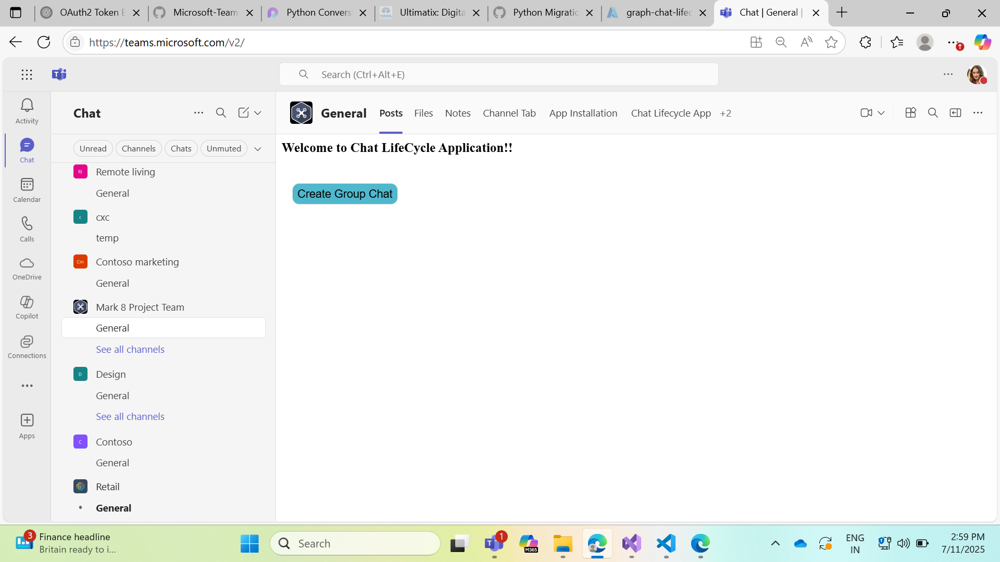
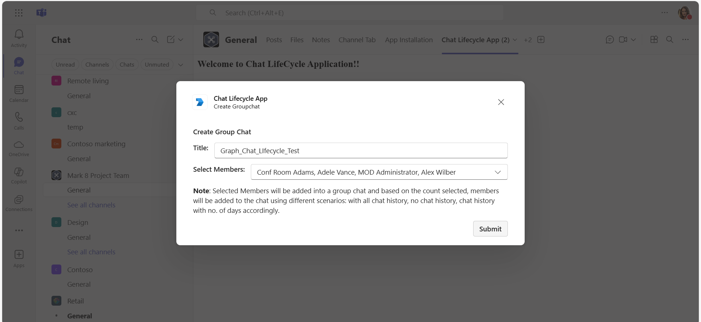
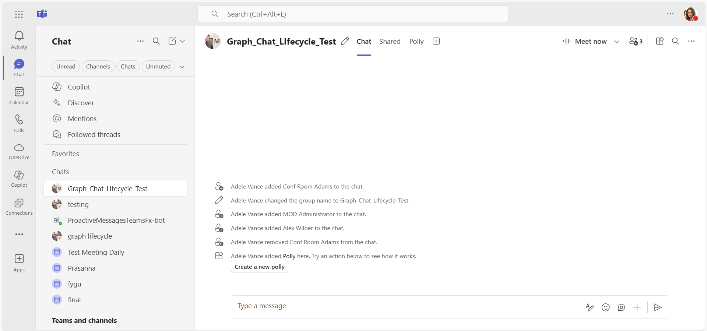

# ChatLifecycle Application

This sample application showcases the management of chat lifecycles in Microsoft Teams, utilizing Microsoft Graph APIs for creating chats, adding members, and removing members in various scenarios. Developed in Python, it includes features such as tab integration, adaptive cards, and lifecycle management, along with detailed instructions for registration, tunneling, and deployment using the Microsoft 365 Agents Toolkit for Visual Studio Code.

## Included Features
* Tabs
* Adaptive Cards
* Graph API

## Interaction with app



## Prerequisites

- Microsoft Teams is installed and you have an account
- [Python SDK](https://www.python.org/downloads/) min version 3.8
- [dev tunnel](https://learn.microsoft.com/en-us/azure/developer/dev-tunnels/get-started?tabs=windows) or [ngrok](https://ngrok.com/) latest version or equivalent tunnelling solution
- [M365 developer account](https://docs.microsoft.com/microsoftteams/platform/concepts/build-and-test/prepare-your-o365-tenant) or access to a Teams account with the appropriate permissions to install an app.
- [Microsoft 365 Agents Toolkit for VS Code](https://marketplace.visualstudio.com/items?itemName=TeamsDevApp.ms-teams-vscode-extension) or [TeamsFx CLI](https://learn.microsoft.com/microsoftteams/platform/toolkit/teamsfx-cli?pivots=version-one)

## Run the app (Using Microsoft 365 Agents Toolkit for Visual Studio Code)

The simplest way to run this sample in Teams is to use Microsoft 365 Agents Toolkit for Visual Studio Code.

1. Ensure you have downloaded and installed [Visual Studio Code](https://code.visualstudio.com/docs/setup/setup-overview)
2. Install the [Microsoft 365 Agents Toolkit extension](https://marketplace.visualstudio.com/items?itemName=TeamsDevApp.ms-teams-vscode-extension)
3. Select **File > Open Folder** in VS Code and choose this samples directory from the repo
4. Press **CTRL+Shift+P** to open the command box and enter **Python: Create Environment** to create and activate your desired virtual environment. Remember to select `requirements.txt` as dependencies to install when creating the virtual environment.
5. Using the extension, sign in with your Microsoft 365 account where you have permissions to upload custom apps
6. Select **Debug > Start Debugging** or **F5** to run the app in a Teams web client.
7. In the browser that launches, select the **Add** button to install the app to Teams.

## Setup

- Ensure that you've [enabled the Teams Channel](https://docs.microsoft.com/en-us/azure/bot-service/channel-connect-teams?view=azure-bot-service-4.0)
**NOTE:** When you create app registration, you will create an App ID and App password - make sure you keep these for later.

1. Register a new application in the [Microsoft Entra ID – App Registrations](https://go.microsoft.com/fwlink/?linkid=2083908) portal.
  - Select **New Registration** and on the *register an application page*, set following values:
    * Set **name** to your app name.
    * Choose the **supported account types** (any account type will work)
    * Leave **Redirect URI** empty.
    * Choose **Register**.
  - On the overview page, copy and save the **Application (client) ID, Directory (tenant) ID**. You’ll need those later when updating your Teams application manifest and in the appsettings.json.
  - Under **Manage**, select **Expose an API**. 
  - Select the **Set** link to generate the Application ID URI in the form of `api://{AppID}`. Insert your fully qualified domain name (with a forward slash "/" appended to the end) between the double forward slashes and the GUID. The entire ID should have the form of: `api://fully-qualified-domain-name/{AppID}`
    * ex: `api://%ngrokDomain%.ngrok-free.app/00000000-0000-0000-0000-000000000000`.
   - Select the **Add a scope** button. In the panel that opens, enter `access_as_user` as the **Scope name**.
   - Set **Who can consent?** to `Admins and users`
   - Fill in the fields for configuring the admin and user consent prompts with values that are appropriate for the `access_as_user` scope:
    * **Admin consent title:** Teams can access the user’s profile.
    * **Admin consent description**: Allows Teams to call the app’s web APIs as the current user.
    * **User consent title**: Teams can access the user profile and make requests on the user's behalf.
    * **User consent description:** Enable Teams to call this app’s APIs with the same rights as the user.
    - Ensure that **State** is set to **Enabled**
  -. Select **Add scope**
    * The domain part of the **Scope name** displayed just below the text field should automatically match the **Application ID** URI set in the previous step, with `/access_as_user` appended to the end:
        * `api://[ngrokDomain].ngrok-free.app/00000000-0000-0000-0000-000000000000/access_as_user.
 - In the **Authorized client applications** section, identify the applications that you want to authorize for your app’s web application. Each of the following IDs needs to be entered:
    * `1fec8e78-bce4-4aaf-ab1b-5451cc387264` (Teams mobile/desktop application)
    * `5e3ce6c0-2b1f-4285-8d4b-75ee78787346` (Teams web application)
- **Note** If you want to test or extend your Teams apps across Office and Outlook, kindly add below client application identifiers while doing Azure AD app registration in your tenant:
   * `4765445b-32c6-49b0-83e6-1d93765276ca` (Office web)
   * `0ec893e0-5785-4de6-99da-4ed124e5296c` (Office desktop)
   * `bc59ab01-8403-45c6-8796-ac3ef710b3e3` (Outlook web)
   * `d3590ed6-52b3-4102-aeff-aad2292ab01c` (Outlook desktop)   
- Navigate to **API Permissions**, and make sure to add the follow permissions:
-   Select Add a permission
-   Select Microsoft Graph -\> Delegated permissions.
    * User.Read (enabled by default)
    * email
    * offline_access
    * OpenId
    * profile
    * Chat.Create
    * Chat.ReadWrite
    * ChatMember.ReadWrite
    * TeamsAppInstallation.ReadWriteForChat
    * TeamsAppInstallation.ReadWriteSelfForChat
    * TeamsTab.Create
    * TeamsTab.ReadWriteForChat
    * TeamsTab.ReadWrite.All
    * User.Read.All
-   Click on Add permissions.
- Navigate to **Authentication**
    If an app hasn't been granted IT admin consent, users will have to provide consent the first time they use an app.
    Set a redirect URI:
    * Select **Add a platform**.
    * Select **Single Page Application**.
    * Enter the **redirect URI** for the app in the following format: https://%ngrokDomain%.ngrok-free.app/auth/auth-end.
    
-  Navigate to the **Certificates & secrets**. In the Client secrets section, click on "+ New client secret". Add a description      (Name of the secret) for the secret and select “Never” for Expires. Click "Add". Once the client secret is created, copy its value, it need to be placed in the appsettings.json.

2. Setup NGROK
 - Run ngrok - point to port 3978

   ```bash
   ngrok http 3978 --host-header="localhost:3978"
   ```  

   Alternatively, you can also use the `dev tunnels`. Please follow [Create and host a dev tunnel](https://learn.microsoft.com/en-us/azure/developer/dev-tunnels/get-started?tabs=windows) and host the tunnel with anonymous user access command as shown below:

   ```bash
   devtunnel host -p 3978 --allow-anonymous
   ```

3) In a terminal, go to `samples/graph-chat-lifecycle/python`

4) Activate your desired virtual environment

5) Install dependencies by running ```pip install -r requirements.txt``` in the project folder.

6) Update the `config.py` configuration for the app to use the Microsoft App Id and App Password from the App registration. (Note the App Password is referred to as the "client secret" in the azure portal and you can always create a new client secret anytime.)

7) Run your app with `python app.py`

### Setup Manifest for Teams

- **This step is specific to Teams.**
    - **Edit** the `manifest.json` contained in the `appManifest` folder to replace your Microsoft App Id (that was created when you registered your app earlier) *everywhere* you see the place holder string `<<YOUR-MICROSOFT-APP-ID>>` (depending on the scenario the Microsoft App Id may occur multiple times in the `manifest.json`). Also, replace your Base url wherever you see the place holder string `<<YOUR-BASE-URL>>`.
    **Note:** If you want to test your app across multi hub like: Outlook/Office.com, please update the `manifest.json` in the `appManifest_Hub` folder with the required values.
    - **Zip** up the contents of the `appManifest` folder to create a `Manifest.zip` or `Manifest_Hub` folder to create a `Manifest_Hub.zip`(Make sure that zip file does not contains any subfolder otherwise you will get error while uploading your .zip package)
    - **Upload** the `manifest.zip` to Teams (in the Apps view click "Upload a custom app")

## Running the sample

1. In Teams, Install App

 

 
 
2. In Teams, Once the app is successfully installed, it can be opened in the tab and has option to create group chat if user is authenticated.

 

3. Once create group chat is clicked, user will be able to add Title of the groupchat and select users from drop down to create a group chat and add members (using different scenarios) and delete member accordingly to depict the lifecycle of chat.

   

4. Also, Polly app will be installed to the created group chat and will be pinned to the chat.

   
   

## Further reading

- [Microsoft Graph Documentation](https://docs.microsoft.com/graph/)
- [Teams App Development](https://docs.microsoft.com/microsoftteams/platform/)
- [Microsoft Graph Chat APIs](https://docs.microsoft.com/graph/api/resources/chat)
- [Graph-Chat-Life-Cycle](https://learn.microsoft.com/en-us/microsoftteams/plan-teams-lifecycle)
- [Extend Teams apps across Microsoft 365](https://learn.microsoft.com/en-us/microsoftteams/platform/m365-apps/overview)

