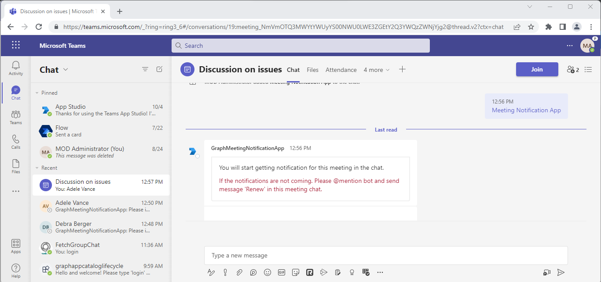
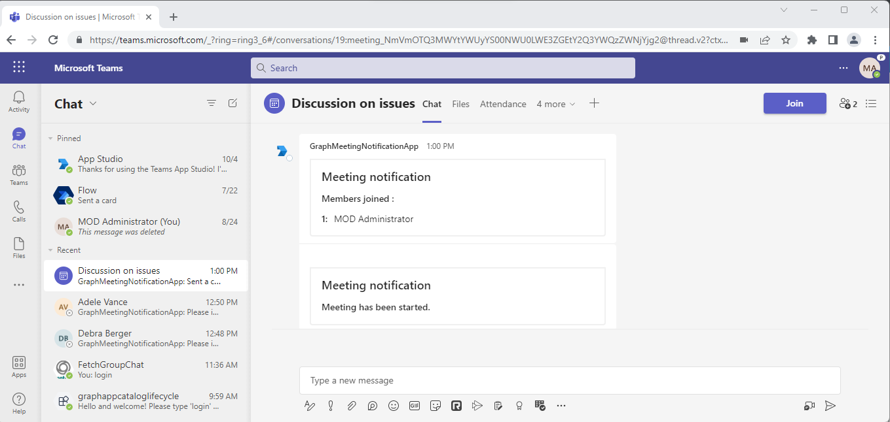
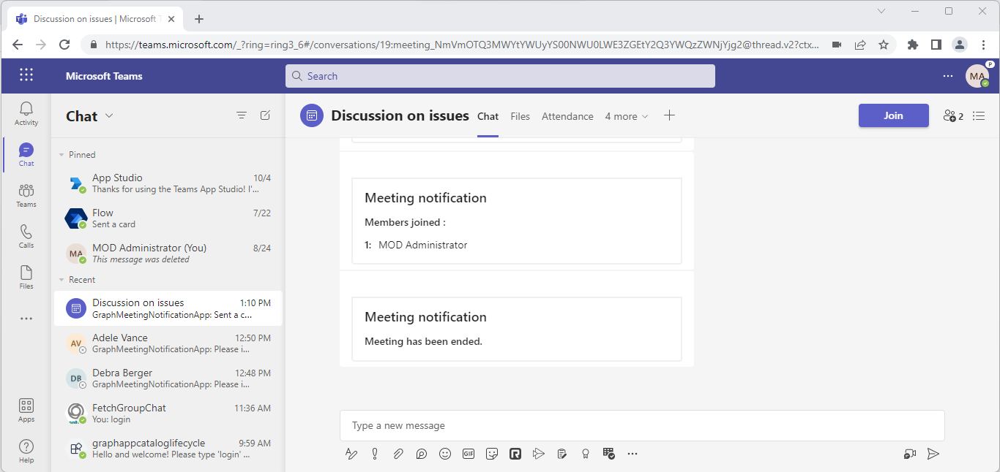

# Online meeting subscription

This is a sample application which demonstrates use of online meeting subscription that will post notifications when user joined/left and when meeting start/end.

## Concepts introduced in this sample
- After sucessfully installation of bot in meeting you will get a welcome card and the subscription will be created for meeting it is installed in.



- After that when the metting gets started or user joins the meeting, notifications will be sent in chat:



- Notifications will also be triggered when someone leaves that meeting or when meeting gets end:



## Prerequisites

- Microsoft Teams is installed and you have an account (not a guest account)
-  .[NET 6.0](https://dotnet.microsoft.com/en-us/download) SDK.
    ```bash
        # determine dotnet version
        dotnet --version
    ```
-  [ngrok](https://ngrok.com/) or equivalent tunneling solution
-  [M365 developer account](https://docs.microsoft.com/en-us/microsoftteams/platform/concepts/build-and-test/prepare-your-o365-tenant) or access to a Teams account with the appropriate permissions to install an app.

## Run app locally

### Register your application with Azure AD

1. Register a new application in the [Azure Active Directory – App Registrations](https://go.microsoft.com/fwlink/?linkid=2083908) portal.
2. On the overview page, copy and save the **Application (client) ID, Directory (tenant) ID**. You’ll need those later when updating your Teams application manifest and in the appsettings.json.
3. Navigate to **API Permissions**, and make sure to add the follow permissions:
-   Select Add a permission
-   Select Microsoft Graph -> Application permissions.
   - `OnlineMeetings.Read.All`

-   Click on Add permissions. Please make sure to grant the admin consent for the required permissions.

4.  Navigate to the **Certificates & secrets**. In the Client secrets section, click on "+ New client secret". Add a description (Name of the secret) for the secret and select “Never” for Expires. Click "Add". Once the client secret is created, copy its value, it need to be placed in the appsettings.json file.

### Create Azure bot resource

In Azure portal, create a [Azure Bot resource](https://docs.microsoft.com/en-us/azure/bot-service/bot-builder-authentication?view=azure-bot-service-4.0&tabs=csharp%2Caadv2).

- Ensure that you've [enabled the Teams Channel](https://docs.microsoft.com/en-us/azure/bot-service/channel-connect-teams?view=azure-bot-service-4.0)

### Create and install Self-Signed certificate

To include resource data of online meeting, this Graph API require self-signed certificate. Follow the below steps to create and manage certificate.

1. You can self-sign the certificate, since Microsoft Graph does not verify the certificate issuer, and uses the public key for only encryption.

2. Use [Azure Key Vault](https://docs.microsoft.com/en-us/azure/key-vault/key-vault-whatis) as the solution to create, rotate, and securely manage certificates. Make sure the keys satisfy the following criteria:

    - The key must be of type `RSA`
    - The key size must be between 2048 and 4096 bits

3. Follow this documentation for the steps - [**Create and install Self-Signed certificate**](MeetingNotification/CertificateDocumentation/README.md)


### Setup code.
1) Clone the repository

    ```bash
    git clone https://github.com/OfficeDev/Microsoft-Teams-Samples.git
    ```

  A) Or from Visual Studio code

  - Launch Visual Studio code
  - File -> Open Folder
  - Navigate to `samples/graph-meeting-notification/csharp` folder
  - Select `MeetingNotification` folder
  - Press `F5` to run the project

  B) Run ngrok - point to port 3978

   ```bash
     ngrok http -host-header=rewrite 3978
   ```  

## Instruction for appsetting
1. Provide MicrosoftAppId, MicrosoftAppPassword and MicrosoftAppTenantId in the appsetting that is created in Azure.
2. Provide the ngrok url as  "BaseUrl" in appsetting on which application is running on.
3. You should be having Base64EncodedCertificate and CertificateThumbprint value from *Create and install Self-Signed certificate* step.

## Instruction for manifest
1. Fill any GUID for <APP-ID>. You can also put your MicrosoftAppId here.
2. Update <MICROSOFT-APP-ID> placeholder with your Microsoft App Id.
3. ZIP the manifest and make sure manifest.json and two icon images are at root.
4. Upload the `manifest.zip` to Teams (in the Apps view click "Upload a custom app")

Follow this documentation to get more information on custom apps and uploading them into Teams - [Manage custom apps](https://docs.microsoft.com/en-us/microsoftteams/custom-app-overview) and [Upload an app package](https://docs.microsoft.com/en-us/microsoftteams/upload-custom-apps)
 
## Further reading
- [Change notifications for Microsoft Teams meeting](https://docs.microsoft.com/en-us/graph/changenotifications-for-onlinemeeting)
- [Set up change notifications that include resource data](https://docs.microsoft.com/en-us/graph/webhooks-with-resource-data)

