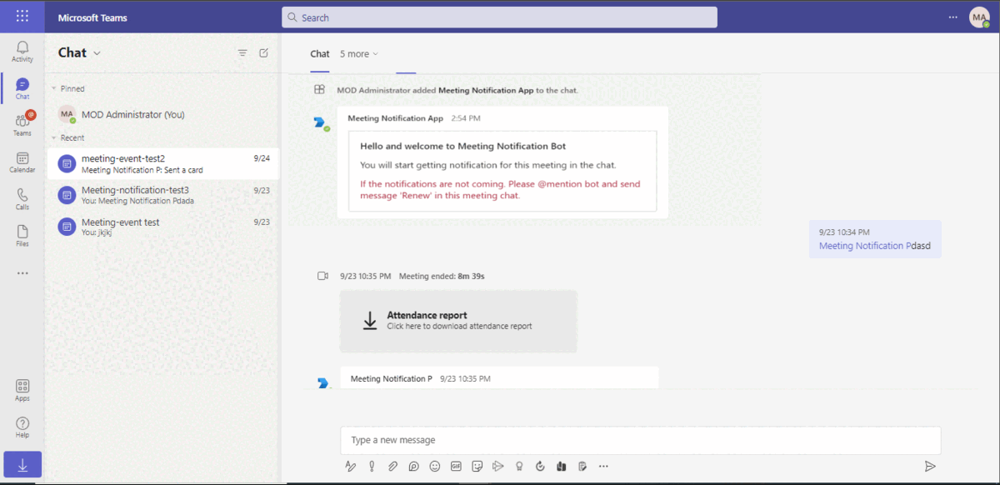

# Online meeting subscription

This sample application illustrates the integration of online meeting subscriptions in Microsoft Teams, providing real-time notifications in chat for events like user joins, leaves, and meeting start/end. Developed in Node.js, the application features bot interactions, adaptive cards, and utilizes the Microsoft Graph API, along with a detailed setup guide involving Azure Bot Service and self-signed certificates for secure communications

## Included Features
* Bots
* Change Notifications
* Adaptive Cards
* Graph API

## Interaction with app


## Prerequisites

- Microsoft Teams is installed and you have an account (not a guest account)
- [NodeJS](https://nodejs.org/en/)
- [dev tunnel](https://learn.microsoft.com/en-us/azure/developer/dev-tunnels/get-started?tabs=windows) or [ngrok](https://ngrok.com/) latest version or equivalent tunnelling solution
- [M365 developer account](https://docs.microsoft.com/en-us/microsoftteams/platform/concepts/build-and-test/prepare-your-o365-tenant) or access to a Teams account with the appropriate permissions to install an app.
- [Microsoft 365 Agents Toolkit for VS Code](https://marketplace.visualstudio.com/items?itemName=TeamsDevApp.ms-teams-vscode-extension) or [TeamsFx CLI](https://learn.microsoft.com/microsoftteams/platform/toolkit/teamsfx-cli?pivots=version-one)

## Run the app (Using Microsoft 365 Agents Toolkit for Visual Studio Code)

The simplest way to run this sample in Teams is to use Microsoft 365 Agents Toolkit for Visual Studio Code.

**Note:** Please create and install self-signed certificate before running this sample using toolkit or manually.

1. Ensure you have downloaded and installed [Visual Studio Code](https://code.visualstudio.com/docs/setup/setup-overview)
1. Install the [Microsoft 365 Agents Toolkit extension](https://marketplace.visualstudio.com/items?itemName=TeamsDevApp.ms-teams-vscode-extension)
1. Select **File > Open Folder** in VS Code and choose this samples directory from the repo
1. Using the extension, sign in with your Microsoft 365 account where you have permissions to upload custom apps
1. Before running this sample using toolkit, we need to update the .env file values in your code for 'Base64EncodedCertificate' and 'PRIVATE_KEY_PATH'. Follow this documentation for the steps to get the values  - [Create and install Self-Signed certificate](CertificateDocumentation/README.md)
1. Select **Debug > Start Debugging** or **F5** to run the app in a Teams web client.
1. In the browser that launches, select the **Add** button to install the app to Teams.

> If you do not have permission to upload custom apps (uploading), Microsoft 365 Agents Toolkit will recommend creating and using a Microsoft 365 Developer Program account - a free program to get your own dev environment sandbox that includes Teams.

**Note:** Please create and install self-signed certificate before running this sample using toolkit or manually.

### Register your application with Azure AD

1. Register a new application in the [Microsoft Entra ID – App Registrations](https://go.microsoft.com/fwlink/?linkid=2083908) portal.
2. On the overview page, copy and save the **Application (client) ID, Directory (tenant) ID**. You’ll need those later when updating your Teams application manifest and in the appsettings.json.
3. Navigate to **API Permissions**, and make sure to add the follow permissions:
-   Select Add a permission
-   Select Microsoft Graph -> Application permissions.
   - `OnlineMeetings.Read.All`
   - `User.Read`

-   Click on Add permissions. Please make sure to grant the admin consent for the required permissions.

4.  Navigate to the **Certificates & secrets**. In the Client secrets section, click on "+ New client secret". Add a description (Name of the secret) for the secret and select “Never” for Expires. Click "Add". Once the client secret is created, copy its value, it need to be placed in the appsettings.json file.

### Create Azure bot resource

In Azure portal, create a [Azure Bot resource](https://docs.microsoft.com/en-us/azure/bot-service/bot-builder-authentication?view=azure-bot-service-4.0&tabs=csharp%2Caadv2).

- Ensure that you've [enabled the Teams Channel](https://docs.microsoft.com/en-us/azure/bot-service/channel-connect-teams?view=azure-bot-service-4.0)

- In Settings/Configuration/Messaging endpoint, enter the current `https` URL you were given by running the tunnelling application. Append with the path `/api/messages`

### Create and install Self-Signed certificate

To include resource data of graph notifications, this Graph API require self-signed certificate. Follow the below steps to create and manage certificate.

1. You can self-sign the certificate, since Microsoft Graph does not verify the certificate issuer, and uses the public key for only encryption.

2. Use [Azure Key Vault](https://docs.microsoft.com/en-us/azure/key-vault/key-vault-whatis) as the solution to create, rotate, and securely manage certificates. Make sure the keys satisfy the following criteria:

    - The key must be of type `RSA`
    - The key size must be between 2048 and 4096 bits

3. Follow this documentation for the steps - [**Create and install Self-Signed certificate**](CertificateDocumentation/README.md)

###  Setup NGROK
1) Run ngrok - point to port 3978

   ```bash
   ngrok http 3978 --host-header="localhost:3978"
   ```  

   Alternatively, you can also use the `dev tunnels`. Please follow [Create and host a dev tunnel](https://learn.microsoft.com/en-us/azure/developer/dev-tunnels/get-started?tabs=windows) and host the tunnel with anonymous user access command as shown below:

   ```bash
   devtunnel host -p 3978 --allow-anonymous
   ```

### Setup code.
1) Clone the repository

    ```bash
    git clone https://github.com/OfficeDev/Microsoft-Teams-Samples.git
    ```

  - Launch Visual Studio code
  - File -> Open Folder
  - Navigate to `samples/graph-change-notification-team-channel/nodejs` folder.

  - Update the `.env` file

   Update configuration with the ```MicrosoftAppId```, ```MicrosoftAppPassword```, ```MicrosoftAppTenantId```,
   ```Base64EncodedCertificate```, ```EncryptionCertificateId```, ```PRIVATE_KEY_PATH```

 **Note** : ```notificationUrl``` will be updated automatically from `teamsapp.local.yml` file when you run application by Microsoft 365 Agents Toolkit. And when you run locally through `npm start` then your notificationUrl will be like : `https://1234.ngrok-free.app/api/notifications` and if you are using dev tunnels, your notificationUrl will be like: `https://12345.devtunnels.ms/api/notifications`.   

### Instruction for .env
1. Provide `MicrosoftAppId`, `MicrosoftAppPassword` and `MicrosoftAppTenantId` in the .env that is created in Azure.
2. Provide the ngrok url as  `BaseUrl` in appsetting on which application is running on.  E.g. if you are using ngrok it would be something like `https://1234.ngrok-free.app` and if you are using dev tunnels, your URL will be like: https://12345.devtunnels.ms.
3. You should be having `Base64EncodedCertificate` from *Create and install Self-Signed certificate* step.
4. Use Certificate "PEM" format and add the certificate name for `PRIVATE_KEY_PATH` For eg  `PRIVATE_KEY_PATH`=PrivateKeyFileName.pem" in .env file. Also make sure the private key file is stored inside helper folder of this project.

 - Install node modules

    Inside node js folder, open your local terminal and run the below command to install node modules. You can do the same for client folder by opening the project in Visual Studio code.

    ```bash
    npm install
    ```

- Run your app

   ```bash
     npm start
   ``` 

## Instruction for manifest
1. Update <MICROSOFT-APP-ID> placeholder with your Microsoft App Id.
2. ZIP the appManifest and make sure manifest.json and two icon images are at root.
3. Upload the `manifest.zip` to Teams (In Teams Apps/Manage your apps click "Upload an app". Browse to and Open the .zip file. At the next dialog, click the Add button.)

**Note**: If you are facing any issue in your app, please uncomment [this]https://github.com/OfficeDev/Microsoft-Teams-Samples/blob/main/samples/graph-meeting-notification/nodejs/index.js#L54) line and put your debugger for local debug.

## Running the sample
- After sucessfully installation of bot in meeting you will get a welcome card and the subscription will be created for meeting it is installed in.


- Bot will send card for meeting start end events. Bot will also send card when members joined/left the meeting
 

  

- Bot will also send card when members joined/left the meeting
 

 
## Further reading
- [Change notifications for Microsoft Teams meeting](https://docs.microsoft.com/en-us/graph/changenotifications-for-onlinemeeting)
- [Set up change notifications that include resource data](https://docs.microsoft.com/en-us/graph/webhooks-with-resource-data)

