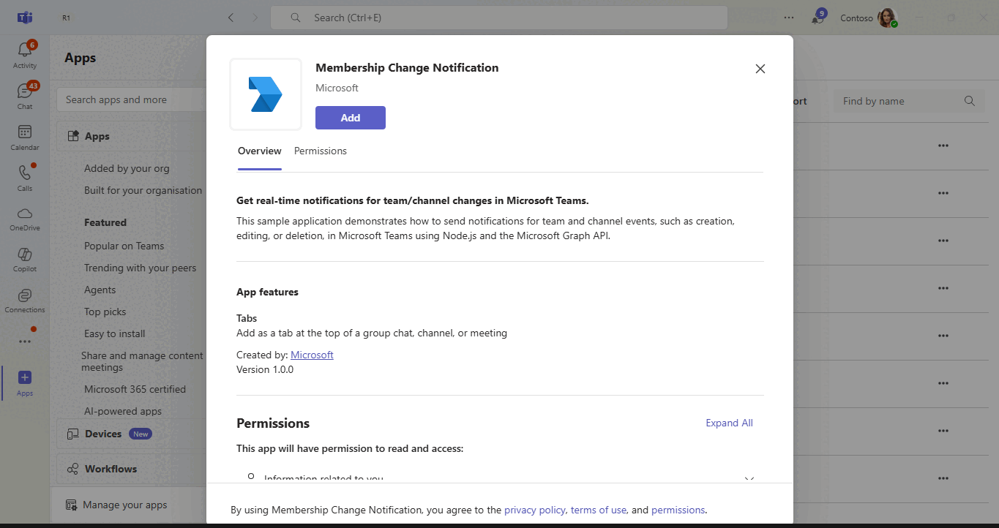
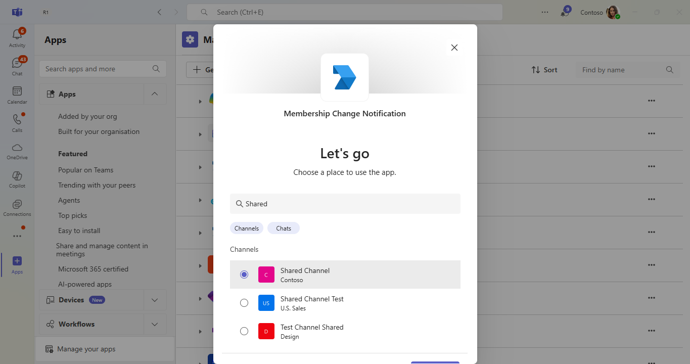
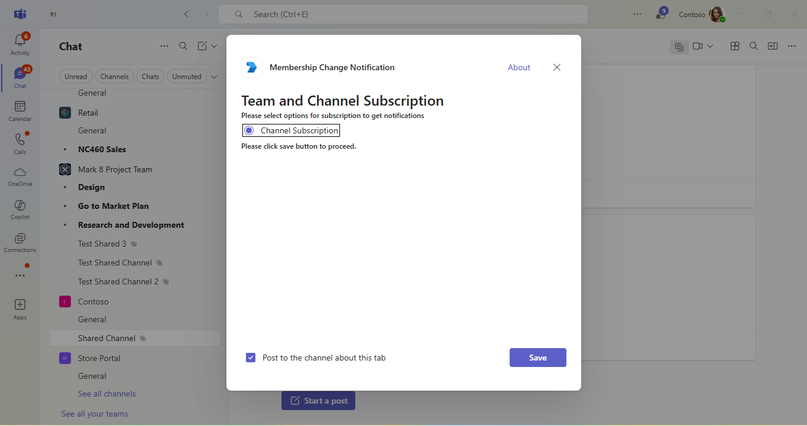
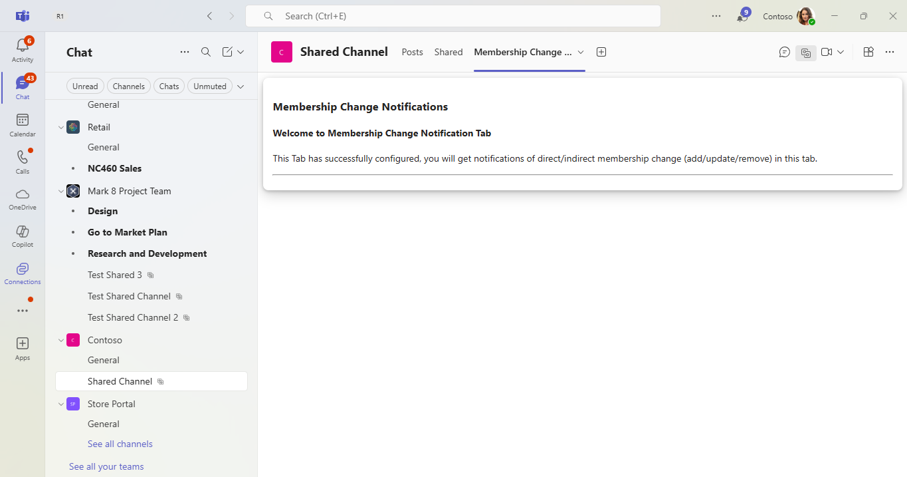
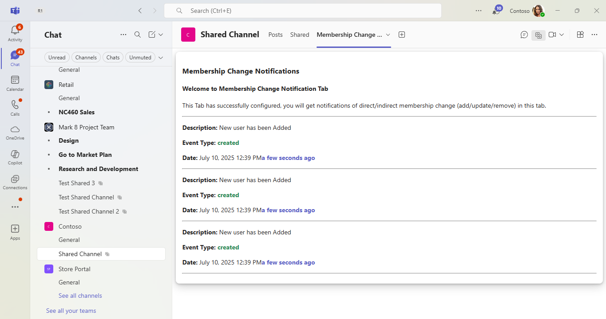
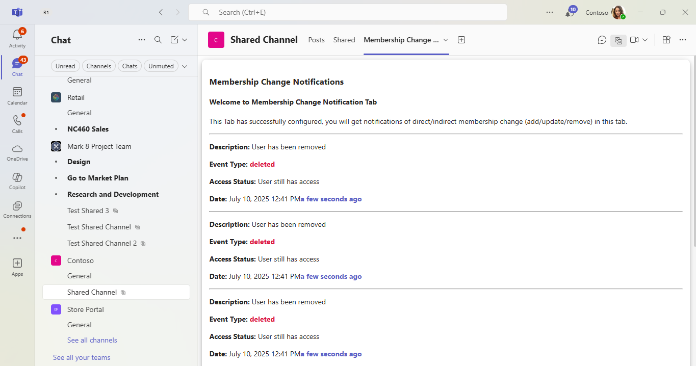

# Change Notifications For Team and Channel Using Microsoft Graph C#

This sample application demonstrates how to manage/handle membership change notification for shared channel, such as users being added, removed, or having their membership updated when a channel is shared/unshared with a team. The application leverages C# and the Microsoft Graph API to deliver real-time notifications. Built using C# and the Microsoft Graph API, it provides detailed setup instructions, including Azure AD registration, and certificate management, making it easy for developers to create interactive and responsive applications.

## Included Features
* Tabs
* Graph API
* RSC Permissions
* Change Notifications

## Interaction with bot


## Prerequisites

- Microsoft Teams is installed and you have an account (not a guest account)
-  .[NET 6.0](https://dotnet.microsoft.com/en-us/download) SDK.
    ```bash
        # determine dotnet version
        dotnet --version
    ```
-  [dev tunnel](https://learn.microsoft.com/en-us/azure/developer/dev-tunnels/get-started?tabs=windows) or [ngrok](https://ngrok.com/download) latest version or equivalent tunneling solution
-  [M365 developer account](https://docs.microsoft.com/en-us/microsoftteams/platform/concepts/build-and-test/prepare-your-o365-tenant) or access to a Teams account with the appropriate permissions to install an app.

## Setup

> Note these instructions are for running the sample on your local machine.

1) Run ngrok - point to port 3978

   ```bash
   ngrok http 3978 --host-header="localhost:3978"
   ```  

   Alternatively, you can also use the `dev tunnels`. Please follow [Create and host a dev tunnel](https://learn.microsoft.com/en-us/azure/developer/dev-tunnels/get-started?tabs=windows) and host the tunnel with anonymous user access command as shown below:

   ```bash
   devtunnel host -p 3978 --allow-anonymous
   ```

2) Setup for Azure AD application

### Register your application with Azure AD

1. Register a new application in the [Microsoft Entra ID [App Registrations](https://go.microsoft.com/fwlink/?linkid=2083908) portal.
2. On the overview page, copy and save the **Application (client) ID, Directory (tenant) ID**. You'll need those later when updating your Teams application manifest and in the appsettings.json.
3. Navigate to **API Permissions**, and make sure to add the follow permissions:
-   Select Add a permission
-   Select Microsoft Graph -> Application permissions.
   - `ChannelMember.Read.All`,`Channel.ReadBasic.All`,`ChannelSettings.Read.All`,`Directory.ReadWrite.All`,`Group.ReadWrite.All`
    `Team.ReadBasic.All`,`TeamSettings.Read.All`,`TeamSettings.ReadWrite.All`

-   Click on Add permissions. Please make sure to grant the admin consent for the required permissions.

4. Navigate to the **Certificates & secrets**. In the Client secrets section, click on "+ New client secret". Add a description (Name of the secret) for the secret and select Expiry date. Click "Add", Once the client secret is created, copy its value because it needs to be placed in the appsettings.json file.

### Create and install Self-Signed certificate

To include resource data of graph notifications, this Graph API require self-signed certificate. Follow the below steps to create and manage certificate.

1. You can self-sign the certificate, since Microsoft Graph does not verify the certificate issuer, and uses the public key for only encryption.

2. Use [Azure Key Vault](https://docs.microsoft.com/en-us/azure/key-vault/key-vault-whatis) as the solution to create, rotate, and securely manage certificates. Make sure the keys satisfy the following criteria:

    - The key must be of type `RSA`
    - The key size must be between 2048 and 4096 bits

3. Follow this documentation for the steps - 
[Create and install Self-Signed certificate](ChangeNotification/CertificateDocumentation/README.md)

3) Clone the repository

    ```bash
    git clone https://github.com/OfficeDev/Microsoft-Teams-Samples.git
    ```

  A) If you are using Visual Studio

  - Launch Visual Studio
  - File -> Open Folder
  - Navigate to `samples/graph-change-notification-team-channel/csharp` folder
  - Select `ChangeNotiifcation` solution file

  **Instruction for appsetting**
    1. Provide MicrosoftAppId, MicrosoftAppPassword and MicrosoftAppTenantId in the appsetting that is created in Azure.
    (Note the App Password is referred to as the "client secret" in the azure portal and you can always create a new client secret anytime.)
    2. Provide the tunnel url as  "BaseUrl" in appsetting on which application is running on.
    3. You should be having Base64EncodedCertificate and CertificateThumbprint value from *Create and install Self-Signed certificate* step.

  - Run your bot, either from Visual Studio with `F5` or using `dotnet run` in the appropriate folder.

  B) *This step is specific to Teams.*

- **Edit** the `manifest.json` contained in the  `AppManifest` folder to replace your Microsoft App Id (that was created when you registered your bot earlier) *everywhere* you see the place holder string `<<YOUR-MICROSOFT-APP-ID>>` (depending on the scenario the Microsoft App Id may occur multiple times in the `manifest.json`)

- **Edit** the `manifest.json` for `validDomains` with base Url domain. E.g. if you are using ngrok it would be `https://1234.ngrok-free.app` then your domain-name will be `1234.ngrok-free.app` and if you are using dev tunnels then your domain will be like: `12345.devtunnels.ms`.

- **Zip** up the contents of the `AppManifest` folder to create a `manifest.zip` (Make sure that zip file does not contains any subfolder otherwise you will get error while uploading your .zip package)

- **Upload** the `manifest.zip` to Teams (In Teams Apps/Manage your apps click "Upload an app". Browse to and Open the .zip file. At the next dialog, click the Add button.)

- Add the app to shared channel in team scope

**Note**: If you are facing any issue in your app, please uncomment [this](https://github.com/OfficeDev/Microsoft-Teams-Samples/blob/main/samples/graph-change-notification-team-channel/csharp/ChangeNotification/AdapterWithErrorHandler.cs#L27) line and put your debugger for local debug.

## Using RSC Permissions

If you prefer to use Resource-Specific Consent (RSC) permissions instead of application permissions, you can skip the "API Permissions" steps described earlier in the Azure AD registration section. Instead, update your Teams app manifest with the following properties to leverage RSC permissions:

```json
"webApplicationInfo": {
    "id": "${{AAD_APP_CLIENT_ID}}",
    "resource": ""
  },
  "authorization": {
		"permissions": {
			"resourceSpecific": [
				{
					"name": "TeamsAppInstallation.Read.User",
					"type": "Application"
				},
				{
					"name": "Member.Read.Group",
					"type": "Application"
				},
				{
					"name": "ChannelSettings.Read.Group",
					"type": "Application"
				},
				{
					"name": "ChannelMember.Read.Group",
					"type": "Application"
				},
				{
					"name": "ChannelMember.ReadWrite.Group",
					"type": "Application"
				}
			]
		}
	}
```

## Running the sample

1. **App Install**


2. **Select Shared Channel**


3. **Configure Page**


4. **Welcome Page**


5. **User Added**


6. **User Removed**


7. **User Membership Updated**


## Further reading

- [Create subscription permissions for supported resource](https://docs.microsoft.com/en-us/graph/api/subscription-post-subscriptions?view=graph-rest-1.0&tabs=http#team-channel-and-chat)

