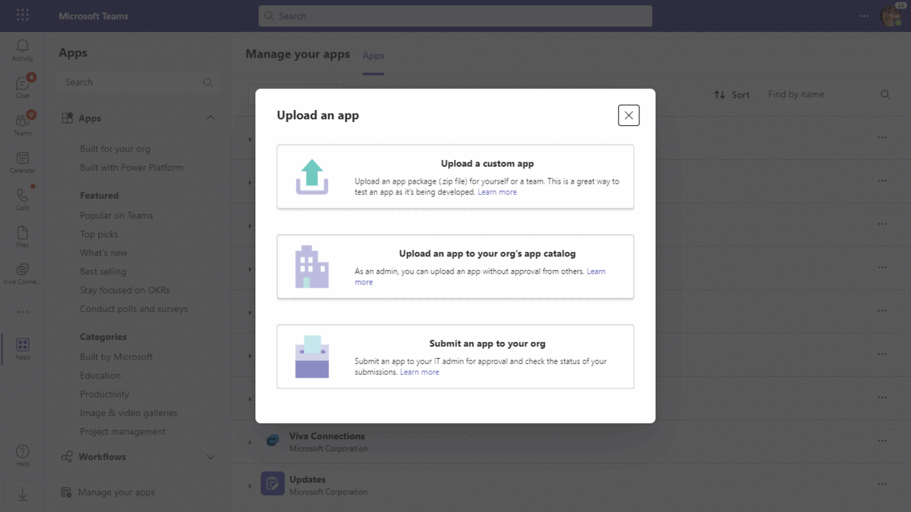
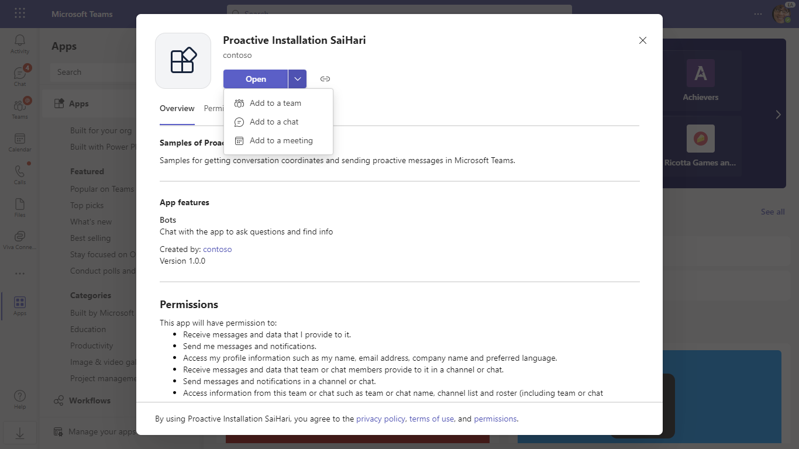
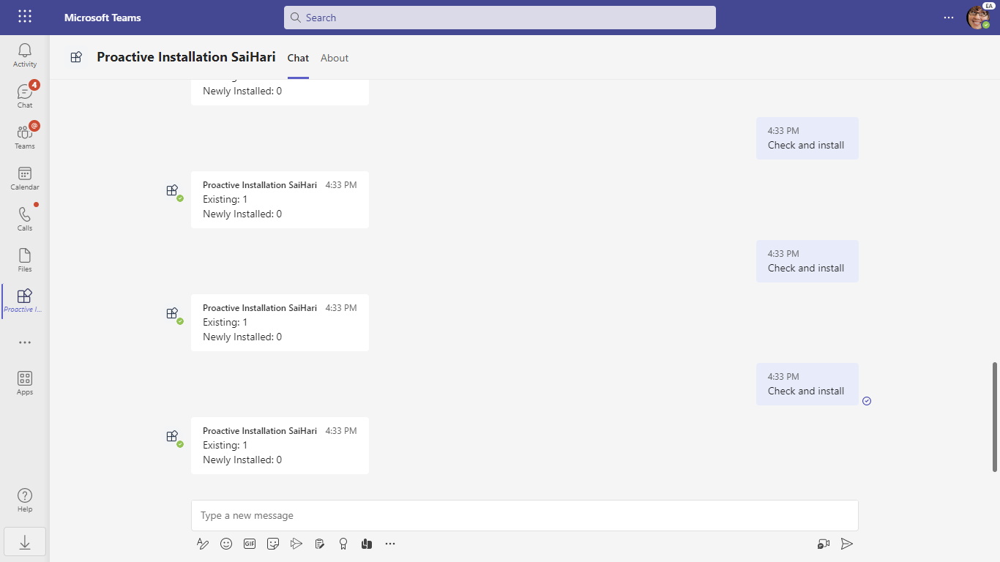

# Proactive Installation Sample App

This sample application showcases proactive installation of a Microsoft Teams app, allowing you to send notifications to users via Microsoft Graph APIs. With integrated bot functionality, this app facilitates user interaction and demonstrates how to efficiently manage app installations within Teams channels and group chats.s

Language Used : C#

## Included Features
* Bots

## Interaction with app


## Try it yourself - experience the App in your Microsoft Teams client
Please find below demo manifest which is deployed on Microsoft Azure and you can try it yourself by uploading the app package (.zip file link below) to your teams and/or as a personal app. (Uploading must be enabled for your tenant, [see steps here](https://docs.microsoft.com/microsoftteams/platform/concepts/build-and-test/prepare-your-o365-tenant#enable-custom-teams-apps-and-turn-on-custom-app-uploading)).

**Proactive Installation Sample App:** [Manifest](/samples/graph-proactive-installation/csharp/demo-manifest/graph-proactive-installation.zip)

## Prerequisites

- Microsoft Teams is installed and you have an account
- [.NET Core SDK](https://dotnet.microsoft.com/download) version 6.0
- [dev tunnel](https://learn.microsoft.com/en-us/azure/developer/dev-tunnels/get-started?tabs=windows) or [ngrok](https://ngrok.com/) latest version or equivalent tunnelling solution
- [Teams Toolkit for Visual Studio](https://learn.microsoft.com/en-us/microsoftteams/platform/toolkit/toolkit-v4/install-teams-toolkit-vs?pivots=visual-studio-v17-7)

## Run the app (Using Teams Toolkit for Visual Studio)

The simplest way to run this sample in Teams is to use Teams Toolkit for Visual Studio.
1. Install Visual Studio 2022 **Version 17.10 Preview 4 or higher** [Visual Studio](https://visualstudio.microsoft.com/downloads/)
1. Install Teams Toolkit for Visual Studio [Teams Toolkit extension](https://learn.microsoft.com/en-us/microsoftteams/platform/toolkit/toolkit-v4/install-teams-toolkit-vs?pivots=visual-studio-v17-7)
1. In the debug dropdown menu of Visual Studio, select Dev Tunnels > Create A Tunnel (set authentication type to Public) or select an existing public dev tunnel.
1. In the debug dropdown menu of Visual Studio, select default startup project > **Microsoft Teams (browser)**
1. In Visual Studio, right-click your **TeamsApp** project and **Select Teams Toolkit > Prepare Teams App Dependencies**
1. Using the extension, sign in with your Microsoft 365 account where you have permissions to upload custom apps.
1. Select **Debug > Start Debugging** or **F5** to run the menu in Visual Studio.
1. In the browser that launches, select the **Add** button to install the app to Teams.
> If you do not have permission to upload custom apps (uploading), Teams Toolkit will recommend creating and using a Microsoft 365 Developer Program account - a free program to get your own dev environment sandbox that includes Teams.

## Manually Setup and use the sample locally.
1. Register a new application in the [Microsoft Entra ID – App Registrations](https://go.microsoft.com/fwlink/?linkid=2083908) portal.

  - Required Microsoft graph Application level permissions to run this sample app
     
  - [Get consent for the Application permissions](https://docs.microsoft.com/graph/auth-v2-service?context=graph%2Fapi%2F1.0&view=graph-rest-1.0#3-get-administrator-consent) by following steps mentioned here.

2. Setup for Bot
	- Register a Microsoft Entra ID aap registration in Azure portal.
	- Also, register a bot with Azure Bot Service, following the instructions [here](https://docs.microsoft.com/azure/bot-service/bot-service-quickstart-registration?view=azure-bot-service-3.0).
	- Ensure that you've [enabled the Teams Channel](https://docs.microsoft.com/azure/bot-service/channel-connect-teams?view=azure-bot-service-4.0)
	- While registering the bot, use `https://<your_tunnel_domain>/api/messages` as the messaging endpoint.

    > NOTE: When you create your app registration, you will create an App ID and App password - make sure you keep these for later.

3. Setup NGROK
- Run ngrok - point to port 5130

   ```bash
   ngrok http 5130 --host-header="localhost:5130"
   ```  

   Alternatively, you can also use the `dev tunnels`. Please follow [Create and host a dev tunnel](https://learn.microsoft.com/en-us/azure/developer/dev-tunnels/get-started?tabs=windows) and host the tunnel with anonymous user access command as shown below:

   ```bash
   devtunnel host -p 5130 --allow-anonymous
   ```

4. Setup for code

  - Clone the repository

    ```bash
    git clone https://github.com/OfficeDev/Microsoft-Teams-Samples.git
    ```
  - Modify the `/appsettings.json` and fill in the following details:
    - `{{YOUR-MICROSOFT-APP-ID}}` - Generated from Step 1 while doing Microsoft Entra ID app registration in Azure portal.
    - `{{ YOUR-MICROSOFT-APP-PASSWORD}}` - Generated from Step 1, also referred to as Client secret
    - `{{ YOUR-APPCATALOG-TEAM-ID }}` - To get `TeamsappcatalogAppId` you first navigate to following link in your browser [Get TeamsAppCatalogId](https://developer.microsoft.com/graph/graph-explorer?request=appCatalogs%2FteamsApps%3F%24filter%3DdistributionMethod%20eq%20'organization'&method=GET&version=v1.0&GraphUrl=https://graph.microsoft.com) from Microsoft Graph explorer. Then search with app name or based on Manifest App id  in Graph Explorer response and copy the `Id` [i.e teamApp.Id]
  
    
    
  - Run the bot from Visual Studio:
  
    - Launch Visual Studio
    - File -> Open -> Project/Solution  
    - Navigate to `samples/graph-proactive-installation/csharp` folder
    - Select `ProactiveAppInstallation.sln` file
    - Press `F5` to run the project

   **Note** In the debug dropdown menu of Visual Studio, select default startup project > **ProactiveAppInstallation**
    
4) Setup Manifest for Teams
- __*This step is specific to Teams.*__
    - **Edit** the `manifest.json` contained in the ./appPackage folder to replace your Microsoft App Id (that was created when you registered your app registration earlier) *everywhere* you see the place holder string `{{Microsoft-App-Id}}` (depending on the scenario the Microsoft App Id may occur multiple times in the `manifest.json`)   
    - **Zip** up the contents of the `appPackage` folder to create a `manifest.zip` (Make sure that zip file does not contains any subfolder otherwise you will get error while uploading your .zip package)

- Upload the manifest.zip to Teams (in the Apps view click "Upload an app to your org's app catalog")
   - Go to Microsoft Teams. From the lower left corner, select Apps
   - From the lower left corner, choose Upload an app to your org's app catalog
   - Go to your project directory, the ./appPackage folder, select the zip folder, and choose Open.
   - Select Add in the pop-up dialog box. Your app is uploaded to Teams.

## Running the sample

### Interacting with the Proactive installation App in Teams

- Install the Proactive App Installation demo in a Team or GroupChat.

    

-  Run Check and install to pro-actively installs the App for all the users in team. 
    

-  Run Check and install to pro-actively installs the App for all the users in team. After installation send 'Send message' command to send proactive message.

   

- **Group Chat**

   

- **Team Scope**

   

**Note**: If you are facing any issue in your app, please uncomment [this](https://github.com/OfficeDev/Microsoft-Teams-Samples/blob/main/samples/graph-proactive-installation/csharp/ProactiveAppInstallation/AdapterWithErrorHandler.cs#L27) line and put your debugger for local debug.


## Further reading

- [Proactive App Installation using Graph API](https://docs.microsoft.com/en-us/microsoftteams/platform/graph-api/proactive-bots-and-messages/graph-proactive-bots-and-messages?tabs=Csharp)
- [Bot Framework Documentation](https://docs.botframework.com)
- [Bot Basics](https://docs.microsoft.com/azure/bot-service/bot-builder-basics?view=azure-bot-service-4.0)
- [Azure Bot Service Introduction](https://docs.microsoft.com/azure/bot-service/bot-service-overview-introduction?view=azure-bot-service-4.0)
- [Azure Bot Service Documentation](https://docs.microsoft.com/azure/bot-service/?view=azure-bot-service-4.0)

