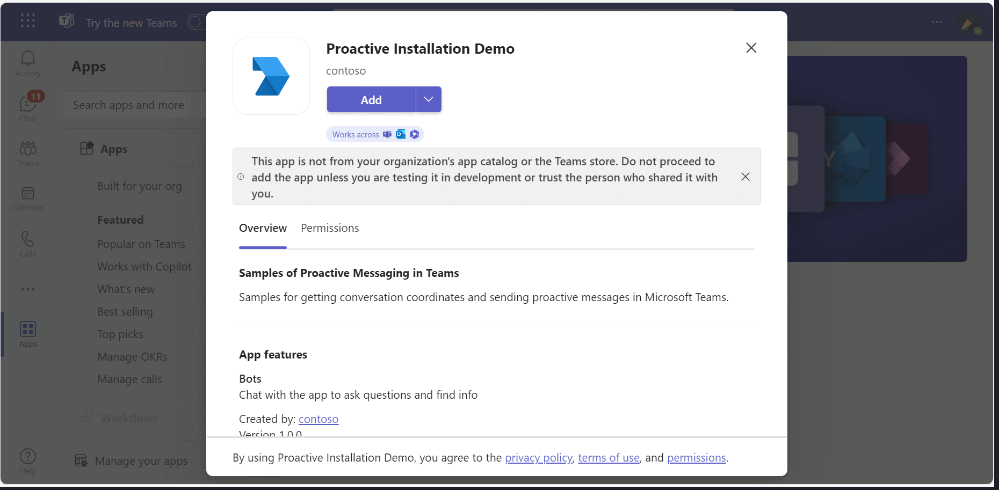
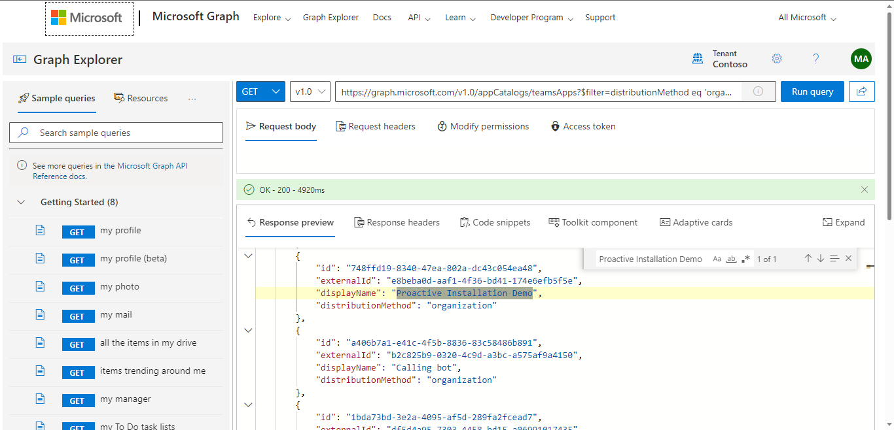
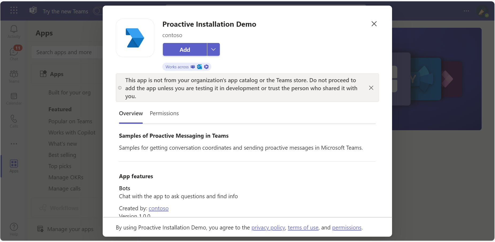
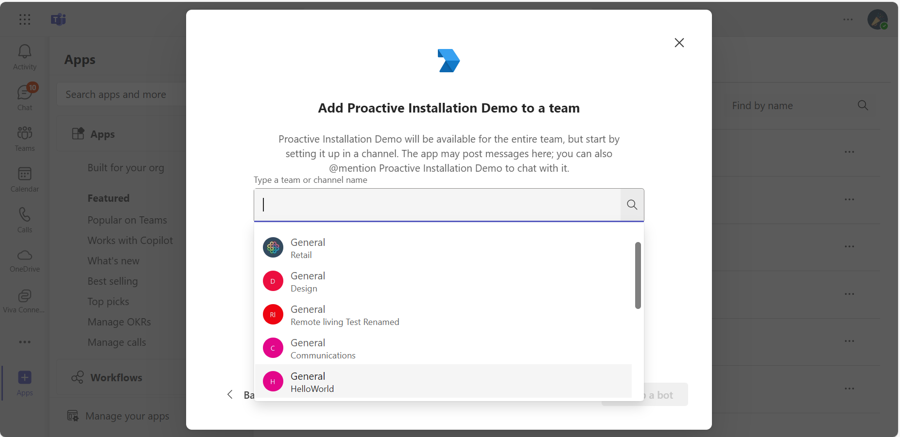
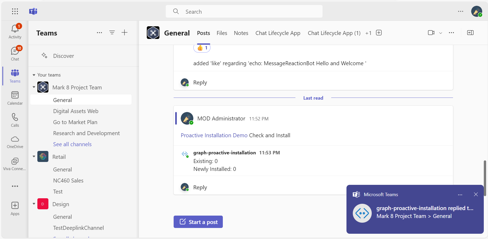
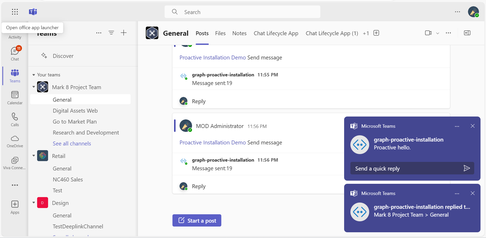
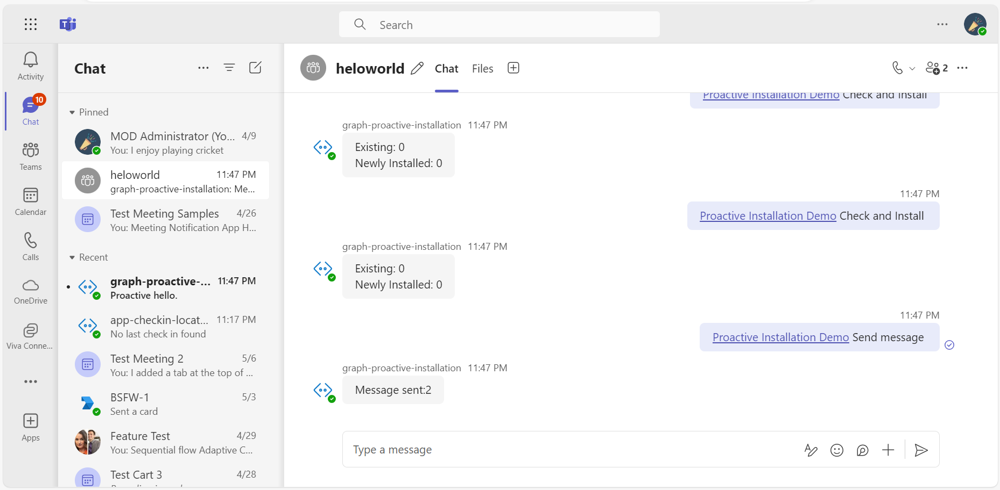
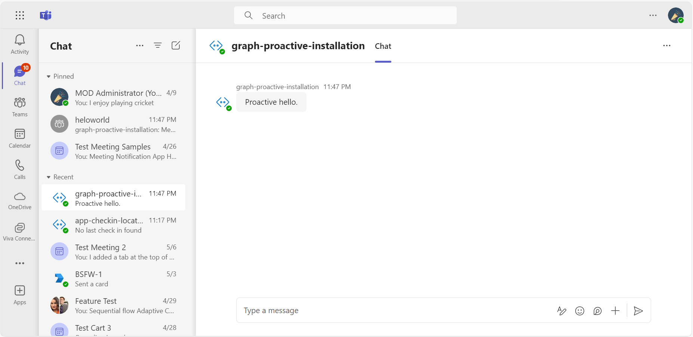

# Proactive Installation Sample App

This sample application illustrates how to implement proactive installation of a Microsoft Teams app and send notifications using Microsoft Graph APIs. Featuring bot integration, this app allows for user interaction within Group Chats and Channels, enhancing communication and app management in Teams.

## Included Features
* Bots

## Interaction with bot


## Try it yourself - experience the App in your Microsoft Teams client
Please find below demo manifest which is deployed on Microsoft Azure and you can try it yourself by uploading the app package (.zip file link below) to your teams and/or as a personal app. (Uploading must be enabled for your tenant, [see steps here](https://docs.microsoft.com/microsoftteams/platform/concepts/build-and-test/prepare-your-o365-tenant#enable-custom-teams-apps-and-turn-on-custom-app-uploading)).

**Proactive Installation Sample App:** [Manifest](/samples/graph-proactive-installation/csharp/demo-manifest/graph-proactive-installation.zip)

## Prerequisites
- Microsoft Teams is installed and you have an account
- [NodeJS](https://nodejs.org/en/) version 10.14 or higher

    ```bash
    # determine node version
    node --version
- [dev tunnel](https://learn.microsoft.com/en-us/azure/developer/dev-tunnels/get-started?tabs=windows) or [ngrok](https://ngrok.com/) latest version or equivalent tunnelling solution
- [Microsoft 365 Agents Toolkit for VS Code](https://marketplace.visualstudio.com/items?itemName=TeamsDevApp.ms-teams-vscode-extension) or [TeamsFx CLI](https://learn.microsoft.com/microsoftteams/platform/toolkit/teamsfx-cli?pivots=version-one)

## Run the app (Using Microsoft 365 Agents Toolkit for Visual Studio Code)

The simplest way to run this sample in Teams is to use Microsoft 365 Agents Toolkit for Visual Studio Code.

1. Ensure you have downloaded and installed [Visual Studio Code](https://code.visualstudio.com/docs/setup/setup-overview)
1. Install the [Microsoft 365 Agents Toolkit extension](https://marketplace.visualstudio.com/items?itemName=TeamsDevApp.ms-teams-vscode-extension)
1. Select **File > Open Folder** in VS Code and choose this samples directory from the repo
1. Using the extension, sign in with your Microsoft 365 account where you have permissions to upload custom apps
1. Select **Debug > Start Debugging** or **F5** to run the app in a Teams web client.
1. In the browser that launches, select the **Add** button to install the app to Teams.

> If you do not have permission to upload custom apps (uploading), Microsoft 365 Agents Toolkit will recommend creating and using a Microsoft 365 Developer Program account - a free program to get your own dev environment sandbox that includes Teams.

## Register Azure AD application
Register one Azure AD application in your tenant's directory for the bot and tab app authentication.

1.  Log in to the Azure portal from your subscription, and go to the "App registrations" blade  [here](https://portal.azure.com/#blade/Microsoft_AAD_IAM/ActiveDirectoryMenuBlade/RegisteredApps). Ensure that you use a tenant where admin consent for API permissions can be provided.

2.  Click on "New registration", and create an Azure AD application.

3.  **Name:**  The name of your Teams app - if you are following the template for a default deployment, we recommend "App catalog lifecycle".

4.  **Supported account types:**  Select "Accounts in any organizational directory"

5.  Leave the "Redirect URL" field blank.   

6.  Click on the "Register" button.

7.  When the app is registered, you'll be taken to the app's "Overview" page. Copy the  **Application (client) ID**; we will need it later. Verify that the "Supported account types" is set to **Multiple organizations**.

8.  On the side rail in the Manage section, navigate to the "Certificates & secrets" section. In the Client secrets section, click on "+ New client secret". Add a description for the secret and select Expires as "Never". Click "Add".

9.  Once the client secret is created, copy its **Value**, please take a note of the secret as it will be required later.


At this point you have 3 unique values:
-   Application (client) ID which will be later used during Azure bot creation
-   Client secret for the bot which will be later used during Azure bot creation
-   Directory (tenant) ID


We recommend that you copy these values into a text file, using an application like Notepad. We will need these values later.

10.  Under left menu, navigate to **API Permissions**, and make sure to add the following permissions of Microsoft Graph API > Application permissions:
-   TeamsAppInstallation.ReadWriteForUser.All

Click on Add Permissions to commit your changes.

11.  If you are logged in as the Global Administrator, click on the "Grant admin consent for <%tenant-name%>" button to grant admin consent else, inform your admin to do the same through the portal or follow the steps provided here to create a link and send it to your admin for consent.
    
12.  Global Administrator can grant consent using following link:  [https://login.microsoftonline.com/common/adminconsent?client_id=](https://login.microsoftonline.com/common/adminconsent?client_id=)<%appId%> 

## Setup Bot Service

1. In Azure portal, create a [Azure Bot resource](https://docs.microsoft.com/azure/bot-service/bot-service-quickstart-registration)
2. Select Type of App as "Multi Tenant"
3.  Select Creation type as "Use existing app registration"
4. Use the copied App Id and Client secret from above step and fill in App Id and App secret respectively.
5. Click on 'Create' on the Azure bot.   
6. Go to the created resource, ensure that you've [enabled the Teams Channel](https://learn.microsoft.com/azure/bot-service/channel-connect-teams?view=azure-bot-service-4.0)
7. In Settings/Configuration/Messaging endpoint, enter the current `https` URL you have given by running the tunnelling application. Append with the path `/api/messages`

### Register your app with Azure AD.

  1. Register a new application in the [Microsoft Entra ID – App Registrations](https://go.microsoft.com/fwlink/?linkid=2083908) portal.
  2. Select **New Registration** and on the *register an application page*, set following values:
      * Set **name** to your app name.
      * Choose the **supported account types** (any account type will work)
      * Leave **Redirect URI** empty.
      * Choose **Register**.
  3. On the overview page, copy and save the **Application (client) ID, Directory (tenant) ID**. You'll need those later when updating your Teams application manifest and in the appsettings.json.
  4. Navigate to **API Permissions**, and make sure to add the follow permissions:
   Select Add a permission
      * Select Add a permission
      * Select Microsoft Graph -\> Delegated permissions.
      * `User.Read` (enabled by default)
      * Click on Add permissions. Please make sure to grant the admin consent for the required permissions.


###  Setup NGROK
1) Run ngrok - point to port 3978

   ```bash
   ngrok http 3978 --host-header="localhost:3978"
   ```  

   Alternatively, you can also use the `dev tunnels`. Please follow [Create and host a dev tunnel](https://learn.microsoft.com/en-us/azure/developer/dev-tunnels/get-started?tabs=windows) and host the tunnel with anonymous user access command as shown below:

   ```bash
   devtunnel host -p 3978 --allow-anonymous
   ```

## Setup the Code
> Note these instructions are for running the sample on your local machine, the tunnelling solution is required because
the Teams service needs to call into the bot.

1) Clone the repository

    ```bash
    git clone https://github.com/OfficeDev/Microsoft-Teams-Samples.git
    ```

2) In a terminal, navigate to `samples/javascript_nodejs/graph-proactive-installation`
    ```bash
    cd samples/graph-proactive-installation/nodejs
    ```
3)  Install modules

    ```bash
    npm install
    ```

4) Go to .env file  and add `MicrosoftAppId` ,  `MicrosoftAppPassword` and `AppCatalogTeamAppId` information. 
    - To get `AppCatalogTeamAppId` navigate to following link in your browser [Get TeamsAppCatalogId](https://developer.microsoft.com/graph/graph-explorer?request=appCatalogs%2FteamsApps%3F%24filter%3DdistributionMethod%20eq%20'organization'&method=GET&version=v1.0&GraphUrl=https://graph.microsoft.com) from Microsoft Graph explorer.
    And then search with app name or based on Manifest App id in Graph Explorer response and copy the `Id` [i.e teamApp.Id]
    

5) Run your bot at the command line

    ```bash
    npm start
    ```

## Upload the Manifest
    - **Edit** the `manifest.json` contained in the  `appManifest` folder to replace your Microsoft App Id (that was created when you registered your bot earlier) *everywhere* you see the place holder string `<<YOUR-MICROSOFT-APP-ID>>` (depending on the scenario the Microsoft App Id may occur multiple times in the `manifest.json`)
    - **Zip** up the contents of the `appManifest` folder to create a `manifest.zip` (Make sure that zip file does not contains any subfolder otherwise you will get error while uploading your .zip package)
    - **Upload** the `manifest.zip` to Teams (In Teams Apps/Manage your apps click "Upload an app". Browse to and Open the .zip file. At the next dialog, click the Add button.)
    - Add the app to team/groupChat scope (Supported scopes)

**Note**: If you are facing any issue in your app, please uncomment [this](https://github.com/OfficeDev/Microsoft-Teams-Samples/blob/main/samples/graph-proactive-installation/nodejs/index.js#L47) line and put your debugger for local debug.

## Running the sample


- Install the Proactive App Installation demo app in a Team or GroupChat.


- **Team Scope**: Run 'Check and Install' to pro-actively install the App for all the users in team. After installation send 'Send message' command to send proactive message.


- **Group Chat**:  Run 'Check and Install' to pro-actively install the App for all the users in team. After installation send 'Send message' command to send proactive message.



## Deploy the bot to Azure

To learn more about deploying a bot to Azure, see [Deploy your bot to Azure](https://aka.ms/azuredeployment) for a complete list of deployment instructions.

## Further reading

- [Proactive App Installation using Graph API](https://docs.microsoft.com/en-us/microsoftteams/platform/graph-api/proactive-bots-and-messages/graph-proactive-bots-and-messages?tabs=node)
- [Bot Framework Documentation](https://docs.botframework.com)
- [Bot Basics](https://docs.microsoft.com/azure/bot-service/bot-builder-basics?view=azure-bot-service-4.0)
- [Azure Bot Service Introduction](https://docs.microsoft.com/azure/bot-service/bot-service-overview-introduction?view=azure-bot-service-4.0)
- [Azure Bot Service Documentation](https://docs.microsoft.com/azure/bot-service/?view=azure-bot-service-4.0)


